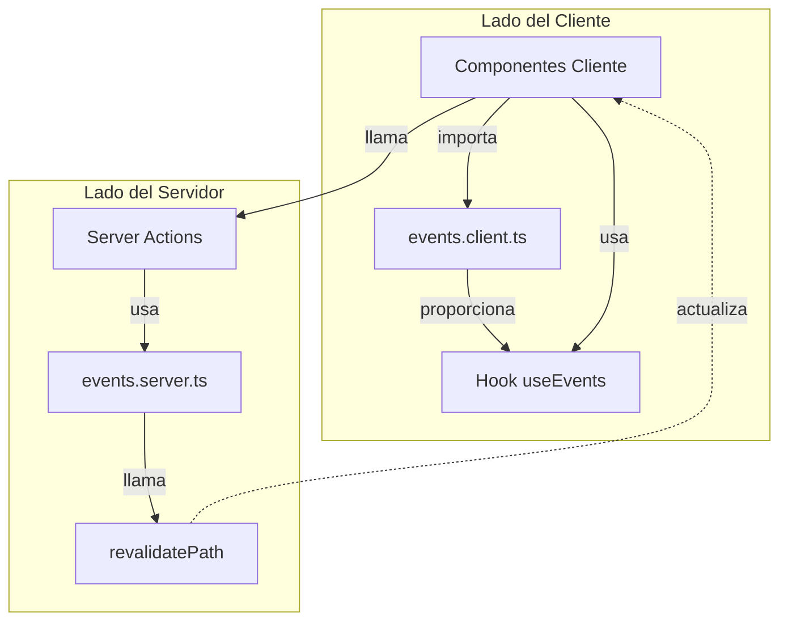
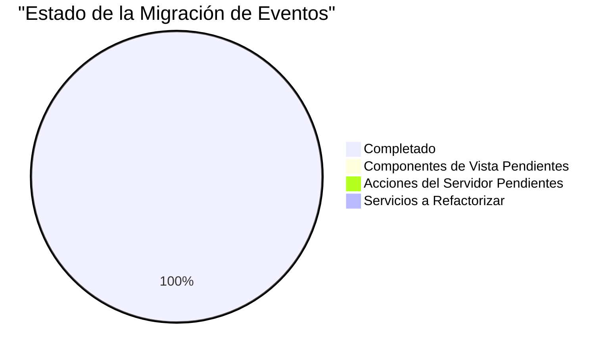
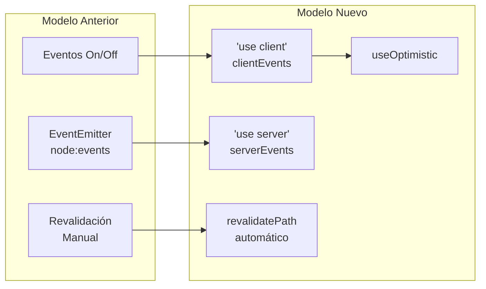

# Migración del Sistema de Eventos

## Arquitectura del Nuevo Sistema



## Estado de la Migración



## Modelo de Eventos Anterior vs. Nuevo



## Beneficios del Nuevo Sistema

1. **Compatibilidad con Next.js 15**
   - Separación clara entre componentes de cliente y servidor
   - Sin errores de importación de módulos de Node en el navegador
   - Mejor integración con App Router

2. **Mejoras Técnicas**
   - Actualizaciones optimistas para mejor UX
   - Tipado completo para todos los eventos
   - Revalidación automática de rutas
   - Eliminación de dependencias inseguras

3. **Mejor Arquitectura**
   - Separación de responsabilidades
   - Mejor manejo de estado
   - Flujo de datos más predecible
   - Mayor contexto en eventos

## Guía de Migración

1. **Para Componentes de Vista:**
   ```typescript
   // Antes
   import { type EventData, eventsService } from '@/services/events.service';

   // Suscribirse
   eventsService.on('evento:tipo', callback);

   // Desuscribirse
   eventsService.off('evento:tipo', callback);
   ```

   ```typescript
   // Después
   import { clientEvents } from '@/lib/client/events.client';

   // Usar hook optimista
   const [optimisticState, addEvent] = clientEvents.useEvents(initialState);

   // No necesita suscripción/desuscripción manual
   ```

2. **Para Server Actions:**
   ```typescript
   // Antes
   import { eventsService } from '@/services/events.service';

   // Emitir evento
   eventsService.emit('evento:tipo');
   ```

   ```typescript
   // Después
   import { serverEvents } from '@/lib/server/events.server';

   // Emitir evento con datos contextuales
   await serverEvents.emit({
     type: 'evento:tipo',
     data: { action: 'create', entity }
   });
   ```

3. **Para Servicios que Extienden EventEmitter:**
   - Crear una versión especial del servicio basado en serverEvents
   - Reemplazar métodos como .on(), .off(), .emit() con las nuevas implementaciones
   - Eliminar la extensión de EventEmitter

## Estado Actual

Se ha completado la migración de todos los componentes y servicios al nuevo sistema de eventos. El enfoque ha sido validado y todos los servicios que anteriormente extendían EventEmitter ahora utilizan el nuevo sistema basado en serverEvents y clientEvents.

Los principales logros incluyen:

1. Eliminación completa de la dependencia de node:events
2. Mejor integración con Next.js 15 App Router
3. Separación clara entre eventos del cliente y del servidor
4. Mejor tipado y estructura de datos para los eventos
5. Código más mantenible con objetos literales en lugar de clases
6. Revalidación automática de rutas

Los próximos pasos incluyen pruebas exhaustivas, documentación detallada y posibles optimizaciones de rendimiento.