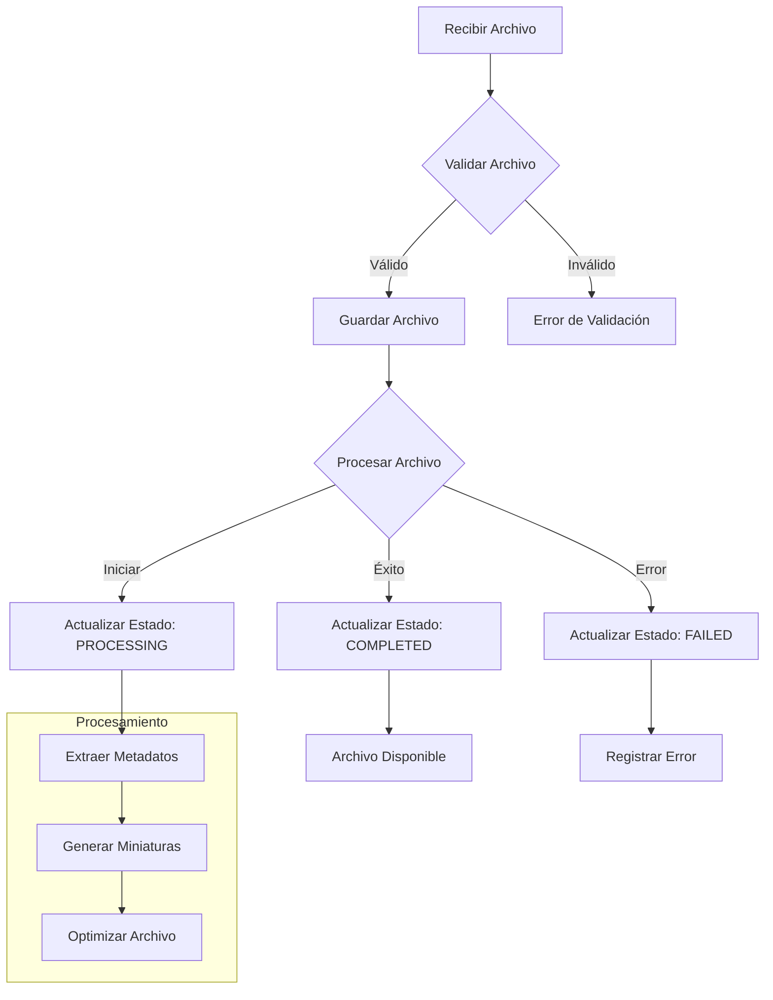

# Documentación de la Entidad File

## Introducción

La entidad `File` representa archivos genéricos en el sistema de gestión de imágenes. Esta entidad permite manejar una variedad de tipos de archivos, no limitados a imágenes, extendiendo las capacidades de almacenamiento y organización del sistema.

## Estructura de la Entidad

### Propiedades Básicas

```typescript
interface FileItem {
    id: EntityId;
    name: string;
    path: string;
    type: FileType;
    size: number;
    mimeType: string;
    metadata: JSONString<MediaMetadata>;
    processingStatus: FileProcessingStatus;
    errorMessage?: string;
    createdAt: Date;
    updatedAt: Date;
}
```

### Enumeraciones

```typescript
enum FileProcessingStatus {
    PENDING = 'pending',
    PROCESSING = 'processing',
    COMPLETED = 'completed',
    FAILED = 'failed'
}

enum FileType {
    IMAGE = 'image',
    VIDEO = 'video',
    AUDIO = 'audio',
    DOCUMENT = 'document',
    OTHER = 'other'
}
```

### Validación con Zod

```typescript
const fileProcessingStatusSchema = z.nativeEnum(FileProcessingStatus);
const fileTypeSchema = z.nativeEnum(FileType);

const fileItemSchema = z.object({
    id: z.string(),
    name: z.string().min(1),
    path: z.string().min(1),
    type: fileTypeSchema,
    size: z.number().positive(),
    mimeType: z.string(),
    metadata: z.string(),
    processingStatus: fileProcessingStatusSchema,
    errorMessage: z.string().optional(),
    createdAt: z.date(),
    updatedAt: z.date()
});
```

## Diagrama de Flujo



## Estructura de Carpetas

```
src/
├─ types/
│  ├─ entities/
│  │  ├─ file/
│  │     ├─ base.ts         # Tipos básicos de archivo
│  │     ├─ extended.ts     # Tipos extendidos y utilidades
│  │     ├─ enums.ts        # Enumeraciones relacionadas con archivos
│  │     └─ index.ts        # Exportaciones
│  └─ file-item.ts         # Tipos generales de archivos
├─ lib/
│  ├─ server/
│  │  └─ services/
│  │     └─ file/          # Carpeta del servicio File
│  │        ├─ transformers/  # Transformadores para la entidad
│  │        ├─ service.ts     # Implementación del servicio
│  │        └─ index.ts       # Punto de entrada
├─ app/
│  └─ api/
│     └─ files/            # API endpoints para archivos
│        └─ route.ts       # Manejadores de rutas
```

## Interacciones con el Sistema de Eventos

La entidad File utiliza el sistema de eventos para notificar cambios y mantener la coherencia en la aplicación.

### Eventos Emitidos

- `files:modified` - Cuando se modifican archivos
- `file:progress` - Para informar sobre el progreso del procesamiento
- `file:error` - Cuando ocurre un error en el procesamiento
- `file:complete` - Cuando se completa el procesamiento

### Ejemplo de Emisión de Eventos

```typescript
import { emit } from '@/lib/server/events.server';

async function processFile(fileId: string): Promise<void> {
  try {
    // Actualizar estado a PROCESSING
    await updateFileStatus(fileId, FileProcessingStatus.PROCESSING);

    // Emitir evento de progreso
    await emit({
      type: 'file:progress',
      id: fileId,
      data: { progress: 0, status: 'processing' }
    });

    // Procesar archivo...

    // Actualizar estado a COMPLETED
    await updateFileStatus(fileId, FileProcessingStatus.COMPLETED);

    // Emitir evento de completado
    await emit({
      type: 'file:complete',
      id: fileId,
      data: { status: 'completed' }
    });

  } catch (error) {
    // Actualizar estado a FAILED
    await updateFileStatus(fileId, FileProcessingStatus.FAILED);

    // Emitir evento de error
    await emit({
      type: 'file:error',
      id: fileId,
      data: { error: error.message }
    });
  }
}
```

## Ejemplos de Uso en el Proyecto

### Carga de un Archivo

```typescript
import { fileService } from '@/lib/server/services/file';

async function uploadFile(file: File): Promise<FileItem | null> {
  try {
    const result = await fileService.createFile({
      name: file.name,
      size: file.size,
      type: determineFileType(file.type),
      mimeType: file.type,
      // Otros datos necesarios
    });

    return result;
  } catch (error) {
    console.error('Error al cargar archivo:', error);
    return null;
  }
}

function determineFileType(mimeType: string): FileType {
  if (mimeType.startsWith('image/')) return FileType.IMAGE;
  if (mimeType.startsWith('video/')) return FileType.VIDEO;
  if (mimeType.startsWith('audio/')) return FileType.AUDIO;
  if (mimeType.startsWith('application/') || mimeType.startsWith('text/')) return FileType.DOCUMENT;
  return FileType.OTHER;
}
```

### Obtención de un Archivo por ID

```typescript
import { fileService } from '@/lib/server/services/file';

async function getFileById(fileId: string): Promise<FileItem | null> {
  try {
    const file = await fileService.getFileById(fileId);
    return file;
  } catch (error) {
    console.error('Error al obtener archivo:', error);
    return null;
  }
}
```

### Actualización de Metadatos de un Archivo

```typescript
import { fileService } from '@/lib/server/services/file';

async function updateFileMetadata(fileId: string, metadata: Partial<MediaMetadata>): Promise<boolean> {
  try {
    const file = await fileService.getFileById(fileId);
    if (!file) return false;

    // Combinar metadatos existentes con nuevos
    const currentMetadata = JSON.parse(file.metadata);
    const updatedMetadata = { ...currentMetadata, ...metadata };

    await fileService.updateFile(fileId, {
      metadata: JSON.stringify(updatedMetadata)
    });

    return true;
  } catch (error) {
    console.error('Error al actualizar metadatos:', error);
    return false;
  }
}
```

## Consideraciones Importantes

1. **Validación**: Siempre validar los archivos antes de procesarlos para garantizar la integridad de los datos.

2. **Manejo de Errores**: Implementar una estrategia robusta de manejo de errores para evitar estados inconsistentes.

3. **Metadatos**: Asegurar que los metadatos se extraigan y almacenen correctamente según el tipo de archivo.

4. **Limpieza**: Implementar mecanismos para eliminar archivos temporales o fallidos para evitar acumulación innecesaria.

5. **Permisos**: Considerar las implicaciones de seguridad al permitir diferentes tipos de archivos.

## Integraciones con Otras Entidades

La entidad File se integra con varias otras entidades del sistema:

- **Folder**: Los archivos se organizan en carpetas
- **Image**: Un tipo especializado de File para imágenes
- **Video**: Un tipo especializado de File para videos
- **Tag**: Los archivos pueden tener etiquetas
- **Collection**: Los archivos pueden formar parte de colecciones

## Conclusión

La entidad File proporciona la infraestructura básica para el manejo de archivos de diversos tipos en la aplicación. Su diseño versátil permite extender fácilmente el sistema para soportar nuevos tipos de archivos y funcionalidades relacionadas.