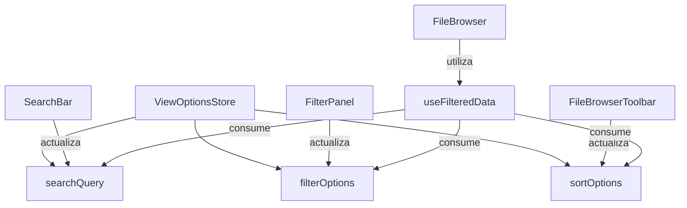

# Sistema de Filtrado y Búsqueda

## Visión general

El sistema de filtrado y búsqueda del FileBrowser permite a los usuarios encontrar rápidamente los archivos que necesitan mediante búsqueda por texto, filtros avanzados y ordenación. Está diseñado para ser flexible, extensible y ofrecer una experiencia de usuario intuitiva.



## Componentes principales

### 1. ViewOptionsStore (Zustand)

Este store centraliza todas las opciones de visualización, filtrado y ordenación:

```typescript
interface ViewOptionsState {
  // Opciones de visualización
  viewMode: 'grid' | 'list' | 'cards' | 'masonry';
  itemSize: number;

  // Opciones de búsqueda y filtrado
  searchQuery: string;
  filterOptions: FilterOption[];
  sortOptions: SortOption[];

  // Acciones
  setSearchQuery: (query: string) => void;
  addFilterOption: (option: FilterOption) => void;
  removeFilterOption: (field: string) => void;
  resetFilters: () => void;
  addSortOption: (option: SortOption) => void;
  // ...
}
```

### 2. Componentes de UI

#### SearchBar

Componente de búsqueda con debounce integrado que actualiza el `searchQuery` en el store.

```tsx
<SearchBar
  placeholder="Buscar archivos..."
  debounceMs={300}
  showClearButton={true}
/>
```

#### FilterPanel

Panel de filtros avanzados que permite aplicar múltiples filtros a la vez.

```tsx
<FilterPanel
  filters={[
    {
      id: 'type',
      type: 'select',
      label: 'Tipo de archivo',
      options: [
        { value: 'image', label: 'Imágenes' },
        { value: 'video', label: 'Videos' }
      ]
    },
    {
      id: 'createdAt',
      type: 'date',
      label: 'Creado después de'
    }
  ]}
/>
```

#### FileBrowserToolbar

Barra de herramientas que integra búsqueda, filtros y opciones de ordenación.

```tsx
<FileBrowserToolbar
  allItemIds={itemIds}
  showSearch={true}
  showFilters={true}
  filters={filterDefinitions}
/>
```

### 3. Hook useFilteredData

Este hook aplica filtros, búsqueda y ordenación a una colección de datos.

```tsx
const filteredItems = useFilteredData(items);
```

## Tipos de filtros soportados

- **text**: Entrada de texto simple
- **select**: Selector de opciones predefinidas
- **checkbox**: Selección múltiple de opciones
- **radio**: Selección única entre opciones
- **date**: Selector de fecha
- **boolean**: Valor booleano (sí/no)

## Operadores de filtrado

- **eq**: Igualdad exacta
- **neq**: Desigualdad
- **gt**: Mayor que
- **lt**: Menor que
- **contains**: Contiene la cadena (para texto)
- **startsWith**: Comienza con la cadena
- **endsWith**: Termina con la cadena

## Integración con FileBrowser

El sistema de filtrado se integra perfectamente con el FileBrowser a través del hook `useFilteredData`. Este hook:

1. Obtiene las opciones de filtrado, búsqueda y ordenación del store
2. Aplica los filtros a los datos proporcionados
3. Devuelve los datos filtrados y ordenados

```tsx
function useFilteredData<T extends FileItem[]>(
  data: T,
  searchFields: string[] = ['name', 'description', 'tags']
): T {
  const filterOptions = useViewOptionsStore((state) => state.filterOptions);
  const sortOptions = useViewOptionsStore((state) => state.sortOptions);
  const searchQuery = useViewOptionsStore((state) => state.searchQuery);

  return useMemo(() => {
    // Aplicar filtros, búsqueda y ordenación...
    // ...
    return filteredData as T;
  }, [data, filterOptions, sortOptions, searchQuery, searchFields]);
}
```

## Persistencia de preferencias

Las opciones de visualización, filtrado y ordenación se persisten en localStorage para mantener la consistencia entre sesiones.

## Extensibilidad

El sistema está diseñado para ser extensible:

- Se pueden añadir nuevos tipos de filtros implementando nuevos renderizadores en `FilterPanel`
- Se pueden añadir nuevos operadores de filtrado en `useFilteredData`
- Se pueden personalizar los filtros predeterminados en `IntegratedFileBrowser`

## Rendimiento

Para garantizar un buen rendimiento incluso con grandes colecciones de archivos:

- La búsqueda utiliza debounce para evitar actualizaciones excesivas
- Los filtros se aplican en un useMemo para evitar recálculos innecesarios
- Los componentes están memorizados para evitar renderizados innecesarios