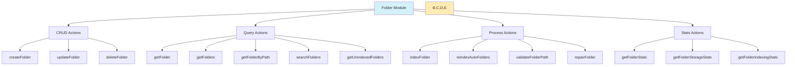

# Documentación del Módulo Folder

## Estructura de Archivos

El módulo Folder está organizado en varios archivos especializados que manejan diferentes aspectos de la funcionalidad:

```
src/app/actions/folders/
├── index.ts              # Exportaciones centralizadas
├── crud.actions.ts       # Operaciones CRUD básicas
├── query.actions.ts      # Consultas y búsquedas
├── process.actions.ts    # Procesamiento e indexación
└── stats.actions.ts      # Estadísticas y métricas
```

## Diagrama de Arquitectura



## Acciones Disponibles

### CRUD Actions (`crud.actions.ts`)
- **createFolder**: Crea una nueva carpeta verificando duplicados
- **updateFolder**: Actualiza una carpeta existente
- **deleteFolder**: Elimina una carpeta si no contiene imágenes

### Query Actions (`query.actions.ts`)
- **getFolder**: Obtiene una carpeta por ID
- **getFolders**: Lista todas las carpetas con caché
- **getFolderByPath**: Busca una carpeta por ruta
- **searchFolders**: Búsqueda por nombre o ruta
- **getUnindexedFolders**: Obtiene carpetas pendientes de indexar

### Process Actions (`process.actions.ts`)
- **indexFolder**: Indexa contenido de una carpeta
- **reindexAutoFolders**: Reindexación automática
- **validateFolderPath**: Valida existencia y acceso
- **repairFolder**: Repara estadísticas y relaciones

### Stats Actions (`stats.actions.ts`)
- **getFolderStats**: Estadísticas generales
- **getFolderStorageStats**: Estadísticas de almacenamiento
- **getFolderIndexingStats**: Estadísticas de indexación

## Manejo de Errores

Cada grupo de acciones tiene su propia clase de error especializada:
- `FolderError`: Errores CRUD
- `FolderQueryError`: Errores de consulta
- `FolderProcessError`: Errores de procesamiento
- `FolderStatsError`: Errores de estadísticas

## Revalidación de Rutas

Las rutas que se revalidan automáticamente cuando hay cambios:
- `/folders`
- `/images`
- `/dashboard`
- `/api/folders`
- `/api/images`

## Ejemplos de Uso

### Crear y Procesar una Carpeta

```typescript
// Crear una nueva carpeta
const newFolder = await createFolder({
  name: 'Vacaciones 2024',
  path: '/fotos/vacaciones-2024',
});

// Indexar su contenido
const indexResult = await indexFolder(newFolder.id);
```

### Búsqueda y Estadísticas

```typescript
// Buscar carpetas
const searchResults = await searchFolders('vacaciones');

// Obtener estadísticas
const stats = await getFolderStats();
```

### Mantenimiento

```typescript
// Validar una ruta
const validation = await validateFolderPath('/ruta/carpeta');

// Reparar una carpeta
const repair = await repairFolder(folderId);
```

## Integración con React Query

Ejemplo de uso con React Query:

```typescript
const useFolders = () => {
  return useQuery({
    queryKey: ['folders'],
    queryFn: getFolders,
    staleTime: 30000, // 30 segundos
  });
};

const useFolder = (id: string) => {
  return useQuery({
    queryKey: ['folder', id],
    queryFn: () => getFolder(id),
    enabled: !!id,
  });
};
```

## Notas de Implementación

1. Todas las acciones son server-side y están marcadas con 'use server'
2. Se implementa caché para operaciones de lectura frecuentes
3. Las operaciones de escritura revalidan automáticamente las rutas afectadas
4. Se mantiene un registro detallado con el logger del servidor
5. Las operaciones pesadas como indexación son asíncronas
6. Se implementa validación de datos y manejo de errores robusto

## Mejores Prácticas

1. Usar siempre las funciones exportadas, no acceder directamente a la base de datos
2. Manejar los errores específicos de cada tipo de operación
3. Implementar revalidación después de operaciones de escritura
4. Utilizar las funciones de caché para operaciones de lectura frecuentes
5. Mantener la consistencia en el manejo de rutas y nombres de archivos