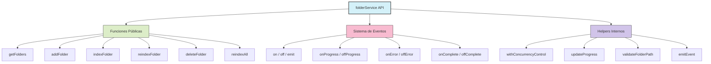
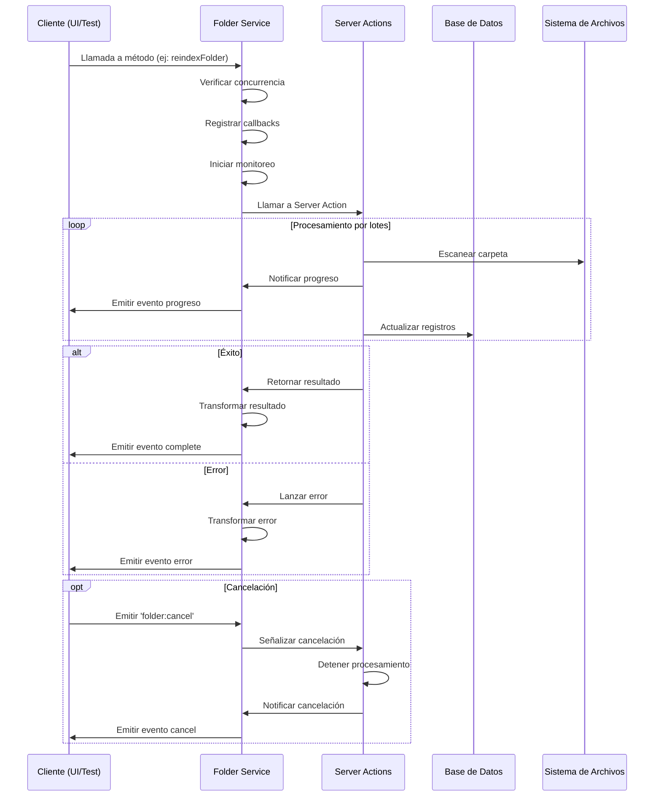

# Guía del Servicio de Carpetas (Enfoque Funcional)

## Diseño e Implementación

El servicio de carpetas implementa un enfoque completamente funcional para gestionar el ciclo de vida de las carpetas en el sistema. A continuación se describen los principales componentes y características del servicio.

### Principios clave

#### 1. Enfoque Funcional Puro

El servicio evita completamente el uso de clases y patrones OOP (Programación Orientada a Objetos), en favor de:

- **Funciones puras**: Operaciones que no tienen efectos secundarios inesperados
- **Closures**: Encapsulamiento de estado sin necesidad de clases
- **Composición de funciones**: Construcción de operaciones complejas a partir de sencillas
- **Inmutabilidad**: Preferencia por estructuras inmutables para mejorar previsibilidad

#### 2. Sistema de Eventos

El servicio implementa un sistema de eventos robusto que permite:

- Suscripción a eventos específicos (progreso, errores, finalización)
- Notificaciones en tiempo real para actualizar la UI
- Cancelación de operaciones en curso
- Integración con el sistema de eventos central de la aplicación

#### 3. Control de Concurrencia

El servicio incluye mecanismos para:

- Prevenir la duplicación de operaciones (no iniciar una operación ya en curso)
- Limitar el número de operaciones concurrentes para evitar sobrecarga
- Distribuir recursos de manera eficiente entre múltiples operaciones
- Permitir cancelar operaciones en cualquier momento

#### 4. Manejo Funcional de Errores

En lugar de usar excepciones y clases de error, el servicio:

- Trata los errores como objetos de datos normales
- Proporciona mejor trazabilidad y contexto en los errores
- Mejora las capacidades de pruebas y depuración
- Estandariza el formato de errores en todas las operaciones

## Arquitectura

### Estructura del Servicio



### Flujo de Datos



## Sistema de Eventos

### Eventos Disponibles

| Evento | Descripción | Datos Proporcionados |
|--------|-------------|----------------------|
| `folder:progress` | Actualización de progreso | `ProcessStatus` con detalles |
| `folder:error` | Se produjo un error | `ErrorResponse` con detalles |
| `folder:complete` | Operación completada | Resultado de la operación |
| `folder:cancel` | Cancelar operación específica | - |
| `folder:cancel:all` | Cancelar todas las operaciones | - |
| `folder:stats` | Actualización de estadísticas | `FolderStats` con métricas |
| `folder:added` | Carpeta añadida | Datos de la carpeta |
| `folder:deleted` | Carpeta eliminada | ID de la carpeta |
| `folder:modified` | Carpeta modificada | Datos actualizados |
| `folder:indexing:start` | Inicio de indexación | Datos iniciales |
| `folder:indexing:complete` | Indexación completada | Estadísticas finales |
| `folder:reindexAll:start` | Inicio de reindexación global | Configuración inicial |
| `folder:reindexAll:progress` | Progreso de reindexación global | Estado actual por carpeta |
| `folder:reindexAll:complete` | Reindexación global completada | Estadísticas finales |

### Suscripción a Eventos

```typescript
// Ejemplo de suscripción a eventos
import { folderService } from '@/services/folder.service.functional';

// Método general para cualquier evento
folderService.on('folder:progress', (status) => {
  console.log(`Progreso: ${status.progress}%`);
});

// Métodos específicos para eventos comunes
folderService.onProgress((status) => {
  updateProgressBar(status.progress);
});

folderService.onError((error) => {
  showErrorMessage(error.message);
});

folderService.onComplete((result) => {
  showSuccessMessage(`Procesados ${result.filesProcessed} archivos`);
});

// Limpiar eventos al desmontar componentes
folderService.off('folder:progress', myCallback);
// O todos los listeners
folderService.offAll();
```

## Control de Concurrencia

El servicio implementa un sistema de control de concurrencia para evitar problemas de carrera y limitar el uso de recursos:

```typescript
// Implementación interna
const withConcurrencyControl = async <T>(operation: string, fn: () => Promise<T>): Promise<T> => {
  if (state.operationsInProgress.get(operation)) {
    throw createFolderError(
      `Operación ${operation} en progreso`,
      FOLDER_ERROR_CODES.OPERATION_IN_PROGRESS
    );
  }

  state.operationsInProgress.set(operation, true);
  try {
    return await fn();
  } finally {
    state.operationsInProgress.delete(operation);
  }
};
```

### Procesamiento por Lotes

Para operaciones que manipulan grandes cantidades de archivos, el servicio implementa procesamiento por lotes:

- División de colecciones grandes en lotes manejables
- Control de concurrencia para procesamiento paralelo
- Monitoreo de progreso en tiempo real
- Estimación de tiempo restante y velocidad de procesamiento
- Capacidad de cancelación en cualquier momento
- Recuperación en caso de fallos parciales

## Funciones Principales

### Indexación de Carpetas

```typescript
// Ejemplo: Reindexar una carpeta con monitoreo de progreso
import { folderService } from '@/services/folder.service.functional';

// Crear callbacks para seguimiento
const callbacks = {
  onProgress: (status) => {
    console.log(`Progreso: ${status.progress}%`);
    console.log(`Archivos: ${status.filesProcessed}/${status.totalFiles}`);
    console.log(`Fase: ${status.phase}`);
  },
  onError: (error) => {
    console.error(`Error: ${error.message}`);
  },
  onComplete: (result) => {
    console.log(`Completado. ${result.filesProcessed} archivos procesados`);
  },
  onCancel: () => {
    console.log('Operación cancelada por el usuario');
  }
};

// Iniciar indexación
try {
  const result = await folderService.reindexFolder('carpeta-id', callbacks);
  console.log('Resultado:', result);
} catch (error) {
  console.error('Error al reindexar carpeta:', error);
}

// Cancelar la operación desde cualquier lugar
folderService.emit('folder:cancel', {});
```

### Reindexación Global

```typescript
// Ejemplo: Reindexar todas las carpetas del sistema
import { folderService } from '@/services/folder.service.functional';

// Opciones avanzadas
const options = {
  maxConcurrent: 2,    // Máximo 2 carpetas en paralelo
  batchSize: 50,       // Procesar en lotes de 50 archivos
  onGlobalProgress: (status) => {
    console.log(`Progreso global: ${status.progress}%`);
    console.log(`Carpetas: ${status.current}/${status.total}`);
    console.log(`Tiempo estimado: ${status.estimatedTimeRemaining}s`);
  },
  onFolderProgress: (folderId, status) => {
    console.log(`Carpeta ${folderId}: ${status.progress}%`);
  }
};

// Iniciar reindexación global
try {
  const result = await folderService.reindexAll(options);
  console.log('Resultado global:', result);
  console.log(`Éxito: ${result.successful}/${result.totalFolders}`);
  console.log(`Fallidas: ${result.failed}`);
  console.log(`Duración: ${result.duration/1000}s`);
  console.log(`Cancelada: ${result.cancelled}`);
} catch (error) {
  console.error('Error en reindexación global:', error);
}

// Cancelar todas las operaciones de reindexación
folderService.emit('folder:cancel:all', {});
```

## Integración con Server Actions

El servicio se integra perfectamente con las Server Actions de Next.js:

```typescript
// Server Action en app/actions/folders/reindex-folder.ts
'use server';

import { revalidatePath } from 'next/cache';
import { createFolderError, FOLDER_ERROR_CODES } from './folder-types';

export async function reindexFolderAction(id: string, options?: ReindexOptions) {
  try {
    // Verificar permisos y validar entradas

    // Procesar la carpeta
    const result = await processFolder(id, options);

    // Revalidar rutas
    revalidatePath('/folders');
    revalidatePath(`/folders/${id}`);

    return result;
  } catch (error) {
    // Convertir y propagar error
    throw createFolderError(
      `Error reindexando carpeta ${id}`,
      FOLDER_ERROR_CODES.INDEXING_FAILED,
      error
    );
  }
}
```

## Mejores Prácticas

### Al Usar el Servicio en Componentes

1. **Gestión del Ciclo de Vida**:
   - Registrar event listeners en `useEffect`
   - Desregistrar en la función de limpieza
   - Usar `folderService.offAll()` para limpiar todo

2. **Actualización de Estado**:
   - Actualizar estado React con eventos del servicio
   - Usar `useCallback` para funciones de callback estables

3. **Cancelación de Operaciones**:
   - Proporcionar mecanismos de UI para cancelar
   - Gestionar estado durante la cancelación
   - Mostrar retroalimentación tras la cancelación

### Ejemplo Completo de Componente

```tsx
'use client';

import { useState, useEffect, useCallback } from 'react';
import { folderService } from '@/services/folder.service.functional';
import type { ProcessStatus } from '@/app/actions/folders/folder-types';

export function FolderProcessor({ folderId }: { folderId: string }) {
  const [progress, setProgress] = useState<ProcessStatus | null>(null);
  const [error, setError] = useState<string | null>(null);
  const [result, setResult] = useState<any | null>(null);

  // Callbacks estables
  const handleProgress = useCallback((status: ProcessStatus) => {
    setProgress(status);
  }, []);

  const handleError = useCallback((error: any) => {
    setError(error.message || 'Error desconocido');
  }, []);

  const handleComplete = useCallback((data: any) => {
    setResult(data);
  }, []);

  // Registrar/desregistrar eventos
  useEffect(() => {
    folderService.onProgress(handleProgress);
    folderService.onError(handleError);
    folderService.onComplete(handleComplete);

    return () => {
      folderService.offProgress(handleProgress);
      folderService.offError(handleError);
      folderService.offComplete(handleComplete);
    };
  }, [handleProgress, handleError, handleComplete]);

  // Iniciar procesamiento
  const startProcessing = async () => {
    try {
      await folderService.reindexFolder(folderId);
    } catch (error: any) {
      setError(error.message);
    }
  };

  // Cancelar procesamiento
  const cancelProcessing = () => {
    folderService.emit('folder:cancel', {});
  };

  return (
    <div>
      {/* UI del componente */}
    </div>
  );
}
```

## Solución de Problemas

### Errores Comunes

1. **Operación en progreso**: Se intenta iniciar una operación que ya está en curso.
   - Solución: Verificar estado antes de iniciar, o implementar cola de operaciones.

2. **Carpeta no encontrada**: ID o ruta de carpeta inválidos.
   - Solución: Validar ID antes de llamar al servicio.

3. **Permiso denegado**: No se puede acceder al sistema de archivos.
   - Solución: Verificar permisos del usuario y del sistema.

4. **Callbacks no eliminados**: Fugas de memoria por event listeners no limpiados.
   - Solución: Usar `useEffect` con función de limpieza.

### Rendimiento

1. **Ajustar tamaño de lotes**:
   - Lotes pequeños: Mejor feedback, más sobrecarga
   - Lotes grandes: Mejor rendimiento, menos actualizaciones de UI

2. **Limitar concurrencia**:
   - CPU-bound: Limitar al número de núcleos
   - I/O-bound: Puede aumentarse para operaciones de red/disco

3. **Monitoreo de recursos**:
   - Observar uso de memoria durante procesamiento grande
   - Considerar cancelar operaciones si los recursos son limitados

## Resumen

El servicio de carpetas proporciona:

1. **API Funcional**: Sencilla, componible y testeable
2. **Sistema de Eventos**: Comunicación en tiempo real con la UI
3. **Control de Concurrencia**: Gestión eficiente de recursos
4. **Manejo de Errores**: Formato estandarizado y trazabilidad
5. **Procesamiento por Lotes**: Eficiencia en conjuntos grandes de datos
6. **Cancelación de Operaciones**: Control completo por el usuario
7. **Monitoreo Avanzado**: Métricas detalladas de rendimiento

Este enfoque funcional facilita las pruebas, mejora la composición, y proporciona una arquitectura más mantenible a largo plazo.