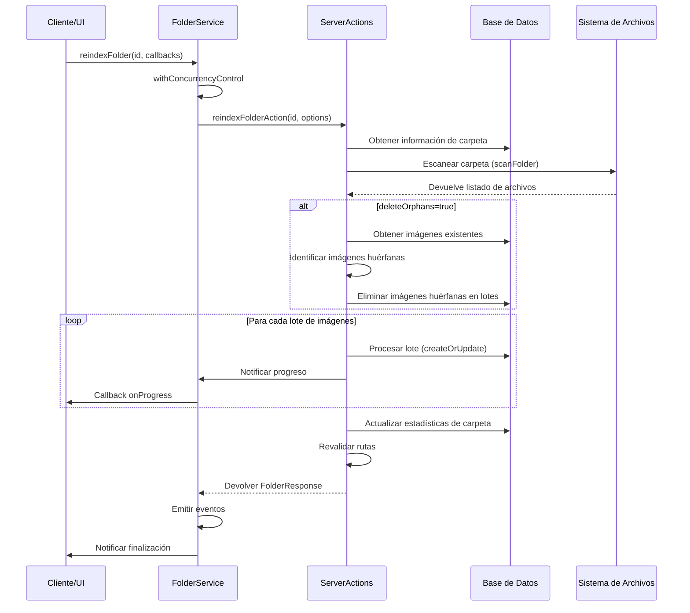
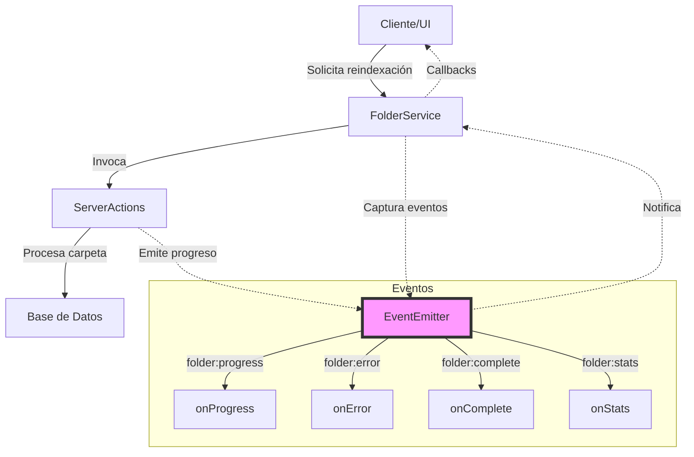
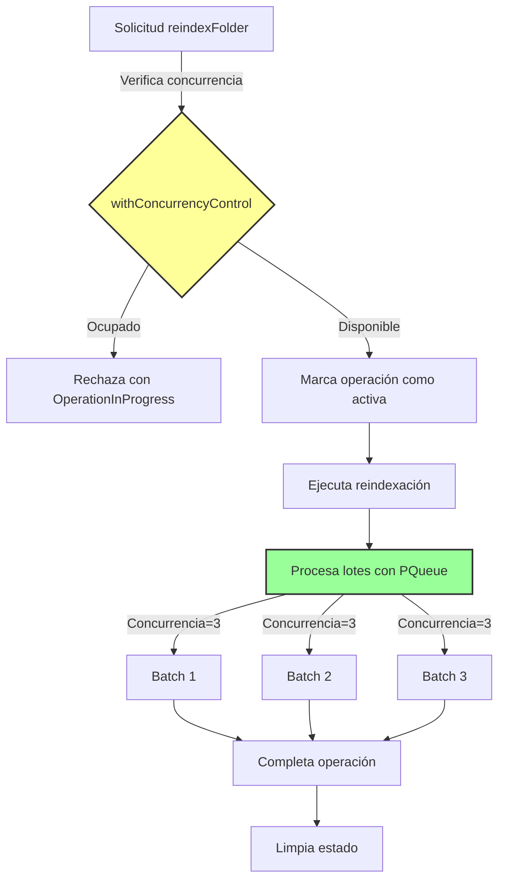

# Flujo de trabajo del Servicio de Carpetas

Este documento describe el flujo de trabajo del servicio de carpetas, particularmente enfocado en el proceso de reindexación.

## Proceso de Reindexación

El proceso de reindexación de carpetas permite actualizar la información en la base de datos acerca de los archivos presentes en una carpeta del sistema de archivos. Este proceso incluye:

1. Escaneo de la carpeta
2. Limpieza de imágenes huérfanas (que ya no existen en el sistema de archivos)
3. Procesamiento por lotes de las imágenes encontradas
4. Actualización de estadísticas de la carpeta

## Arquitectura de Eventos

El servicio de carpetas implementa un sistema de eventos para notificar cambios en tiempo real.

## Control de Concurrencia

Para evitar sobrecargar el sistema, el servicio implementa un control de concurrencia que:

1. Limita el número de operaciones paralelas
2. Procesa los archivos en lotes
3. Evita iniciar operaciones duplicadas

Este enfoque funcional permite un procesamiento eficiente y resiliente de grandes volúmenes de archivos, mientras mantiene al usuario informado del progreso en tiempo real.