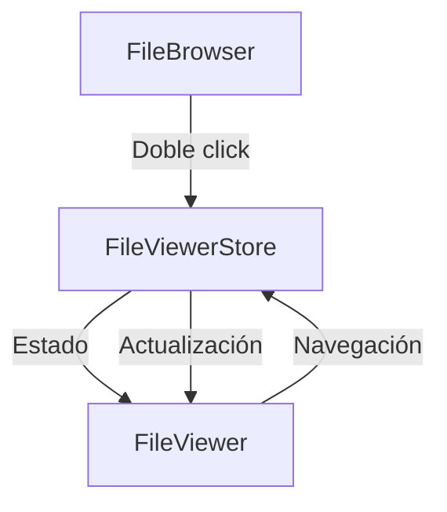

# Integración del Visor de Archivos

## Visión general

El visor de archivos (`FileViewer`) está diseñado para integrarse perfectamente con el `FileBrowser` a través de un store centralizado. Esta arquitectura permite una navegación fluida entre elementos sin tener que salir del visor.



## Arquitectura

### Store centralizado

El `FileViewerStore` actúa como fuente única de verdad para:

1. Estado de apertura del visor
2. Lista de elementos visualizables
3. Índice del elemento actual
4. Acciones de navegación

```typescript
// Ejemplo de uso del store
const {
  openViewer,
  closeViewer,
  nextItem,
  previousItem
} = useFileViewerStore();

// Abrir el visor con una lista de elementos
openViewer(imageItems, initialIndex);
```

### Componente FileViewer

El componente `FileViewer` está diseñado para ser independiente y se monta en el layout principal de la aplicación. Esto permite:

1. Mantenerlo siempre disponible sin tener que remontarlo
2. Conservar su estado entre navegaciones
3. Proporcionar una experiencia de usuario consistente

## Flujo de integración

1. **Apertura del visor**:
   - El usuario hace doble clic en un elemento del `FileBrowser`
   - El `FileBrowser` convierte los elementos a `ImageItems` y determina el índice inicial
   - El `FileBrowser` llama a `openViewer()` del store
   - El `FileViewer` reacciona al cambio de estado y se muestra

2. **Navegación entre elementos**:
   - El usuario utiliza las flechas del teclado o los botones de navegación
   - El `FileViewer` llama a `nextItem()` o `previousItem()` del store
   - El store actualiza el índice actual
   - El `FileViewer` muestra el nuevo elemento

3. **Cierre del visor**:
   - El usuario presiona ESC o el botón de cierre
   - El `FileViewer` llama a `closeViewer()` del store
   - El store actualiza el estado de apertura
   - El `FileViewer` se oculta

## Ventajas de esta arquitectura

1. **Desacoplamiento**: El `FileBrowser` y el `FileViewer` no dependen directamente uno del otro
2. **Estado centralizado**: El estado del visor se gestiona en un único lugar
3. **Persistencia**: El estado del visor puede persistir entre navegaciones si es necesario
4. **Extensibilidad**: Fácil de extender con nuevas funcionalidades

## Uso en la aplicación

```tsx
// En el FileBrowser
const handleItemDoubleClick = useCallback((item: FileItem) => {
  // Convertir a ImageItems
  const images = fileItemsToImageItems(filteredItems);

  // Encontrar índice
  const index = filteredItems.findIndex(file => file.id === item.id);

  // Abrir visor
  openViewer(images, index);
}, [filteredItems, openViewer]);

// En el layout principal
export default function RootLayout({ children }) {
  return (
    <html>
      <body>
        {children}
        <FileViewer />
      </body>
    </html>
  );
}
```

## Consideraciones de rendimiento

1. El `FileViewer` solo carga las imágenes cuando es necesario
2. Las URL de las imágenes se cachean para evitar solicitudes repetidas
3. La virtualización de miniaturas evita renderizar todas las imágenes a la vez