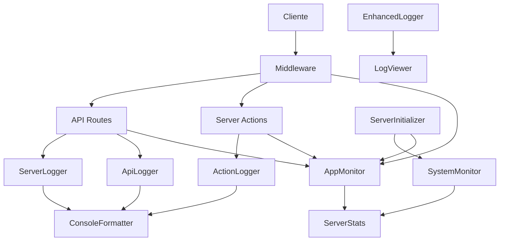

# Arquitectura de Logging

Este documento describe la arquitectura de logging implementada en la aplicación, que proporciona capacidades avanzadas de registro, monitoreo y depuración.

## Componentes Principales

La arquitectura de logging se compone de los siguientes elementos:

### 1. Loggers

- **EnhancedLogger**: Logger principal con soporte para colores, iconos, contextos y métodos avanzados.
- **ServerLogger**: Logger optimizado para entornos de servidor con formato mejorado para la consola.
- **ApiLogger**: Logger especializado para rutas de API con información de solicitudes y respuestas.
- **ActionLogger**: Logger para Server Actions con seguimiento de rendimiento.

### 2. Visualización

- **LogViewer**: Componente UI para visualizar logs en tiempo real con filtrado y estadísticas.
- **DebugConsole**: Consola de depuración integrada en la aplicación.
- **ServerStats**: Visualizador de estadísticas del servidor y la aplicación.

### 3. Monitoreo

- **SystemMonitor**: Monitor de recursos del sistema (CPU, memoria, red).
- **AppMonitor**: Monitor de estadísticas de la aplicación (solicitudes, rendimiento, errores).
- **ServerInitializer**: Componente para inicializar y gestionar los monitores.

### 4. Utilidades

- **ConsoleFormatter**: Utilidad para formatear mensajes en la consola con colores y estilos.
- **Migration**: Capa de compatibilidad para migrar desde el logger antiguo.

## Diagrama de Arquitectura



## Uso de Loggers

### EnhancedLogger

```typescript
import { enhancedLogger } from '@/lib/logger/enhanced-logger';

// Logger básico
enhancedLogger.info('Mensaje informativo');
enhancedLogger.warn('Advertencia');
enhancedLogger.error('Error', { code: 500 });

// Logger con contexto
const userLogger = enhancedLogger.withContext('UserService');
userLogger.info('Usuario creado', { id: 123 });
```

### ServerLogger

```typescript
import { serverLogger } from '@/lib/logger/server-logger';

// Logger para servidor
serverLogger.info('Servidor iniciado');
serverLogger.http('GET /api/users', { status: 200, time: '120ms' });
serverLogger.db('Consulta completada', { table: 'users', time: '50ms' });

// Formateo avanzado
serverLogger.separator('Inicio de operación');
serverLogger.progress('Procesamiento', 75);
serverLogger.separatorEnd();
```

### Monitores

```typescript
import { appMonitor } from '@/lib/server/app-monitor';
import { systemMonitor } from '@/lib/server/system-monitor';

// Iniciar monitores
const stopAppMonitor = appMonitor.start();
const stopSystemMonitor = systemMonitor.start();

// Registrar eventos
appMonitor.trackRequest(200, 150); // status, tiempo en ms
appMonitor.trackError(new Error('Fallo de conexión'), 'database');
appMonitor.trackDatabaseQuery(75, false); // tiempo en ms, es lenta?

// Obtener estadísticas
const stats = appMonitor.getStats();
console.log(stats.requests.total);

// Detener monitores
stopAppMonitor();
stopSystemMonitor();
```

## Panel de Depuración

La aplicación incluye un panel de depuración accesible en la ruta `/debug` que proporciona:

1. **Consola de Logs**: Visualización en tiempo real de logs con filtrado y búsqueda.
2. **Estadísticas del Servidor**: Monitoreo de recursos del sistema y métricas de la aplicación.

## Inicialización del Servidor

El sistema de logging y monitoreo se inicializa automáticamente cuando la aplicación arranca:

1. El componente `ServerInitializer` se incluye en el layout principal.
2. Al cargar la aplicación, se realiza una llamada a `/api/init-server`.
3. La API inicializa los monitores y configura los manejadores de eventos.

## Migración desde el Logger Antiguo

Para facilitar la transición, se proporciona una capa de compatibilidad:

```typescript
// Código antiguo (sigue funcionando)
import { logger } from '@/lib/logger/logger';
logger.info('Mensaje');

// Código nuevo recomendado
import { enhancedLogger } from '@/lib/logger/enhanced-logger';
enhancedLogger.info('Mensaje');
```
