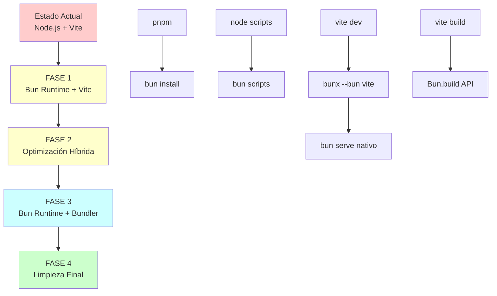

[001] Plan de Migración Node.js + Vite → Bun Runtime + Bundler

## Context

El proyecto actualmente usa Node.js como runtime y Vite como bundler/dev server. Necesitamos migrar completamente a Bun como runtime único y eventualmente reemplazar Vite con el bundler nativo de Bun para simplificar el stack tecnológico y mejorar el rendimiento.

## Prioridad: [HIGH] | Complejidad: [BIG]

## Arquitectura Actual

### Runtime y Herramientas
- **Runtime Principal**: Node.js (v20+)
- **Bundler/Dev Server**: Vite 7.0.1
- **Package Manager**: pnpm
- **Build Tools**: tsup (servidor), Vite (cliente)
- **Testing**: Playwright + Vitest
- **Linting**: ESLint + Biome

### Estructura de Scripts Críticos
```json
{
  "dev": "pnpm dev:vite",
  "dev:vite": "vite",
  "build": "pnpm build:vite && pnpm build:server",
  "build:vite": "vite build",
  "build:server": "node scripts/build-server.js",
  "preview": "vite preview"
}
```

## Plan de Migración en Fases

### 🚀 FASE 1: Migración del Runtime (Inmediata)
**Duración estimada: 1-2 días**

#### 1.1 Instalación y Configuración Base ✅ COMPLETADO
- [x] ✅ Instalar Bun globalmente (v1.2.15 ya instalado)
- [x] ✅ Migrar de pnpm a bun como package manager (bun.lock creado)
- [x] ✅ Crear `bunfig.toml` con configuración optimizada
- [x] ✅ Actualizar scripts de package.json para usar bun

#### 1.2 Validación de Compatibilidad ✅ COMPLETADO
- [x] ✅ Verificar que todas las dependencias funcionen con Bun
- [x] ✅ Actualizar scripts de logging para usar bun
- [x] ✅ Probar scripts de base de datos (Drizzle)
- [x] ✅ Validar funcionamiento de Playwright

#### 1.3 Configuración de Desarrollo ✅ COMPLETADO
- [x] ✅ Mantener Vite temporalmente con `bunx --bun vite`
- [x] ✅ Actualizar scripts de desarrollo y build
- [x] ✅ Configurar Playwright para usar Bun
- [x] ✅ Actualizar documentación
- [x] ✅ Crear benchmarks de rendimiento

### 🔄 FASE 2: Migración Híbrida Bun + Vite (1-2 semanas)
**Duración estimada: 1-2 semanas**

#### 2.1 Optimización del Setup Híbrido
- [ ] Configurar Vite para funcionar óptimamente con Bun
- [ ] Optimizar configuración de `vite.config.ts`
- [ ] Validar HMR y desarrollo en caliente
- [ ] Benchmarks de rendimiento vs Node.js

#### 2.2 Preparación para Transición
- [ ] Analizar dependencias de Vite específicas
- [ ] Identificar plugins críticos de Vite
- [ ] Diseñar estrategia de reemplazo de plugins
- [ ] Documentar diferencias de configuración

### 🎯 FASE 3: Migración Completa a Bun Bundler (2-3 semanas)
**Duración estimada: 2-3 semanas**

#### 3.1 Configuración del Bundler Nativo
- [ ] Crear configuración de `Bun.build()` equivalente a Vite
- [ ] Migrar plugins esenciales (React, TypeScript, SVG)
- [ ] Configurar HMR nativo de Bun
- [ ] Implementar proxy de desarrollo

#### 3.2 Características Específicas
- [ ] Configurar bundling de assets (SVG, imágenes)
- [ ] Implementar code splitting equivalente
- [ ] Configurar sourcemaps y debugging
- [ ] Validar build de producción

#### 3.3 Servidor de Desarrollo
- [ ] Reemplazar `vite dev` con servidor Bun nativo
- [ ] Configurar proxy para APIs
- [ ] Implementar live reload/HMR
- [ ] Optimizar tiempo de startup

### 🧹 FASE 4: Limpieza y Optimización (1 semana)
**Duración estimada: 1 semana**

#### 4.1 Eliminación de Dependencias Legacy
- [ ] Remover Vite y plugins relacionados
- [ ] Limpiar configuraciones obsoletas
- [ ] Actualizar scripts de CI/CD
- [ ] Optimizar bundle final

#### 4.2 Documentación y Testing
- [ ] Actualizar documentación completa
- [ ] Validar todos los tests E2E
- [ ] Benchmarks de rendimiento final
- [ ] Guía de migración para equipo

## Configuraciones Clave a Crear

### bunfig.toml
```toml
[install]
# Configuración para migración desde pnpm
dev = true
optional = true
peer = true
production = false
concurrentScripts = 16

[install.cache]
dir = "~/.bun/install/cache"
disable = false

# Configuración para builds
[serve.static]
plugins = ["bun-plugin-tailwind"]
```

### Configuración de Build
```typescript
// build.config.ts (nueva configuración)
await Bun.build({
  entrypoints: ['./src/main.tsx'],
  outdir: './dist',
  target: 'browser',
  format: 'esm',
  splitting: true,
  minify: {
    whitespace: true,
    identifiers: true,
    syntax: true
  },
  plugins: [
    // React plugin equivalente
    // SVG plugin equivalente
    // Path resolution plugin
  ]
})
```

## Puntos de Atención Críticos

### ⚠️ Riesgos de Compatibilidad
1. **Dependencias nativas**: Verificar compatibilidad de sharp, sqlite3, etc.
2. **ESM vs CommonJS**: Revisar imports/exports de módulos legacy
3. **Plugins de Vite**: Migrar funcionalidad de vite-plugin-svgr, etc.
4. **Configuración de TypeScript**: Adaptar paths y resolución de módulos

### 🔧 Herramientas a Migrar
1. **tsup** → Bun.build() para servidor
2. **vite dev** → Bun serve() nativo
3. **vite build** → Bun.build() para producción
4. **vite preview** → Bun serve() para preview

### 📊 Métricas de Éxito
1. **Tiempo de startup**: Reducción esperada del 30-50%
2. **Tiempo de build**: Mejora esperada del 20-40%
3. **Tamaño de node_modules**: Reducción significativa
4. **Memoria utilizada**: Optimización general

## Scripts de Migración Propuestos

### package.json (FASE 1)
```json
{
  "scripts": {
    "dev": "bunx --bun vite",
    "build": "bun run build:vite && bun run build:server",
    "build:vite": "bunx --bun vite build",
    "build:server": "bun scripts/build-server.js",
    "preview": "bunx --bun vite preview",
    "install": "bun install"
  }
}
```

### package.json (FASE 3 - Final)
```json
{
  "scripts": {
    "dev": "bun run dev:native",
    "dev:native": "bun serve:dev",
    "build": "bun run build:client && bun run build:server",
    "build:client": "bun build:production",
    "build:server": "bun scripts/build-server.js",
    "preview": "bun serve:preview"
  }
}
```

## Diagrama de Migración



## Comandos de Ejecución Inmediata

```bash
# FASE 1 - Migración de Runtime
bun install                    # Migrar de pnpm a bun
bunx --bun vite               # Probar Vite con Bun runtime
bun run test:e2e              # Validar tests con Bun
bun run drizzle:check         # Validar DB con Bun

# Benchmarking
time bun install              # vs time pnpm install
time bunx --bun vite build    # vs time pnpm build:vite
```

## Referencias y Documentación

- [Bun Installation Guide](https://bun.sh/docs/installation)
- [Migrating from Node.js](https://bun.sh/docs/guides/install/from-npm-install-to-bun-install)
- [Vite with Bun](https://bun.sh/guides/ecosystem/vite)
- [Bun Bundler API](https://bun.sh/docs/bundler)

---

**Estado**: 📋 PLANIFICADO - Listo para ejecución inmediata
**Próximo paso**: Ejecutar FASE 1 - Migración del Runtime
**Estimación total**: 4-6 semanas para migración completa
