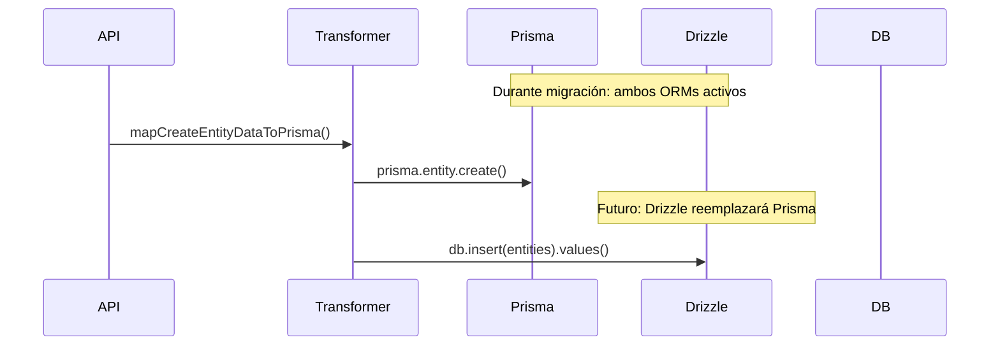

# Auditoría de Documentación: Referencias a Prisma

Este documento cataloga todas las referencias a Prisma en la documentación del proyecto y proporciona guías para actualizarlas con información de coexistencia Prisma-Drizzle.

---

## **Resumen de la Auditoría**

- **Total de archivos revisados**: 50+ archivos .md
- **Referencias a Prisma encontradas**: 85+ menciones
- **Categorías principales**:
  - Diagramas de flujo (Mermaid)
  - Ejemplos de código
  - Documentación de tipos
  - Guías de migración

---

## **Archivos por Actualizar**

### **🔴 ALTA PRIORIDAD - Documentación Principal**

#### `src/types/entities/MIGRATION-GUIDE.md`

- ✅ **Actualizado**: Agregada nota de migración Drizzle
- **Cambios**: Nota de coexistencia en la introducción

#### `docs/architecture.md`

- ✅ **Actualizado**: Agregada nota de migración
- **Cambios**: Nota de estado de migración en el encabezado

#### `CURRENT-TASK.md`

- ✅ **Actualizado**: Agregada referencia a migración paralela
- **Cambios**: Nota sobre migración paralela de Drizzle

### **🟡 MEDIA PRIORIDAD - Documentación de Tipos**

#### `src/types/entities/tag/documentation.md`

- **Referencias encontradas**: 12 menciones a Prisma
- **Cambios necesarios**:

  ```markdown
  > **⚠️ MIGRACIÓN EN CURSO**: Este servicio usa actualmente Prisma pero será migrado a Drizzle ORM. Ver [Guía de Coexistencia](../../../../docs/migration-drizzle/02-coexistence-guide.md).
  ```

- **Diagramas a actualizar**:

  ```mermaid
  participant Prisma
  participant Drizzle  # Añadir durante migración
  ```

#### `src/types/entities/property/documentation.md`

- **Referencias encontradas**: 8 menciones a Prisma
- **Cambios necesarios**: Igual que tag/documentation.md

#### `src/types/entities/workflow/documentation.md`

- **Referencias encontradas**: 5 menciones a Prisma
- **Cambios necesarios**: Actualizar diagramas y ejemplos

### **🟢 BAJA PRIORIDAD - Documentación Específica de Entidades**

Los siguientes archivos contienen referencias menores a Prisma que deben actualizarse cuando se migre cada entidad específica:

1. `src/types/entities/video/README.md` - 5 menciones
2. `src/types/entities/video/documentation.md` - 3 menciones
3. `src/types/entities/uploaded-image/documentation.md` - 3 menciones
4. `src/types/entities/wildcard/documentation.md` - 3 menciones
5. `src/types/entities/world-item/documentation.md` - 3 menciones
6. `src/types/entities/ui/documentation.md` - 3 menciones
7. `src/types/entities/task/documentation.md` - 3 menciones
8. `src/types/entities/queue-job/documentation.md` - 3 menciones
9. `src/types/entities/prompt/documentation.md` - 3 menciones
10. `src/types/entities/profile/documentation.md` - 3 menciones
11. `src/types/entities/place/documentation.md` - 3 menciones
12. `src/types/entities/note/README.md` - 3 menciones
13. `src/types/entities/note/documentation.md` - 3 menciones
14. `src/types/entities/metadata/documentation.md` - 3 menciones
15. `src/types/entities/json-file/documentation.md` - 3 menciones
16. `src/types/entities/image/documentation.md` - 3 menciones
17. `src/types/entities/group/README.md` - 1 mención
18. `src/types/entities/folder/documentation.md` - 3 menciones
19. `src/types/entities/file3d/documentation.md` - 3 menciones
20. `src/types/entities/file/documentation.md` - 3 menciones
21. `src/types/entities/favorite/documentation.md` - 3 menciones
22. `src/types/entities/document/documentation.md` - 3 menciones
23. `src/types/entities/concept/README.md` - 1 mención
24. `src/types/entities/collection/README.md` - 1 mención
25. `src/types/entities/character/documentation.md` - 3 menciones

---

## **Plantillas de Actualización**

### **Nota de Migración Estándar**

Para agregar al inicio de archivos de documentación de entidades:

```markdown
> **⚠️ MIGRACIÓN EN CURSO**: Este servicio usa actualmente Prisma pero será migrado gradualmente a Drizzle ORM. Durante la transición, ambos ORMs coexisten. Ver [Guía de Coexistencia](../../../../docs/migration-drizzle/02-coexistence-guide.md) para detalles.
```

### **Actualización de Diagramas Mermaid**

Para diagramas que muestran flujo de datos:



### **Actualización de Ejemplos de Código**

Para ejemplos que muestran uso de Prisma:

```typescript
// ACTUAL (Prisma)
import { Prisma } from '@prisma/client';
const newEntityData: Prisma.EntityCreateInput = {
  name: 'example',
  // ...
};

// FUTURO (Drizzle) - En migración
import { db } from '@/lib/drizzle';
import { entities } from '@/lib/drizzle/schema';
const newEntityData = {
  name: 'example',
  // ...
};
await db.insert(entities).values(newEntityData);
```

---

## **Estrategia de Actualización**

### **Fase 1: Documentación Principal (COMPLETADA)**

- ✅ Archivos de alto nivel actualizados
- ✅ Notas de migración agregadas
- ✅ Referencias cruzadas establecidas

### **Fase 2: Documentación por Servicios (PENDIENTE)**

- [ ] Actualizar documentación cuando se migre cada servicio
- [ ] Mantener ejemplos de ambos ORMs durante transición
- [ ] Actualizar diagramas para mostrar coexistencia

### **Fase 3: Limpieza Final (FUTURO)**

- [ ] Eliminar referencias a Prisma cuando migración esté completa
- [ ] Actualizar todos los diagramas para mostrar solo Drizzle
- [ ] Revisar consistencia en toda la documentación

---

## **Checklist por Archivo**

### **Para cada archivo de documentación de entidad**

- [ ] Agregar nota de migración al inicio
- [ ] Actualizar ejemplos de código para mostrar ambos ORMs
- [ ] Modificar diagramas Mermaid para incluir Drizzle
- [ ] Agregar referencias a documentación de coexistencia
- [ ] Mantener ejemplos de Prisma hasta completar migración

### **Para diagramas Mermaid**

- [ ] Agregar participante "Drizzle" donde corresponda
- [ ] Añadir notas sobre estado de migración
- [ ] Mostrar flujos paralelos durante coexistencia
- [ ] Indicar dirección futura hacia Drizzle

---

## **Herramientas de Validación**

### **Script de Búsqueda**

```bash
# Buscar todas las referencias a Prisma en documentación
grep -r "Prisma\|prisma" docs/ src/ --include="*.md" > prisma-references.txt
```

### **Checklist de Validación**

- [ ] Todas las referencias a Prisma tienen contexto de migración
- [ ] Diagramas muestran estado actual de coexistencia
- [ ] Ejemplos de código incluyen ambos ORMs cuando relevante
- [ ] Enlaces a documentación de migración funcionan
- [ ] Consistencia en terminología entre archivos

---

## **Archivos de Migración Creados**

### **Documentación Nueva**

- ✅ `docs/migration-drizzle/00-migration-plan.md`
- ✅ `docs/migration-drizzle/01-schema-conversion.md`
- ✅ `docs/migration-drizzle/02-coexistence-guide.md`
- ✅ `docs/migration-drizzle/03-documentation-audit.md` (este archivo)

### **Archivos Técnicos**

- ✅ `src/lib/drizzle/schema.ts`
- ✅ `src/lib/drizzle/index.ts`
- ✅ `drizzle.config.ts`
- ✅ `scripts/db/drizzle-test.ts`

---

## **Próximos Pasos**

1. **Resolver problema técnico** de better-sqlite3
2. **Validar configuración** de Drizzle completamente
3. **Actualizar documentación** por servicios según se migren
4. **Mantener sincronización** entre documentación y código
5. **Revisar consistencia** periódicamente durante migración

---

## **Referencias**

- [Plan de Migración](./00-migration-plan.md)
- [Conversión de Schema](./01-schema-conversion.md)
- [Guía de Coexistencia](./02-coexistence-guide.md)
- [Documentación de Drizzle](https://orm.drizzle.team/docs)
- [Documentación de Prisma](https://www.prisma.io/docs)
