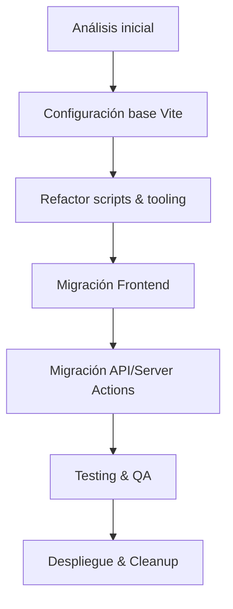

# [012] Migración a Vite + React 19

## Contexto

Actualmente el proyecto utiliza **Next.js 15** como framework principal. **Todos los equipos deben usar Node.js ≥ 20.19 (o 22.12) tal como exige Vite 7**. Queremos sustituirlo por **Vite + React 19** para obtener:

- Arranque y recarga ultrarrápidos gracias a Vite.
- Mejor control fino del bundler (esbuild + Rollup).
- Menor lock-in a convenciones de Next.js.
- Simplificar despliegues como aplicación SPA/MPA + servidor API independiente.

## Objetivo

Completar la migración sin interrumpir la operación normal, preservando 100 % de funcionalidad y pruebas.

Para visión ejecutiva de alto nivel consulta también el documento «[Resumen Ejecutivo](./EXECUTIVE-SUMMARY.md)».

## Roadmap resumido

## Subtareas

- [ ] [HIGH] [SMALL] **T01 – Auditoría de dependencias** <small>(ver 01-dependencies-analysis.md)</small>
- [ ] [HIGH] [MEDIUM] **T02 – Configuración inicial de Vite + React + TS**
- [ ] [HIGH] [SMALL] **T03 – Integrar Tailwind 4, PostCSS y plugins**
- [ ] [HIGH] [SMALL] **T04 – Refactorizar scripts `package.json`**
- [ ] [MEDIUM] [MEDIUM] **T05 – Migrar routing a React Router v6**
- [ ] [MEDIUM] [MEDIUM] **T06 – Reemplazar Server Actions & API Routes**
- [ ] [MEDIUM] [SMALL] **T07 – Adaptar Playwright & Vitest**
- [ ] [LOW] [SMALL] **T08 – Actualizar documentación y guidelines**
- [ ] [LOW] [SMALL] **T09 – Limpieza de código dead/legacy Next**

> El avance de cada tarea se seguirá mediante _pull requests_ vinculados a este documento.

## Métricas de éxito

| Métrica | Objetivo |
|---------|----------|
| 🚦 Lint/TS Errors | 0 errores al finalizar cada fase |
| 🧪 Pruebas end-to-end | 100 % de tests existentes deben pasar |
| ⏱️ Tiempos de build | `pnpm build` ≤ 30 s en máquina local |
| 📦 Bundle size | No exceder +10 % respecto al tamaño actual |

## Riesgos y mitigaciones

1. **Dependencias tight-coupled a Next.js** → Identificadas en **T01** y sustituidas.
2. **SSR/ISR inexistente en Vite** → Revisar si realmente usamos SSR; de ser así, evaluar Vite SSR o Astro híbrido.
3. **Rutas API** → Externalizar a Express/Fastify con la misma lógica.
4. **Deployment** → Ajustar workflow CD para servir archivos estáticos + api.

## Próximo paso inmediato

Ejecutar **T01 – Auditoría de dependencias** y generar plan de eliminación/reemplazo.
