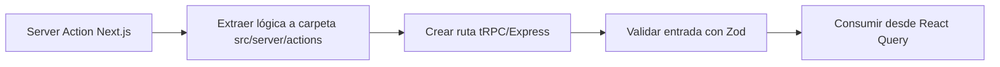

# T06 – Migración de **Server Actions**

## Objetivo

Reemplazar las **Server Actions** de Next.js 15 por un stack neutral compatible con **Vite 7**.

- Centralizar la lógica del servidor en **Express 5** (API REST) o **tRPC v12** (RPC tipado).
- Mantener tipado end‐to‐end con **Zod** y **TypeScript 5.5**. Build del servidor con **tsup** para generar `dist/server` con sourcemaps.
- Proporcionar hooks `useMutation / useQuery` con **@tanstack/react-query 5**.

## Estrategia



## Pasos detallados

1. **Inventario**: Listar todas las acciones en `src/app/actions/**`.
2. **Categorizar**: Leer sus responsabilidades (DB, filesystem, third-party API).
3. **Extraer** la lógica pura a funciones en `src/server/services`.
4. **Elegir transporte**:
   - _Simple_ → **Express** (`/api/*`).
   - _Necesita streaming_ → **tRPC** + websockets.
5. **Configurar servidor** `src/server/index.ts`:

   ```ts
   import express from 'express';
   import { json } from 'body-parser';
   import routes from './routes';

   const app = express();
   app.use(json());
   app.use('/api', routes);
   app.listen(4000);
   ```

6. **Definir rutas** en `src/server/routes/*.ts` con validaciones Zod.
7. **Actualizar hooks cliente** usando `axios` o `fetch` + React Query.
8. **Eliminar archivos Next Action** y actualizar imports.
9. **Habilitar CORS** con origen configurado desde `.env` (`CORS_ORIGIN`).

## Checklist

- [ ] Cada acción expuesta vía `/api/{entity}/{method}`.
- [ ] Esquemas de entrada/salida con Zod exportados para reuso.
- [ ] Tests de integración Vitest + Supertest.
- [ ] CORS configurado correctamente.

> Referencia oficial Vite 7 – [Guía de Integración Backend](https://es.vite.dev/guide/backend-integration.html).

---

### Ejemplo completo

```ts
// src/server/routes/album.ts
import { Router } from 'express';
import { z } from 'zod';
import { createAlbum } from '../../services/album.service';

export const albumRouter = Router();
const albumSchema = z.object({ name: z.string().min(1) });

albumRouter.post('/', async (req, res) => {
  const parse = albumSchema.safeParse(req.body);
  if (!parse.success) return res.status(400).json(parse.error);
  const album = await createAlbum(parse.data);
  res.json(album);
});
```

---

## Criterios de aceptación

1. **Paridad funcional**: Endpoints devuelven los mismos resultados que Server Actions.
2. **Cobertura** ≥ 80 % para nuevos servicios.
3. **Build** sin advertencias.

---

⌛ **Tiempo estimado:** 2 días dev + 0.5 días QA.
