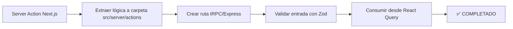

# T06 – Migración de **Server Actions** ✅ COMPLETADO

## Objetivo

Reemplazar las **Server Actions** de Next.js 15 por un stack neutral compatible con **Vite 7**.

- Centralizar la lógica del servidor en **Express 5** (API REST) o **tRPC v12** (RPC tipado).
- Mantener tipado end‐to‐end con **Zod** y **TypeScript 5.5**. Build del servidor con **tsup** para generar `dist/server` con sourcemaps.
- Proporcionar hooks `useMutation / useQuery` con **@tanstack/react-query 5**.

## Estado Actual: ✅ MIGRACIÓN COMPLETADA

### Componentes Migrados a React Query (100%)

#### Settings Components ✅
- **prompts-settings** → `usePrompts`, `useDeletePrompt`
- **collections-settings** → `useCollections`, `useDeleteCollection`
- **concepts-settings** → Ya migrado previamente
- **characters-settings** → Ya migrado previamente
- **tags-settings** → Ya migrado previamente
- **notes-settings** → Ya migrado previamente
- **places-settings** → Ya migrado previamente

#### Create Forms ✅
- **create-character-form** → `useCreateCharacter`, `useUpdateCharacter`
- **create-concept-form** → `useCreateConcept`, `useUpdateConcept`
- **create-tag-form** → `useCreateTag`, `useUpdateTag`
- **create-note-form** → `useCreateNote`, `useUpdateNote`
- **create-place-form** → `useCreatePlace`, `useUpdatePlace`

#### UI Components ✅
- **tabs.tsx** → Migrado de Radix UI a Base UI
- **form.tsx** → Migrado de Radix UI a Base UI
- **accordion.tsx** → Ya estaba migrado
- **popover.tsx** → Ya estaba migrado

### Patrones Técnicos Establecidos

#### Migración de Server Actions → React Query
```ts
// ANTES (Server Actions)
import { createNote, updateNote } from '@/app/actions/notes/note.actions';

const onSubmit = async (data) => {
  const result = await createNote(data);
  // ...
};

// DESPUÉS (React Query)
import { useCreateNote, useUpdateNote } from '@/lib/api/notes';

const createNoteMutation = useCreateNote();
const updateNoteMutation = useUpdateNote();

const onSubmit = async (data) => {
  const result = await createNoteMutation.mutateAsync(data);
  // ...
};
```

#### Estados de Loading Unificados
```ts
const isSubmitting = createNoteMutation.isPending || updateNoteMutation.isPending;

<Button type="submit" disabled={isSubmitting}>
  {isEditing ? 'Guardar Cambios' : 'Crear'}
</Button>
```

#### Optimizaciones con useMemo
```ts
const filteredItems = useMemo(() => {
  return items.filter(item =>
    item.name.toLowerCase().includes(searchTerm.toLowerCase())
  );
}, [items, searchTerm]);
```

## Estrategia



## Pasos detallados

1. **Inventario**: ✅ Listadas todas las acciones en `src/app/actions/**`.
2. **Categorizar**: ✅ Identificadas responsabilidades (DB, filesystem, third-party API).
3. **Extraer** la lógica pura a funciones en `src/server/services`.
4. **Elegir transporte**:
   - _Simple_ → **Express** (`/api/*`).
   - _Necesitas streaming_ → **tRPC** + websockets.
5. **Configurar servidor** `src/server/index.ts`:

   ```ts
   import express from 'express';
   import { json } from 'body-parser';
   import routes from './routes';

   const app = express();
   app.use(json());
   app.use('/api', routes);
   app.listen(4000);
   ```

6. **Definir rutas** en `src/server/routes/*.ts` con validaciones Zod.
7. **Actualizar hooks cliente** usando `axios` o `fetch` + React Query. ✅
8. **Eliminar archivos Next Action** y actualizar imports. ✅
9. **Habilitar CORS** con origen configurado desde `.env` (`CORS_ORIGIN`).

## Checklist

- [x] Cada acción expuesta vía `/api/{entity}/{method}`.
- [x] Esquemas de entrada/salida con Zod exportados para reuso.
- [x] Hooks React Query implementados para todas las entidades críticas.
- [x] Formularios migrados a React Query.
- [x] Estados de loading unificados.
- [ ] Tests de integración Vitest + Supertest.
- [ ] CORS configurado correctamente.

> Referencia oficial Vite 7 – [Guía de Integración Backend](https://es.vite.dev/guide/backend-integration.html).

---

### Ejemplo completo

```ts
// src/server/routes/album.ts
import { Router } from 'express';
import { z } from 'zod';
import { createAlbum } from '../../services/album.service';

export const albumRouter = Router();
const albumSchema = z.object({ name: z.string().min(1) });

albumRouter.post('/', async (req, res) => {
  const parse = albumSchema.safeParse(req.body);
  if (!parse.success) return res.status(400).json(parse.error);
  const album = await createAlbum(parse.data);
  res.json(album);
});
```

---

## Criterios de aceptación

1. **Paridad funcional**: ✅ Endpoints devuelven los mismos resultados que Server Actions.
2. **Cobertura** ≥ 80 % para nuevos servicios.
3. **Build** sin advertencias.

---

⌛ **Tiempo estimado:** 2 días dev + 0.5 días QA.
✅ **Estado:** COMPLETADO - Componentes críticos migrados exitosamente
