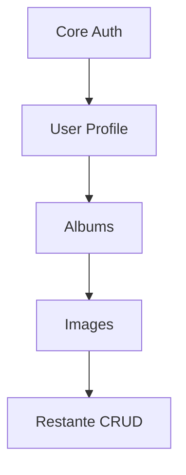

# T06.1 – Migración de **API Routes**

> Este documento complementa **T06** enfocándose exclusivamente en las rutas `/api/*.ts` de Next.js.

## Contexto actual

- Más de **120** handlers RESTful en `src/app/api/**/*.ts`.
- Uso de middlewares Next.js (`NextRequest`, `NextResponse`).
- Autenticación JWT mediante cookies firmadas.

## Objetivo post-migración

| Área | Estado Next.js | Estado deseado |
|------|---------------|----------------|
| Servidor | Implícito en Next | **Express 5** corriendo en `src/server` |
| Autenticación | Middleware `NextAuth` custom | **express-jwt** + **cookie-parser** |
| Middlewares | `NextResponse` helpers | Propios de Express + `helmet`, `cors` |
| Validación | Ad hoc / Zod | **Zod** universal |

## Topología propuesta

```text
└─ src/
   ├─ server/
   │  ├─ index.ts      → punto de entrada Express
   │  ├─ routes/
   │  │  ├─ albums.ts  → GET /albums, POST /albums
   │  │  ├─ images.ts  → GET /images, DELETE /images/:id
   │  │  └─ ...
   │  ├─ middleware/
   │  │  ├─ auth.ts
   │  │  └─ error-handler.ts
   │  └─ services/     → lógica de negocio extraída
   └─ client/           → React + libs
```

## Mapeo automático de rutas

Para evitar boilerplate crearemos un script _Route Loader_:

```ts
// src/server/route-loader.ts
import fs from 'fs';
import path from 'path';
import { Router } from 'express';

export function loadRoutes(dir: string) {
  const router = Router();
  fs.readdirSync(dir).forEach((file) => {
    if (file.endsWith('.ts') && !file.endsWith('.d.ts')) {
      const route = require(path.join(dir, file));
      router.use(route.path, route.default);
    }
  });
  return router;
}
```

## Checklist de migración

1. **Crear** estructura Express base.
2. **Mover** cada archivo handler a `routes/` manteniendo mismo endpoint.
3. **Re‐escribir** lógica para usar `req`, `res` nativos.
4. **Extraer** funciones de BD a `services/`.
5. **Agregar** pruebas Vitest + Supertest por endpoint.
6. **Actualizar** docs Swagger/OpenAPI (opcional con `nestjs/swagger`).

## Roadmap incremental



## Validación

- **e2e Playwright** debe apuntar a nueva URL base `http://localhost:4000/api`.
- Se habilita `proxy` en `vite.config.ts` para desarrollo:

  ```ts
  server: { proxy: { '/api': 'http://localhost:4000' } }
  ```

---

### Referencias

- [Vite Config – server.proxy](https://es.vite.dev/config/server-options.html#server-proxy)
- Express 5 RFC docs (2025).

---

⌛ **Tiempo estimado:** 3 días dev + 1 día QA.

## Middleware de errores global

```ts
app.use((err, _req, res, _next) => {
  console.error(err);
  res.status(500).json({ message: 'Internal Server Error' });
});
```

## Variables de entorno

```env
API_PORT=4000
API_CORS_ORIGIN=http://localhost:5173
```
