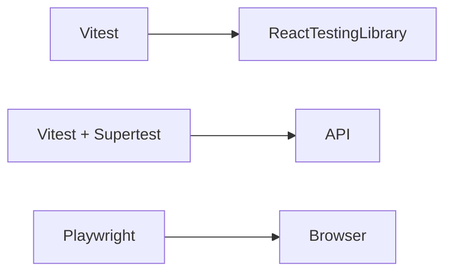

# T07 – Estrategia de Testing tras la Migración

## Objetivo

- Sustituir runtime de pruebas **Jest** (si existe) por **Vitest 1.4** integrado con Vite.
- Mantener pruebas end‐to‐end con **Playwright 1.53**.
- Cobertura > 80 % en business critical.

## Arquitectura de pruebas



## Instalación

```bash
bun add -D vitest @vitest/ui @testing-library/react @testing-library/jest-dom happy-dom
```

Config `vite.config.ts`:

```ts
import { defineConfig } from 'vite';
import { configDefaults } from 'vitest/config';

export default defineConfig({
  test: {
    globals: true,
    environment: 'happy-dom',
    setupFiles: 'src/test/setup.ts',
    exclude: [...configDefaults.exclude, 'playwright/**'],
    coverage: {
      provider: 'v8',
      lines: 70,
      statements: 70,
      branches: 60,
      functions: 70
    }
  }
});
```

## Playwright

Scripts existentes se mantienen, solo cambiar baseURL en `playwright.config.ts`:

```ts
use: { baseURL: 'http://localhost:5173' }
```

## Pipeline CI (GitHub Actions)

```yaml
- name: Install deps
  run: bun install --frozen-lockfile
- name: Unit & Integration
  run: bun test --coverage
- name: Playwright Install
  run: bun playwright:install
- name: Build
  run: bun build:vite
- name: Playwright Tests
  run: bun test:e2e
```

## Métricas

| Tipo | Target | Herramienta |
|------|--------|-------------|
| Unit | ≥ 70 % líneas | Vitest Coverage |
| Integration | 100 % endpoints críticos | Supertest |
| E2E | Flakiness < 2 % | Playwright retries |

## Checklist

- [ ] `bun test` pasa en < 60 s local.
- [ ] Reportes HTML generados (`coverage/`, `playwright-report/`).
