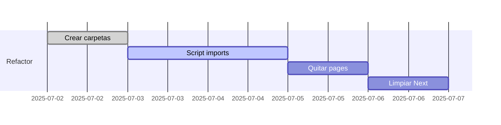

# T10 – Plan de Modificación de Archivos

## 1. Renombrados & reubicaciones

| Origen | Destino | Motivo |
|--------|---------|--------|
| `src/app/` | `src/legacy-next/` | Preservar referencia histórica hasta limpieza final |
| `src/pages/` | — | Eliminado, funcionalidades movidas a React Router |
| `src/app/api/**/*` | `src/server/routes/` | Nueva capa Express |
| `src/app/actions` | `src/server/actions` | Server logic centralizada |
| `public/` | `src/assets/` | Vite asset pipeline |
| `public/uploads/**` | sin cambio | Mantener ruta para compatibilidad |

## 2. Eliminación de dependencias Next.js

- **Borrado realizado**: `next.config.js`, `middleware.ts`, `.next/` y reglas en `.gitignore`.

## 3. Actualizar imports

- Regex: `from 'next/.*'` → eliminar o reemplazar.
- `import Image from 'next/image'` → componente React `` + `next-sensible-image`.

## 4. Script de refactor automático

`scripts/refactor/rollup.mjs`:

```js
import { promises as fs } from 'fs';
import fg from 'fast-glob';

const files = await fg(['src/**/*.tsx', 'src/**/*.ts']);
for (const file of files) {
  let code = await fs.readFile(file, 'utf8');
  code = code.replace(/from 'next\/link'/g, "from 'react-router-dom'");
  code = code.replace(/from 'next\/image'/g, "from '@/components/ui/SmartImage'");
  await fs.writeFile(file, code);
}
```

**Ejecutar en modo prueba antes:**

```bash
node scripts/refactor/rollup.mjs --check
```

## 5. Timeline



## Checklist

- [ ] Build sin referencias a `next/*`.
- [ ] Assets servidos desde `/src/assets`.
