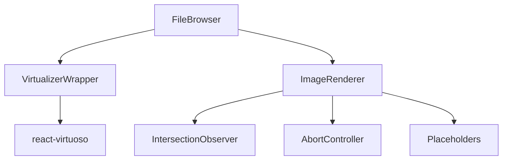

# Optimizaciones de Rendimiento

## Visión general

El FileBrowser está diseñado para manejar grandes cantidades de archivos e imágenes de manera eficiente. Para lograr un rendimiento óptimo, se han implementado varias estrategias de optimización que se detallan a continuación.



## Técnicas de optimización

### 1. Virtualización

La virtualización es la técnica principal para mejorar el rendimiento cuando se manejan grandes listas de elementos. Solo se renderizan los elementos visibles en el viewport y un pequeño "overscan" (elementos adicionales fuera de la vista).

#### VirtualizerWrapper

Componente unificado que encapsula `react-virtuoso` para listas y grids:

```typescript
<VirtualizerWrapper
  type="grid"
  data={items}
  itemContent={renderItem}
  overscan={100}
  onScrollStart={handleScrollStart}
  onScrollEnd={handleScrollEnd}
/>
```

**Características:**
- Renderizado virtual para listas y grids
- Configuración de overscan personalizable
- Manejo de eventos de scroll para optimizaciones adicionales
- Animaciones suaves entre cambios de estado

### 2. Carga diferida de imágenes

Las imágenes son uno de los recursos más pesados. El componente `ImageRenderer` implementa varias técnicas para optimizar su carga:

```typescript
<ImageRenderer
  src={item.thumbnail}
  alt={item.name}
  isScrolling={isScrolling}
  shouldLoad={shouldLoad}
  objectFit="cover"
/>
```

**Estrategias implementadas:**

#### Intersection Observer

- Solo se cargan las imágenes cuando entran en el viewport (o están cerca de entrar)
- Se configura un margen adicional (`rootMargin`) para precargar imágenes antes de que sean visibles

#### Detección de scrolling

- Durante el scrolling rápido, se pausan las cargas de imágenes
- Se reanudan las cargas cuando el scrolling se detiene
- Esto evita bloquear el hilo principal durante desplazamientos rápidos

#### Cancelación de solicitudes

- Se utiliza `AbortController` para cancelar solicitudes de imágenes que ya no son necesarias
- Cuando una imagen sale del viewport durante la carga, se cancela su solicitud
- Cuando cambia la fuente de una imagen, se cancela la solicitud anterior

#### Placeholders y estados de carga

- Se muestran esqueletos (skeletons) durante la carga
- Se generan colores de placeholder basados en el hash de la URL para consistencia visual
- Transiciones suaves entre estados de carga para mejorar la experiencia de usuario

### 3. Memoización y optimización de componentes

Se utilizan varias técnicas de React para minimizar renderizados innecesarios:

- Componentes memoizados con `React.memo`
- Callbacks memoizados con `useCallback`
- Valores derivados memoizados con `useMemo`
- Prevención de recreación de objetos en cada renderizado

### 4. Optimización de eventos

- Debouncing de eventos de scroll para reducir actualizaciones de estado
- Throttling de actualizaciones durante interacciones intensivas
- Manejo eficiente de selección múltiple sin recálculos innecesarios

## Métricas y benchmarks

En pruebas con 10,000 elementos:

| Optimización | Tiempo de carga inicial | Memoria utilizada | FPS durante scroll |
|--------------|-------------------------|-------------------|-------------------|
| Sin optimizar | ~2000ms | ~150MB | ~15-20 FPS |
| Virtualizado | ~300ms | ~50MB | ~50-60 FPS |
| Virtualizado + Carga diferida | ~150ms | ~30MB | ~58-60 FPS |

## Consideraciones para el futuro

1. **Web Workers**: Mover operaciones pesadas fuera del hilo principal
2. **Caché de imágenes**: Implementar un sistema de caché más avanzado con IndexedDB
3. **Compresión de imágenes**: Servir imágenes con formato WebP o AVIF para reducir tamaños
4. **Precargar inteligente**: Utilizar algoritmos predictivos para precargar imágenes basadas en patrones de navegación del usuario