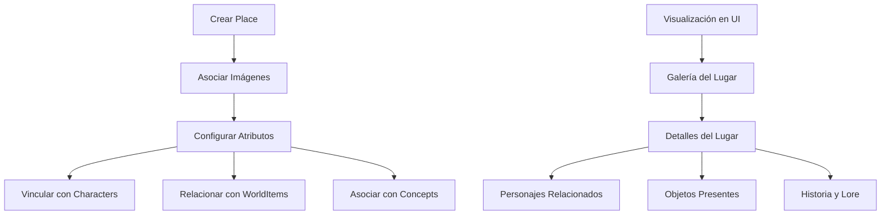

# Documentación de la Entidad Place

## Introducción

La entidad `Place` representa ubicaciones o escenarios en el sistema de gestión de imágenes. Esta entidad permite organizar y categorizar imágenes relacionadas con lugares específicos, proporcionando un contexto espacial para creadores de contenido, diseñadores de worldbuilding, y artistas conceptuales.

## Estructura de la Entidad

### Propiedades Básicas

```typescript
interface Place {
    id: string;               // Identificador único (CUID)
    name: string;             // Nombre del lugar (único)
    description?: string;     // Descripción opcional
    emoji: string;            // Emoji para representación visual (default: 📍)
    color: string;            // Color temático (default: #3b82f6)
    shortcut?: string;        // Acceso rápido opcional
    category?: string;        // Categoría (default: "general")

    // Configuración
    sortBy: string;           // Criterio de ordenación (default: "name")
    filters: string;          // Filtros serializados (default: "empty_array")

    // Atributos del lugar
    region: string;           // Región geográfica (default: "unknown")
    type: string;             // Tipo de lugar (default: "unknown")
    climate: string;          // Clima predominante (default: "temperate")
    population: number;       // Población (default: 0)
    government: string;       // Sistema de gobierno (default: "unknown")

    // Características detalladas (serializadas)
    dangers: string;          // Peligros serializados (default: "empty_array")
    resources: string;        // Recursos serializados (default: "empty_array")
    lore: string;             // Historia y mitología
    history: string;          // Eventos históricos
    stats: string;            // Estadísticas serializadas

    // Visualización
    featuredImage?: string;   // Imagen destacada (referencia)
    isFavorite: boolean;      // Marcado como favorito

    // Metadatos
    createdAt: Date;          // Fecha de creación
    updatedAt: Date;          // Fecha de última actualización
}
```

## Diagrama de Flujo



## Estructura de Carpetas

```
src/
├─ types/
│  ├─ entities/
│  │  ├─ place/
│  │     ├─ types.ts            # Tipos principales de lugar
│  │     └─ index.ts            # Exportaciones
├─ transformers/
│  ├─ place/
│  │  ├─ index.ts               # Exportaciones y funciones públicas
│  │  ├─ transformer.ts         # Transformadores principales
│  │  ├─ serializers.ts         # Serializadores/deserializadores
│  │  ├─ mappers.ts             # Funciones de mapeo
│  │  └─ types.ts               # Tipos internos del transformador
├─ components/
│  ├─ cards/
│  │  ├─ place-card/            # Componentes de tarjeta de lugar
│  ├─ views/
│  │  ├─ places/                # Vistas para lugares
├─ app/
│  └─ api/
│     └─ places/                # API endpoints para lugares
│        └─ route.ts            # Manejadores de rutas
├─ utils/
│  └─ place/                    # Utilidades específicas para lugares
│     ├─ helpers.ts             # Funciones auxiliares
│     ├─ validators.ts          # Validadores
│     └─ index.ts               # Exportaciones
```

## Interacciones con el Sistema de Eventos

### Eventos Emitidos

- `place:created` - Cuando se crea un lugar nuevo
- `place:updated` - Cuando se modifica un lugar existente
- `place:deleted` - Cuando se elimina un lugar
- `place:images:added` - Cuando se asocian imágenes a un lugar
- `place:images:removed` - Cuando se desasocian imágenes de un lugar
- `place:characters:added` - Cuando se asocian personajes a un lugar
- `place:characters:removed` - Cuando se desasocian personajes de un lugar

## Ejemplos de Uso en el Proyecto

### Creación de un Lugar

```typescript
import { createPlace } from '@/transformers/place';

// Crear un lugar básico
const newPlace = await createPlace({
  name: "Rivendell",
  description: "Un último refugio acogedor al este de las Montañas Nubladas",
  type: "settlement",
  region: "Eriador",
  climate: "temperate",
  population: 500,
  government: "monarchy",
  category: "fantasy",
  // Las propiedades que son arrays se serializarán automáticamente
  resources: ["healing herbs", "ancient knowledge", "elven crafts"],
  dangers: ["proximity to mountains", "occasional orc raids"],
  // Propiedades textuales extensas
  lore: "Fundado por Elrond en el año 1697 de la Segunda Edad...",
  history: "Ha servido como refugio para viajeros y sede del Concilio Blanco..."
});

console.log(`Lugar creado: ${newPlace.id}`);
```

### Obtención de Lugares

```typescript
import { searchPlaces, getPlaceById } from '@/transformers/place';

// Buscar lugares por criterios
const searchResult = await searchPlaces({
  filters: {
    text: "Rivendell",
    region: "Eriador",
    climate: "temperate"
  },
  sortBy: "name",
  sortDirection: "asc",
  take: 10,
  skip: 0
});

console.log(`Encontrados ${searchResult.total} lugares`);

// Obtener un lugar específico con todas sus relaciones
const place = await getPlaceById("place_id_here");
if (place) {
  console.log(`Lugar: ${place.name}`);
  console.log(`Imágenes asociadas: ${place.images.length}`);
  console.log(`Personajes presentes: ${place.characters.length}`);
  console.log(`Objetos encontrados: ${place.worldItems.length}`);
}
```

### Asociación de Imágenes con Lugar

```typescript
import { prisma } from '@/lib/prisma';
import { getPlaceById } from '@/transformers/place';

// Asociar imágenes a un lugar
async function associateImagesWithPlace(placeId: string, imageIds: string[]) {
  // Crear conexiones entre lugar e imágenes
  await prisma.place.update({
    where: { id: placeId },
    data: {
      images: {
        connect: imageIds.map(id => ({ id }))
      }
    }
  });

  // Obtener el lugar actualizado con sus relaciones
  const updatedPlace = await getPlaceById(placeId);
  return updatedPlace;
}

// Ejemplo de uso
const updatedPlace = await associateImagesWithPlace(
  "place_id_here",
  ["image_id_1", "image_id_2"]
);
```

### Vinculación de Personajes a un Lugar

```typescript
import { prisma } from '@/lib/prisma';
import { getPlaceById } from '@/transformers/place';

// Vincular personajes a un lugar
async function connectCharactersToPlace(placeId: string, characterIds: string[]) {
  // Crear conexiones entre lugar y personajes
  await prisma.place.update({
    where: { id: placeId },
    data: {
      characters: {
        connect: characterIds.map(id => ({ id }))
      }
    }
  });

  // Obtener el lugar actualizado con sus relaciones
  const updatedPlace = await getPlaceById(placeId);
  return updatedPlace;
}

// Ejemplo de uso
const rivendellWithResidents = await connectCharactersToPlace(
  "rivendell_id",
  ["elrond_id", "arwen_id", "glorfindel_id"]
);
```

### Actualización de un Lugar

```typescript
import { updatePlace } from '@/transformers/place';

// Actualizar atributos de un lugar
const updatedPlace = await updatePlace("place_id_here", {
  description: "Descripción actualizada del lugar",
  population: 550,
  // Actualizar arrays serializados
  resources: ["healing herbs", "ancient knowledge", "elven crafts", "miruvor"],
  // Actualizar historia
  history: "Historia actualizada que incluye eventos recientes..."
});
```

## Consideraciones Importantes

1. **Serialización de Datos**: Varios campos como `dangers`, `resources`, etc., se almacenan como strings serializados en la base de datos. Los transformadores se encargan de serializar/deserializar estos campos automáticamente.

2. **Relaciones Geográficas**: Es importante mantener coherencia en las relaciones geográficas:
   - Un personaje puede estar en múltiples lugares (en diferentes momentos)
   - Un lugar puede contener múltiples personajes
   - Los objetos pueden estar asociados a lugares específicos

3. **Índices**: La entidad tiene índices para optimizar búsquedas por nombre, fecha de creación, tipo, clima, región y categoría.

4. **Representación Visual**: La combinación de emoji, color y featuredImage permite una rápida identificación visual en la interfaz.

## Integraciones con Otras Entidades

La entidad Place se integra con:

- **Image**: Las imágenes pueden estar asociadas a lugares mediante relación many-to-many
- **Video**: Los videos pueden estar asociados a lugares mediante relación many-to-many
- **Character**: Los personajes pueden estar presentes en lugares mediante relación many-to-many
- **WorldItem**: Los objetos pueden encontrarse en lugares mediante relación many-to-many
- **Concept**: Los conceptos pueden estar relacionados con lugares mediante relación many-to-many
- **Group**: Los lugares pueden ser agrupados mediante relación many-to-many

## Casos de Uso Típicos

1. **Worldbuilding para narrativa**: Crear y organizar escenarios para novelas, juegos de rol o proyectos narrativos.
2. **Mapeo de mundos ficticios**: Estructurar geografías imaginarias con sus relaciones internas.
3. **Organización de referencias visuales**: Asociar referencias visuales a ubicaciones específicas.
4. **Documentación de viajes**: Catalogar imágenes de lugares reales visitados.
5. **Generación de AI**: Utilizar los atributos de lugares como prompt de referencia para generar arte con IA.

## Conclusión

La entidad Place proporciona una dimensión espacial al sistema de gestión de imágenes, facilitando la organización contextual para creadores de contenido que trabajan con escenarios, mundos o ubicaciones específicas en sus proyectos creativos. Su integración con otras entidades permite crear mundos coherentes y detallados para proyectos narrativos y visuales.