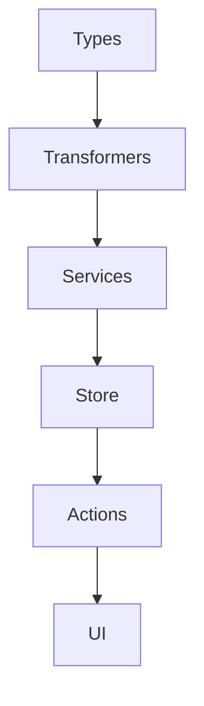

# Plan de Acción: Integración de Nuevas Entidades (junio 2025)

Este documento describe el plan de acción, tareas y recomendaciones para la integración de las entidades `Workflow`, `Document`, `JsonFile`, `File3D` y `Audio` en el Image Manager siguiendo la arquitectura y lineamientos del proyecto.

---

## 🧩 Análisis y alineación arquitectónica

- Seguir el patrón: `types → transformers → services → store → actions`.
- Analizar relaciones con entidades existentes (ej: usuario, colecciones, tags).
- Definir integración con uploads, visualización y flujos existentes.

## 🚀 Tareas principales

1. **Definición de tipos y validaciones**
   - Crear tipos canónicos en `src/types/entities/[entidad]/types.ts`.
   - Definir esquemas Zod en `src/types/entities/[entidad]/[entidad].schema.ts`.
   - Documentar cada tipo y ejemplo de uso.

2. **Transformers y mappers**
   - Implementar en `src/transformers/[entidad]/`:
     - `mappers.ts`, `serializers.ts`, `transformer.ts`, `index.ts`.
   - Documentar con README y diagrama mermaid.

3. **Servicios y lógica de negocio**
   - Crear servicios en `src/services/[entidad]/` para CRUD y lógica específica.
   - Validar con Zod antes de persistir.
   - Prever integración futura con Drizzle.

4. **Store Zustand (si aplica)**
   - Crear store en `src/store/entities/[entidad]/store.ts` si requiere estado global/UI reactivo.
   - Usar persist/immer y selectores optimizados.

5. **Server Actions**
   - Implementar en `src/app/actions/[entidad]/` siguiendo patrón del proyecto.
   - Validar siempre con Zod y documentar endpoints.

6. **UI mínima y visualización**
   - Crear componentes base en `src/components/entities/[entidad]/`.
   - Integrar con uploads y previews si aplica.
   - Usar Shadcn/ui, Tailwind y motion/react.

7. **Documentación y diagramas**
   - Documentar cada módulo con README, ejemplos y diagrama mermaid.
   - Actualizar `docs/entities-new-2025.md` y diagramas de relaciones.

8. **Testing y validación**
   - Crear tests unitarios y de integración para transformers, servicios y server actions.
   - Validar errores con get_errors y Jest.

9. **Migración progresiva a Drizzle**
   - Preparar código para facilitar migración de Prisma a Drizzle.
   - No importar tipos de Prisma en código cliente.

10. **Revisión de seguridad y performance**
    - Validar uploads, sanitizar entradas, proteger rutas y datos sensibles.
    - Optimizar queries y visualización para grandes volúmenes de archivos.

---

## 📋 Recomendaciones clave

- Priorizar entidades simples (Document, JsonFile, Audio) para pruebas rápidas.
- Reutilizar patrones y utilidades existentes para acelerar la integración.
- Documentar y versionar cada avance en el flujo de trabajo.
- Mantener consistencia en naming, estructura y validación.
- Revisar seguridad y performance en cada etapa.

---

## 🗂️ Ejemplo de flujo (mermaid)

> Última actualización: 2025-06-17
