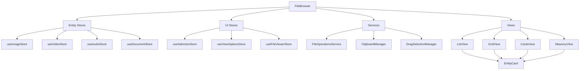

# Design Document - File Browser Improvements

## Overview

Este documento describe el diseño técnico para las mejoras del navegador de archivos (FileBrowser). El diseño se basa en la arquitectura existente que ya incluye virtualización con TanStack Virtual, sistema de stores por entidad, y soporte multi-entidad con `AnyEntityWithStats`.

### Current Architecture Analysis

**Existing Strengths:**

- ✅ **Complete View System**: `ListView`, `GridView`, `CardsView`, `MasonryView`, `TrueMasonryView` all implemented
- ✅ **Advanced Virtualization**: `base-virtualized-view.tsx` with TanStack Virtual and ResizeObserver
- ✅ **Comprehensive Entity Support**: Full `EntityStatsType` enum with stores for image, video, audio, etc.
- ✅ **Sophisticated Card System**: `EntityCard` with layout configurations and presets
- ✅ **Context Menu Foundation**: Complete `context-menu/` directory with types, handlers, and components
- ✅ **Specialized Hooks**: `use-filtered-data`, `use-grid-virtualizer`, `use-thumbnail-loader`
- ✅ **Grid Configuration**: `config/grid-config.ts` with detailed layout configurations
- ✅ **Service Layer**: Complete file, settings, toast services with transformers and validators
- ✅ **Details Panel System**: Advanced `details-panel/` with entity registry and metadata editing
- ✅ **Settings Architecture**: Comprehensive settings system with persistence and validation

**Specific Areas for Enhancement:**

- **Context Menu Operations**: Missing copy, paste, rename, move operations in existing handlers
- **View Metadata Display**: Existing views need to show more entity metadata using available data
- **File Viewer Multi-Format**: Current viewer only supports images, needs video/audio/document support
- **Keyboard Shortcuts**: No global shortcut system implemented
- **Drag Selection**: Not implemented in existing virtualized views
- **Progress Tracking**: Long operations need progress indicators

## Architecture

### Component Hierarchy (Based on Existing Structure)

```
FileBrowser (Main Component - existing)
├── Context Menu System (existing directory: context-menu/)
│   ├── FileContextMenu (existing: context-menu.tsx - needs enhancement)
│   ├── ContextActionHandler (existing: context-action-handler.ts - needs expansion)
│   ├── EmptySpaceContextMenu (new component)
│   ├── MultiSelectionContextMenu (new component)
│   └── Enhanced Submenus (existing: components/ - already implemented)
├── View System (existing directory: views/)
│   ├── BaseVirtualizedView (existing: base-virtualized-view.tsx)
│   ├── ListView (existing: list-view.tsx - needs metadata enhancement)
│   ├── GridView (existing: grid-view.tsx - needs customization options)
│   ├── CardsView (existing: cards-view.tsx - needs interactivity)
│   ├── MasonryView (existing: masonry-view.tsx - needs optimization)
│   └── TrueMasonryView (existing: true-masonry-view.tsx)
├── Configuration System (existing)
│   ├── GridConfig (existing: config/grid-config.ts)
│   └── ViewConfiguration (new: extends existing config)
├── Hooks System (existing directory: hooks/)
│   ├── UseFilteredData (existing: use-filtered-data.ts)
│   ├── UseGridVirtualizer (existing: use-grid-virtualizer.ts)
│   ├── UseThumbnailLoader (existing: use-thumbnail-loader.ts)
│   └── UseKeyboardShortcuts (new hook)
├── File Operations (enhancement of existing services)
│   ├── FileService (existing: services/file/file.service.ts - needs clipboard ops)
│   ├── ClipboardManager (new service)
│   └── ProgressTracking (new service)
├── Drag Selection System (new)
│   ├── SelectionOverlay (new component)
│   └── DragSelectionManager (new service)
└── File Viewer (existing: file-viewer/file-viewer.tsx - needs multi-format)
    ├── ImageViewer (existing functionality)
    ├── VideoViewer (new viewer component)
    ├── AudioViewer (new viewer component)
    ├── DocumentViewer (new viewer component)
    └── GenericFileViewer (new viewer component)
```

### Data Flow Architecture



## Components and Interfaces

### 1. Enhanced Context Menu System (Building on Existing)

#### FileContextMenu (Enhancement of Existing)

**Current Implementation:** `src/components/features/file-browser/context-menu/context-menu.tsx`
**Current Types:** `src/components/features/file-browser/context-menu/types.ts`

```typescript
// Extending existing ContextMenuAction type in types.ts
type EnhancedContextMenuAction = ContextMenuAction |
  | 'paste' | 'rename' | 'move' | 'duplicate'
  | 'properties' | 'share' | 'select-all';

// Extending existing FileContextMenuProps
interface EnhancedFileContextMenuProps extends FileContextMenuProps {
  selectedCount?: number;
  canPaste?: boolean;
}

// New component interfaces
interface EmptySpaceContextMenuProps {
  onAction: (action: EmptySpaceAction, data?: any) => Promise<void>;
  position: { x: number; y: number };
  currentPath?: string;
  canPaste: boolean;
}

interface MultiSelectionContextMenuProps {
  selectedItems: AnyEntityWithStats[];
  onAction: (action: ContextMenuAction, items: AnyEntityWithStats[], data?: any) => Promise<void>;
  position: { x: number; y: number };
}
  | 'properties' | 'share';
```

#### EmptySpaceContextMenu (New)

```typescript
interface EmptySpaceContextMenuProps {
	onAction: (action: EmptySpaceAction, data?: any) => Promise<void>;
	position: { x: number; y: number };
	currentPath?: string;
	canPaste: boolean;
}

type EmptySpaceAction =
	| 'select-all'
	| 'paste'
	| 'refresh'
	| 'new-folder'
	| 'change-view'
	| 'sort-by'
	| 'show-hidden'
	| 'scan-folder'
	| 'properties';
```

### 2. Enhanced View Components

#### ListView (Enhanced)

```typescript
interface EnhancedListViewProps extends BaseVirtualizedViewProps<AnyEntityWithStats> {
	showMetadata: boolean;
	showThumbnails: boolean;
	showTags: boolean;
	showStats: boolean;
	columnConfig: ListColumnConfig[];
}

interface ListColumnConfig {
	key: string;
	label: string;
	width: number | 'auto';
	sortable: boolean;
	visible: boolean;
	renderer?: (item: AnyEntityWithStats) => React.ReactNode;
}
```

#### GridView (Enhanced)

```typescript
interface EnhancedGridViewProps extends BaseVirtualizedViewProps<AnyEntityWithStats> {
	aspectRatio: 'auto' | 'square' | '4:3' | '16:9' | 'custom';
	customAspectRatio?: number;
	showLabels: boolean;
	showOverlay: boolean;
	hoverInfo: 'none' | 'basic' | 'detailed';
}
```

#### CardsView (Enhanced)

```typescript
interface EnhancedCardsViewProps extends BaseVirtualizedViewProps<AnyEntityWithStats> {
	cardStyle: 'compact' | 'detailed' | 'minimal';
	showActions: boolean;
	showMetadata: boolean;
	interactiveMode: boolean;
}
```

### 3. File Operations System

#### FileOperationsService

```typescript
class FileOperationsService {
	async copyToClipboard(items: AnyEntityWithStats[]): Promise<void>;
	async pasteFromClipboard(targetPath: string): Promise<AnyEntityWithStats[]>;
	async moveItems(items: AnyEntityWithStats[], targetPath: string): Promise<void>;
	async deleteItems(items: AnyEntityWithStats[]): Promise<void>;
	async renameItem(item: AnyEntityWithStats, newName: string): Promise<AnyEntityWithStats>;
	async duplicateItems(items: AnyEntityWithStats[]): Promise<AnyEntityWithStats[]>;
	async downloadItems(items: AnyEntityWithStats[]): Promise<void>;
	async openInExplorer(item: AnyEntityWithStats): Promise<void>;
}
```

#### ClipboardManager

```typescript
interface ClipboardData {
	items: AnyEntityWithStats[];
	operation: 'copy' | 'cut';
	timestamp: number;
	source: string;
}

class ClipboardManager {
	private clipboardData: ClipboardData | null = null;

	copy(items: AnyEntityWithStats[]): void;
	cut(items: AnyEntityWithStats[]): void;
	paste(targetPath: string): Promise<AnyEntityWithStats[]>;
	canPaste(): boolean;
	clear(): void;
}
```

### 4. Drag Selection System

#### DragSelectionManager

```typescript
interface DragSelectionConfig {
	enabled: boolean;
	multiSelect: boolean;
	selectOnDrag: boolean;
	threshold: number;
}

class DragSelectionManager {
	private isSelecting: boolean = false;
	private startPoint: { x: number; y: number } | null = null;
	private selectionRect: DOMRect | null = null;

	startSelection(event: MouseEvent): void;
	updateSelection(event: MouseEvent): void;
	endSelection(): string[];
	cancelSelection(): void;
	getSelectedItems(): AnyEntityWithStats[];
}
```

#### SelectionOverlay

```typescript
interface SelectionOverlayProps {
	isActive: boolean;
	startPoint: { x: number; y: number };
	currentPoint: { x: number; y: number };
	selectedItems: string[];
}
```

### 5. Enhanced File Viewer System (Building on Existing)

#### Multi-Format File Viewer (Enhancement of Existing)

**Current Implementation:** `src/components/features/file-viewer/file-viewer.tsx`
**Current Store:** Uses `useFileViewerStore` for state management

```typescript
// Extending existing file viewer to support multiple formats
interface EnhancedFileViewerProps {
	// Inherits from existing useFileViewerStore state
	supportedFormats: EntityStatsType[];
	renderers: Map<EntityStatsType, FileViewerRenderer>;
}

interface FileViewerRenderer {
	canHandle(item: AnyEntityWithStats): boolean;
	render(item: AnyEntityWithStats, props: ViewerRenderProps): React.ReactNode;
	getControls?(item: AnyEntityWithStats): React.ReactNode;
}

// New viewer components to create
interface VideoViewerProps {
	video: VideoWithStats;
	onClose: () => void;
	onNext: () => void;
	onPrevious: () => void;
}

interface AudioViewerProps {
	audio: AudioWithStats;
	onClose: () => void;
	onNext: () => void;
	onPrevious: () => void;
}

interface DocumentViewerProps {
	document: DocumentWithStats;
	onClose: () => void;
	onNext: () => void;
	onPrevious: () => void;
}
```

## Data Models

### Enhanced Entity Support

```typescript
// Extend existing EntityStatsType support
interface EntityTypeConfig {
	type: EntityStatsType;
	icon: React.ComponentType;
	color: string;
	supportedOperations: ContextMenuAction[];
	viewerRenderer?: FileViewerRenderer;
	thumbnailGenerator?: (item: AnyEntityWithStats) => Promise<string>;
}

const ENTITY_TYPE_CONFIGS: Record<EntityStatsType, EntityTypeConfig> = {
	[EntityStatsType.IMAGE]: {
		type: EntityStatsType.IMAGE,
		icon: ImageIcon,
		color: '#3b82f6',
		supportedOperations: ['open', 'preview', 'download', 'copy', 'rename', 'delete'],
		viewerRenderer: new ImageViewerRenderer(),
		thumbnailGenerator: generateImageThumbnail,
	},
	[EntityStatsType.VIDEO]: {
		type: EntityStatsType.VIDEO,
		icon: VideoIcon,
		color: '#ef4444',
		supportedOperations: ['open', 'preview', 'download', 'copy', 'rename', 'delete'],
		viewerRenderer: new VideoViewerRenderer(),
		thumbnailGenerator: generateVideoThumbnail,
	},
	// ... more configurations
};
```

### View Configuration Models

```typescript
interface ViewConfiguration {
	type: 'list' | 'grid' | 'cards' | 'masonry';
	settings: ViewSettings;
	customizations: ViewCustomizations;
}

interface ViewSettings {
	itemSize: number;
	spacing: number;
	showMetadata: boolean;
	showThumbnails: boolean;
	sortBy: string;
	sortDirection: 'asc' | 'desc';
}

interface ViewCustomizations {
	columns?: ListColumnConfig[];
	aspectRatio?: string;
	cardStyle?: string;
	hoverBehavior?: string;
}
```

## Error Handling

### Error Types and Recovery

```typescript
enum FileOperationError {
	PERMISSION_DENIED = 'PERMISSION_DENIED',
	FILE_NOT_FOUND = 'FILE_NOT_FOUND',
	DISK_FULL = 'DISK_FULL',
	NETWORK_ERROR = 'NETWORK_ERROR',
	INVALID_OPERATION = 'INVALID_OPERATION',
	CONCURRENT_MODIFICATION = 'CONCURRENT_MODIFICATION',
}

interface ErrorRecoveryStrategy {
	canRecover(error: FileOperationError): boolean;
	recover(error: FileOperationError, context: any): Promise<void>;
	getErrorMessage(error: FileOperationError): string;
}
```

### Error Boundaries and Fallbacks

```typescript
interface FileOperationResult<T> {
	success: boolean;
	data?: T;
	error?: FileOperationError;
	recoveryOptions?: RecoveryOption[];
}

interface RecoveryOption {
	label: string;
	action: () => Promise<void>;
	destructive: boolean;
}
```

## Testing Strategy

### Unit Testing Approach

1. **Component Testing**
   - Test each view component in isolation
   - Mock entity stores and services
   - Test keyboard navigation and accessibility
   - Test responsive behavior

2. **Service Testing**
   - Test FileOperationsService with mocked file system
   - Test ClipboardManager state management
   - Test DragSelectionManager calculations

3. **Integration Testing**
   - Test FileBrowser with real stores
   - Test context menu interactions
   - Test file viewer navigation
   - Test drag selection behavior

### Performance Testing

1. **Large Dataset Testing**
   - Test with 10,000+ items
   - Measure virtualization performance
   - Test memory usage patterns
   - Validate 60fps maintenance

2. **Stress Testing**
   - Rapid view switching
   - Multiple simultaneous operations
   - Large file operations
   - Network interruption scenarios

### Accessibility Testing

1. **Keyboard Navigation**
   - Tab order validation
   - Arrow key navigation
   - Shortcut key functionality
   - Screen reader compatibility

2. **Visual Accessibility**
   - Color contrast validation
   - Focus indicators
   - High contrast mode support
   - Zoom level compatibility

## Performance Considerations

### Virtualization Optimizations

1. **Smart Caching**
   - Cache rendered items outside viewport
   - Preload adjacent items
   - Lazy load thumbnails and metadata
   - Implement LRU cache for EntityCards

2. **Memory Management**
   - Cleanup unused resources
   - Optimize image loading
   - Debounce expensive operations
   - Use Web Workers for heavy computations

### Rendering Optimizations

1. **React Optimizations**
   - Memoize expensive calculations
   - Use React.memo for stable components
   - Optimize re-render triggers
   - Implement shouldComponentUpdate where needed

2. **DOM Optimizations**
   - Minimize DOM manipulations
   - Use CSS transforms for animations
   - Implement efficient event delegation
   - Optimize scroll event handling

## Missing Components Analysis

### 1. Keyboard Shortcuts System

**Current State:** No global hotkey system detected
**Need:** Comprehensive keyboard navigation and shortcuts

```typescript
interface KeyboardShortcutConfig {
	key: string;
	modifiers: ('ctrl' | 'shift' | 'alt' | 'meta')[];
	action: string;
	context?: 'global' | 'file-browser' | 'file-viewer';
	description: string;
}

class KeyboardShortcutManager {
	private shortcuts: Map<string, KeyboardShortcutConfig> = new Map();

	register(shortcut: KeyboardShortcutConfig): void;
	unregister(key: string): void;
	handleKeyDown(event: KeyboardEvent): boolean;
	getShortcutsForContext(context: string): KeyboardShortcutConfig[];
}
```

### 2. Settings Integration

**Current State:** Basic settings store exists but not integrated with file browser
**Need:** Deep integration with user preferences

```typescript
interface FileBrowserSettings {
	defaultView: 'list' | 'grid' | 'cards' | 'masonry';
	itemSize: number;
	showHiddenFiles: boolean;
	sortBy: string;
	sortDirection: 'asc' | 'desc';
	thumbnailQuality: 'low' | 'medium' | 'high';
	enableAnimations: boolean;
	doubleClickAction: 'open' | 'preview' | 'select';
	contextMenuBehavior: 'click' | 'hover';
	dragSelectionEnabled: boolean;
}
```

### 3. Undo/Redo System

**Current State:** Not implemented
**Need:** Action history for file operations

```typescript
interface UndoableAction {
	id: string;
	type: string;
	timestamp: number;
	execute: () => Promise<void>;
	undo: () => Promise<void>;
	canUndo: () => boolean;
	description: string;
}

class UndoRedoManager {
	private history: UndoableAction[] = [];
	private currentIndex: number = -1;

	execute(action: UndoableAction): Promise<void>;
	undo(): Promise<void>;
	redo(): Promise<void>;
	canUndo(): boolean;
	canRedo(): boolean;
	clear(): void;
}
```

### 4. Progress Tracking System

**Current State:** Basic loading states in stores
**Need:** Detailed progress for long operations

```typescript
interface OperationProgress {
	id: string;
	type: 'copy' | 'move' | 'delete' | 'download' | 'scan';
	status: 'pending' | 'running' | 'completed' | 'error' | 'cancelled';
	progress: number; // 0-100
	currentItem?: string;
	totalItems: number;
	processedItems: number;
	startTime: number;
	estimatedTimeRemaining?: number;
	error?: string;
}
```

### 5. Caching and Offline Support

**Current State:** Basic resource caching in useImageResources
**Need:** Comprehensive caching strategy

```typescript
interface CacheStrategy {
	thumbnails: {
		maxSize: number;
		ttl: number;
		compression: boolean;
	};
	metadata: {
		maxEntries: number;
		ttl: number;
	};
	fileContent: {
		maxSize: number;
		types: string[];
	};
}
```

### 6. Accessibility Enhancements

**Current State:** Basic accessibility, needs improvement
**Need:** Full WCAG compliance

```typescript
interface AccessibilityConfig {
	announceSelectionChanges: boolean;
	keyboardNavigationMode: 'grid' | 'list';
	focusManagement: 'auto' | 'manual';
	screenReaderOptimizations: boolean;
	highContrastMode: boolean;
	reducedMotion: boolean;
}
```

## Security Considerations

### File System Access

1. **Path Validation**
   - Sanitize file paths using path.normalize()
   - Prevent directory traversal attacks
   - Validate file extensions against whitelist
   - Check FilePermission enum before operations

2. **Operation Validation**
   - Implement role-based access control
   - Validate operations against user permissions
   - Log security-relevant operations
   - Implement rate limiting for bulk operations

3. **Content Security**
   - Validate file MIME types
   - Scan for malicious content in uploads
   - Implement file size limits
   - Sanitize metadata before display

### Data Protection

1. **Sensitive Data Handling**
   - Avoid logging sensitive file paths
   - Implement secure clipboard operations
   - Encrypt sensitive metadata in storage
   - Sanitize user input in search queries

2. **Privacy Considerations**
   - Respect user privacy settings
   - Implement data retention policies
   - Allow users to clear browsing history
   - Provide opt-out for telemetry

## Integration Points

### 1. Toast Notification System

**Current:** `toastService` from `@/lib/ui/toast` is available
**Integration:** Use for operation feedback and error messages

```typescript
// File operations should use toastService for user feedback
await fileOperationsService.copyFiles(selectedFiles);
toastService.success(`${selectedFiles.length} archivos copiados`);
```

### 2. Navigation System

**Current:** React Router with `useNavigate` hook
**Integration:** Context menu actions should navigate appropriately

```typescript
// Navigate to entity detail views from context menu
const navigate = useNavigate();
const openEntityDetail = (entity: AnyEntityWithStats) => {
	navigate(`/${entity.entityType}/${entity.id}`);
};
```

### 3. Settings Store Integration

**Current:** `useSettingsStore` with persistence
**Integration:** File browser preferences should sync with global settings

```typescript
// Sync file browser settings with global settings
const { settings, updateSettings } = useSettingsStore();
const fileBrowserSettings = settings?.fileBrowser || defaultFileBrowserSettings;
```

### 4. Activity Logging

**Current:** Activity store tracks user actions
**Integration:** File operations should be logged for audit trail

```typescript
// Log file operations for activity tracking
const { logActivity } = useActivityStore();
await logActivity({
	action: 'file_operation',
	entityType: 'file',
	entityId: file.id,
	details: { operation: 'copy', destination: targetPath },
});
```

## Migration Strategy

### Phase 1: Foundation and Context Menu (Week 1-2)

**Priority: High**

- Implement KeyboardShortcutManager
- Expand existing FileContextMenu with all operations
- Add EmptySpaceContextMenu and MultiSelectionContextMenu
- Integrate with toastService for feedback
- Add basic undo/redo for destructive operations

**Deliverables:**

- Enhanced context menu system
- Keyboard shortcuts for common operations
- Basic file operations (copy, paste, delete, rename)
- Toast notifications for all operations

### Phase 2: View Enhancements (Week 3-4)

**Priority: High**

- Enhance ListView with configurable columns and metadata
- Improve GridView with aspect ratio controls
- Add interactive features to CardsView
- Optimize MasonryView for better performance
- Integrate with settings store for view preferences

**Deliverables:**

- Rich metadata display in all views
- Customizable view configurations
- Settings integration
- Performance optimizations

### Phase 3: File Operations and Progress (Week 5-6)

**Priority: Medium**

- Implement comprehensive FileOperationsService
- Add ClipboardManager with system integration
- Implement progress tracking for long operations
- Add batch operations support
- Integrate with activity logging

**Deliverables:**

- Complete file operations system
- Progress indicators for long operations
- Batch operation support
- Activity logging integration

### Phase 4: Advanced Features (Week 7-8)

**Priority: Medium**

- Implement drag selection system
- Enhance file viewer for multi-format support
- Add caching strategy for better performance
- Implement accessibility improvements
- Add offline support capabilities

**Deliverables:**

- Drag selection functionality
- Multi-format file viewer
- Comprehensive caching system
- WCAG compliance improvements

### Phase 5: Polish and Integration (Week 9-10)

**Priority: Low**

- Comprehensive testing suite
- Performance optimization and profiling
- Bug fixes and edge case handling
- Documentation and user guides
- Final integration testing

**Deliverables:**

- Complete test coverage
- Performance benchmarks
- User documentation
- Production-ready system

## Risk Mitigation

### Technical Risks

1. **Performance Degradation**
   - Risk: New features may impact virtualization performance
   - Mitigation: Continuous performance monitoring and optimization
   - Fallback: Feature flags to disable heavy features

2. **Memory Leaks**
   - Risk: Complex state management may cause memory leaks
   - Mitigation: Proper cleanup in useEffect hooks and component unmounting
   - Monitoring: Memory usage tracking in development

3. **Browser Compatibility**
   - Risk: Advanced features may not work in all browsers
   - Mitigation: Progressive enhancement and feature detection
   - Fallback: Graceful degradation for unsupported features

### User Experience Risks

1. **Learning Curve**
   - Risk: Too many new features may overwhelm users
   - Mitigation: Gradual rollout and user onboarding
   - Solution: Contextual help and tooltips

2. **Accessibility Regression**
   - Risk: New features may break existing accessibility
   - Mitigation: Accessibility testing in each phase
   - Validation: Screen reader testing and keyboard navigation

### Integration Risks

1. **Store Conflicts**
   - Risk: New stores may conflict with existing ones
   - Mitigation: Careful state management and isolation
   - Testing: Integration tests for store interactions

2. **API Changes**
   - Risk: Backend API changes may break file operations
   - Mitigation: Robust error handling and API versioning
   - Fallback: Graceful degradation for API failures
