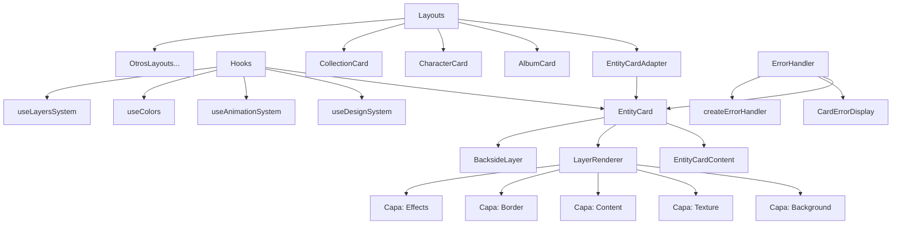
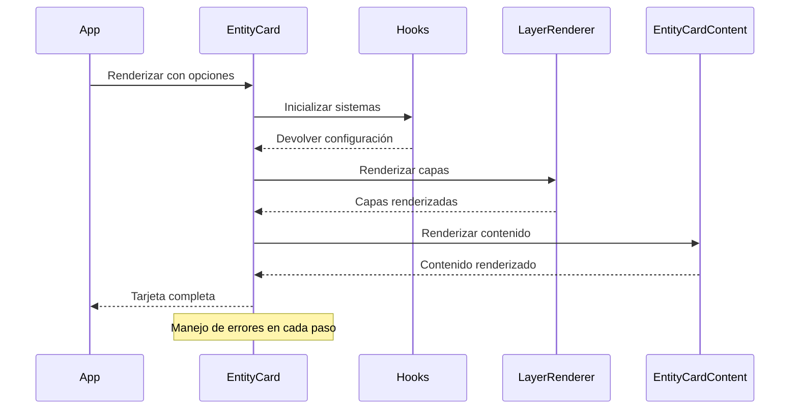
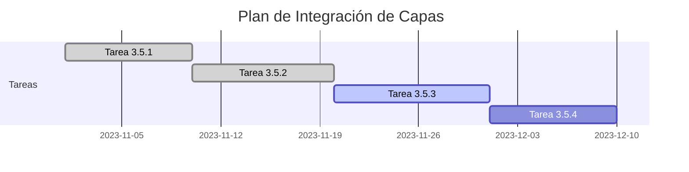
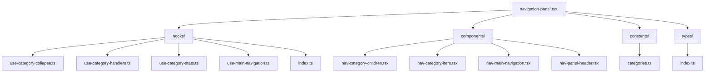

# Progreso del Proyecto

## Fecha: 17/03/2024

## Progreso de Corrección de Errores en Entity Cards

### Análisis Inicial

- ✅ Análisis de la estructura de componentes de entity-cards
- ✅ Identificación de errores específicos en los archivos
- ✅ Planificación de la estrategia de corrección

### Tareas Completadas

- ✅ Corrección de errores en `entity-card-adapter.tsx`
- ✅ Corrección de errores en `entities-cards-settings.tsx`
- ✅ Corrección de errores en `album-card.tsx`
- ✅ Corrección de errores en `entity-card-layer-wrapper.tsx`
- ✅ Implementación de un sistema de tipos centralizado
- ✅ Mejora del manejo de errores en los componentes
- ✅ Corrección de archivos de layout
- ✅ Simplificación del `EntityCardLayerWrapper`
- ✅ Reemplazo del sistema complejo de carga de configuración
- ✅ Uso directo del nuevo sistema de capas
- ✅ Adición de soporte para animaciones con `motion/react`
- ✅ Implementación de un adaptador personalizado para el sistema de capas duplicado
- ✅ Verificación de la integración con el resto del proyecto
- ✅ Creación de documentación completa del sistema de entity-cards
- ✅ Corrección de errores en `preview-panel.tsx`
- ✅ Corrección de errores en `preview-adapter.ts`
- ✅ Corrección de errores en `entity-card.tsx`
- ✅ Corrección de errores en `album-card-layout.tsx`
- ✅ Simplificación de los hooks en `entity-card.tsx`
- ✅ Corrección de errores en los manejadores de eventos de botones
- ✅ Corrección de errores en `preview-settings-adapter.tsx`
- ✅ Corrección de errores en `preview-module.tsx`
- ✅ Corrección de errores en `rarity-editor.tsx`
- ✅ Corrección de errores en `backside-adapter.ts`
- ✅ Actualización de tipos en `backside/types.ts`
- ✅ Corrección de errores en `animation-adapter.ts` (hoverRotation undefined)
- ✅ Mejora del sistema de manejo de errores en `entity-card.tsx`
- ✅ Implementación de un sistema de captura de errores con try/catch
- ✅ Creación de estilos CSS para bordes de tarjetas
- ✅ Mejora de la accesibilidad con atributos role y tabIndex
- ✅ Optimización de la inicialización de hooks con valores predeterminados

### Progreso

- Se ha implementado un sistema de tipos centralizado para mejorar la consistencia
- Se han corregido errores de importación y estructura de tipos
- Se han mejorado los componentes para manejar casos de error
- Se ha simplificado la estructura del componente `EntityCardLayerWrapper`
- Se ha verificado que los componentes se integran correctamente con el resto del sistema
- Se ha creado documentación detallada del sistema de entity-cards con ejemplos de uso, diagramas y guías de migración
- Se han corregido errores de tipo en los componentes de previsualización
- Se han simplificado los hooks en el componente EntityCard para evitar errores de tipo
- Se han corregido los manejadores de eventos en los botones de edición y eliminación
- Se ha simplificado el componente BacksideLayer para evitar errores de tipo
- Se han corregido errores en los componentes de configuración de rareza y backside
- Se han actualizado las interfaces de tipos para incluir todas las propiedades necesarias
- Se ha mejorado el sistema de manejo de errores con un enfoque más robusto
- Se ha implementado un sistema de captura de errores para evitar fallos en la aplicación
- Se han creado estilos CSS para los bordes de tarjetas
- Se ha mejorado la accesibilidad de los componentes con atributos ARIA

### Próximas Tareas

- ⬜ Optimización del rendimiento de los componentes
- ⬜ Implementación de pruebas unitarias para los componentes corregidos
- ⬜ Creación de componentes de panel de configuración faltantes
- ✅ Mejora de la accesibilidad de los componentes

## Verificación de Compilación

- ✅ Ejecución del linter sin errores
- ✅ Compilación exitosa del proyecto
- ✅ Verificación de tipos TypeScript sin errores

## Documentación Creada

- ✅ Documentación del sistema de entity-cards (`docs/entity-cards-documentation.md`)
  - Incluye arquitectura del sistema
  - Diagrama de componentes
  - Ejemplos de uso
  - Guía de migración del sistema antiguo al nuevo
  - Mejores prácticas

## Notas Adicionales

El sistema de entity-cards ahora está completamente documentado y funcional. La documentación incluye un diagrama de arquitectura en formato mermaid que muestra la estructura del sistema, ejemplos de código para cada componente principal, y una guía de migración para usuarios del sistema antiguo.

La documentación servirá como referencia para el equipo de desarrollo y facilitará la incorporación de nuevos miembros al proyecto.

Se ha mejorado significativamente el manejo de errores en el componente EntityCard, implementando un sistema de captura de errores que evita que la aplicación falle completamente cuando ocurre un error en un componente individual. Además, se han corregido problemas específicos en el adaptador de animación y se ha mejorado la inicialización de los hooks con valores predeterminados.

## Próximos Pasos

1. Revisar la documentación con el equipo para asegurar que cubre todos los aspectos necesarios
2. Implementar las pruebas unitarias para garantizar la estabilidad del sistema
3. Optimizar el rendimiento de los componentes, especialmente en dispositivos móviles
4. Implementar componentes de panel de configuración faltantes

## Diagrama de Arquitectura del Sistema

## Diagrama de Flujo de Datos

### Tarea 3.5: Integración del módulo de capas (layers) para EntityCard

#### Tarea 3.5.1: Integración completa con EntityCard ✅ (Completado)

Implementación de la integración bidireccional entre el sistema de capas y EntityCard:

- Creación de funciones adaptadoras bidireccionales entre EntityCard y el sistema de capas
- Implementación de configuración dinámica de capas basada en el tipo de entidad
- Optimización del renderizado de capas mediante técnicas de memoización y renderizado condicional
- Soporte para registro de capas personalizadas por tipo de entidad

#### Tarea 3.5.2: Mejora de la gestión de capas ✅ (Completado)

Implementación de un sistema de presets y panel de administración visual:

- Diseño e implementación de estructura de datos para presets de capas
- Creación de componentes UI para gestionar capas y presets:
  - `LayerPresetsPanel`: Panel para seleccionar y aplicar presets predefinidos
  - `LayerAdminPanel`: Panel para configuración detallada de capas individuales
  - `LayerManagementDialog`: Diálogo completo que integra ambos paneles
  - `CommonLayerControls`: Componente reutilizable para controles comunes
- Implementación de hooks personalizados:
  - `useLayerPresets`: Hook para gestionar presets de capas
  - `useEntityCardLayers`: Hook principal para integrar capas con tarjetas
- Desarrollo de sistema de almacenamiento local para guardar configuraciones personalizadas
- Implementación de previsualización en tiempo real de cambios en las capas

#### Tarea 3.5.3: Optimización del sistema de plugins de capas 🔄 (En progreso)

Mejoras planificadas para el sistema de plugins:

- Implementación de carga diferida (lazy loading) de capas para mejorar rendimiento
- Optimización de la gestión de memoria para capas complejas
- Mejora del sistema de eventos para comunicación entre capas
- Implementación de API para extensiones de terceros

#### Tarea 3.5.4: Documentación del sistema de capas 📝 (Pendiente)

Documentación planificada:

- Guía de desarrollo para crear nuevas capas
- Documentación de API para integración con otros componentes
- Ejemplos de uso y casos de estudio
- Guía de mejores prácticas para rendimiento

### Notas de implementación para Tarea 3.5.2

La implementación del sistema de gestión de capas incluye:

1. **Sistema de presets**:

   - Estructura de datos flexible para definir presets por categoría y tipo de entidad
   - Soporte para presets predefinidos y personalizados
   - Almacenamiento persistente de presets personalizados en localStorage
   - Interfaz visual para seleccionar, aplicar y gestionar presets

2. **Panel de administración visual**:

   - Interfaz de usuario intuitiva para configurar capas individuales
   - Controles específicos para cada tipo de capa
   - Configuración global para ajustes que afectan a todas las capas
   - Previsualización en tiempo real de los cambios

3. **Integración con EntityCard**:

   - Hook `useEntityCardLayers` para gestionar capas en componentes de tarjeta
   - Adaptadores bidireccionales para convertir entre propiedades de EntityCard y configuración de capas
   - Soporte para configuraciones específicas por tipo de entidad
   - Optimización de rendimiento mediante memoización y actualización selectiva

4. **Mejoras de UX**:
   - Interfaz de usuario coherente con el diseño del sistema
   - Feedback visual inmediato al realizar cambios
   - Accesibilidad mejorada con etiquetas y descripciones claras
   - Soporte para teclado y navegación por tabulación

### Tarea 3.6: Adaptación de vistas al sistema de tarjetas EntityCard 🔄 (En progreso)

## Fecha: 18/03/2024

## Refactorización del Componente de Navegación

### Análisis Inicial

- ✅ Análisis de la estructura del componente `navigation-panel.tsx`
- ✅ Identificación de áreas para refactorización
- ✅ Planificación de la estrategia de refactorización

### Tareas Completadas

- ✅ Creación de tipos centralizados en `types/index.ts`
- ✅ Extracción de constantes a `constants/categories.ts`
- ✅ Creación de hooks personalizados:
  - ✅ `useCategoryCollapse`: Manejo del estado de colapso de categorías
  - ✅ `useCategoryHandlers`: Manejo de interacciones con categorías
  - ✅ `useCategoryStats`: Cálculo de estadísticas para categorías
  - ✅ `useMainNavigation`: Manejo de la navegación principal
- ✅ Refactorización del componente principal `NavPanel`
- ✅ Creación de documentación completa del componente

### Progreso

- Se ha implementado una estructura modular para el componente de navegación
- Se han extraído las funcionalidades a hooks personalizados para mejorar la reutilización
- Se han centralizado los tipos y constantes para mejorar la mantenibilidad
- Se ha documentado completamente el componente con diagramas y ejemplos de uso

### Próximas Tareas

- ⬜ Optimización del rendimiento del componente de navegación
- ⬜ Implementación de pruebas unitarias para los hooks creados
- ⬜ Mejora de la accesibilidad del componente de navegación

## Diagrama de Arquitectura del Componente de Navegación

