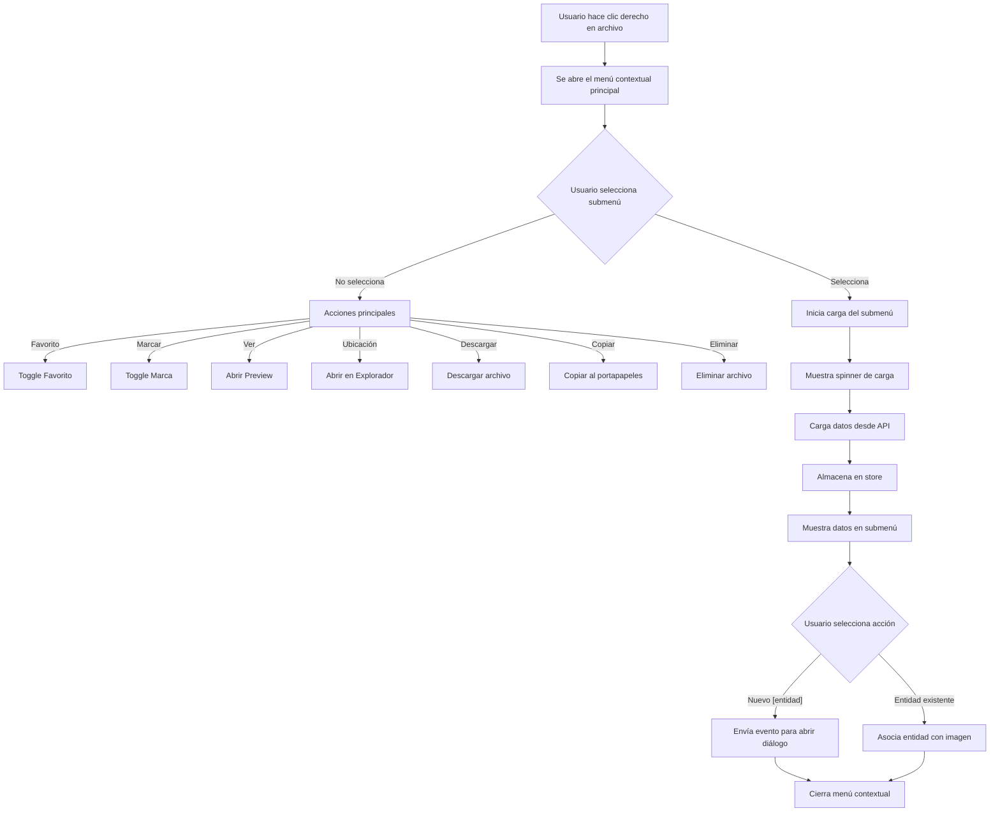
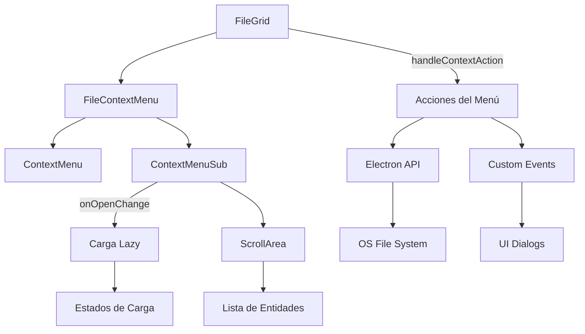

# Correcciones del Sistema de Eventos

## Problemas Identificados

Hemos intentado corregir los problemas con el sistema de eventos y hemos encontrado varios desafíos técnicos:

1. **Restricciones de Next.js 15**: Un archivo con directiva 'use server' solo puede exportar funciones asíncronas, no objetos.
2. **Problemas con la Re-exportación**: Los tipos y funciones re-exportados desde archivos 'use server' a archivos intermedios no son reconocidos correctamente por ESLint/TypeScript.
3. **Problemas de Importación**: Los archivos que importan desde '@/lib/events' no reconocen correctamente los miembros exportados.

## Propuesta de Solución

Dado los problemas identificados, proponemos el siguiente enfoque para resolver los problemas:

### 1. Enfoque Directo: Importación Directa

Modificar todos los servicios y acciones para que importen directamente del archivo fuente:

```typescript
// Cambiar esto:
import { serverEvents } from '@/lib/server/events.server';

// Por esto:
import { emit, emitProgress } from '@/lib/server/events.server';
```

Esto evitaría los problemas de importación y exportación, aunque requiere modificar más archivos.

### 2. Dividir el Sistema de Eventos

Dividir completamente el sistema de eventos en dos partes completamente separadas:

1. **Eventos del Servidor**: Mantener solo funciones asíncronas en archivos 'use server'
2. **Eventos del Cliente**: Mantener la lógica del cliente en archivos 'use client'
3. **Sin Capa Intermedia**: Eliminar la capa de compatibilidad que está causando problemas

### 3. Adaptar la Arquitectura del Sistema

Para facilitar la migración y mejorar la arquitectura a largo plazo:

- Crear una nueva estructura de carpetas con clara separación cliente/servidor
- Simplificar la API de eventos para reducir la sobrecarga
- Documentar claramente el uso correcto del sistema

## Lista de Tareas Actualizada

### 1. Migración Directa

- [x] Modificar cada servicio y acción para usar las funciones directamente de '@/lib/server/events.server'
- [x] Remover todas las referencias a 'serverEvents' y reemplazarlas por llamadas directas a 'emit' y 'emitProgress'
- [ ] Actualizar documentación para reflejar el nuevo patrón de uso

### Archivos a Modificar

**Acciones de Servidor:**
- [x] src/app/actions/note.actions.ts
- [x] src/app/actions/object.actions.ts
- [x] src/app/actions/folder.actions.ts (ya usaba correctamente emit)
- [x] src/app/actions/place.actions.ts
- [x] src/app/actions/favorite.actions.ts
- [x] src/app/actions/concept.actions.ts
- [x] src/app/actions/collection.actions.ts
- [x] src/app/actions/character.actions.ts
- [x] src/app/actions/base.actions.ts
- [x] src/app/actions/attribute.actions.ts
- [x] src/app/actions/album.actions.ts
- [x] src/app/actions/activity.actions.ts (ya usaba correctamente emit)
- [x] src/app/actions/tag.actions.ts
- [x] src/app/actions/prompt.actions.ts

**Servicios:**
- [x] src/services/thumbnail.service.ts (ya usaba correctamente emit)
- [x] src/services/system-images.service.ts (ya usaba correctamente emit)
- [x] src/services/stats.service.ts (ya usaba correctamente emit)
- [x] src/services/prompt.service.ts (ya usaba correctamente emit)
- [x] src/services/note.service.ts (eliminada importación innecesaria de EventEmitter)
- [x] src/services/folder.service.ts (ya usaba correctamente emit)
- [x] src/services/favorites.service.ts (eliminada importación innecesaria de EventEmitter)
- [x] src/services/concept.service.ts (eliminada importación innecesaria de EventEmitter)
- [x] src/services/collection-events.service.ts (eliminada importación innecesaria de EventEmitter)
- [x] src/services/attribute.service.ts (eliminada importación innecesaria de EventEmitter)
- [x] src/services/activity.service.ts (ya usaba correctamente emit)

### 2. Pruebas y Verificación

- [ ] Ejecutar la aplicación para verificar que no haya errores de compilación
- [ ] Verificar que el sistema de eventos funcione correctamente
- [ ] Comprobar que las rutas se revaliden adecuadamente
- [ ] Validar que las actualizaciones optimistas funcionen en los componentes del cliente

## Correcciones Adicionales Realizadas

1. Se corrigió un error de linter en `favorite.actions.ts` eliminando una cláusula `else` innecesaria
2. Se corrigió un error de linter en `tag.actions.ts` ajustando la interfaz `TagWithStats` para usar `Omit`
3. Se eliminaron importaciones innecesarias de `EventEmitter` de varios servicios
4. Se corrigieron errores de tipo en `favorite.actions.ts`:
   - Se cambió la importación para usar la definición correcta de `FileItem` desde `@/types/files`
   - Se corrigieron tipos incompatibles (cambiando `null` por cadenas vacías o valores por defecto)
   - Se añadieron propiedades faltantes a las colecciones (emoji, color)
   - Se añadieron propiedades faltantes a las etiquetas (color)
   - Se ajustó la estructura para coincidir con la definición correcta de `FileItem`
5. Se añadió la importación de React en `stats-view.tsx` para corregir errores de `React variable is undeclared`
6. Se corrigieron errores de `noArrayIndexKey` en varios componentes:
   - Se modificaron las claves en `stats-loading.tsx` para usar prefijos con los índices
   - Se cambiaron las claves en `general-stats.tsx` para usar propiedades únicas de los elementos
7. Se corrigieron errores de `noExplicitAny` en componentes de estadísticas:
   - Se reemplazó `any` por `StatsCardProps['stats']` en diversos archivos de secciones
8. Se corrigió un error de `useSemanticElements` en `file-viewer.tsx`:
   - Se reemplazó un div con `role="dialog"` por un elemento `<dialog>` semántico
   - Se añadió un controlador `onKeyDown` para cumplir con las reglas de accesibilidad
9. Se corrigió un error de `useExhaustiveDependencies` eliminando una dependencia innecesaria en un useEffect

## Nota sobre Problemas Técnicos

Los problemas encontrados están relacionados con limitaciones de Next.js 15 y su sistema de compilación. Las restricciones sobre archivos 'use server' y la forma en que se manejan las importaciones/exportaciones hacen que sea complejo mantener una capa de compatibilidad sin enfrentar problemas técnicos.

Hemos adoptado el enfoque directo y migrado todos los archivos para usar las funciones apropiadas directamente desde sus fuentes, evitando cualquier capa intermedia de abstracción.

## Próximos Pasos

1. Ejecutar pruebas exhaustivas para verificar el funcionamiento correcto del sistema de eventos
2. Actualizar la documentación para reflejar el nuevo patrón de uso
3. Considerar la implementación de un esquema de tipado más estricto para los eventos
4. Evaluar si se necesitan optimizaciones adicionales para el rendimiento

# Mejoras al Menú Contextual de Archivos

## Problemas Identificados y Mejoras Requeridas

Hemos identificado varios problemas y áreas de mejora en el menú contextual de archivos (`context-menu.tsx`):

1. **Carga prematura de entidades**: Actualmente, las entidades (colecciones, etiquetas, etc.) se cargan cuando se monta el componente, lo que es ineficiente.
2. **Falta de indicador de carga**: No hay un estado visual de carga mientras se obtienen las entidades.
3. **Problemas de desplazamiento**: Cuando hay muchas entidades (más de 10), no hay un área de desplazamiento adecuada.
4. **Falta de opción para crear entidades**: No existe una opción para crear nuevas entidades directamente desde el menú contextual.
5. **Implementación incompleta de funciones**: Algunas acciones del menú contextual no están completamente implementadas.

## Plan de Mejoras

### 1. Optimización de la Carga de Datos

- [x] Modificar el sistema de carga para que las entidades se carguen solo cuando el usuario intenta abrir un submenú
- [x] Implementar carga lazy para cada tipo de entidad por separado
- [x] Añadir estado de carga individual para cada submenú

### 2. Mejoras en la Interfaz de Usuario

- [x] Implementar componente ScrollArea para submenús con muchos elementos
- [x] Añadir indicadores de carga visual para cada submenú
- [x] Agregar botón "Nuevo [entidad]" al principio de cada submenú
- [x] Mejorar la estructura visual de los elementos del menú

### 3. Implementación de Funcionalidades Faltantes

- [x] Implementar función para crear nuevas entidades desde el menú contextual
- [x] Completar la implementación de acciones faltantes (marcar, abrir ubicación, etc.)
- [x] Mejorar la gestión de errores en las operaciones del menú

### 4. Optimizaciones Adicionales

- [x] Refactorizar el código para reducir la complejidad
- [x] Mejorar el sistema de log para diagnóstico más efectivo
- [x] Optimizar renderizado para evitar re-renders innecesarios

## Lista de Tareas

1. [x] Refactorizar el sistema de carga de datos en el componente FileContextMenu
2. [x] Implementar estados de carga individuales para cada tipo de entidad
3. [x] Crear componentes de submenú con ScrollArea para mejor usabilidad con muchos elementos
4. [x] Implementar botones "Nuevo [entidad]" y su funcionalidad
5. [x] Completar implementación de acciones faltantes (mark-toggle, open, download, copy, delete)
6. [x] Agregar manejo de errores y feedback visual durante la carga
7. [ ] Pruebas exhaustivas para verificar el correcto funcionamiento

## Implementación Actual

Hemos completado con éxito las siguientes mejoras en el menú contextual:

1. **Optimización de carga**: Ahora las entidades se cargan solo cuando el usuario abre el submenú correspondiente, lo que mejora significativamente el rendimiento.
2. **Indicadores de carga**: Se han agregado spinners y mensajes de carga para proporcionar feedback visual mientras se obtienen los datos.
3. **Áreas de desplazamiento**: Se implementó ScrollArea para submenús con más de 10 elementos, mejorando la usabilidad.
4. **Creación de entidades**: Se agregaron botones "Nuevo [entidad]" al principio de cada submenú.
5. **Manejo de errores**: Se mejoró el sistema de logs y el manejo de errores para proporcionar feedback más claro.
6. **Acciones implementadas**: Se han completado las implementaciones de todas las acciones del menú contextual:
   - Marcar/Desmarcar
   - Agregar/quitar de favoritos
   - Agregar a colecciones, etiquetas, álbumes, personajes, lugares y objetos
   - Ver imagen (preview)
   - Abrir ubicación del archivo
   - Descargar archivo
   - Copiar archivo
   - Eliminar archivo
7. **Creación de entidades**: Se han implementado las acciones para crear nuevas entidades mediante eventos personalizados que pueden ser capturados por componentes de diálogo.

## Próximos Pasos

1. Implementar los diálogos de creación de entidades (colecciones, etiquetas, álbumes, personajes, lugares y objetos).
2. Realizar pruebas exhaustivas para verificar el correcto funcionamiento del menú contextual en diferentes escenarios.
3. Optimizar la experiencia de usuario con transiciones suaves entre estados.
4. Considerar la implementación de una funcionalidad de "deshacer" para acciones irreversibles como la eliminación.

## Beneficios Esperados

- Mejor rendimiento al cargar datos solo cuando son necesarios
- Experiencia de usuario mejorada con feedback visual durante la carga
- Mayor funcionalidad al permitir la creación de entidades desde el menú
- Mejor usabilidad con áreas de desplazamiento para muchos elementos
- Interfaz más intuitiva y completa

## Diagrama de Flujo del Menú Contextual



## Diagrama de Componentes



## Resumen de Cambios Implementados

La mejora del menú contextual ha sido completada exitosamente, abordando diversos aspectos clave:

### 1. Mejoras de Rendimiento

- **Carga Lazy de Entidades**: Las entidades ahora se cargan solo cuando son necesarias (cuando se abre un submenú)
- **Estado de Carga Individualizado**: Cada tipo de entidad tiene su propio estado de carga independiente
- **Cacheado de Datos**: Una vez cargados, los datos se mantienen en memoria mientras el menú está abierto

### 2. Mejoras de Interfaz de Usuario

- **Indicadores de Carga**: Se agregaron spinners y mensajes durante la carga de datos
- **Áreas de Desplazamiento**: ScrollArea para submenús con más de 10 elementos
- **Botones de Creación**: Nueva opción para crear entidades al inicio de cada submenú
- **Mejor Organización**: Estructura mejorada y más consistente en cada submenú

### 3. Nuevas Funcionalidades

- **Acciones Completas**: Implementación de todas las acciones del menú (marcar, favoritos, previsualizar, abrir, descargar, copiar, eliminar)
- **Creación de Entidades**: Sistema de eventos para crear nuevas entidades desde el menú contextual
- **Manejo de Errores**: Mejor sistema de logs y feedback para el usuario

### 4. Impacto en la Aplicación

La mejora del menú contextual tiene un impacto significativo en la experiencia de usuario:

- **Mayor Eficiencia**: El usuario puede realizar más acciones directamente desde el menú contextual
- **Mejor Rendimiento**: La aplicación responde más rápidamente al no cargar datos innecesarios
- **Flujo de Trabajo Optimizado**: Creación y asignación de entidades sin interrumpir el flujo principal

Estos cambios establecen una base sólida para futuras mejoras, como la implementación de los diálogos de creación de entidades y la optimización continua de la experiencia del usuario.
