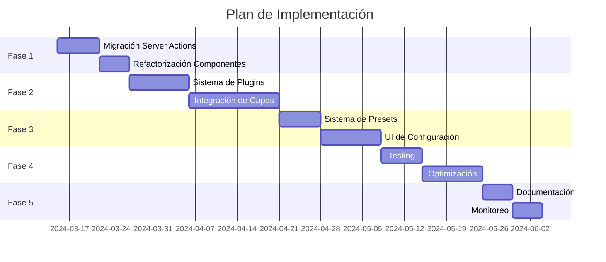

# Plan de Acción: Migración a Server Actions e Integración de Capas

## Fase 1: Migración a Server Actions
- [x] Crear acciones del servidor base
  - [x] Implementar `getVisualConfig.action.ts`
    - [x] Añadir validación con Zod
    - [x] Implementar manejo de errores robusto
    - [x] Añadir tipos TypeScript
  - [x] Implementar `updateVisualConfig.action.ts`
    - [x] Añadir validación con Zod
    - [x] Implementar manejo de errores robusto
    - [x] Añadir tipos TypeScript
  - [x] Implementar `deleteVisualConfig.action.ts`
    - [x] Añadir validación con Zod
    - [x] Implementar manejo de errores robusto
    - [x] Añadir tipos TypeScript
  - [x] Crear schemas centralizados
    - [x] `baseVisualConfigSchema`
    - [x] `entityParamsSchema`
    - [x] `actionResponseSchema`

- [ ] Refactorizar componentes existentes
  - [ ] Migrar FolderCard a usar Server Actions
  - [ ] Migrar ImageCard a usar Server Actions
  - [ ] Migrar VideoCard a usar Server Actions
  - [ ] Implementar optimistic updates
  - [ ] Agregar Suspense boundaries

## Fase 2: Sistema de Capas
- [ ] Implementar sistema de plugins para capas
  - [ ] Crear interfaz base para plugins de capas
  - [ ] Implementar registro dinámico de plugins
  - [ ] Crear sistema de prioridad y orden de capas

- [ ] Integrar capas existentes
  - [x] Animated Border Layer
    - [x] Crear configuración específica
    - [x] Implementar acciones del servidor
    - [x] Implementar controles de UI
    - [x] Añadir modelo Prisma

  - [ ] Border Layer
    - [x] Crear configuración específica
    - [x] Implementar acciones del servidor
    - [x] Implementar controles de UI
    - [x] Añadir modelo Prisma
    - [ ] Optimizar rendimiento

  - [ ] Chromatic Aberration Layer
    - [ ] Configuración de intensidad y colores
    - [ ] Controles de UI adaptativos
    - [ ] Optimización para WebGL

  - [ ] Filter Layer System
    - [ ] Implementar sistema de filtros compuestos
    - [ ] Crear presets de filtros
    - [ ] Optimizar rendimiento de filtros

  - [ ] Glitch Effect Layer
    - [ ] Configuración de intensidad y frecuencia
    - [ ] Sistema de triggers
    - [ ] Optimización de memoria

  - [ ] Glow Layer
    - [ ] Sistema de colores dinámicos
    - [ ] Control de intensidad y radio
    - [ ] Optimización de blur

  - [ ] Grain Layer
    - [ ] Configuración de densidad y contraste
    - [ ] Animación opcional
    - [ ] Optimización de textura

  - [ ] Holographic Layer
    - [ ] Sistema de colores y patrones
    - [ ] Efectos de movimiento
    - [ ] Optimización de shaders

  - [ ] Noise Texture Layer
    - [ ] Generación procedural
    - [ ] Control de seed y escala
    - [ ] Caché de texturas

  - [ ] Pattern Layer
    - [ ] Sistema de patrones modulares
    - [ ] Configuración de escala y rotación
    - [ ] Optimización de SVG

  - [ ] Pixelate Layer
    - [ ] Control de resolución
    - [ ] Efectos de transición
    - [ ] Optimización de render

  - [ ] Scanlines Layer
    - [x] Configuración de intensidad y colores
    - [x] Implementar acciones del servidor
    - [x] Implementar controles de UI
    - [x] Añadir modelo Prisma
    - [ ] Optimización de animación

  - [ ] Shader Layer
    - [ ] Sistema de shaders modulares
    - [ ] Hot-reload de shaders
    - [ ] Optimización de WebGL

## Fase 3: Sistema de Presets y Configuración
- [ ] Implementar sistema de presets
  - [ ] Crear estructura de datos para presets
  - [ ] Implementar serialización/deserialización
  - [ ] Agregar sistema de versiones

- [ ] Mejorar UI de configuración
  - [ ] Crear paneles específicos por capa
  - [ ] Implementar vista previa en tiempo real
  - [ ] Agregar sistema de undo/redo

## Fase 4: Optimización y Testing
- [ ] Implementar pruebas
  - [ ] Unit tests para Server Actions
  - [ ] Integration tests para capas
  - [ ] E2E tests para UI

- [ ] Optimizar rendimiento
  - [ ] Implementar lazy loading de capas
  - [ ] Optimizar bundle size
  - [ ] Mejorar caching

## Fase 5: Documentación y Mantenimiento
- [ ] Crear documentación
  - [ ] Guías de desarrollo
  - [ ] API reference
  - [ ] Ejemplos de uso

- [ ] Implementar monitoreo
  - [ ] Agregar métricas de rendimiento
  - [ ] Implementar error tracking
  - [ ] Crear dashboards de análisis

