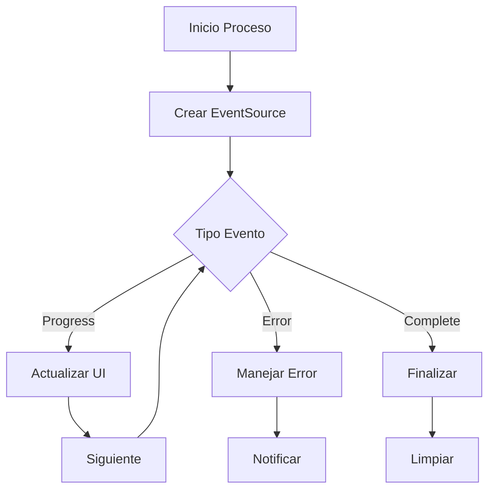
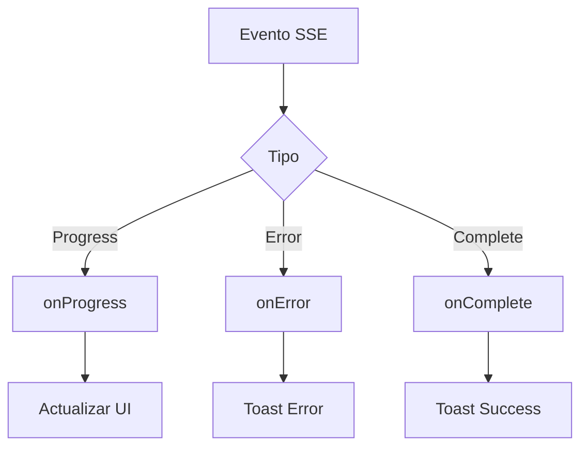

# NO BORRAR

Este proyecto es una aplicación moderna de gestión y visualización de archivos multimedia diseñada para proporcionar una experiencia fluida y eficiente en la organización y visualización de grandes colecciones de medios locales.

# Stack Tecnológico

## Front End

- **Next.js 15** - con App Router
- **React 19** - con Server Components
- **Tailwind CSS** - para estilos
- **shadcn/ui** - para componentes de UI
- **Zustand** - para gestión de estado
- **Jest** - para testing
- **Motion** - para animaciones
- **Lucide React** - para iconos
- **Typescript** - para tipado estático

## Back End

- **SQLite 3** - para base de datos local
- **Prisma ORM** - para ORM
- **Next.js API Routes** - para endpoints
- **Node.js fs/promises** - para manipulación de archivos

### Otras dependencias

- **Event Source Polyfill** - para soporte de eventos en navegadores antiguos
- **Event Source Stream** - para soporte de eventos en navegadores antiguos
- **Tanstack Query** - para gestión de datos
- **Bull** - para procesamiento de imágenes
- **Chokidar** - para monitoreo de cambios en carpetas
- **Exifr** - para extraer metadatos de imágenes
- **Sharp** - para procesamiento de imágenes
- **React Scan** - para debug de renderizado
- **React Color** - para color picker
- **Next Themes** - para gestión de temas
- **Eslint** - para linting

## 📝 Documentación del Proyecto

Se ha realizado una documentación detallada de las características principales del proyecto. La documentación actualizada se encuentra en:

#### Documentación Core

- `/docs/PRD.md` - Documento de Requerimientos del Producto
- `/docs/ROADMAP.md` - Vista general del proyecto y planificación
- `/docs/features/` - Documentación detallada de características

#### Features Documentados en Detalle:

1. **Optimización y Rendimiento**

   - `/docs/features/optimization/grid-performance.md`
   - `/docs/features/optimization/pagination-infinite-scroll.md`

2. **Servicios y Procesamiento**

   - `/docs/features/services/processing-improvements.md`

3. **Gestión de Archivos**

   - `/docs/features/file-management/batch-operations.md`

4. **Interfaz de Usuario**

   - `/docs/features/ui/info-panels.md`
   - `/docs/features/viewer/image-viewer-improvements.md`

5. **Personalización**

   - `/docs/features/customization/themes-and-performance.md`

6. **Metadata y Edición**

   - `/docs/features/metadata/metadata-management.md`

7. **Integración IA**
   - `/docs/features/ai/ai-integration.md`

### 🚀 Próximos Pasos

1. **Alta Prioridad**

   - Implementar optimizaciones de rendimiento en la vista de grilla
   - Desarrollar sistema de paginación y scroll infinito
   - Mejorar servicios de procesamiento

2. **Media Prioridad**

   - Implementar sistema de gestión batch
   - Desarrollar paneles informativos
   - Mejorar navegación y organización

3. **Baja Prioridad**
   - Implementar características de personalización
   - Desarrollar herramientas de edición básica
   - Explorar integración con IA

### 📊 Métricas y Objetivos

- Mejorar rendimiento general de la aplicación
- Reducir tiempos de carga y procesamiento
- Mantener uso eficiente de recursos
- Mejorar experiencia de usuario

### 🔍 Notas de Seguimiento

- Se mantiene compatibilidad con features existentes
- Se prioriza la estabilidad y rendimiento
- Se documenta cada nueva implementación
- Se mantienen tests actualizados

## 🚨 Issues Actuales (2024-01-06)

### Issue #1: Indexación de Carpetas

- ✗ La carpeta se crea pero el indexado no inicia
- ✗ Error: "The 'payload' argument must be of type object. Received null"
- ✗ No se muestra el progreso de indexación
- ✗ No se actualizan estadísticas (tamaño, archivos)

### Issue #2: Reindexación

- ✗ No muestra progreso en tiempo real
- ✗ No notifica finalización
- ✗ Proceso queda en espera indefinida

### Issue #3: Estadísticas

- ✗ No se muestran tamaños de archivos
- ✗ No se actualizan contadores
- ✗ Información incompleta en UI

## 🎯 Plan de Acción

1. **Fase 1: Diagnóstico**

   - Revisar flujo de indexación en `folder.service.ts`
   - Analizar manejo de eventos en `folders-section.tsx`
   - Verificar implementación de EventSource

2. **Fase 2: Correcciones**

   - Corregir payload en proceso de indexación
   - Implementar manejo de eventos SSE
   - Actualizar sistema de callbacks

3. **Fase 3: Mejoras**

   - Mejorar sistema de progreso
   - Implementar actualización de estadísticas
   - Optimizar manejo de errores

4. **Fase 4: Documentación**
   - Actualizar `folder-service.md`
   - Documentar cambios en componentes
   - Actualizar guías de desarrollo

## 🔄 Estado Actual

- Base de datos: Nueva implementación
- Servicios: Parcialmente funcionales
- UI: Requiere actualizaciones
- Documentación: En proceso de actualización

## 📝 Notas Técnicas

### Stack Involucrado

- EventSource para SSE
- API Routes para endpoints
- React para UI
- SQLite para almacenamiento

### Áreas de Mejora

1. Manejo de eventos en tiempo real
2. Procesamiento de archivos
3. Actualización de estadísticas
4. Manejo de errores

## 🔄 Actualizaciones (2024-01-06)

### Correcciones en SSE para Thumbnails

#### Problemas Identificados

1. **Manejo de Eventos SSE**

   - ✅ Eventos no se recibían en tiempo real
   - ✅ Formato de eventos SSE incorrecto
   - ✅ Headers CORS faltantes
   - ✅ Caché de eventos no controlada

2. **UI/UX**
   - ✅ Barra de progreso no se actualizaba
   - ✅ Estado no se mostraba correctamente
   - ✅ Feedback visual limitado

#### Cambios Realizados

1. **Servicio de Thumbnails**

   - ✅ Refactorizado manejo de eventos SSE
   - ✅ Implementado sistema de callbacks
   - ✅ Añadido control de caché con timestamp
   - ✅ Mejorado manejo de errores y reconexión
   - ✅ Implementado timeout de seguridad
   - ✅ Añadida limpieza de recursos

2. **Componente UI**
   - ✅ Actualización en tiempo real de progreso
   - ✅ Mejor feedback visual
   - ✅ Manejo de estados mejorado
   - ✅ Animaciones y transiciones
   - ✅ Integración con sistema de callbacks

### Estado Actual

1. **Funcionalidades**

   - ✅ Reprocesamiento de thumbnails
   - ✅ Optimización de thumbnails
   - ✅ Limpieza de thumbnails
   - ✅ Progreso en tiempo real
   - ✅ Manejo de errores
   - ✅ Cancelación de procesos
   - ✅ Timeout de seguridad

2. **Pendientes**
   - [ ] Implementar sistema de cola
   - [ ] Optimizar uso de memoria
   - [ ] Mejorar caché de thumbnails
   - [ ] Documentar nuevos endpoints

### Notas Técnicas

1. **Formato de Eventos SSE**

   ```typescript
   // Evento de Progreso
   {
     type: 'progress',
     data: {
       status: string,
       current: number,
       total: number,
       progress: number,
       currentFile?: string,
       lastProcessed?: {
         id: string,
         path: string,
         processedAt: string
       }
     }
   }

   // Evento de Error
   {
     type: 'error',
     data: {
       message: string,
       type: string
     }
   }

   // Evento de Completado
   {
     type: 'complete',
     data: {
       processed: number,
       total: number,
       errors: number
     }
   }
   ```

2. **Sistema de Callbacks**

   ```typescript
   interface ThumbnailCallbacks {
   	onProgress?: (status: ProcessStatus) => void;
   	onError?: (error: Error) => void;
   	onComplete?: (data: any) => void;
   }

   interface ProcessStatus {
   	status?: string;
   	current?: number;
   	total?: number;
   	progress?: number;
   	currentFile?: string;
   	lastProcessed?: {
   		id: string;
   		path: string;
   		processedAt: string;
   	};
   }
   ```

3. **Manejo de Errores**

   ```typescript
   try {
   	// Proceso principal
   } catch (error) {
   	callbacks?.onError?.(
   		error instanceof Error ? error : new Error(String(error))
   	);
   	throw error;
   } finally {
   	// Limpieza de recursos
   	eventSource?.close();
   }
   ```

### Próximos Pasos

1. **Optimizaciones**

   - Implementar sistema de cola con Bull
   - Mejorar manejo de memoria
   - Optimizar procesamiento de imágenes
   - Implementar caché eficiente

2. **Documentación**
   - Actualizar diagramas de flujo
   - Documentar tipos de eventos
   - Añadir ejemplos de uso
   - Documentar manejo de errores

### Diagramas de Flujo

#### Procesamiento de Thumbnails



#### Sistema de Callbacks


