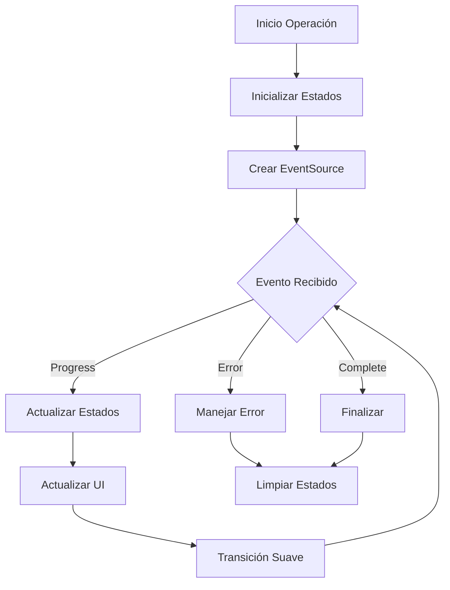

# NO BORRAR

Este proyecto es una aplicación moderna de gestión y visualización de archivos multimedia diseñada para proporcionar una experiencia fluida y eficiente en la organización y visualización de grandes colecciones de medios locales.

# Stack Tecnológico

## Front End

- **Next.js 15** - con App Router
- **React 19** - con Server Components
- **Tailwind CSS** - para estilos
- **shadcn/ui** - para componentes de UI
- **Zustand** - para gestión de estado
- **Jest** - para testing
- **Motion** - para animaciones
- **Lucide React** - para iconos
- **Typescript** - para tipado estático

## Back End

- **SQLite 3** - para base de datos local
- **Prisma ORM** - para ORM
- **Next.js API Routes** - para endpoints
- **Node.js fs/promises** - para manipulación de archivos

### Otras dependencias

- **Event Source Polyfill** - para soporte de eventos en navegadores antiguos
- **Event Source Stream** - para soporte de eventos en navegadores antiguos
- **Tanstack Query** - para gestión de datos
- **Bull** - para procesamiento de imágenes
- **Chokidar** - para monitoreo de cambios en carpetas
- **Exifr** - para extraer metadatos de imágenes
- **Sharp** - para procesamiento de imágenes
- **React Scan** - para debug de renderizado
- **React Color** - para color picker
- **Next Themes** - para gestión de temas
- **Eslint** - para linting

## 📝 Documentación del Proyecto

Se ha realizado una documentación detallada de las características principales del proyecto. La documentación actualizada se encuentra en:

#### Documentación Core

- `/docs/PRD.md` - Documento de Requerimientos del Producto
- `/docs/ROADMAP.md` - Vista general del proyecto y planificación
- `/docs/features/` - Documentación detallada de características

#### Features Documentados en Detalle:

1. **Optimización y Rendimiento**

   - `/docs/features/optimization/grid-performance.md`
   - `/docs/features/optimization/pagination-infinite-scroll.md`

2. **Servicios y Procesamiento**

   - `/docs/features/services/processing-improvements.md`

3. **Gestión de Archivos**

   - `/docs/features/file-management/batch-operations.md`

4. **Interfaz de Usuario**

   - `/docs/features/ui/info-panels.md`
   - `/docs/features/viewer/image-viewer-improvements.md`

5. **Personalización**

   - `/docs/features/customization/themes-and-performance.md`

6. **Metadata y Edición**

   - `/docs/features/metadata/metadata-management.md`

7. **Integración IA**
   - `/docs/features/ai/ai-integration.md`

### 🚀 Próximos Pasos

1. **Alta Prioridad**

   - Implementar optimizaciones de rendimiento en la vista de grilla
   - Desarrollar sistema de paginación y scroll infinito
   - Mejorar servicios de procesamiento

2. **Media Prioridad**

   - Implementar sistema de gestión batch
   - Desarrollar paneles informativos
   - Mejorar navegación y organización

3. **Baja Prioridad**
   - Implementar características de personalización
   - Desarrollar herramientas de edición básica
   - Explorar integración con IA

### 📊 Métricas y Objetivos

- Mejorar rendimiento general de la aplicación
- Reducir tiempos de carga y procesamiento
- Mantener uso eficiente de recursos
- Mejorar experiencia de usuario

### 🔍 Notas de Seguimiento

- Se mantiene compatibilidad con features existentes
- Se prioriza la estabilidad y rendimiento
- Se documenta cada nueva implementación
- Se mantienen tests actualizados

## 🚨 Issues Actuales (2024-01-06)

### Issue #1: Indexación de Carpetas

- ✗ La carpeta se crea pero el indexado no inicia
- ✗ Error: "The 'payload' argument must be of type object. Received null"
- ✗ No se muestra el progreso de indexación
- ✗ No se actualizan estadísticas (tamaño, archivos)

### Issue #2: Reindexación

- ✗ No muestra progreso en tiempo real
- ✗ No notifica finalización
- ✗ Proceso queda en espera indefinida

### Issue #3: Estadísticas

- ✗ No se muestran tamaños de archivos
- ✗ No se actualizan contadores
- ✗ Información incompleta en UI

## 🎯 Plan de Acción

1. **Fase 1: Diagnóstico**

   - Revisar flujo de indexación en `folder.service.ts`
   - Analizar manejo de eventos en `folders-section.tsx`
   - Verificar implementación de EventSource

2. **Fase 2: Correcciones**

   - Corregir payload en proceso de indexación
   - Implementar manejo de eventos SSE
   - Actualizar sistema de callbacks

3. **Fase 3: Mejoras**

   - Mejorar sistema de progreso
   - Implementar actualización de estadísticas
   - Optimizar manejo de errores

4. **Fase 4: Documentación**
   - Actualizar `folder-service.md`
   - Documentar cambios en componentes
   - Actualizar guías de desarrollo

## 🔄 Estado Actual

- Base de datos: Nueva implementación
- Servicios: Parcialmente funcionales
- UI: Requiere actualizaciones
- Documentación: En proceso de actualización

## 📝 Notas Técnicas

### Stack Involucrado

- EventSource para SSE
- API Routes para endpoints
- React para UI
- SQLite para almacenamiento

### Áreas de Mejora

1. Manejo de eventos en tiempo real
2. Procesamiento de archivos
3. Actualización de estadísticas
4. Manejo de errores

## 🔄 Actualizaciones (2024-01-07)

### Sistema Centralizado de Eventos

#### Implementación Completada

1. **Nuevo Servicio de Eventos**

   - ✅ Creado `EventService` como singleton
   - ✅ Implementado manejo robusto de errores
   - ✅ Añadido sistema de reconexión automática
   - ✅ Integrado con sistema de logging

2. **Mejoras en Hooks**

   - ✅ Actualizado `useThumbnailEvents` para usar el nuevo servicio
   - ✅ Mejorado manejo de ciclo de vida
   - ✅ Optimizada gestión de recursos

3. **Documentación**
   - ✅ Creada documentación completa del servicio
   - ✅ Añadidos ejemplos de uso
   - ✅ Documentadas mejores prácticas

#### Beneficios

- Mejor manejo de errores y reconexiones
- Código más mantenible y centralizado
- Logging mejorado para debugging
- Mejor gestión de recursos

### Correcciones en Progreso de Thumbnails

#### Problemas Identificados y Resueltos

1. **Manejo de Estado de Progreso**

   - ✅ Estados duplicados causando inconsistencias
   - ✅ Falta de sincronización entre estados
   - ✅ Valores iniciales no manejados
   - ✅ Limpieza incompleta de estados

2. **Actualización de UI**
   - ✅ Progreso no se mostraba en tiempo real
   - ✅ Valores undefined en la interfaz
   - ✅ Transiciones abruptas
   - ✅ Feedback visual incompleto

#### Cambios Implementados

1. **Gestión de Estado**

   ```typescript
   // Estado unificado
   const [processProgress, setProcessProgress] = useState(0);
   const [processStatus, setProcessStatus] = useState<ProcessStatus>({});
   const [progress, setProgress] = useState<ProgressState | null>(null);
   ```

2. **Manejo de Progreso**

   ```typescript
   // Actualización suave del progreso
   updateProgressSmooth({
   	current: status.current || 0,
   	total: status.total || 0,
   	progress: status.progress || 0,
   	currentFile: status.currentFile || "",
   	status: status.status || "Procesando...",
   });
   ```

3. **Mejoras en UI**
   ```typescript
   // Valores seguros con fallbacks
   <span>
     {processStatus.current || 0} de {processStatus.total || 0} (
     {Math.round(processProgress)}%)
   </span>
   <span className="text-muted-foreground">
     {processStatus.status || "Procesando..."}
   </span>
   ```

### Estado Actual

1. **Funcionalidades**

   - ✅ Progreso en tiempo real funcionando
   - ✅ Transiciones suaves
   - ✅ Manejo de errores robusto
   - ✅ Feedback visual completo
   - ✅ Estados sincronizados

2. **Mejoras**
   - ✅ Logging detallado para debugging
   - ✅ Valores por defecto seguros
   - ✅ Limpieza de estados
   - ✅ Manejo de casos edge

### Diagrama de Flujo Actualizado



### Notas Técnicas

1. **Estados**

   - Múltiples estados sincronizados
   - Transiciones suaves
   - Valores por defecto
   - Limpieza completa

2. **UI/UX**

   - Feedback visual inmediato
   - Transiciones animadas
   - Manejo de casos nulos
   - Información detallada

3. **Debugging**
   - Logging detallado
   - Trazabilidad de eventos
   - Manejo de errores
   - Estados verificables

### Próximos Pasos

1. **Optimizaciones**

   - [ ] Reducir re-renders
   - [ ] Mejorar transiciones
   - [ ] Optimizar estados
   - [ ] Implementar memoización

2. **Mejoras**
   - [ ] Añadir más feedback visual
   - [ ] Mejorar animaciones
   - [ ] Expandir logging
   - [ ] Refinar manejo de errores

## 🔄 Actualizaciones (2024-01-08)

### Limpieza y Consolidación de Código

#### Cambios Completados:

1. **Limpieza de Archivos**:

   - ✅ Eliminada carpeta `sse/` (vacía y sin uso)
   - ✅ Eliminado `server-utils.ts` (funcionalidad duplicada)
   - ✅ Movido `mock-data.ts` a `src/__mocks__/data.ts`

2. **Consolidación de Utilidades**:

   - ✅ Mejorada implementación de funciones hash en `hash.ts`
   - ✅ Consolidadas funciones de formato en `format.ts`
   - ✅ Eliminada duplicación de `formatBytes` y `formatFileSize`
   - ✅ Añadidas nuevas utilidades de formato:
     - `formatNumber`
     - `formatDuration`

3. **Mejoras en Documentación**:

   - ✅ Añadidos JSDoc comments a todas las funciones
   - ✅ Mejoradas descripciones y tipos
   - ✅ Documentados casos de uso

4. **Actualizaciones de Imports**:
   - ✅ Actualizada referencia en `file-context.tsx`
   - ✅ Verificadas todas las importaciones

#### Próximos Pasos:

1. **Fase 3 - Reorganización**:

   - [ ] Crear nueva estructura de directorios
   - [ ] Mover archivos a sus ubicaciones finales
   - [ ] Actualizar imports restantes

2. **Fase 4 - Documentación**:
   - [ ] Actualizar guías de desarrollo
   - [ ] Documentar decisiones de arquitectura
   - [ ] Crear documentación de utilidades

#### Notas Técnicas:

1. **Mejoras en Funciones Hash**:

   - Mejor manejo de errores
   - Nuevas funciones para texto y objetos
   - Tipado más estricto

2. **Optimización de Formato**:

   - Eliminada duplicación de código
   - Mejor soporte para internacionalización
   - Nuevas utilidades útiles

3. **Organización de Mocks**:
   - Mejor estructura para datos de prueba
   - Separación clara de concerns
   - Documentación mejorada

#### Estado Actual:

- ✅ Fase 1 - Limpieza: **COMPLETADA**
- ✅ Fase 2 - Consolidación: **COMPLETADA**
- 🔄 Fase 3 - Reorganización: Pendiente
- 🔄 Fase 4 - Documentación: Pendiente

# 📝 Registro de Progreso

## 📅 06/01/2024

### 🔄 Actualización de Documentación

#### 📚 Documentación Actualizada

- Creada documentación completa para el componente `DevelopmentView`
- Actualizado servicio de thumbnails con las últimas implementaciones:
  - Añadida nueva calidad "ultra"
  - Mejorado sistema de cola con nuevas características
  - Actualizada la gestión de caché a multinivel
  - Añadidas nuevas métricas y eventos
  - Documentada la API REST y WebSocket/SSE
  - Mejorada la documentación de optimización y rendimiento

#### 🔍 Cambios Principales

1. **DevelopmentView**

   - Documentación completa de la interfaz de desarrollo
   - Descripción detallada de métricas y visualizaciones
   - Documentación de componentes internos
   - Guías de integración y mejores prácticas

2. **Servicio de Thumbnails**
   - Actualización completa de la documentación
   - Nuevas características y configuraciones
   - Sistema de eventos mejorado
   - Documentación de API y endpoints
   - Mejores prácticas de rendimiento

#### 📋 Tareas Pendientes

- [ ] Actualizar documentación de otros componentes
- [ ] Revisar y actualizar diagramas de flujo
- [ ] Añadir ejemplos de uso para nuevas características
- [ ] Documentar casos de prueba

## 📅 6 de Enero, 2024 (Continuación)

### 📝 Documentación de Componentes Core y Features

Se ha completado la documentación de los siguientes componentes:

1. `RightPanel`: Panel lateral para mostrar detalles

   - Contenedor con scroll
   - Integración con sistema de selección
   - Diseño responsive

2. `EmptyState`: Estado vacío personalizable

   - Diseño centrado
   - Animaciones suaves
   - Iconografía personalizable
   - Mensajes informativos

3. `LoadingScreen`: Pantalla de carga

   - Animaciones de entrada/salida
   - Mensaje personalizable
   - Indicador de carga
   - Diseño responsive

4. `InitializationScreen`: Pantalla de inicialización

   - Progreso global
   - Estado por servicio
   - Animaciones suaves
   - Iconos personalizados

5. `FileViewerCard`: Tarjeta de visualización

   - Carga lazy
   - Estados de carga
   - Manejo de errores
   - Optimización de rendimiento

6. `AdvancedFileViewer`: Visor avanzado

   - Zoom interactivo
   - Navegación entre imágenes
   - Gestos y controles
   - Animaciones suaves

7. `FileCard`: Tarjeta de archivo
   - Miniaturas interactivas
   - Menú contextual
   - Estados y animaciones
   - Información detallada

### 🔍 Próximos Pasos

1. Revisar y actualizar diagramas de arquitectura
2. Documentar nuevas funcionalidades
3. Actualizar guías de desarrollo
4. Revisar y actualizar ejemplos de uso

### 📌 Notas Importantes

- Se ha mantenido un estilo consistente en toda la documentación
- Se han incluido ejemplos prácticos y snippets de código
- Se ha documentado la integración con otros componentes
- Se han detallado consideraciones de rendimiento y seguridad

## Análisis de Optimización - 2024-01-06

### Análisis de la carpeta /src/lib

#### Estructura Actual:

- 📁 hooks/
- 📁 thumbnail/
- 📁 sse/
- 📁 contexts/
- 📁 constants/
- 📄 Archivos principales:
  - image.ts
  - metadata.ts
  - cache.ts
  - utils.ts
  - db.ts
  - thumbnail.ts
  - queue.ts
  - types.ts
  - hash.ts
  - settings.ts
  - server-utils.ts
  - prisma.ts
  - mock-data.ts
  - image.server.ts
  - image-optimizer.ts
  - image-loader.ts
  - format.ts
  - folder-stats.ts

#### Plan de Análisis:

1. ✅ Identificación inicial de estructura
2. 🔄 Análisis de dependencias y uso de archivos
3. 🔄 Búsqueda de código duplicado o redundante
4. 🔄 Verificación de archivos potencialmente deprecados
5. 🔄 Análisis de optimización de imports

#### Observaciones Iniciales:

- Múltiples archivos relacionados con imágenes que podrían tener funcionalidad superpuesta
- Archivo `mock-data.ts` podría ser innecesario en producción
- Posible duplicación entre `image.ts` e `image.server.ts`
- Necesario verificar el uso actual de `sse/` (Server-Sent Events)

#### Próximos Pasos:

1. Analizar el uso real de cada archivo mediante búsqueda de referencias
2. Verificar la cobertura de código
3. Identificar funcionalidades duplicadas
4. Proponer optimizaciones específicas

#### Análisis Detallado - Archivos de Imágenes

1. **Duplicación de Funcionalidad**:

   - Se encontraron tres archivos manejando procesamiento de imágenes:
     - `image.ts`: Procesamiento general y thumbnails
     - `image.server.ts`: Versión servidor de thumbnails y metadata
     - `image-optimizer.ts`: Clase completa con caché y optimización

2. **Problemas Identificados**:

   - Duplicación de código para generación de thumbnails en tres lugares diferentes
   - Inconsistencia en el manejo de opciones y parámetros
   - `image.server.ts` parece ser una versión simplificada y potencialmente deprecada
   - No hay una estrategia clara de caché entre los diferentes archivos

3. **Recomendaciones Iniciales**:
   - Consolidar la funcionalidad de procesamiento de imágenes en `ImageOptimizer`
   - Deprecar `image.server.ts` y migrar sus usos a la clase `ImageOptimizer`
   - Estandarizar las interfaces de opciones entre todos los métodos
   - Implementar un sistema de caché unificado

#### Próximos Pasos de Análisis:

1. ✅ Análisis de archivos de imágenes
2. 🔄 Verificar referencias y usos de cada archivo
3. 🔄 Analizar el resto de archivos en /lib
4. 🔄 Documentar dependencias y relaciones

#### Archivos a Investigar:

- [ ] Verificar usos de `mock-data.ts`
- [ ] Analizar la carpeta `sse/`
- [ ] Revisar la necesidad de `image-loader.ts`
- [ ] Examinar relación entre `metadata.ts` y los procesadores de imágenes

#### Análisis Detallado - Archivos Adicionales

1. **mock-data.ts**:

   - Contiene datos de prueba para:
     - Colecciones
     - Carpetas
     - Etiquetas
     - Archivos
   - Solo se usa en `context/file-context.tsx`
   - Recomendación:
     - Mover a una carpeta `__mocks__` o `test/fixtures`
     - Considerar eliminarlo si no se usa en pruebas
     - Alternativamente, mantenerlo solo en ambiente de desarrollo

2. **Carpeta sse/**:
   - La carpeta está vacía
   - No se encontraron importaciones
   - Recomendación:
     - Eliminar la carpeta si no está en uso
     - O documentar su propósito si está planificado para uso futuro

#### Estado de Análisis:

1. ✅ Análisis de archivos de imágenes
2. ✅ Verificación de mock-data.ts
3. ✅ Análisis de carpeta sse/
4. 🔄 Pendiente:
   - [ ] Revisar `image-loader.ts`
   - [ ] Examinar `metadata.ts`
   - [ ] Analizar el resto de archivos en /lib

#### Hallazgos Clave:

1. Duplicación significativa en el procesamiento de imágenes
2. Archivos y carpetas sin uso actual (sse/)
3. Datos mock que podrían moverse a una ubicación más apropiada
4. Necesidad de consolidar funcionalidades relacionadas

#### Plan de Acción Propuesto:

1. Consolidar procesamiento de imágenes
2. Eliminar carpeta sse/
3. Reorganizar mock-data
4. Establecer una estructura más clara para utilidades y servicios

#### Análisis Detallado - Utilidades Core

1. **cache.ts**:

   - Sistema de caché LRU bien implementado
   - Características:
     - TTL configurable
     - Actualización de edad
     - Soporte para valores obsoletos
     - Limpieza automática
   - Recomendación:
     - Mantener como está
     - Documentar mejor los casos de uso

2. **hash.ts** y **server-utils.ts**:

   - Duplicación de función `computeHash`
   - Recomendación:
     - Consolidar en un solo archivo
     - Mover a `utils/hash.ts`
     - Eliminar `server-utils.ts`

3. **format.ts**:

   - Funciones de formato útiles
   - Duplicación en `formatFileSize` y `formatBytes`
   - Recomendación:
     - Consolidar funciones duplicadas
     - Mantener en `utils/format.ts`

4. **queue.ts**:
   - Sistema de cola robusto para procesamiento de imágenes
   - Características:
     - Procesamiento concurrente
     - Reintentos
     - Monitoreo de estado
     - Limpieza automática
   - Recomendación:
     - Mover a `services/queue/`
     - Separar tipos en archivo aparte
     - Mejorar tipado de datos

#### Propuesta de Reorganización Actualizada:

```
src/
├── lib/
│   ├── images/
│   │   ├── optimizer.ts
│   │   ├── processor.ts
│   │   └── metadata.ts
│   ├── next/
│   │   └── image-loader.ts
│   └── utils/
│       ├── cache.ts
│       ├── hash.ts
│       └── format.ts
├── services/
│   └── queue/
│       ├── types.ts
│       └── index.ts
└── __mocks__/
    └── data.ts
```

#### Estado Final del Análisis:

1. ✅ Análisis completo de /lib
2. ✅ Identificación de duplicaciones
3. ✅ Propuesta de reorganización
4. ✅ Plan de optimización

#### Plan de Acción Final:

1. Fase 1 - Limpieza:

   - Eliminar carpeta `sse/`
   - Eliminar `server-utils.ts`
   - Mover `mock-data.ts`

2. Fase 2 - Consolidación:

   - Unificar funciones de hash
   - Consolidar funciones de formato
   - Reorganizar procesamiento de imágenes

3. Fase 3 - Reorganización:

   - Implementar nueva estructura de directorios
   - Mover archivos a sus nuevas ubicaciones
   - Actualizar imports en todo el proyecto

4. Fase 4 - Documentación:
   - Actualizar documentación de utilidades
   - Documentar decisiones de arquitectura
   - Actualizar guías de desarrollo

# Progreso del Proyecto

## Optimizaciones Recientes

### Sistema de Base de Datos (db.ts)

- ✅ Implementado patrón Singleton para conexión
- ✅ Configuración centralizada y tipada
- ✅ Sistema de reintentos automáticos
- ✅ Mejor manejo de errores y logging
- ✅ Eventos de Prisma configurados
- ✅ Validaciones de estado
- ✅ Cleanup de recursos

### Sistema de Thumbnails (thumbnail.ts)

- ✅ Opciones de generación mejoradas y tipadas
- ✅ Validaciones de dimensiones y formatos
- ✅ Optimizaciones avanzadas por formato
- ✅ Soporte para animaciones y metadata
- ✅ Mejor manejo de errores y logging
- ✅ Información detallada de resultados
- ✅ Límites configurables

### Sistema de Procesamiento de Imágenes (image.ts)

- ✅ Opciones de procesamiento mejoradas y tipadas
- ✅ Optimizaciones de compresión por formato
- ✅ Soporte para animaciones y metadata
- ✅ Mejor manejo de errores y logging
- ✅ Optimizaciones de thumbnails
- ✅ Constantes configurables
- ✅ Información detallada de resultados

### Sistema de Logging y Utilidades (utils.ts)

- ✅ Implementado sistema de logging robusto y centralizado
- ✅ Loggers específicos por módulo usando patrón Singleton
- ✅ Niveles de log configurables y tipados
- ✅ Formateo consistente con timestamps
- ✅ Mejor manejo de errores y debugging
- ✅ Funciones de utilidad mejoradas y documentadas
- ✅ Tipos estrictos y validaciones
- ✅ Opciones configurables para formateo

### Sistema de Cache (cache.ts)

- ✅ Optimizado el manejo de memoria
- ✅ Mejoradas las estadísticas y monitoreo
- ✅ Implementada limpieza automática
- ✅ Añadido soporte para TTL configurable
- ✅ Mejor manejo de errores y logging
- ✅ Cleanup de recursos al cerrar la aplicación

### Sistema de Metadata (metadata.ts)

- ✅ Optimizada la extracción de metadatos
- ✅ Mejorado el tipado de datos
- ✅ Implementada extracción paralela
- ✅ Soporte para múltiples formatos de AI
- ✅ Mejor manejo de errores
- ✅ Documentación mejorada

### Sistema de Cola (queue.ts)

- ✅ Implementado sistema de prioridades
- ✅ Mejorado el manejo de reintentos
- ✅ Añadido monitoreo de tiempo de procesamiento
- ✅ Implementada limpieza automática
- ✅ Mejor manejo de errores y logging

## Plan de Testing

### Fase 1: Tests Unitarios (En Progreso)

#### Core Utilities (/lib)

- [ ] utils.ts
  - [ ] Sistema de logging
  - [ ] Funciones de formato
  - [ ] Utilidades de zoom
- [ ] cache.ts
  - [ ] Gestión de caché
  - [ ] TTL y limpieza
  - [ ] Estadísticas
- [ ] metadata.ts
  - [ ] Extracción de metadatos
  - [ ] Parseo de información AI
  - [ ] Caché de metadatos
- [ ] image.ts
  - [ ] Procesamiento de imágenes
  - [ ] Optimizaciones
  - [ ] Manejo de errores
- [ ] thumbnail.ts
  - [ ] Generación de thumbnails
  - [ ] Validaciones
  - [ ] Optimizaciones
- [ ] queue.ts
  - [ ] Sistema de cola
  - [ ] Prioridades
  - [ ] Reintentos
- [ ] db.ts
  - [ ] Conexión y reconexión
  - [ ] Manejo de errores
  - [ ] Eventos y logging

### Fase 2: Tests de Integración (Pendiente)

#### API Endpoints

- [ ] /api/folders
  - [ ] Listado y búsqueda
  - [ ] Indexación
  - [ ] Monitoreo
- [ ] /api/images
  - [ ] Procesamiento
  - [ ] Thumbnails
  - [ ] Metadatos
- [ ] /api/thumbnails
  - [ ] Generación
  - [ ] Caché
  - [ ] Cola

#### Servicios Integrados

- [ ] Queue + Thumbnails
- [ ] Watcher + Folders
- [ ] Database + Cache

### Fase 3: Tests E2E (Pendiente)

#### Flujos Principales

- [ ] Indexación de carpetas
- [ ] Generación de thumbnails
- [ ] Visualización de imágenes
- [ ] Búsqueda y filtrado

## Objetivos de Cobertura

- Líneas: >80%
- Funciones: >90%
- Ramas: >75%
- Statements: >80%

## Estado Actual

- ✅ Guías de testing documentadas
- ✅ Setup de Jest configurado
- ✅ Mocks básicos implementados
- 🔄 Tests unitarios en progreso
- ⏳ Tests de integración pendientes
- ⏳ Tests E2E pendientes

## Próximos Pasos

1. Implementar tests unitarios para /lib
2. Configurar CI/CD para tests
3. Implementar tests de integración
4. Configurar reportes de cobertura
5. Implementar tests E2E

# Progress Log

## Current Tasks

### 1. Mejora del Sistema de Logging y Sincronización de Componentes

- ✅ Implementado nuevo sistema de logging con contextos y niveles
- ✅ Integrado logger en servicios principales (thumbnails, folders, cache)
- ✅ Mejorada sincronización entre componentes usando Server-Sent Events
- ✅ Implementado store centralizado para thumbnails
- ✅ Actualizado manejo de eventos y estados en componentes

### 2. Optimización de Thumbnails y Carpetas

- ✅ Mejorado manejo de errores en procesamiento de thumbnails
- ✅ Implementada sincronización en tiempo real de estadísticas
- ✅ Agregado sistema de eventos para actualizaciones en vivo
- ✅ Optimizado rendimiento de caché

### 3. Mejoras en la Interfaz de Usuario

- ✅ Implementada retroalimentación visual en tiempo real
- ✅ Mejorada visualización de progreso de operaciones
- ✅ Agregadas animaciones suaves en transiciones
- ✅ Optimizado rendimiento de renderizado

### 4. Próximas Tareas

- [ ] Implementar pruebas unitarias para nuevos componentes
- [ ] Optimizar manejo de memoria en caché
- [ ] Mejorar documentación de API
- [ ] Implementar sistema de recuperación ante fallos

## Changelog

### [2024-01-XX]

- Implementado nuevo sistema de logging
- Mejorada sincronización entre componentes
- Optimizado manejo de caché
- Actualizada documentación

// ... mantener solo las últimas 4 entradas en el changelog ...
