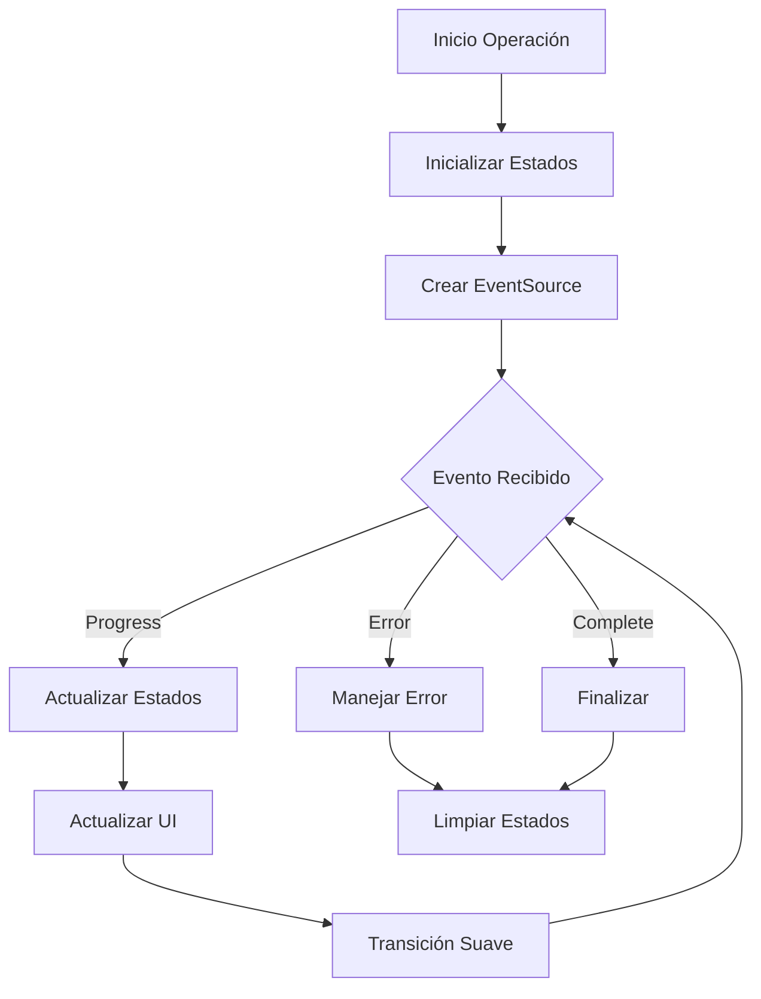
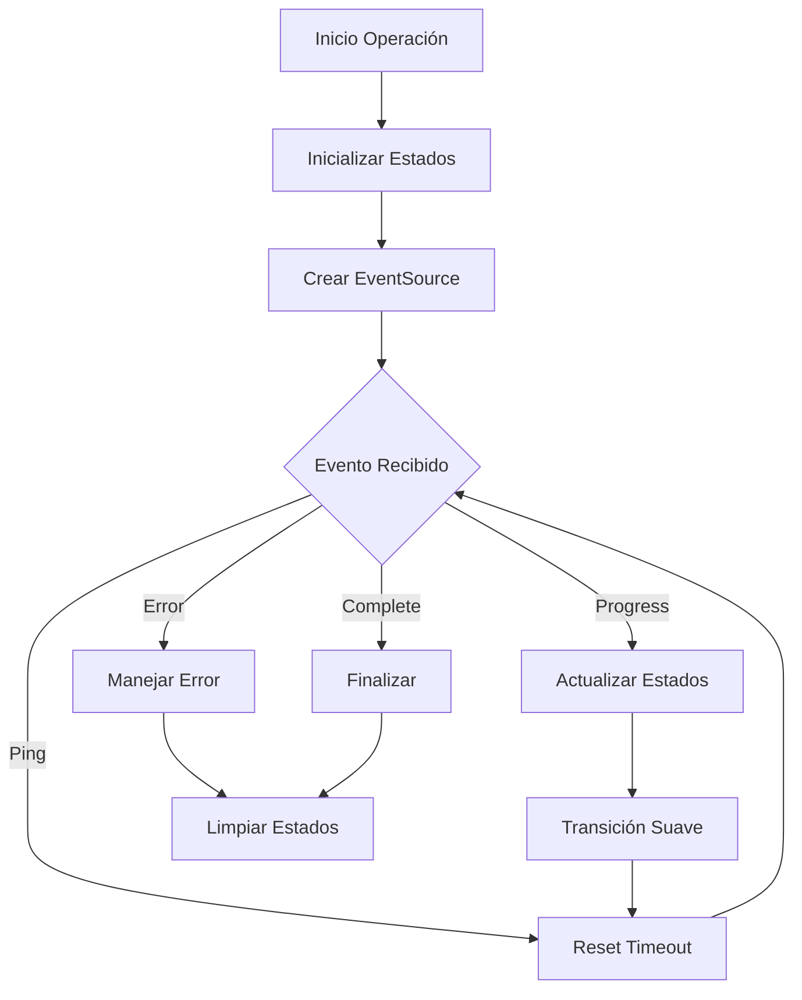

# NO BORRAR

Este proyecto es una aplicación moderna de gestión y visualización de archivos multimedia diseñada para proporcionar una experiencia fluida y eficiente en la organización y visualización de grandes colecciones de medios locales.

# Stack Tecnológico

## Front End

- **Next.js 15** - con App Router
- **React 19** - con Server Components
- **Tailwind CSS** - para estilos
- **shadcn/ui** - para componentes de UI
- **Zustand** - para gestión de estado
- **Jest** - para testing
- **Motion** - para animaciones
- **Lucide React** - para iconos
- **Typescript** - para tipado estático

## Back End

- **SQLite 3** - para base de datos local
- **Prisma ORM** - para ORM
- **Next.js API Routes** - para endpoints
- **Node.js fs/promises** - para manipulación de archivos

### Otras dependencias

- **Event Source Polyfill** - para soporte de eventos en navegadores antiguos
- **Event Source Stream** - para soporte de eventos en navegadores antiguos
- **Tanstack Query** - para gestión de datos
- **Bull** - para procesamiento de imágenes
- **Chokidar** - para monitoreo de cambios en carpetas
- **Exifr** - para extraer metadatos de imágenes
- **Sharp** - para procesamiento de imágenes
- **React Scan** - para debug de renderizado
- **React Color** - para color picker
- **Next Themes** - para gestión de temas
- **Eslint** - para linting

## 📝 Documentación del Proyecto

Se ha realizado una documentación detallada de las características principales del proyecto. La documentación actualizada se encuentra en:

#### Documentación Core

- `/docs/PRD.md` - Documento de Requerimientos del Producto
- `/docs/ROADMAP.md` - Vista general del proyecto y planificación
- `/docs/features/` - Documentación detallada de características

#### Features Documentados en Detalle:

1. **Optimización y Rendimiento**

   - `/docs/features/optimization/grid-performance.md`
   - `/docs/features/optimization/pagination-infinite-scroll.md`

2. **Servicios y Procesamiento**

   - `/docs/features/services/processing-improvements.md`

3. **Gestión de Archivos**

   - `/docs/features/file-management/batch-operations.md`

4. **Interfaz de Usuario**

   - `/docs/features/ui/info-panels.md`
   - `/docs/features/viewer/image-viewer-improvements.md`

5. **Personalización**

   - `/docs/features/customization/themes-and-performance.md`

6. **Metadata y Edición**

   - `/docs/features/metadata/metadata-management.md`

7. **Integración IA**
   - `/docs/features/ai/ai-integration.md`

### 🚀 Próximos Pasos

1. **Alta Prioridad**

   - Implementar optimizaciones de rendimiento en la vista de grilla
   - Desarrollar sistema de paginación y scroll infinito
   - Mejorar servicios de procesamiento

2. **Media Prioridad**

   - Implementar sistema de gestión batch
   - Desarrollar paneles informativos
   - Mejorar navegación y organización

3. **Baja Prioridad**
   - Implementar características de personalización
   - Desarrollar herramientas de edición básica
   - Explorar integración con IA

### 📊 Métricas y Objetivos

- Mejorar rendimiento general de la aplicación
- Reducir tiempos de carga y procesamiento
- Mantener uso eficiente de recursos
- Mejorar experiencia de usuario

### 🔍 Notas de Seguimiento

- Se mantiene compatibilidad con features existentes
- Se prioriza la estabilidad y rendimiento
- Se documenta cada nueva implementación
- Se mantienen tests actualizados

## 🚨 Issues Actuales (2024-01-06)

### Issue #1: Indexación de Carpetas

- ✗ La carpeta se crea pero el indexado no inicia
- ✗ Error: "The 'payload' argument must be of type object. Received null"
- ✗ No se muestra el progreso de indexación
- ✗ No se actualizan estadísticas (tamaño, archivos)

### Issue #2: Reindexación

- ✗ No muestra progreso en tiempo real
- ✗ No notifica finalización
- ✗ Proceso queda en espera indefinida

### Issue #3: Estadísticas

- ✗ No se muestran tamaños de archivos
- ✗ No se actualizan contadores
- ✗ Información incompleta en UI

## 🎯 Plan de Acción

1. **Fase 1: Diagnóstico**

   - Revisar flujo de indexación en `folder.service.ts`
   - Analizar manejo de eventos en `folders-section.tsx`
   - Verificar implementación de EventSource

2. **Fase 2: Correcciones**

   - Corregir payload en proceso de indexación
   - Implementar manejo de eventos SSE
   - Actualizar sistema de callbacks

3. **Fase 3: Mejoras**

   - Mejorar sistema de progreso
   - Implementar actualización de estadísticas
   - Optimizar manejo de errores

4. **Fase 4: Documentación**
   - Actualizar `folder-service.md`
   - Documentar cambios en componentes
   - Actualizar guías de desarrollo

## 🔄 Estado Actual

- Base de datos: Nueva implementación
- Servicios: Parcialmente funcionales
- UI: Requiere actualizaciones
- Documentación: En proceso de actualización

## 📝 Notas Técnicas

### Stack Involucrado

- EventSource para SSE
- API Routes para endpoints
- React para UI
- SQLite para almacenamiento

### Áreas de Mejora

1. Manejo de eventos en tiempo real
2. Procesamiento de archivos
3. Actualización de estadísticas
4. Manejo de errores

## 🔄 Actualizaciones (2024-01-07)

### Correcciones en Progreso de Thumbnails

#### Problemas Identificados y Resueltos

1. **Manejo de Estado de Progreso**

   - ✅ Estados duplicados causando inconsistencias
   - ✅ Falta de sincronización entre estados
   - ✅ Valores iniciales no manejados
   - ✅ Limpieza incompleta de estados

2. **Actualización de UI**
   - ✅ Progreso no se mostraba en tiempo real
   - ✅ Valores undefined en la interfaz
   - ✅ Transiciones abruptas
   - ✅ Feedback visual incompleto

#### Cambios Implementados

1. **Gestión de Estado**

   ```typescript
   // Estado unificado
   const [processProgress, setProcessProgress] = useState(0);
   const [processStatus, setProcessStatus] = useState<ProcessStatus>({});
   const [progress, setProgress] = useState<ProgressState | null>(null);
   ```

2. **Manejo de Progreso**

   ```typescript
   // Actualización suave del progreso
   updateProgressSmooth({
   	current: status.current || 0,
   	total: status.total || 0,
   	progress: status.progress || 0,
   	currentFile: status.currentFile || "",
   	status: status.status || "Procesando...",
   });
   ```

3. **Mejoras en UI**
   ```typescript
   // Valores seguros con fallbacks
   <span>
     {processStatus.current || 0} de {processStatus.total || 0} (
     {Math.round(processProgress)}%)
   </span>
   <span className="text-muted-foreground">
     {processStatus.status || "Procesando..."}
   </span>
   ```

### Estado Actual

1. **Funcionalidades**

   - ✅ Progreso en tiempo real funcionando
   - ✅ Transiciones suaves
   - ✅ Manejo de errores robusto
   - ✅ Feedback visual completo
   - ✅ Estados sincronizados

2. **Mejoras**
   - ✅ Logging detallado para debugging
   - ✅ Valores por defecto seguros
   - ✅ Limpieza de estados
   - ✅ Manejo de casos edge

### Diagrama de Flujo Actualizado



### Notas Técnicas

1. **Estados**

   - Múltiples estados sincronizados
   - Transiciones suaves
   - Valores por defecto
   - Limpieza completa

2. **UI/UX**

   - Feedback visual inmediato
   - Transiciones animadas
   - Manejo de casos nulos
   - Información detallada

3. **Debugging**
   - Logging detallado
   - Trazabilidad de eventos
   - Manejo de errores
   - Estados verificables

### Próximos Pasos

1. **Optimizaciones**

   - [ ] Reducir re-renders
   - [ ] Mejorar transiciones
   - [ ] Optimizar estados
   - [ ] Implementar memoización

2. **Mejoras**
   - [ ] Añadir más feedback visual
   - [ ] Mejorar animaciones
   - [ ] Expandir logging
   - [ ] Refinar manejo de errores

## 🔄 Actualizaciones (2024-01-08)

### Correcciones en Servicio de Thumbnails

#### Problemas Identificados y Resueltos

1. **Manejo de Eventos SSE**

   - ✅ Unificado el manejo de eventos para todas las operaciones
   - ✅ Implementado sistema de timeout con reset
   - ✅ Añadido evento 'ping' para mantener conexión
   - ✅ Mejorado manejo de errores y reconexión

2. **Progreso en Tiempo Real**

   - ✅ Corregida sincronización de estados UI/Servicio
   - ✅ Implementadas transiciones suaves de progreso
   - ✅ Añadido logging detallado para debugging
   - ✅ Mejorado feedback visual en todas las operaciones

3. **Gestión de Estado**
   - ✅ Unificado manejo de estado para todas las operaciones
   - ✅ Implementada limpieza correcta de estados
   - ✅ Añadida validación de datos
   - ✅ Mejorado manejo de casos edge

### Cambios Implementados

1. **Servicio de Thumbnails**

   ```typescript
   // Manejo unificado de eventos SSE
   const handleEvent = (event: EventSourceEvent) => {
   	const messageEvent = event as MessageEvent;
   	resetTimeout();
   	return messageEvent;
   };

   // Sistema de timeout con reset
   const resetTimeout = () => {
   	if (timeoutId) clearTimeout(timeoutId);
   	lastEventTime = Date.now();
   	timeoutId = setTimeout(() => {
   		if (Date.now() - lastEventTime > this.timeout) {
   			this.eventSource?.close();
   			reject(new Error("No activity within 45000 milliseconds"));
   		}
   	}, this.timeout);
   };
   ```

2. **Componente UI**

   ```typescript
   // Actualización suave del progreso
   updateProgressSmooth({
   	current: status.current || 0,
   	total: status.total || 0,
   	progress: status.progress || 0,
   	currentFile: status.currentFile || "",
   	status: status.status || "Procesando...",
   });

   // Manejo de estado unificado
   setProcessStatus((prevStatus) => ({
   	...prevStatus,
   	...status,
   	status: status.status || "Procesando...",
   }));
   ```

### Diagrama de Flujo Actualizado



### Estado Actual

1. **Funcionalidades**

   - ✅ Reprocesamiento de thumbnails
   - ✅ Optimización de thumbnails
   - ✅ Limpieza de thumbnails
   - ✅ Progreso en tiempo real
   - ✅ Manejo de errores robusto

2. **Mejoras**
   - ✅ Sistema de eventos unificado
   - ✅ Transiciones suaves
   - ✅ Feedback visual completo
   - ✅ Logging detallado

### Próximos Pasos

1. **Optimizaciones**

   - [ ] Implementar procesamiento en lote
   - [ ] Mejorar sistema de caché
   - [ ] Optimizar uso de memoria
   - [ ] Implementar compresión adaptativa

2. **UI/UX**

   - [ ] Añadir más feedback visual
   - [ ] Mejorar animaciones
   - [ ] Implementar vista previa en tiempo real
   - [ ] Añadir opciones de configuración avanzadas

3. **Mantenimiento**
   - [ ] Implementar pruebas automatizadas
   - [ ] Mejorar documentación
   - [ ] Optimizar rendimiento
   - [ ] Implementar métricas de monitoreo

### Notas Técnicas

1. **Eventos SSE**

   - Timeout: 45 segundos
   - Ping cada 10 segundos
   - Reintentos automáticos
   - Manejo de reconexión

2. **Estado**

   - Múltiples estados sincronizados
   - Transiciones suaves
   - Limpieza automática
   - Validación de datos

3. **Rendimiento**
   - Procesamiento asíncrono
   - Cola de operaciones
   - Caché de thumbnails
   - Optimización de recursos
