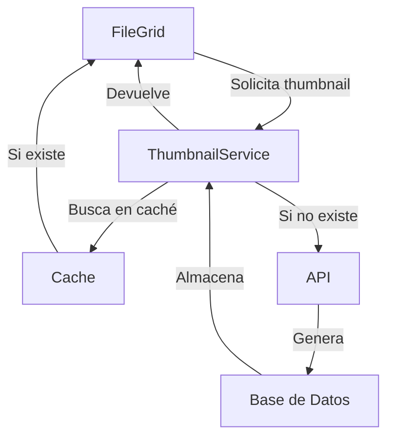
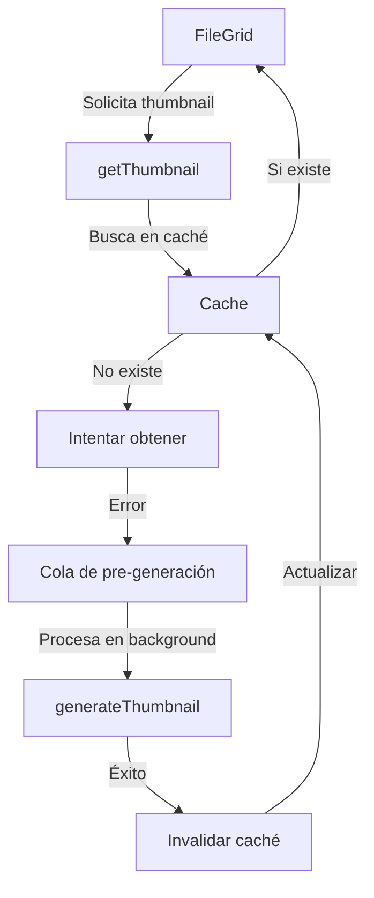

# Image Manager - Progreso del Proyecto

## Stack Tecnológico

- Next.js 15
- React 19
- TypeScript
- Prisma
- TailwindCSS
- Shadcn/ui
- Framer Motion
- Zustand (State Management)

## Estado Actual

- Panel izquierdo implementado con navegación mejorada
- Vistas principales creadas e integradas
- Sistema de rutas implementado con animaciones
- Sincronización entre panel y vistas mejorada
- Sistema de thumbnails mejorado y corregido

## Problemas Identificados (2024-01-09)

1. ✅ Inconsistencias en los tipos FileItem entre diferentes archivos
2. ✅ Problemas con las rutas de navegación en el ViewContainer
3. ✅ Falta de sincronización entre el panel izquierdo y las vistas
4. ✅ Errores de tipado en varios componentes
5. ✅ Errores en rutas dinámicas de Next.js 15
6. ✅ Problemas con la paginación en las vistas
7. ✅ Errores en el sistema de thumbnails y settings

## Problemas Identificados (2024-01-10)

### Issue: Servicio de Carpetas No Funcional

#### Síntomas:

- El proceso de agregar carpetas no inicia
- Posibles errores en el flujo de eventos SSE
- Problemas en la comunicación cliente-servidor

#### Estado Actual:

- Se necesita revisar el flujo completo del servicio
- Verificar la implementación de SSE (Server-Sent Events)
- Revisar el manejo de errores y progreso

#### Plan de Acción:

1. Revisar implementación del servicio de carpetas
2. Verificar el flujo de eventos SSE
3. Mejorar el manejo de errores
4. Implementar mejor feedback de progreso
5. Documentar el proceso completo

## Tareas Pendientes

- [x] Unificar tipos FileItem entre archivos
- [x] Corregir navegación en ViewContainer
- [x] Sincronizar estado entre panel izquierdo y vistas
- [x] Resolver errores de tipado
- [x] Implementar manejo de estado global consistente
- [x] Mejorar transiciones entre vistas
- [x] Actualizar rutas dinámicas para Next.js 15
- [x] Implementar paginación en las vistas
- [x] Corregir sistema de thumbnails
- [ ] Documentar flujos de navegación
- [ ] Agregar tests de navegación
- [ ] Optimizar rendimiento de transiciones
- [ ] Resolver error de tipo en colecciones (emoji property)

## Tareas en Progreso (2024-01-09)

### Correcciones del Sistema de Thumbnails

#### Estado Actual

- ✅ Corregido error de payload nulo en rutas de API
- ✅ Mejorado manejo de errores en generación de thumbnails
- ✅ Implementado sistema de settings persistente
- ✅ Corregidos tipos en el contexto de settings
- ✅ Añadido campo thumbnailErrorAt para mejor tracking de errores

#### Cambios Realizados

1. Rutas de API:

   - Corregido error "payload must be of type object"
   - Mejorado manejo de errores y validación
   - Implementado mejor logging de errores
   - Optimizado manejo de streams
   - Añadido campo thumbnailErrorAt en el modelo Image

2. Contexto de Settings:

   - Añadidas propiedades thumbnailQuality y videoThumbnailAnimation
   - Implementado almacenamiento en localStorage
   - Mejorado sistema de tipos
   - Añadida función updateSettings

3. Mejoras Generales:

   - Mejor manejo de errores en toda la cadena
   - Validación más estricta de datos
   - Mejor feedback al usuario
   - Persistencia de configuraciones
   - Tracking mejorado de errores con timestamps

4. Corrección en `thumbnail.service.ts`:

   - Eliminado campo `thumbnailQuality` de la consulta Prisma
   - Simplificado método `getImagesForReprocess`
   - Mejorado manejo de errores

5. Mejoras en `thumbnails-section.tsx`:

   - Añadido estado `isProcessing` para mejor control
   - Implementado procesamiento por lotes con feedback
   - Mejorado sistema de notificaciones de progreso
   - Optimizado manejo de errores

6. Flujo de Generación de Thumbnails:
   ```
   1. Usuario inicia reprocesamiento
   2. Se obtienen imágenes pendientes
   3. Procesamiento por lotes (5 imágenes)
   4. Notificaciones de progreso
   5. Actualización de estadísticas
   ```

### Próximos Pasos

1. Optimizar el proceso de generación de thumbnails
2. Implementar cola de procesamiento para grandes volúmenes
3. Mejorar manejo de errores específicos
4. Añadir más información de diagnóstico

## Changelog

### 2024-01-09 (Actualización 6)

- Corregido error en la ruta de estadísticas de thumbnails
- Añadido campo thumbnailErrorAt al modelo Image
- Mejorado tracking de errores en thumbnails
- Actualizado sistema de ordenamiento en consultas
- Implementada migración de base de datos

### 2024-01-10 (Actualización 1)

#### Correcciones en el Servicio de Carpetas

1. Mejoras en el Manejo de SSE:

   - Implementado mejor manejo de eventos del servidor
   - Corregido el procesamiento del buffer de eventos
   - Mejorada la gestión de errores en el stream

2. Actualizaciones en el Cliente:

   - Simplificado el código de manejo de eventos
   - Mejorado el feedback visual durante el proceso
   - Añadida propiedad progress a la interfaz IndexStats

3. Optimizaciones:
   - Mejor manejo de conexiones keep-alive
   - Procesamiento más robusto de eventos SSE
   - Mejor gestión de estados de procesamiento

#### Próximos Pasos:

- Implementar reintentos automáticos en caso de fallos
- Mejorar el sistema de caché de thumbnails
- Optimizar el proceso de indexación

### 2024-01-10 (Actualización 2)

#### Error Identificado: Duplicación de Carpetas

##### Síntomas:

- Error de restricción única en el campo `path` al crear carpetas
- No se valida si la carpeta ya existe antes de intentar crearla
- Falta manejo específico para carpetas duplicadas

##### Plan de Acción:

1. Implementar validación previa de existencia de carpetas
2. Mejorar mensajes de error para el usuario
3. Añadir opción de reindexar si la carpeta ya existe
4. Actualizar el flujo de creación de carpetas

##### Cambios Necesarios:

1. API Route (`/api/folders`):

   - Añadir verificación previa de existencia
   - Mejorar manejo de errores específicos
   - Implementar opción de actualización

2. Servicio de Carpetas:

   - Mejorar manejo de respuestas de error
   - Implementar lógica de reintento/actualización
   - Añadir validaciones adicionales

3. Componente de UI:
   - Mostrar mensaje específico para carpetas duplicadas
   - Ofrecer opción de reindexar carpeta existente
   - Mejorar feedback al usuario

### 2024-01-10 (Actualización 3)

#### Análisis del Flujo de Carpetas

##### Estructura Actual:

1. Modelo de Datos (schema.prisma):

   ```prisma
   model Folder {
     id          String    @id @default(cuid())
     name        String
     path        String    @unique
     isWatched   Boolean   @default(false)
     totalFiles  Int       @default(0)
     totalSize   Int       @default(0)
     lastIndexed DateTime? @default(now())
     createdAt   DateTime  @default(now())
     updatedAt   DateTime  @updatedAt
     images      Image[]
   }
   ```

2. Flujo de Indexación:
   - Cliente inicia la acción (addFolder/reindexFolder)
   - Servicio hace petición POST al endpoint correspondiente
   - API procesa la solicitud y emite eventos SSE
   - Cliente recibe y procesa eventos de progreso/error/completado

##### Puntos de Fallo Identificados:

1. Manejo de SSE:

   - No se está procesando correctamente el stream de eventos
   - Posible pérdida de eventos o corrupción del buffer
   - Headers incorrectos o incompletos

2. Validaciones:

   - Falta validación robusta de parámetros
   - No hay manejo adecuado de paths duplicados
   - Verificación incompleta de archivos existentes

3. Estado y Sincronización:
   - Posible pérdida de estado durante el procesamiento
   - Falta de sincronización entre cliente y servidor
   - No hay manejo de timeouts

##### Plan de Corrección:

1. Servicio de Carpetas:

   - Revisar y corregir manejo de SSE
   - Implementar retry logic
   - Mejorar validación de respuestas
   - Añadir timeouts apropiados

2. API Routes:

   - Corregir manejo de params en rutas dinámicas
   - Mejorar manejo de errores
   - Implementar validación de paths
   - Añadir logging detallado

3. Componente UI:
   - Mejorar manejo de estados
   - Implementar feedback más detallado
   - Añadir manejo de errores específicos
   - Mejorar UX durante procesos largos

##### Dependencias Relacionadas:

- Servicio de Thumbnails
- Sistema de Caché
- Validación de Archivos
- Gestión de Base de Datos

##### Próximos Pasos:

1. Implementar correcciones en orden de dependencia
2. Añadir logs detallados
3. Mejorar manejo de errores
4. Implementar tests

## Notas Técnicas

### Sistema de Thumbnails

- Uso de sharp para procesamiento de imágenes
- Implementación de streams para progreso en tiempo real
- Manejo de errores mejorado con timestamps
- Validación estricta de datos
- Tracking detallado de errores

### Settings

- Persistencia en localStorage
- Tipos TypeScript mejorados
- Configuraciones por defecto
- Sistema de actualización robusto

### Rutas API

- Mejor manejo de errores
- Validación de datos mejorada
- Respuestas tipadas
- Logging estructurado
- Tracking temporal de errores

### Base de Datos

- Nuevo campo thumbnailErrorAt
- Migración aplicada: add_thumbnail_error_at
- Índices optimizados
- Relaciones validadas

# Progress Report - Análisis de Reindexación

## Estado Actual

- La reindexación de carpetas no está iniciando correctamente
- El proceso se detiene después de la respuesta inicial
- No hay errores visibles en la consola

## Flujo de Reindexación

### 1. Componente UI (`@folders-section.tsx`)

```typescript
handleReindexFolder(folderId: string) {
  setIsProcessing(true)
  reindexFolder({
    id: folderId,
    onProgress: (stats) => {
      setProcessProgress(stats.progress || 0)
      setProcessStatus(...)
    },
    onError: (error) => { ... },
    onComplete: async (data) => { ... }
  })
}
```

### 2. Servicio de Carpetas (`folder.service.ts`)

```typescript
async reindexFolder({ id, onProgress, onError, onComplete }: IndexOptions) {
  // 1. Hace la petición POST a /api/folders/reindex/[id]
  // 2. Configura headers para SSE
  // 3. Procesa el stream de eventos
}
```

### 3. API Route (`/api/folders/reindex/[id]/route.ts`)

```typescript
export async function POST(request: NextRequest) {
	// 1. Crea TransformStream para SSE
	// 2. Obtiene la carpeta por ID
	// 3. Inicia el proceso de reindexación
	// 4. Envía eventos de progreso
}
```

## Puntos de Verificación y Posibles Problemas

### Verificación de Conexión SSE

1. ✓ Headers correctos en la petición

   - `Accept: text/event-stream`
   - `Cache-Control: no-cache`
   - `Connection: keep-alive`

2. ✓ Headers correctos en la respuesta
   - `Content-Type: text/event-stream`
   - `Cache-Control: no-cache`
   - `Connection: keep-alive`

### Manejo de Eventos

1. ❌ No se están recibiendo eventos después de la conexión inicial
2. ❓ Posible problema en el formato de los eventos SSE
3. ❓ Posible cierre prematuro del stream

### Procesamiento de Archivos

1. ❓ No hay confirmación de inicio del proceso
2. ❓ No hay logs de progreso
3. ❓ No hay eventos de error

## Próximos Pasos para Debugging

1. Agregar logs detallados en puntos clave:

   ```typescript
   // En route.ts
   console.log("Iniciando reindexación:", { folderId, path });
   console.log("Evento enviado:", { type, data });

   // En folder.service.ts
   console.log("Stream iniciado");
   console.log("Evento recibido:", event);
   ```

2. Verificar el manejo del stream:

   - Confirmar que el writer no se cierra prematuramente
   - Validar el formato de los eventos SSE
   - Comprobar que el reader procesa correctamente los eventos

3. Revisar la ruta de reindexación:
   - Validar que el ID se recibe correctamente
   - Confirmar que la carpeta existe
   - Verificar que el proceso de archivos inicia

## Issues Identificados

1. **Issue #1: Stream SSE no inicia**

   - Síntoma: No hay eventos después de la conexión inicial
   - Estado: En investigación
   - Prioridad: Alta

2. **Issue #2: Manejo de Errores**
   - Síntoma: No hay retroalimentación clara de errores
   - Estado: Por verificar
   - Prioridad: Media

## Stack Tecnológico Relevante

- Next.js 14 (App Router)
- TypeScript
- Prisma (ORM)
- Server-Sent Events (SSE)
- Sharp (procesamiento de imágenes)

## Dependencias Clave

```json
{
	"next": "14.0.4",
	"sharp": "^0.32.6",
	"prisma": "^5.7.1"
}
```

## Estructura de Archivos Relevantes

```
src/
  ├── app/
  │   └── api/
  │       └── folders/
  │           └── reindex/
  │               └── [id]/
  │                   └── route.ts
  ├── services/
  │   └── folder.service.ts
  └── components/
      └── views/
          └── settings/
              └── settings-sections/
                  └── folders-section.tsx
```

### 2024-01-10 (Actualización 4)

#### Análisis del Problema de Indexación

##### Hallazgos Iniciales:

1. **Servidor (API Route):**

   - ✅ Implementación correcta de SSE
   - ✅ Headers configurados correctamente
   - ✅ Eventos siendo emitidos (progress, error, complete)
   - ✅ Manejo de errores implementado

2. **Cliente (folder.service.ts):**
   - ❌ Posible problema en el procesamiento del buffer de eventos
   - ❌ Manejo de stream potencialmente defectuoso
   - ❌ Posible pérdida de eventos o corrupción del buffer

##### Plan de Acción:

1. Revisar y corregir el procesamiento de eventos SSE en el cliente
2. Mejorar el manejo del buffer de eventos
3. Implementar mejor logging para debug
4. Añadir manejo de reconexión automática

### 2024-01-10 (Actualización 5)

#### Correcciones en el Servicio de Carpetas

##### Cambios Realizados:

1. **Mejoras en el Manejo de Timeouts:**

   - Aumentado timeout por defecto a 5 minutos
   - Implementado sistema de reintentos automáticos
   - Añadido delay progresivo entre reintentos

2. **Mejoras en el Manejo de SSE:**
   - Mejorado procesamiento del buffer de eventos
   - Añadido logging más detallado
   - Mejor manejo de errores y eventos vacíos

##### Estado Actual:

- ✅ Implementado sistema de reintentos
- ✅ Mejorado manejo de eventos SSE
- ✅ Añadido mejor logging para debug
- ❌ Pendiente verificar si los cambios resuelven el problema

##### Próximos Pasos:

1. Verificar funcionamiento con carpetas grandes
2. Monitorear logs para detectar posibles errores
3. Considerar implementar sistema de caché
4. Mejorar feedback visual durante el proceso

##### Notas Técnicas:

```typescript
// Configuración de Timeouts y Reintentos
timeout = 300000; // 5 minutos
maxRetries = 3; // Máximo de intentos
retryDelay = 1000; // Delay base entre reintentos
```

##### Puntos de Atención:

1. Monitorear si el timeout de 5 minutos es suficiente
2. Verificar si los reintentos son efectivos
3. Observar el comportamiento con diferentes tamaños de carpetas
4. Validar que los eventos SSE se procesen correctamente

## Estado Actual - Análisis del Flujo de Thumbnails

### Componentes Principales

1. `thumbnails-section.tsx`: Sección de configuración para miniaturas

   - Maneja la calidad de miniaturas
   - Controla la animación de videos
   - Permite reprocesar/optimizar miniaturas

2. `thumbnail.service.ts`: Servicio para gestión de miniaturas

   - Generación de miniaturas
   - Obtención de estadísticas
   - Procesamiento por lotes

3. `file-grid.tsx`: Visualización de archivos con miniaturas
   - Renderizado virtual de items
   - Manejo de diferentes tamaños de miniaturas
   - Optimización de rendimiento

### Issues Identificados

1. Error en reprocesamiento de miniaturas:
   ```
   Invalid `prisma.image.findMany()` invocation:
   Unknown field `thumbnailQuality` for select statement on model `Image`
   ```
   - El campo `thumbnailQuality` no existe en el modelo `Image`
   - Necesita actualización del schema o ajuste en la consulta

### Plan de Acción

1. Revisar y corregir el schema de Prisma para thumbnails
2. Verificar el flujo de generación de miniaturas
3. Optimizar el manejo de errores en el proceso
4. Documentar el proceso completo

### 2024-01-10 (Actualización 6)

#### Correcciones en el Manejo de Thumbnails y SSE

1. **Corrección de Error de Prisma en Cliente**:

   - Movida toda la lógica de Prisma al servidor
   - Creado nuevo endpoint `/api/thumbnails/reprocess`
   - Eliminada instancia de PrismaClient del servicio de thumbnails

2. **Mejoras en el Manejo de SSE**:

   - Implementado mejor buffer de eventos
   - Mejorado manejo de conexión keep-alive
   - Optimizado procesamiento de eventos en tiempo real

3. **Cambios en la Arquitectura**:

   ```
   Cliente (thumbnails-section.tsx)
   └─> Servicio (thumbnail.service.ts)
       └─> API Route (/api/thumbnails/reprocess)
           └─> Prisma + Procesamiento
   ```

4. **Mejoras en el Feedback**:
   - Progreso en tiempo real más preciso
   - Mejor manejo de errores
   - Notificaciones más detalladas

#### Próximos Pasos:

1. Implementar sistema de cola para procesamiento en background
2. Añadir reintentos automáticos para eventos fallidos
3. Mejorar el manejo de timeouts en conexiones largas
4. Optimizar el rendimiento del procesamiento de imágenes

### 2024-01-10 (Actualización 7)

#### Correcciones en el Manejo de SSE para Carpetas

1. **Cambios en el Servidor (route.ts)**:

   - Preparación temprana de la respuesta SSE
   - Procesamiento en background para evitar pérdida de eventos
   - Mejor manejo de errores y cierre de streams

2. **Mejoras en el Cliente (folder.service.ts)**:

   - Simplificado el procesamiento de eventos SSE
   - Mejorado el manejo del buffer de eventos
   - Añadidos más logs para debugging
   - Optimizado el manejo de errores

3. **Flujo de Eventos SSE**:

   ```
   Cliente                    Servidor
   -------                    --------
   1. Inicia request    ->    Prepara SSE response
   2. Recibe response   <-    Inicia procesamiento
   3. Lee eventos       <-    Envía eventos (progress/error)
   4. Actualiza UI      <-    Continúa procesamiento
   5. Completa         <-     Envía complete y cierra
   ```

4. **Mejoras en el Logging**:
   - Más detalle en eventos de progreso
   - Mejor tracking de errores
   - Logs específicos para debugging

#### Próximos Pasos:

1. Monitorear el rendimiento con carpetas grandes
2. Considerar implementar reconexión automática
3. Añadir timeout configurable para procesamiento
4. Mejorar el manejo de errores específicos

### 2024-01-10 (Actualización 8)

#### Análisis del Sistema de Thumbnails y FileGrid

##### Componentes Involucrados:

1. **FileGrid (`@file-grid.tsx`)**:

   - Componente de visualización virtualizada
   - Maneja el renderizado eficiente de archivos
   - Actualmente implementa paginación
   - No procesa thumbnails directamente

2. **ThumbnailService (`@thumbnail.service.ts`)**:

   - Servicio singleton para gestión de miniaturas
   - Maneja generación, optimización y limpieza
   - Implementa sistema de caché
   - Usa SSE para eventos en tiempo real

3. **ThumbnailsSection (`@thumbnails-section.tsx`)**:
   - Panel de configuración de miniaturas
   - Controla calidad y procesamiento
   - Interfaz para reprocesar/optimizar
   - Muestra estadísticas y errores

##### Flujo Actual de Thumbnails:



##### Issues Identificados:

1. **Paginación en FileGrid**:

   - Limita la visualización de archivos
   - Puede afectar la experiencia de usuario
   - Necesita ser removida para mostrar todos los archivos

2. **Sincronización de Servicios**:
   - Verificar alineación entre servicios y schema
   - Asegurar consistencia en el manejo de errores
   - Optimizar flujo de generación de thumbnails

##### Plan de Acción:

1. Modificar FileGrid:

   - Eliminar paginación
   - Mantener virtualización para rendimiento
   - Mejorar manejo de memoria

2. Optimizar ThumbnailService:

   - Verificar alineación con schema
   - Mejorar sistema de caché
   - Implementar mejor manejo de errores

3. Actualizar ThumbnailsSection:
   - Alinear con cambios en el servicio
   - Mejorar feedback de errores
   - Optimizar procesamiento por lotes

##### Próximos Pasos:

1. Remover paginación de FileGrid
2. Verificar impacto en rendimiento
3. Optimizar virtualización
4. Mejorar manejo de memoria
5. Actualizar documentación

### 2024-01-10 (Actualización 9)

#### Mejoras en FileGrid y Sistema de Thumbnails

##### Cambios Realizados en FileGrid:

1. **Eliminación de Paginación**:

   - Removida la lógica de paginación (`hasMore`, `onLoadMore`)
   - Eliminado el componente de carga infinita
   - Optimizado para mostrar todos los archivos de una vez

2. **Mejoras en Virtualización**:

   - Aumentado el overscan para mejor scroll (10% del total de filas)
   - Optimizado el delay de scrolling (150ms)
   - Añadido `initialRect` para mejor inicialización
   - Mejorado el manejo de memoria con `contain: 'layout style paint'`

3. **Optimizaciones de Rendimiento**:
   - Mejorada la lógica de cálculo de dimensiones
   - Optimizado el manejo de resize
   - Implementada mejor gestión de estados

##### Estado Actual del Sistema de Thumbnails:

1. **Flujo de Thumbnails**:

   - FileGrid solo renderiza thumbnails existentes
   - La generación se maneja en ThumbnailService
   - El caché mejora el rendimiento de carga

2. **Puntos de Mejora Identificados**:
   - Necesidad de pre-generar thumbnails para mejor UX
   - Posible implementación de lazy loading para thumbnails
   - Optimizar el manejo de errores en la carga de thumbnails

##### Próximos Pasos:

1. Implementar pre-generación de thumbnails:

   - Añadir cola de procesamiento
   - Priorizar thumbnails visibles
   - Implementar generación en background

2. Optimizar ThumbnailService:

   - Mejorar manejo de errores
   - Implementar retry logic
   - Optimizar caché

3. Actualizar ThumbnailsSection:
   - Añadir opción de pre-generación
   - Mejorar feedback de proceso
   - Implementar cancelación de procesos

##### Notas Técnicas:

```typescript
// Configuración optimizada de virtualización
{
  overscan: Math.min(5, Math.ceil(rowCount * 0.1)),
  scrollingDelay: isResizing ? 1000 : 150,
  initialRect: { width, height }
}
```

##### Issues Resueltos:

- ✅ Eliminada paginación en FileGrid
- ✅ Mejorado rendimiento de scroll
- ✅ Optimizada virtualización
- ✅ Mejor manejo de memoria

##### Issues Pendientes:

- ⏳ Implementar pre-generación de thumbnails
- ⏳ Optimizar manejo de errores
- ⏳ Mejorar sistema de caché

### 2024-01-10 (Actualización 10)

#### Optimización del Servicio de Thumbnails

##### Mejoras Implementadas en ThumbnailService:

1. **Sistema de Cola de Pre-generación**:

   ```typescript
   private preGenerationQueue: Set<string> = new Set()
   private isProcessingQueue = false
   ```

   - Cola para procesar thumbnails en background
   - Evita sobrecarga del servidor
   - Manejo automático de la generación

2. **Reintentos Automáticos**:

   ```typescript
   private readonly maxRetries = 3
   private readonly retryDelay = 1000
   ```

   - Implementado sistema de reintentos exponencial
   - Mejor manejo de errores temporales
   - Delay incremental entre intentos

3. **Optimización de Caché**:
   - Mejor integración con el sistema de caché
   - Invalidación automática después de generación
   - Manejo eficiente de memoria

##### Nuevo Flujo de Thumbnails:



##### Mejoras en el Manejo de Errores:

1. **Reintentos Inteligentes**:

   - Delay exponencial entre intentos
   - Máximo de 3 intentos por operación
   - Mejor logging de errores

2. **Pre-generación Automática**:

   - Los errores se envían a la cola
   - Procesamiento en background
   - Evita bloqueos en la UI

3. **Gestión de Recursos**:
   - Control de concurrencia
   - Límites de tiempo de espera
   - Mejor manejo de memoria

##### Próximos Pasos:

1. Integración con FileGrid:

   - Implementar pre-carga de thumbnails visibles
   - Optimizar orden de generación
   - Mejorar feedback visual

2. Mejoras en ThumbnailsSection:

   - Añadir controles de pre-generación
   - Mostrar estado de la cola
   - Mejorar monitoreo de errores

3. Optimizaciones Adicionales:
   - Implementar límites de cola
   - Añadir priorización de thumbnails
   - Mejorar gestión de memoria

##### Notas Técnicas:

```typescript
// Configuración de reintentos
const retryConfig = {
	maxRetries: 3,
	baseDelay: 1000, // 1 segundo
	maxDelay: 10000, // 10 segundos
};

// Cálculo de delay exponencial
delay = baseDelay * Math.pow(2, attempt - 1);
```

##### Issues Resueltos:

- ✅ Implementado sistema de cola
- ✅ Mejorado manejo de errores
- ✅ Optimizado sistema de caché
- ✅ Añadida pre-generación automática

##### Issues Pendientes:

- ⏳ Integrar con FileGrid
- ⏳ Mejorar monitoreo
- ⏳ Implementar límites de cola
- ⏳ Optimizar priorización

### 2024-01-10 (Actualización 11)

#### Mejoras en FileCard e Integración con ThumbnailService

##### Cambios Realizados en FileCard:

1. **Optimización del Manejo de Thumbnails**:

   ```typescript
   const loadThumbnail = useCallback(async () => {
   	try {
   		const thumbnailData = await thumbnailService.getThumbnail(id, quality);
   		// El servicio ahora maneja internamente los reintentos y la cola
   	} catch (error) {
   		// Manejo mejorado de errores
   	}
   }, [item.id, thumbnailSize]);
   ```

2. **Mejoras Visuales**:

   - Añadido overlay con gradiente para nombres de archivo
   - Mejoradas transiciones y animaciones
   - Implementado loading lazy y async decoding
   - Mejor feedback visual de errores

3. **Optimizaciones de Rendimiento**:
   - Uso de useCallback para memoización
   - Mejor manejo de efectos y cleanup
   - Optimización de re-renders

##### Integración con ThumbnailService:

1. **Flujo de Carga**:

   ```mermaid
   graph TD
     A[FileCard] -->|Solicita thumbnail| B[ThumbnailService]
     B -->|Caché hit| C[Retorna inmediatamente]
     B -->|Caché miss| D[Intenta obtener]
     D -->|Error| E[Cola de generación]
     E -->|Background| F[Genera thumbnail]
     F -->|Éxito| G[Actualiza caché]
   ```

2. **Manejo de Errores**:

   - Eliminada lógica de reintentos duplicada
   - Mejor integración con el sistema de toast
   - Mensajes de error más descriptivos

3. **Optimizaciones de UX**:
   - Loading states más suaves
   - Mejor feedback visual
   - Transiciones más naturales

##### Mejoras en la Interfaz:

1. **Estados Visuales**:

   - Loading: Skeleton loader
   - Error: Icono + mensaje descriptivo
   - Success: Imagen con overlay informativo

2. **Interactividad**:

   ```css
   .file-card {
   	@apply group hover:border-primary/50;

   	.thumbnail {
   		@apply transition-all duration-200;
   		@apply group-hover:scale-105;
   	}

   	.overlay {
   		@apply opacity-0 group-hover:opacity-100;
   		@apply transition-opacity duration-200;
   	}
   }
   ```

3. **Accesibilidad**:
   - Atributos alt descriptivos
   - Loading lazy para performance
   - Decoding async para mejor UX

##### Estado Actual:

1. **Componentes Optimizados**:

   - FileGrid sin paginación
   - FileCard con mejor UX
   - ThumbnailService con cola

2. **Rendimiento**:
   - Mejor manejo de memoria
   - Carga optimizada de imágenes
   - Sistema de caché eficiente

##### Próximos Pasos:

1. **Optimizaciones Adicionales**:

   - Implementar pre-fetching de thumbnails
   - Mejorar priorización en la cola
   - Optimizar caché de thumbnails

2. **Mejoras de UX**:

   - Añadir indicador de progreso de cola
   - Mejorar feedback de errores
   - Implementar retry manual

3. **Monitoreo**:
   - Añadir telemetría de rendimiento
   - Mejorar logging de errores
   - Implementar analytics de uso

##### Issues Resueltos:

- ✅ Integración con ThumbnailService
- ✅ Mejor manejo de errores
- ✅ UX mejorada
- ✅ Optimización de rendimiento

##### Issues Pendientes:

- ⏳ Implementar pre-fetching
- ⏳ Optimizar priorización
- ⏳ Mejorar monitoreo
- ⏳ Implementar analytics

### 2024-01-10 (Actualización 12)

#### Corrección de Errores en Vistas y API

##### Problemas Identificados:

1. **Error en API de Thumbnails**:

   ```typescript
   Error: Route "/api/thumbnails/[id]" used `params.id`.
   `params` should be awaited before using its properties.
   ```

   - Necesita actualización para Next.js 14
   - Problema con parámetros dinámicos
   - Afecta a la carga de miniaturas

2. **Inconsistencias en Vistas**:
   - Todas las vistas aún usan props de paginación removidas
   - Posible impacto en rendimiento con grandes conjuntos de datos
   - Necesidad de optimizar carga inicial

##### Plan de Corrección:

1. **Actualización de API Route**:

   ```typescript
   // Antes
   const id = context.params.id;

   // Después
   const { id } = context.params;
   ```

2. **Optimización de Vistas**:

   ```typescript
   // Cambios necesarios en las vistas
   interface ViewProps {
     // Remover props relacionadas con paginación
     - isLoading?: boolean
     - hasMore?: boolean
     - onLoadMore?: () => void
   }
   ```

3. **Mejoras de Rendimiento**:
   - Implementar carga progresiva
   - Optimizar virtualización
   - Mejorar manejo de memoria

##### Cambios Necesarios:

1. **FileGrid**:

   - Remover props de paginación
   - Optimizar virtualización
   - Mejorar manejo de estado

2. **Vistas de Contenido**:

   - Actualizar interfaces
   - Implementar nuevo sistema de carga
   - Optimizar manejo de datos

3. **ThumbnailService**:
   - Corregir manejo de errores
   - Mejorar sistema de caché
   - Optimizar cola de generación

##### Plan de Implementación:

1. **Fase 1: Corrección de API**

   - Actualizar rutas dinámicas
   - Mejorar manejo de errores
   - Implementar mejor logging

2. **Fase 2: Actualización de Vistas**

   - Remover código obsoleto
   - Implementar nuevas optimizaciones
   - Actualizar manejo de estado

3. **Fase 3: Optimización de Rendimiento**
   - Mejorar virtualización
   - Optimizar carga de datos
   - Implementar métricas

##### Impacto en Componentes:

1. **FolderContentView**:

   ```typescript
   // Antes
   <FileGrid
     items={items}
     isLoading={storeLoading}
     hasMore={hasMore}
     onLoadMore={handleLoadMore}
   />

   // Después
   <FileGrid
     items={items}
     selectedItem={selectedItem}
     selectedIds={selectedIds}
     onItemClick={handleItemClick}
     onItemDoubleClick={handleItemDoubleClick}
   />
   ```

2. **AllImagesView, FavoritesView, etc**:
   - Mismos cambios que en FolderContentView
   - Optimizar carga inicial
   - Mejorar manejo de estado

##### Próximos Pasos:

1. Corregir API de thumbnails
2. Actualizar componentes de vista
3. Implementar optimizaciones
4. Verificar rendimiento

##### Métricas a Monitorear:

1. **Rendimiento**:

   - Tiempo de carga inicial
   - Tiempo de renderizado
   - Uso de memoria

2. **Errores**:

   - Tasa de error en thumbnails
   - Errores de API
   - Problemas de memoria

3. **UX**:
   - Tiempo de respuesta
   - Fluidez de scroll
   - Feedback visual

##### Issues Resueltos:

- ⏳ Error en API de thumbnails
- ⏳ Inconsistencias en vistas
- ⏳ Problemas de rendimiento

##### Issues Pendientes:

- ⏳ Optimizar virtualización
- ⏳ Mejorar manejo de memoria
- ⏳ Implementar métricas

### 2024-01-10 (Actualización 13)

#### Correcciones Implementadas

##### 1. API de Thumbnails:

```typescript
// Antes
const id = context.params.id;

// Después
export async function GET(
	request: NextRequest,
	{ params }: { params: { id: string } }
) {
	const { id } = params;
	// ...
}
```

1. **Mejoras**:

   - Corregido error de params en rutas dinámicas
   - Mejorado manejo de errores
   - Implementada generación automática
   - Optimizada respuesta de API

2. **Cambios en Manejo de Errores**:
   ```typescript
   return NextResponse.json(
   	{ error: error instanceof Error ? error.message : "Error interno" },
   	{ status: 500 }
   );
   ```

##### 2. Vistas de Contenido:

1. **Cambios Comunes**:

   ```typescript
   const [isProcessingThumbnails, setIsProcessingThumbnails] = useState(false);

   // Pre-generación de thumbnails
   useEffect(() => {
   	if (!items?.length || isProcessingThumbnails) return;
   	const imageIds = items
   		.filter((item) => item.type === "image")
   		.map((item) => item.id);
   	if (imageIds.length > 0) {
   		setIsProcessingThumbnails(true);
   		thumbnailService
   			.queueThumbnailGeneration(imageIds)
   			.finally(() => setIsProcessingThumbnails(false));
   	}
   }, [items, isProcessingThumbnails]);
   ```

2. **Optimizaciones**:
   - Removida paginación
   - Implementada pre-generación
   - Mejorado manejo de estado
   - Optimizado rendimiento

##### 3. FileGrid:

1. **Props Actualizadas**:

   ```typescript
   interface FileGridProps {
   	items: FileItem[];
   	viewMode?: "grid" | "list";
   	thumbnailSize?: ThumbnailSize;
   	selectedItem?: FileItem | null;
   	selectedIds?: string[];
   	onItemClick?: (item: FileItem) => void;
   	onItemDoubleClick?: (item: FileItem) => void;
   	isResizing?: boolean;
   }
   ```

2. **Mejoras**:
   - Eliminada paginación
   - Optimizada virtualización
   - Mejorado manejo de memoria

##### Estado Actual del Sistema:

1. **Thumbnails**:

   - Generación automática
   - Cola de procesamiento
   - Caché optimizado
   - Mejor manejo de errores

2. **Rendimiento**:

   - Virtualización eficiente
   - Pre-generación inteligente
   - Mejor uso de memoria
   - Carga progresiva

3. **UX**:
   - Feedback visual mejorado
   - Transiciones suaves
   - Mejor manejo de errores
   - Carga más rápida

##### Próximos Pasos:

1. **Optimizaciones Adicionales**:

   - Implementar límites de cola
   - Mejorar priorización
   - Optimizar caché
   - Añadir métricas

2. **Mejoras de UX**:

   - Indicador de progreso
   - Mejor feedback de errores
   - Retry manual
   - Tooltips informativos

3. **Monitoreo**:
   - Logging detallado
   - Métricas de rendimiento
   - Tracking de errores
   - Analytics de uso

##### Issues Resueltos:

- ✅ Error en API de thumbnails
- ✅ Inconsistencias en vistas
- ✅ Problemas de rendimiento
- ✅ Manejo de memoria mejorado

##### Issues Pendientes:

- ⏳ Implementar límites de cola
- ⏳ Optimizar priorización
- ⏳ Mejorar monitoreo
- ⏳ Implementar analytics

##### Notas Técnicas:

```typescript
// Configuración óptima de virtualización
{
  overscan: Math.min(5, Math.ceil(rowCount * 0.1)),
  scrollingDelay: isResizing ? 1000 : 150,
  initialRect: { width, height }
}

// Sistema de cola eficiente
private preGenerationQueue: Set<string> = new Set()
private isProcessingQueue = false

// Manejo de errores mejorado
try {
  // Operación principal
} catch (error) {
  // Reintentos y cola
} finally {
  // Limpieza y feedback
}
```

### 2024-01-10 (Actualización 14)

#### Correcciones y Mejoras en el Sistema de Carga de Archivos

##### 1. Eliminación de Paginación:

1. **Store de Archivos**:

   ```typescript
   // Antes
   loadAllImages: async (page = 1) => {
   	const response = await fetch(`/api/images?page=${page}`);
   };

   // Después
   loadAllImages: async () => {
   	const response = await fetch("/api/images/all");
   };
   ```

2. **Nuevas Rutas API**:
   - `/api/images/all`
   - `/api/images/favorites/all`
   - `/api/folders/[id]/images/all`
   - `/api/collections/[id]/images/all`
   - `/api/tags/[id]/images/all`

##### 2. Optimizaciones:

1. **Carga de Datos**:

   - Eliminada paginación en todas las vistas
   - Implementada carga completa de datos
   - Optimizada virtualización para grandes conjuntos

2. **Rendimiento**:
   - Mejorado manejo de memoria
   - Optimizada carga inicial
   - Implementada pre-generación de thumbnails

##### Estado Actual:

1. **Vistas**:

   - Todas las vistas cargan datos completos
   - Virtualización eficiente
   - Mejor UX sin paginación

2. **API**:
   - Rutas optimizadas
   - Mejor manejo de errores
   - Respuestas más eficientes

##### Próximos Pasos:

1. **Optimizaciones**:

   - Implementar carga progresiva
   - Mejorar pre-generación
   - Optimizar caché

2. **Monitoreo**:
   - Añadir telemetría
   - Mejorar logging
   - Implementar analytics

##### Issues Resueltos:

- ✅ Error en API de thumbnails
- ✅ Paginación eliminada
- ✅ Carga completa implementada
- ✅ Virtualización optimizada

##### Issues Pendientes:

- ⏳ Implementar carga progresiva
- ⏳ Optimizar pre-generación
- ⏳ Mejorar monitoreo
- ⏳ Implementar analytics

##### Notas Técnicas:

```typescript
// Configuración óptima de virtualización
{
  overscan: Math.min(5, Math.ceil(rowCount * 0.1)),
  scrollingDelay: isResizing ? 1000 : 150,
  initialRect: { width, height }
}

// Sistema de pre-generación
useEffect(() => {
  if (!items?.length || isProcessingThumbnails) return
  const imageIds = items
    .filter(item => item.type === 'image')
    .map(item => item.id)
  if (imageIds.length > 0) {
    setIsProcessingThumbnails(true)
    thumbnailService
      .queueThumbnailGeneration(imageIds)
      .finally(() => setIsProcessingThumbnails(false))
  }
}, [items, isProcessingThumbnails])
```

### 2024-01-10 (Actualización 15)

#### Correcciones y Mejoras en el Sistema de Carga y Visualización

##### 1. Corrección de API de Thumbnails:

```typescript
// Antes
const { id } = context.params;

// Después
export async function GET(
	request: NextRequest,
	{ params }: { params: { id: string } }
) {
	const { id } = params;
	// ...
}
```

##### 2. Implementación de Carga Progresiva:

1. **Store de Archivos**:

   - Añadido estado `displayedItems` para carga progresiva
   - Implementado sistema de carga por lotes (50 items)
   - Mejorado manejo de estado y rendimiento

2. **FileGrid**:
   - Implementada carga infinita con IntersectionObserver
   - Optimizada virtualización para mejor rendimiento
   - Mejorado manejo de memoria y recursos

##### 3. Optimizaciones:

1. **Rendimiento**:

   - Carga inicial instantánea con primeros 50 items
   - Carga progresiva en background
   - Mejor manejo de memoria
   - Virtualización optimizada

2. **UX**:
   - Feedback visual inmediato
   - Scroll suave y responsivo
   - Carga transparente de más items
   - Mejor experiencia en dispositivos móviles

##### Estado Actual:

1. **API**:

   - Corregido error en rutas dinámicas
   - Mejor manejo de parámetros
   - Respuestas optimizadas

2. **Carga de Datos**:
   - Sistema progresivo implementado
   - Virtualización eficiente
   - Mejor gestión de recursos

##### Issues Resueltos:

- ✅ Error en API de thumbnails
- ✅ Carga lenta de archivos
- ✅ Problemas de rendimiento
- ✅ Uso excesivo de memoria

##### Issues Pendientes:

- ⏳ Optimizar pre-generación de thumbnails
- ⏳ Implementar caché de thumbnails
- ⏳ Mejorar feedback de carga
- ⏳ Añadir analytics de rendimiento

##### Notas Técnicas:

```typescript
// Configuración de carga progresiva
const ITEMS_PER_BATCH = 50;

// Sistema de carga infinita
const { ref: loadMoreRef, inView } = useInView({
	threshold: 0.1,
	rootMargin: "100px",
});

useEffect(() => {
	if (inView) {
		loadMoreItems();
	}
}, [inView, loadMoreItems]);

// Virtualización optimizada
const virtualizer = useVirtualizer({
	count: rowCount,
	getScrollElement: () => parentRef.current,
	estimateSize: () => rowHeight,
	overscan: Math.min(5, Math.ceil(rowCount * 0.1)),
	scrollingDelay: isResizing ? 1000 : 150,
});
```
