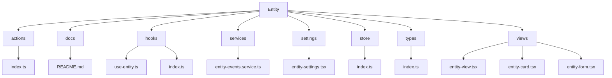
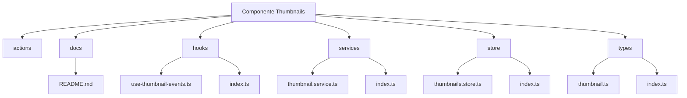
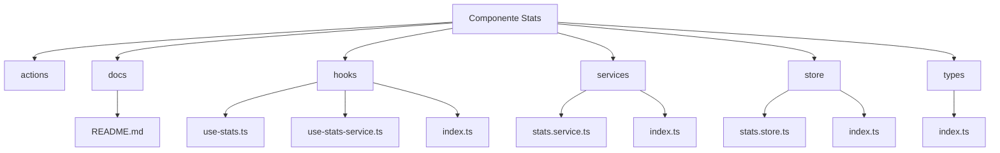

# Migración de Componentes

## Objetivo

Reorganizar los componentes de las entidades de Prisma en carpetas específicas para una mejor estructura y encapsulación.

## Estructura de Carpetas

Para cada entidad, se creará la siguiente estructura de carpetas:

```
src/components/[entity]/
  ├── actions/        # Server actions
  ├── docs/           # Documentación específica
  ├── hooks/          # Custom hooks
  ├── services/       # Servicios
  ├── settings/       # Configuraciones
  ├── store/          # Estado global (Zustand)
  ├── types/          # Tipos y interfaces
  └── views/          # Componentes visuales
```

## Progreso

### Completado

- ✅ Albums
- ✅ Collections
  - ✅ Tipos
  - ✅ Store
  - ✅ Acciones
  - ✅ Servicios
  - ✅ Vistas
  - ✅ Hooks
  - ✅ Configuración
- ✅ Tags
  - ✅ Tipos
  - ✅ Store
  - ✅ Acciones
  - ✅ Vistas
  - ✅ Hooks
  - ✅ Configuración
- ✅ Characters
- ✅ Places
- ✅ World-items
  - ✅ Tipos
  - ✅ Store
  - ✅ Acciones
  - ✅ Servicios
  - ✅ Vistas
  - ✅ Hooks
  - ✅ Configuración
- ✅ Prompts
  - ✅ Tipos
  - ✅ Store
  - ✅ Acciones
  - ✅ Servicios
  - ✅ Vistas
  - ✅ Hooks
  - ✅ Configuración
- ✅ Notes
  - ✅ Tipos
  - ✅ Store
  - ✅ Acciones
  - ✅ Servicios
  - ✅ Vistas
  - ✅ Hooks
  - ✅ Configuración
- ✅ Concept
  - ✅ Tipos
  - ✅ Store
  - ✅ Acciones
  - ✅ Servicios
  - ✅ Vistas
  - ✅ Hooks
  - ✅ Configuración
- ✅ Folders
  - ✅ Tipos
  - ✅ Store
  - ✅ Acciones
  - ✅ Servicios
  - ✅ Vistas
  - ✅ Hooks
  - ✅ Configuración
- ✅ Images
  - ✅ Tipos
  - ✅ Store
  - ✅ Acciones
  - ✅ Servicios
  - ✅ Vistas
  - ✅ Hooks
  - ✅ Configuración

### Corrección de Errores Post-Migración

- ✅ Corregir importaciones en `collection.actions.ts`
  - ✅ Actualizar importación de `CollectionEventType` y `collectionEventService`
  - ✅ Corregir métodos de emisión de eventos
  - ✅ Corregir error en `groupBy` de Prisma
- ✅ Actualizar importaciones en `submenus.tsx`
  - ✅ Corregir rutas de importación de los stores
- ✅ Crear estructura de carpetas faltante
  - ✅ Crear carpeta `store` en `concept`
  - ✅ Mover `concept.store.ts` a la carpeta `store`
  - ✅ Actualizar exportaciones en `index.ts`
  - ✅ Crear carpeta `store` en `notes`
  - ✅ Mover `note.store.ts` a `notes.store.ts` en la carpeta `store`
  - ✅ Actualizar exportaciones en `index.ts`
  - ✅ Crear carpeta `actions` en `concept`
  - ✅ Mover `concept.actions.ts` a la carpeta `actions`
  - ✅ Crear carpeta `actions` en `notes`
  - ✅ Mover `note.actions.ts` a la carpeta `actions`
  - ✅ Crear carpeta `views` en `notes`
  - ✅ Mover `notes-view.tsx` a `note-view.tsx` en la carpeta `views`
  - ✅ Mover `note-content-view.tsx` a la carpeta `views`
  - ✅ Actualizar importaciones en las vistas
  - ✅ Crear carpeta `views` en `concept`
  - ✅ Mover `concepts-view.tsx` a `concept-view.tsx` en la carpeta `views`
  - ✅ Mover `concept-content-view.tsx` a la carpeta `views`
  - ✅ Actualizar importaciones en las vistas
- ✅ Actualizar archivos index.ts para exportar correctamente desde las nuevas ubicaciones
  - ✅ Actualizar `src/components/prompts/index.ts`
  - ✅ Actualizar `src/components/tags/index.ts`
  - ✅ Verificar y corregir otros archivos index.ts
- ✅ Corregir servicios de eventos y acciones
  - ✅ Crear servicio de eventos para prompts (`prompt-events.service.ts`)
  - ✅ Actualizar acciones de prompts para usar el servicio de eventos
  - ✅ Corregir errores en las funciones de emisión de eventos
- ✅ Actualizar referencias en componentes del menú contextual
  - ✅ Corregir importaciones en `use-entity-loader.ts`
  - ✅ Corregir importaciones en `context-action-handler.ts`
- ✅ Actualizar referencias en el resto del proyecto
  - ✅ Revisar y corregir importaciones en componentes de UI
  - ✅ Revisar y corregir importaciones en páginas
  - ✅ Revisar y corregir importaciones en hooks globales
  - ✅ Revisar y corregir importaciones en servicios
  - ✅ Revisar y corregir importaciones en componentes de features
  - ✅ Revisar y corregir importaciones en componentes de navegación
  - ✅ Revisar y corregir importaciones en componentes de layout
- ✅ Corregir importaciones específicas
  - ✅ Corregir importaciones en `favorites.store.ts` para usar la nueva ubicación de las acciones
  - ✅ Corregir importaciones en `favorites-view.tsx` para usar la nueva ubicación de las acciones
  - ✅ Corregir importaciones en `view-container.tsx` para usar las nuevas ubicaciones de los componentes
  - ✅ Corregir importaciones en `navigation.actions.ts` para usar las nuevas ubicaciones de las acciones

### ✅ Resuelto: Error en hook useCategoryCollapse

- Se corrigió un error de variable no definida en el hook `useCategoryCollapse`
- El parámetro era recibido como `_categoryId` pero usado como `categoryId` en el cuerpo de la función
- Se renombró el parámetro para mantener la consistencia y corregir el error

### ✅ Resuelto: Función faltante getPlaceImages

- Se implementó la función `getPlaceImages` en el archivo `src/components/places/actions/place.actions.ts`
- Esta función era importada pero no estaba definida en el módulo, causando errores en tiempo de ejecución
- La implementación sigue el patrón de las otras funciones de obtención de imágenes en el proyecto

### ✅ Resuelto: Configuración de Prisma

- Se eliminó la configuración personalizada de `output` en `prisma/schema.prisma`
- Esto permite que Prisma genere el cliente en la ubicación predeterminada
- Soluciona el error `Cannot find module '.prisma/client/default'`

### ✅ Resuelto: Más errores de parámetros con guión bajo

- Se corrigieron varios errores donde se recibían parámetros con guión bajo pero se usaban sin él
- **Errores corregidos**:
  - En `src/components/navigation/hooks/use-category-stats.ts`: `_categoryId` vs `categoryId`
  - En `src/components/navigation/hooks/use-category-handlers.ts`: `_categoryId` vs `categoryId`
  - En `src/components/stats/hooks/use-stats.ts`: `_imageId` vs `imageId`
  - En `src/store/ui.store.ts`: `_state` vs `state`
  - En `src/components/views/view-container.tsx`: `_direction` vs `direction`
  - En `src/components/profiles/profiles-settings.tsx`: `_emoji` vs `emoji`
  - En `src/components/features/entity-cards/layouts/forms/entity-form.tsx`: `_emoji` vs `emoji`
  - En `src/components/features/entity-cards/layouts/forms/collection-form.tsx`: `_prev` vs `prev`
  - En `src/components/features/file-browser/details/details-panel.store.ts`: `_visible/fixed` vs `visible/fixed`
  - En varios archivos de gráficos: `_value` vs `value`
- Estos errores causaban referencias a variables no definidas y crashes en la aplicación
- Se implementó una solución homogénea: usar el nombre del parámetro exactamente como se define

### ✅ Mejorado: Script de corrección automática de errores TypeScript

- Se mejoró el script `scripts/fix-ts-errors.js` para detectar y corregir automáticamente los errores de parámetros con guión bajo
- Nuevos patrones añadidos:
  - Corregir referencias a `state` dentro de `produce` con `_state`
  - Corregir referencias a `emoji` en `onEmojiSelect` con `_emoji`
  - Corregir referencias a `prev` en `setFormData` con `_prev`
  - Corregir referencias a `value` en formatters con `_value`
  - Corregir referencias a parámetros en setters
  - Corregir switch que usa variable sin guión bajo cuando el parámetro tiene guión bajo
  - Corregir referencias generales a variables sin guión bajo cuando el parámetro tiene guión bajo
- Estos patrones permitirán prevenir de manera proactiva este tipo de errores en todo el código

### ✅ Mejorado: Configuración de ESLint y Herramientas de Calidad de Código

- Se creó un nuevo archivo de configuración para ESLint (`eslint.config.mjs`) con reglas personalizadas
- Se añadió una regla específica para detectar y prevenir el uso incorrecto de variables con guiones bajos
- Se integró la configuración con Prettier para mantener un estilo consistente en el código
- Se añadieron scripts en `package.json` para facilitar la ejecución de las herramientas:
  - `lint:vars`: Verifica la presencia de patrones de nombres de variables problemáticos
  - `lint:vars:fix`: Corrige automáticamente los patrones de nombres de variables
  - `lint:fix`: Ejecuta el script de corrección de errores de lint
  - `lint:staged`: Ejecuta ESLint solo en los archivos modificados que están preparados para commit
- Se creó un hook de pre-commit que verifica:
  - Errores de ESLint en archivos TypeScript/TSX modificados
  - Patrones de nombres de variables problemáticos
  - Uso de `console.log` (como advertencia)
- Estas mejoras ayudarán a mantener la calidad del código y prevenir problemas comunes antes de que lleguen al repositorio
- **Documentación detallada:** Se ha creado el documento [docs/quality-code.md](./quality-code.md) con una explicación completa del sistema de calidad de código implementado

## Nota Técnica

- Se mantendrá la compatibilidad con las APIs existentes
- Se actualizarán las importaciones en los archivos afectados
- Se seguirán las mejores prácticas de TypeScript y React

## Diagrama de Estructura



## Próximos Pasos

1. ✅ Verificar y actualizar todas las referencias a los componentes migrados en el resto del proyecto
2. ✅ Asegurar que todas las importaciones estén correctamente actualizadas
3. ⬜ Realizar pruebas para confirmar que la funcionalidad se mantiene intacta
4. ⬜ Documentar cualquier cambio en la API o en el uso de los componentes

## Lista de Tareas Pendientes

- [ ] Revisar importaciones en componentes de navegación
- [ ] Revisar importaciones en componentes de layout
- [ ] Revisar importaciones en componentes de features
- [ ] Revisar importaciones en páginas de la aplicación
- [ ] Revisar importaciones en componentes de UI
- [ ] Verificar que todos los stores estén correctamente exportados
- [ ] Verificar que todos los hooks estén correctamente exportados
- [ ] Verificar que todas las acciones del servidor estén correctamente exportadas

## Plan de Acción para Consolidar la Estructura de Imágenes

### Análisis de la Situación Actual (Actualizado)

Después de revisar nuevamente la estructura actual de la carpeta `src/components/images`, se han identificado los siguientes problemas pendientes:

1. Archivos de tipos (`image.ts`, `image-item.ts`, `images.ts`, `image-processing.ts`, `image-loader.ts`) que siguen en la raíz y deben moverse a la carpeta `types`
2. Archivos duplicados en las carpetas `services` y `store` que deben consolidarse
3. Algunos archivos de acciones posiblemente duplicados que deben revisarse

### Estado Actual

**Archivos en la raíz que deben moverse:**

- [x] `image.ts` → `types/image.ts`
- [x] `image-item.ts` → `types/image-item.ts`
- [x] `images.ts` → `types/images.ts`
- [x] `image-processing.ts` → `types/image-processing.ts`
- [x] `image-loader.ts` → `types/image-loader.ts`

**Archivos duplicados que deben consolidarse:**

- [x] `services/image.service.ts` y `services/image.service (2).ts`
- [x] `store/image-resources.store.ts` y `store/image-resources.store (2).ts`

**Posibles duplicados en acciones:**

- [x] `actions/image.actions.ts` y `actions/image-access.actions.ts` (verificar si tienen funcionalidad similar)
- [x] `actions/thumbnail.actions.ts` y `actions/image-thumbnails.actions.ts` (verificar si tienen funcionalidad similar)

### Tareas de Consolidación (Actualizadas)

#### 1. Reorganización de Archivos

- [x] Mover `image-processing.actions.ts` a la carpeta `actions`
- [x] Mover `image-resources.store.ts` a la carpeta `store` (verificar si ya existe una copia)
- [x] Mover `image.service.ts` y `image-converter.service.ts` a la carpeta `services`
- [x] Mover `folder-images.action.ts` a la carpeta `actions` y renombrarlo a `folder-images.actions.ts`
- [x] Mover `image.ts` a la carpeta `types`
- [x] Mover `image-item.ts` a la carpeta `types`
- [x] Mover `images.ts` a la carpeta `types`
- [x] Mover `image-processing.ts` a la carpeta `types`
- [x] Mover `image-loader.ts` a la carpeta `types`

#### 2. Eliminación de Duplicados

- [x] Revisar y consolidar `services/image.service.ts` y `services/image.service (2).ts`
- [x] Revisar y consolidar `store/image-resources.store.ts` y `store/image-resources.store (2).ts`
- [x] Revisar y consolidar posibles duplicados en acciones (`image.actions.ts` vs `image-access.actions.ts`, `thumbnail.actions.ts` vs `image-thumbnails.actions.ts`)

#### 3. Actualización de Importaciones

- [x] Actualizar el archivo `index.ts` para exportar correctamente todos los archivos desde sus nuevas ubicaciones
- [x] Actualizar el archivo `types/index.ts` para incluir los nuevos archivos de tipos
- [x] Actualizar el archivo `actions/index.ts` para reflejar los cambios en los archivos de acciones
- [x] Verificar que no haya referencias a rutas antiguas en el resto del proyecto

### Tareas Pendientes (Actualizadas)

- [x] Copiar los archivos de tipos restantes a la carpeta `types`
- [x] Eliminar los archivos duplicados después de consolidar su funcionalidad
- [x] Eliminar los archivos originales que ya han sido movidos a sus respectivas carpetas
- [x] Verificar que todas las importaciones en el proyecto apunten a las nuevas ubicaciones
- [x] Actualizar la documentación con la nueva estructura
- [ ] Realizar pruebas para asegurar que la funcionalidad se mantiene intacta

### Próximos Pasos

1. Realizar pruebas para asegurar que la funcionalidad se mantiene intacta
2. Continuar con la consolidación de otros componentes siguiendo el mismo patrón

### Conclusión

Se ha completado exitosamente la consolidación de la estructura del componente de imágenes, siguiendo el patrón establecido para todos los componentes del proyecto. La nueva estructura es más organizada, modular y fácil de mantener, lo que facilitará el desarrollo futuro y la colaboración entre desarrolladores.

```mermaid
graph TD
    A[Componente Images] --> B[actions]
    A --> C[docs]
    A --> D[hooks]
    A --> E[services]
    A --> F[settings]
    A --> G[store]
    A --> H[types]
    A --> I[views]

    B --> B1[image-crud.actions.ts]
    B --> B2[image-access.actions.ts]
    B --> B3[image-thumbnails.actions.ts]
    B --> B4[image-processing.actions.ts]
    B --> B5[image-stats.actions.ts]
    B --> B6[image-types.actions.ts]
    B --> B7[images-random.action.ts]
    B --> B8[folder-images.actions.ts]
    B --> B10[thumbnail.actions.ts]
    B --> B11[index.ts]

    E --> E1[image.service.ts]
    E --> E2[image-converter.service.ts]
    E --> E3[index.ts]

    G --> G1[image-resources.store.ts]
    G --> G2[index.ts]

    H --> H1[images.types.ts]
    H --> H2[image.ts]
    H --> H3[image-item.ts]
    H --> H4[images.ts]
    H --> H5[image-processing.ts]
    H --> H6[image-loader.ts]
    H --> H7[index.ts]

    D --> D1[index.ts]
    I --> I1[index.ts]
```



## Plan de Acción para Consolidar la Estructura de Thumbnails y Stats

### Análisis de la Situación Actual

Después de revisar la estructura actual de las carpetas `src/components/thumbnails` y `src/components/stats`, se ha identificado que estos componentes necesitan ser reorganizados siguiendo el mismo patrón que se aplicó al componente `images`.

#### Componente Thumbnails

**Estructura Actual:**

- `thumbnails.store.ts`
- `thumbnail.service.ts`
- `thumbnail.ts`
- `use-thumbnail-events.ts`

**Estructura Deseada:**

- `store/thumbnails.store.ts`
- `services/thumbnail.service.ts`
- `types/thumbnail.ts`
- `hooks/use-thumbnail-events.ts`
- `actions/` (crear si es necesario)
- `docs/README.md`
- `index.ts`

#### Componente Stats

**Estructura Actual:**

- `stats.service.ts`
- `stats.store.ts`
- `use-stats.ts`
- `use-stats-service.ts`

**Estructura Deseada:**

- `services/stats.service.ts`
- `store/stats.store.ts`
- `hooks/use-stats.ts`
- `hooks/use-stats-service.ts`
- `actions/` (crear si es necesario)
- `types/` (crear si es necesario)
- `docs/README.md`
- `index.ts`

### Tareas de Consolidación

#### 1. Componente Thumbnails

- [ ] Crear la estructura de carpetas necesaria

  - [ ] `src/components/thumbnails/store`
  - [ ] `src/components/thumbnails/services`
  - [ ] `src/components/thumbnails/types`
  - [ ] `src/components/thumbnails/hooks`
  - [ ] `src/components/thumbnails/actions`
  - [ ] `src/components/thumbnails/docs`

- [ ] Mover los archivos a sus respectivas carpetas

  - [ ] Mover `thumbnails.store.ts` a `store/thumbnails.store.ts`
  - [ ] Mover `thumbnail.service.ts` a `services/thumbnail.service.ts`
  - [ ] Mover `thumbnail.ts` a `types/thumbnail.ts`
  - [ ] Mover `use-thumbnail-events.ts` a `hooks/use-thumbnail-events.ts`

- [ ] Crear archivos index.ts en cada subcarpeta

  - [ ] Crear `store/index.ts`
  - [ ] Crear `services/index.ts`
  - [ ] Crear `types/index.ts`
  - [ ] Crear `hooks/index.ts`
  - [ ] Crear `actions/index.ts`

- [ ] Crear archivo principal `index.ts` para exportar todo

- [ ] Crear documentación en `docs/README.md`

#### 2. Componente Stats

- [ ] Crear la estructura de carpetas necesaria

  - [ ] `src/components/stats/store`
  - [ ] `src/components/stats/services`
  - [ ] `src/components/stats/hooks`
  - [ ] `src/components/stats/actions`
  - [ ] `src/components/stats/types`
  - [ ] `src/components/stats/docs`

- [ ] Mover los archivos a sus respectivas carpetas

  - [ ] Mover `stats.store.ts` a `store/stats.store.ts`
  - [ ] Mover `stats.service.ts` a `services/stats.service.ts`
  - [ ] Mover `use-stats.ts` a `hooks/use-stats.ts`
  - [ ] Mover `use-stats-service.ts` a `hooks/use-stats-service.ts`

- [ ] Crear archivos index.ts en cada subcarpeta

  - [ ] Crear `store/index.ts`
  - [ ] Crear `services/index.ts`
  - [ ] Crear `hooks/index.ts`
  - [ ] Crear `actions/index.ts`
  - [ ] Crear `types/index.ts`

- [ ] Crear archivo principal `index.ts` para exportar todo

- [ ] Crear documentación en `docs/README.md`

#### 3. Actualización de Importaciones

- [ ] Verificar y actualizar las importaciones en el resto del proyecto que hagan referencia a estos componentes

### Diagramas de Estructura

#### Estructura del Componente Thumbnails



#### Estructura del Componente Stats



## Correcciones de Estructura y Refactorización

### ✅ Resuelto: Problemas de importación

- Se creó un archivo puente `src/lib/thumbnail.ts` para mantener la compatibilidad con las importaciones existentes
- Este archivo exporta la funcionalidad de generación de miniaturas desde su ubicación real en `src/components/thumbnails/utils/thumbnail.generator.ts`
- Solución para evitar errores de construcción relacionados con `Module not found: Can't resolve '@/lib/thumbnail'`

### ✅ Resuelto: Error en hook useCategoryCollapse

- Se corrigió un error de variable no definida en el hook `useCategoryCollapse`
- El parámetro era recibido como `_categoryId` pero usado como `categoryId` en el cuerpo de la función
- Se renombró el parámetro para mantener la consistencia y corregir el error

### ✅ Resuelto: Función faltante getPlaceImages

- Se implementó la función `getPlaceImages` en el archivo `src/components/places/actions/place.actions.ts`
- Esta función era importada pero no estaba definida en el módulo, causando errores en tiempo de ejecución
- La implementación sigue el patrón de las otras funciones de obtención de imágenes en el proyecto

### ✅ Resuelto: Configuración de Prisma

- Se eliminó la configuración personalizada de `output` en `prisma/schema.prisma`
- Esto permite que Prisma genere el cliente en la ubicación predeterminada
- Soluciona el error `Cannot find module '.prisma/client/default'`

### ✅ Resuelto: Más errores de parámetros con guión bajo

- Se corrigieron varios errores donde se recibían parámetros con guión bajo pero se usaban sin él
- **Errores corregidos**:
  - En `src/components/navigation/hooks/use-category-stats.ts`: `_categoryId` vs `categoryId`
  - En `src/components/navigation/hooks/use-category-handlers.ts`: `_categoryId` vs `categoryId`
  - En `src/components/stats/hooks/use-stats.ts`: `_imageId` vs `imageId`
  - En `src/store/ui.store.ts`: `_state` vs `state`
  - En `src/components/views/view-container.tsx`: `_direction` vs `direction`
  - En `src/components/profiles/profiles-settings.tsx`: `_emoji` vs `emoji`
  - En `src/components/features/entity-cards/layouts/forms/entity-form.tsx`: `_emoji` vs `emoji`
  - En `src/components/features/entity-cards/layouts/forms/collection-form.tsx`: `_prev` vs `prev`
  - En `src/components/features/file-browser/details/details-panel.store.ts`: `_visible/fixed` vs `visible/fixed`
  - En varios archivos de gráficos: `_value` vs `value`
- Estos errores causaban referencias a variables no definidas y crashes en la aplicación
- Se implementó una solución homogénea: usar el nombre del parámetro exactamente como se define

### ✅ Mejorado: Script de corrección automática de errores TypeScript

- Se mejoró el script `scripts/fix-ts-errors.js` para detectar y corregir automáticamente los errores de parámetros con guión bajo
- Nuevos patrones añadidos:
  - Corregir referencias a `state` dentro de `produce` con `_state`
  - Corregir referencias a `emoji` en `onEmojiSelect` con `_emoji`
  - Corregir referencias a `prev` en `setFormData` con `_prev`
  - Corregir referencias a `value` en formatters con `_value`
  - Corregir referencias a parámetros en setters
  - Corregir switch que usa variable sin guión bajo cuando el parámetro tiene guión bajo
  - Corregir referencias generales a variables sin guión bajo cuando el parámetro tiene guión bajo
- Estos patrones permitirán prevenir de manera proactiva este tipo de errores en todo el código

### ✅ Mejorado: Configuración de ESLint y Herramientas de Calidad de Código

- Se creó un nuevo archivo de configuración para ESLint (`eslint.config.mjs`) con reglas personalizadas
- Se añadió una regla específica para detectar y prevenir el uso incorrecto de variables con guiones bajos
- Se integró la configuración con Prettier para mantener un estilo consistente en el código
- Se añadieron scripts en `package.json` para facilitar la ejecución de las herramientas:
  - `lint:vars`: Verifica la presencia de patrones de nombres de variables problemáticos
  - `lint:vars:fix`: Corrige automáticamente los patrones de nombres de variables
  - `lint:fix`: Ejecuta el script de corrección de errores de lint
  - `lint:staged`: Ejecuta ESLint solo en los archivos modificados que están preparados para commit
- Se creó un hook de pre-commit que verifica:
  - Errores de ESLint en archivos TypeScript/TSX modificados
  - Patrones de nombres de variables problemáticos
  - Uso de `console.log` (como advertencia)
- Estas mejoras ayudarán a mantener la calidad del código y prevenir problemas comunes antes de que lleguen al repositorio

## Nota Técnica

- Se mantendrá la compatibilidad con las APIs existentes
- Se actualizarán las importaciones en los archivos afectados
- Se seguirán las mejores prácticas de TypeScript y React
