# Estado del Desarrollo de Entity Cards

## Diagrama de la Estructura

```mermaid
graph TD
    EC[EntityCard] --> M[Módulos]
    EC --> S[Settings]
    EC --> SC[Schema]
    EC --> A[Actions]
    M --> L[Layers]
    M --> C[Colors]
    M --> R[Rarities]
    M --> IG[Image-Grid]
    M --> BS[Backside ✅]
    M --> CO[Core ✅]
    S --> CP[ColorPalettes Panel]
    S --> RS[RaritySystems Panel]
    S --> GD[GeneralDesign Panel]
    S --> BP[Backside Panel ✅]
    S --> COP[Core Panel ✅]
    SC --> CC[CardConfiguration]
    SC --> BSC[BacksideConfig ✅]
    SC --> COC[CoreConfig ✅]
    A --> GE[getEntityCardConfig]
    A --> SE[saveEntityCardConfig]
    A --> GR[getRaritySystem]
    A --> SR[saveRaritySystem]
    A --> GT[getTextureSystem]
    A --> ST[saveTextureSystem]
    A --> GBC[getBacksideConfig ✅]
    A --> SBC[saveBacksideConfig ✅]
    A --> GCC[getCoreConfig ✅]
    A --> SCC[saveCoreConfig ✅]
```

## Módulos Implementados

1. **Layers** ✅: Sistema completo de capas para las tarjetas.
2. **Colors** ✅: Sistema configurable de paleta de colores.
3. **Rarities** ✅: Sistema configurable de distribución de rarezas.
4. **Image-Grid** ✅: Visualización configurable de grid de imágenes.
5. **Backside** ✅:
   - Componentes implementados
   - Server actions implementados
   - Integración con la tarjeta
   - Panel de configuración creado
6. **Core** ✅:
   - Componentes implementados
   - Server actions implementados
   - Integración con la tarjeta
   - Panel de configuración creado

## Paneles de Configuración Implementados

1. **Color Palettes** ✅: Panel para configurar paletas de colores.
2. **Rarity System** ✅: Panel para configurar sistema de rarezas.
3. **General Design Settings** ✅: Configuración general de diseño.
4. **Image Grid** ✅: Panel para configurar grid de imágenes.
5. **Layers** ✅: Configuración del sistema de capas.
6. **Textures** ✅: Panel para configurar texturas.
7. **Shadows** ✅: Panel para configurar sombras.
8. **Backside** ✅: Panel para configurar la cara posterior.
9. **Core** ✅: Panel para configurar aspectos fundamentales del sistema de tarjetas.

## Server Actions Implementados

1. **getEntityCardConfig** ✅: Obtener configuración de tarjeta.
2. **saveEntityCardConfig** ✅: Guardar configuración de tarjeta.
3. **getRaritySystem** ✅: Obtener sistema de rarezas.
4. **saveRaritySystem** ✅: Guardar sistema de rarezas.
5. **getTextureSystem** ✅: Obtener sistema de texturas.
6. **saveTextureSystem** ✅: Guardar sistema de texturas.
7. **getBacksideConfig** ✅: Obtener configuración de cara posterior.
8. **saveBacksideConfig** ✅: Guardar configuración de cara posterior.
9. **getCoreConfig** ✅: Obtener configuración del núcleo.
10. **saveCoreConfig** ✅: Guardar configuración del núcleo.

## Tareas Pendientes

### Alta Prioridad
1. ✅ ~~Completar el módulo Backside~~
2. ✅ ~~Completar el módulo Core~~
3. ✅ ~~Crear server actions para BacksideConfig y CoreConfig~~
4. ✅ ~~Crear paneles de configuración para Backside y Core~~
5. ❌ Corregir inconsistencias en las rutas de importación en entities-cards-settings.tsx
6. ❌ Mejorar integración entre formularios y layouts

### Media Prioridad
1. ❌ Optimizar el esquema de Prisma para reducir redundancia
2. ❌ Documentación completa de la API
3. ❌ Pruebas unitarias y de integración

## Problemas Detectados

1. ✅ Inconsistencias en las rutas de importación - Corregidas
2. ✅ Necesidad de CSS global para efectos de backside - Implementado
3. ✅ Server actions para los nuevos módulos - Implementados
4. ✅ Advertencias del linter sobre el uso de parseFloat y parseInt - Corregidas

## Plan de Acción Inmediato

1. ✅ Verificar estructura y estado actual de los módulos implementados
2. ✅ Crear server actions para configuraciones de Backside y Core
3. ✅ Integrar BacksideLayer y CoreLayer en entity-card.tsx
4. ✅ Corregir inconsistencias en rutas de importación
5. ✅ Crear paneles de configuración para Backside y Core
6. ✅ Corregir advertencias del linter

## Próximos Pasos

1. ❌ Optimizar las implementaciones para mejorar el rendimiento
2. ❌ Refactorizar el código para reducir la redundancia
3. ❌ Implementar sistemas de pruebas automatizadas
4. ❌ Documentar completamente la API y los componentes
5. ❌ Revisar la accesibilidad y mejorarla donde sea necesario

## Conclusión

Los módulos Core y Backside están completamente implementados, con todos los componentes, server actions, paneles de configuración e integración necesarios. El sistema de Entity Cards ahora tiene una arquitectura más completa y coherente. Los próximos pasos se centrarán en la optimización, pruebas y documentación del sistema.
