# Estado del Desarrollo de Entity Cards

## Diagrama de la Estructura

```mermaid
graph TD
    EC[EntityCard] --> M[Módulos]
    EC --> S[Settings]
    EC --> SC[Schema]
    EC --> A[Actions]
    EC --> T[Types ✅]
    M --> L[Layers ✅]
    M --> C[Colors]
    M --> R[Rarities]
    M --> IG[Image-Grid]
    M --> BS[Backside ✅]
    M --> CO[Core ✅]
    S --> CP[ColorPalettes Panel ✅]
    S --> RS[RaritySystems Panel ✅]
    S --> GD[GeneralDesign Panel ✅]
    S --> BP[Backside Panel ✅]
    S --> COP[Core Panel ✅]
    S --> LP[Layers Panel ✅]
    SC --> CC[CardConfiguration]
    SC --> BSC[BacksideConfig ✅]
    SC --> COC[CoreConfig ✅]
    T --> BO[BacksideOptions ✅]
    T --> COO[CoreOptions ✅]
    A --> GE[getEntityCardConfig]
    A --> SE[saveEntityCardConfig]
    A --> GR[getRaritySystem]
    A --> SR[saveRaritySystem]
    A --> GT[getTextureSystem]
    A --> ST[saveTextureSystem]
    A --> GBC[getBacksideConfig ✅]
    A --> SBC[saveBacksideConfig ✅]
    A --> GCC[getCoreConfig ✅]
    A --> SCC[saveCoreConfig ✅]
```

## Módulos Implementados

1. **Layers** ✅: Sistema completo de capas para las tarjetas.
2. **Colors** ✅: Sistema configurable de paleta de colores.
3. **Rarities** ✅: Sistema configurable de distribución de rarezas.
4. **Image-Grid** ✅: Visualización configurable de grid de imágenes.
5. **Backside** ✅:
   - Componentes implementados
   - Server actions implementados
   - Integración con la tarjeta
   - Panel de configuración creado
   - Interfaz de tipos definida
6. **Core** ✅:
   - Componentes implementados
   - Server actions implementados
   - Integración con la tarjeta
   - Panel de configuración creado
   - Interfaz de tipos definida

## Paneles de Configuración Implementados

1. **Color Palettes** ✅: Panel para configurar paletas de colores.
2. **Rarity System** ✅: Panel para configurar sistema de rarezas.
3. **General Design Settings** ✅: Configuración general de diseño.
4. **Image Grid** ✅: Panel para configurar grid de imágenes.
5. **Layers** ✅: Configuración del sistema de capas.
6. **Textures** ✅: Panel para configurar texturas.
7. **Shadows** ✅: Panel para configurar sombras.
8. **Backside** ✅: Panel para configurar la cara posterior.
9. **Core** ✅: Panel para configurar aspectos fundamentales del sistema de tarjetas.

## Types (Interfaces) Implementados

1. **CardOptions** ✅: Actualizado para incluir backside y core.
2. **BacksideOptions** ✅: Definición de opciones para el módulo backside.
3. **CoreOptions** ✅: Definición de opciones para el módulo core.

## Server Actions Implementados

1. **getEntityCardConfig** ✅: Obtener configuración de tarjeta.
2. **saveEntityCardConfig** ✅: Guardar configuración de tarjeta.
3. **getRaritySystem** ✅: Obtener sistema de rarezas.
4. **saveRaritySystem** ✅: Guardar sistema de rarezas.
5. **getTextureSystem** ✅: Obtener sistema de texturas.
6. **saveTextureSystem** ✅: Guardar sistema de texturas.
7. **getBacksideConfig** ✅: Obtener configuración de cara posterior.
8. **saveBacksideConfig** ✅: Guardar configuración de cara posterior.
9. **getCoreConfig** ✅: Obtener configuración del núcleo.
10. **saveCoreConfig** ✅: Guardar configuración del núcleo.

## Tareas Pendientes

### Alta Prioridad
1. ✅ ~~Completar el módulo Backside~~
2. ✅ ~~Completar el módulo Core~~
3. ✅ ~~Crear server actions para BacksideConfig y CoreConfig~~
4. ✅ ~~Crear paneles de configuración para Backside y Core~~
5. ✅ ~~Corregir inconsistencias en las rutas de importación en entities-cards-settings.tsx~~
6. ✅ ~~Actualizar las definiciones de tipos para incluir backside y core~~
7. ✅ ~~Mejorar integración entre formularios y layouts~~
   - ✅ Se han creado componentes de formulario estandarizados (FormToggle, FormSlider, FormSelect, FormInput)
   - ✅ Se ha implementado un sistema flexible de layouts (FormLayout, FormSection, FormRow, FormGroup)
   - ✅ Se ha integrado el nuevo sistema en el panel de configuración de Core como ejemplo
   - ✅ Se han añadido animaciones sutiles para mejorar la experiencia de usuario

### Media Prioridad
1. ✅ ~~Aplicar el nuevo sistema de formularios al resto de paneles de configuración~~
   - ✅ Panel de Core implementado con el nuevo sistema
   - ✅ Panel de Backside refactorizado para usar el nuevo sistema
   - ✅ Panel de Rarities migrado al nuevo sistema
   - ✅ Panel de Colors migrado al nuevo sistema
   - ✅ Panel de Design Settings migrado al nuevo sistema
   - ✅ Panel de Layers Settings migrado al nuevo sistema
   - ❌ Pendiente refactorizar los paneles restantes según sea necesario
2. ❌ Optimizar el esquema de Prisma para reducir redundancia
3. ❌ Documentación completa de la API
4. ❌ Pruebas unitarias y de integración

### Baja Prioridad
1. ❌ Explorar opciones para mejorar la accesibilidad
2. ❌ Implementar tema oscuro optimizado para los paneles
3. ❌ Añadir animaciones avanzadas (opcional)

## Problemas Detectados

1. ✅ Inconsistencias en las rutas de importación - Corregidas
2. ✅ Necesidad de CSS global para efectos de backside - Implementado
3. ✅ Server actions para los nuevos módulos - Implementados
4. ✅ Advertencias del linter sobre el uso de parseFloat y parseInt - Corregidas
5. ✅ Problemas de accesibilidad en el componente BaseCard - Corregidos
6. ✅ Falta de definiciones de tipos para los nuevos módulos - Implementadas
7. ✅ Inconsistencia en la estructura de formularios entre diferentes paneles de configuración - Corregida con nuevo sistema de componentes
8. ✅ Falta de feedback visual inmediato al cambiar configuraciones - Mejorado con animaciones y mejor UI

## Plan de Acción Inmediato

1. ✅ Verificar estructura y estado actual de los módulos implementados
2. ✅ Crear server actions para configuraciones de Backside y Core
3. ✅ Integrar BacksideLayer y CoreLayer en entity-card.tsx
4. ✅ Corregir inconsistencias en rutas de importación
5. ✅ Crear paneles de configuración para Backside y Core
6. ✅ Corregir advertencias del linter
7. ✅ Actualizar las definiciones de tipos para incluir las nuevas opciones
8. ✅ Desarrollar componentes de formulario mejorados con mejor integración de layouts
9. ✅ Implementar un sistema de layouts de formulario flexible
10. ✅ Estandarizar la estructura de paneles de configuración
11. ✅ Migrar los paneles de Rarities y Colors al nuevo sistema de formularios
12. ✅ Migrar el panel de Design Settings al nuevo sistema de formularios
13. ✅ Migrar el panel de Layers Settings al nuevo sistema de formularios
14. 🔍 Continuar migrando los paneles restantes al nuevo sistema de formularios

## Próximos Pasos

1. 🔄 Continuar la aplicación del nuevo sistema de formularios al resto de paneles de configuración
   - ✅ Panel de Core implementado con el nuevo sistema
   - ✅ Panel de Backside refactorizado para usar el nuevo sistema
   - ✅ Panel de Rarities migrado al nuevo sistema
   - ✅ Panel de Colors migrado al nuevo sistema
   - ✅ Panel de Design Settings migrado al nuevo sistema
   - ✅ Panel de Layers Settings migrado al nuevo sistema
   - ✅ Panel de Image Settings migrado al nuevo sistema
   - ✅ Panel de Video Settings migrado al nuevo sistema
   - ✅ Panel de Visual Effects Settings migrado al nuevo sistema
   - ❌ Pendiente: textures-settings.tsx
   - ❌ Pendiente: distortion-effects-settings.tsx
   - ❌ Pendiente: otros paneles según prioridad
2. ❌ Optimizar las implementaciones para mejorar el rendimiento
3. ❌ Refactorizar el código para reducir la redundancia
4. ❌ Implementar sistemas de pruebas automatizadas
5. ❌ Documentar completamente la API y los componentes
6. ❌ Revisar la accesibilidad y mejorarla donde sea necesario

## Conclusión

Se ha creado y aplicado con éxito un sistema estandarizado para la integración entre formularios y layouts. Este sistema utiliza componentes reutilizables como FormLayout, FormSection, FormRow y FormGroup para estructurar los formularios, y componentes de campo como FormToggle, FormSlider, FormSelect y FormInput para la entrada de datos.

La implementación incluye:
- Un sistema de layouts flexible que permite diferentes configuraciones y estilos
- Componentes de formulario estandarizados con soporte para iconos, tooltips y mensajes de error
- Animaciones sutiles para mejorar la experiencia de usuario
- Integración con los esquemas de colores existentes
- Un patrón consistente para la estructura de los formularios

El sistema se ha aplicado a varios paneles de configuración:
- Core Settings: Implementado desde cero con el nuevo sistema
- Backside Settings: Refactorizado para utilizar el nuevo sistema
- Rarities Settings: Migrado del sistema antiguo al nuevo
- Colors Settings: Migrado del sistema antiguo al nuevo
- Design Settings: Migrado del sistema antiguo al nuevo
- Layers Settings: Migrado del sistema antiguo al nuevo
- Image Settings: Migrado del sistema antiguo al nuevo
- Video Settings: Migrado del sistema antiguo al nuevo
- Visual Effects Settings: Migrado del sistema antiguo al nuevo

Estos componentes están correctamente sincronizados con sus server-actions y el esquema de Prisma, asegurando la integridad de los datos. Se ha creado una guía de migración (MIGRATION_GUIDE.md) para facilitar la transición de los paneles restantes al nuevo sistema.

Los próximos pasos incluirán continuar la migración de los paneles restantes y avanzar con las tareas de optimización, pruebas y documentación.

## Avances Recientes (15/03/2024)

Se ha completado la migración de tres paneles adicionales al nuevo sistema de formularios:

1. **Image Settings Panel** ✅
   - Migrado completamente al nuevo sistema de formularios
   - Organizado en pestañas: Diseño, Efectos y Avanzado
   - Implementado manejo de estado con hooks de React
   - Sincronizado correctamente con las opciones de la tarjeta

2. **Video Settings Panel** ✅
   - Migrado completamente al nuevo sistema de formularios
   - Organizado en pestañas: Diseño, Video, Efectos y Avanzado
   - Añadido componente específico para controles de video
   - Implementado manejo de estado con hooks de React

3. **Visual Effects Settings Panel** ✅
   - Migrado completamente al nuevo sistema de formularios
   - Organizado en pestañas: Ajustes, Filtros y Efectos
   - Mejorada la organización en secciones por tipo de efecto
   - Implementado manejo de estado con hooks de React

Estos paneles ahora siguen el nuevo esquema de componentes de formulario, mejorando la consistencia en la interfaz de usuario y facilitando el mantenimiento del código. La guía de migración ha sido de gran utilidad para mantener la coherencia en la implementación.

Próximamente se abordarán los paneles restantes, como textures-settings.tsx y distortion-effects-settings.tsx, para completar la migración al nuevo sistema de formularios.
