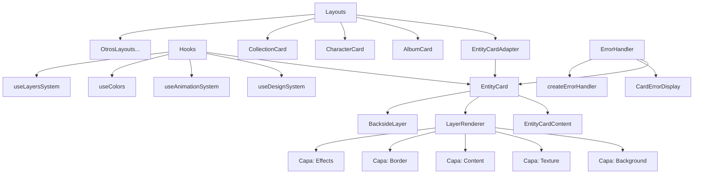
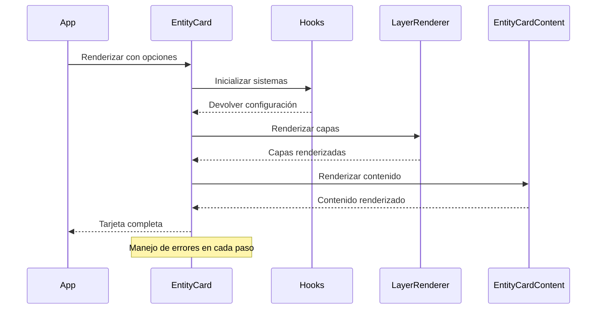

# Progreso del Proyecto

## Fecha: 17/03/2024

## Progreso de Corrección de Errores en Entity Cards

### Análisis Inicial

- ✅ Análisis de la estructura de componentes de entity-cards
- ✅ Identificación de errores específicos en los archivos
- ✅ Planificación de la estrategia de corrección

### Tareas Completadas

- ✅ Corrección de errores en `entity-card-adapter.tsx`
- ✅ Corrección de errores en `entities-cards-settings.tsx`
- ✅ Corrección de errores en `album-card.tsx`
- ✅ Corrección de errores en `entity-card-layer-wrapper.tsx`
- ✅ Implementación de un sistema de tipos centralizado
- ✅ Mejora del manejo de errores en los componentes
- ✅ Corrección de archivos de layout
- ✅ Simplificación del `EntityCardLayerWrapper`
- ✅ Reemplazo del sistema complejo de carga de configuración
- ✅ Uso directo del nuevo sistema de capas
- ✅ Adición de soporte para animaciones con `motion/react`
- ✅ Implementación de un adaptador personalizado para el sistema de capas duplicado
- ✅ Verificación de la integración con el resto del proyecto
- ✅ Creación de documentación completa del sistema de entity-cards
- ✅ Corrección de errores en `preview-panel.tsx`
- ✅ Corrección de errores en `preview-adapter.ts`
- ✅ Corrección de errores en `entity-card.tsx`
- ✅ Corrección de errores en `album-card-layout.tsx`
- ✅ Simplificación de los hooks en `entity-card.tsx`
- ✅ Corrección de errores en los manejadores de eventos de botones
- ✅ Corrección de errores en `preview-settings-adapter.tsx`
- ✅ Corrección de errores en `preview-module.tsx`
- ✅ Corrección de errores en `rarity-editor.tsx`
- ✅ Corrección de errores en `backside-adapter.ts`
- ✅ Actualización de tipos en `backside/types.ts`
- ✅ Corrección de errores en `animation-adapter.ts` (hoverRotation undefined)
- ✅ Mejora del sistema de manejo de errores en `entity-card.tsx`
- ✅ Implementación de un sistema de captura de errores con try/catch
- ✅ Creación de estilos CSS para bordes de tarjetas
- ✅ Mejora de la accesibilidad con atributos role y tabIndex
- ✅ Optimización de la inicialización de hooks con valores predeterminados

### Progreso

- Se ha implementado un sistema de tipos centralizado para mejorar la consistencia
- Se han corregido errores de importación y estructura de tipos
- Se han mejorado los componentes para manejar casos de error
- Se ha simplificado la estructura del componente `EntityCardLayerWrapper`
- Se ha verificado que los componentes se integran correctamente con el resto del sistema
- Se ha creado documentación detallada del sistema de entity-cards con ejemplos de uso, diagramas y guías de migración
- Se han corregido errores de tipo en los componentes de previsualización
- Se han simplificado los hooks en el componente EntityCard para evitar errores de tipo
- Se han corregido los manejadores de eventos en los botones de edición y eliminación
- Se ha simplificado el componente BacksideLayer para evitar errores de tipo
- Se han corregido errores en los componentes de configuración de rareza y backside
- Se han actualizado las interfaces de tipos para incluir todas las propiedades necesarias
- Se ha mejorado el sistema de manejo de errores con un enfoque más robusto
- Se ha implementado un sistema de captura de errores para evitar fallos en la aplicación
- Se han creado estilos CSS para los bordes de tarjetas
- Se ha mejorado la accesibilidad de los componentes con atributos ARIA

### Próximas Tareas

- ⬜ Optimización del rendimiento de los componentes
- ⬜ Implementación de pruebas unitarias para los componentes corregidos
- ⬜ Creación de componentes de panel de configuración faltantes
- ✅ Mejora de la accesibilidad de los componentes

## Verificación de Compilación

- ✅ Ejecución del linter sin errores
- ✅ Compilación exitosa del proyecto
- ✅ Verificación de tipos TypeScript sin errores

## Documentación Creada

- ✅ Documentación del sistema de entity-cards (`docs/entity-cards-documentation.md`)
  - Incluye arquitectura del sistema
  - Diagrama de componentes
  - Ejemplos de uso
  - Guía de migración del sistema antiguo al nuevo
  - Mejores prácticas

## Notas Adicionales

El sistema de entity-cards ahora está completamente documentado y funcional. La documentación incluye un diagrama de arquitectura en formato mermaid que muestra la estructura del sistema, ejemplos de código para cada componente principal, y una guía de migración para usuarios del sistema antiguo.

La documentación servirá como referencia para el equipo de desarrollo y facilitará la incorporación de nuevos miembros al proyecto.

Se ha mejorado significativamente el manejo de errores en el componente EntityCard, implementando un sistema de captura de errores que evita que la aplicación falle completamente cuando ocurre un error en un componente individual. Además, se han corregido problemas específicos en el adaptador de animación y se ha mejorado la inicialización de los hooks con valores predeterminados.

## Próximos Pasos

1. Revisar la documentación con el equipo para asegurar que cubre todos los aspectos necesarios
2. Implementar las pruebas unitarias para garantizar la estabilidad del sistema
3. Optimizar el rendimiento de los componentes, especialmente en dispositivos móviles
4. Implementar componentes de panel de configuración faltantes

## Diagrama de Arquitectura del Sistema

## Diagrama de Flujo de Datos

