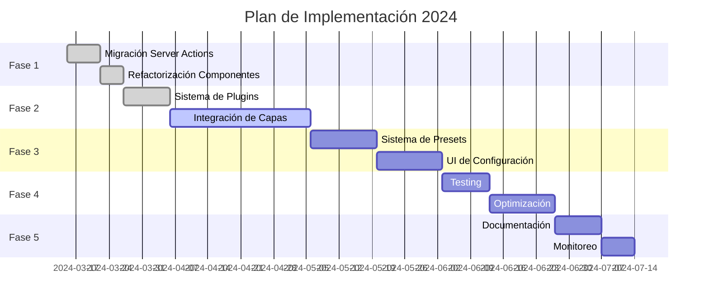
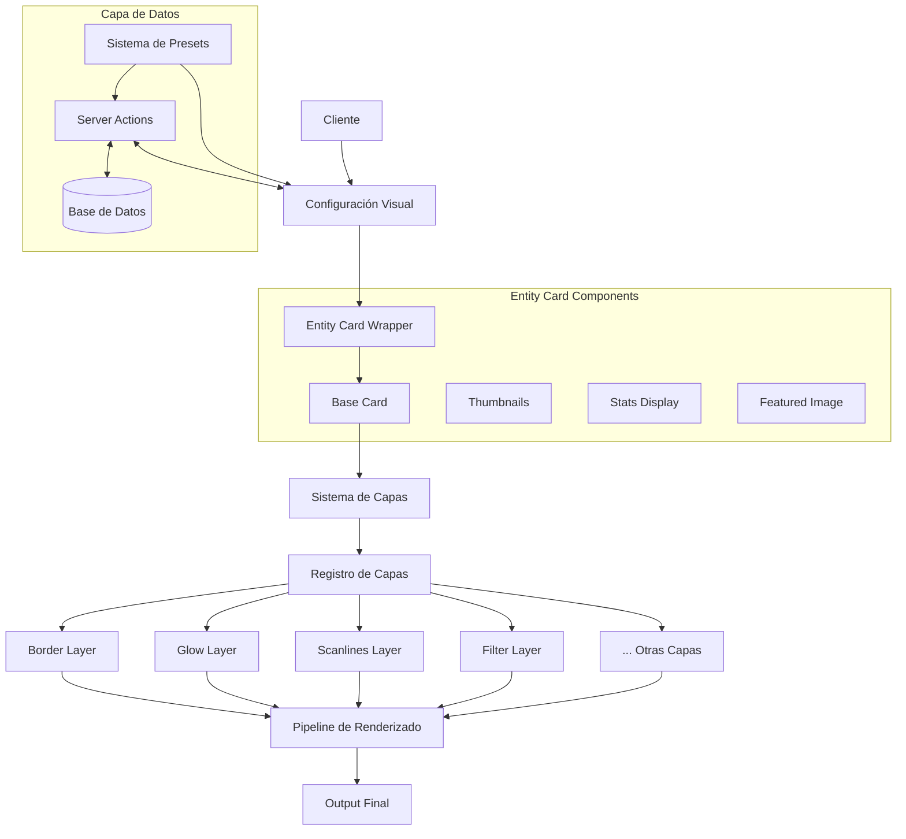

# Plan de Acción: Migración a Server Actions e Integración de Capas

## Fase 1: Migración a Server Actions ✅
- [x] Crear acciones del servidor base
  - [x] Implementar `getVisualConfig.action.ts`
    - [x] Añadir validación con Zod
    - [x] Implementar manejo de errores robusto
    - [x] Añadir tipos TypeScript
  - [x] Implementar `updateVisualConfig.action.ts`
    - [x] Añadir validación con Zod
    - [x] Implementar manejo de errores robusto
    - [x] Añadir tipos TypeScript
  - [x] Implementar `deleteVisualConfig.action.ts`
    - [x] Añadir validación con Zod
    - [x] Implementar manejo de errores robusto
    - [x] Añadir tipos TypeScript
  - [x] Crear schemas centralizados
    - [x] `baseVisualConfigSchema`
    - [x] `entityParamsSchema`
    - [x] `actionResponseSchema`

## Fase 2: Sistema de Capas 🔄
- [x] Implementar sistema de plugins para capas ✅
  - [x] Crear interfaz base para plugins de capas
  - [x] Implementar registro dinámico de plugins
  - [x] Crear sistema de prioridad y orden de capas
  - [x] Implementar `LayerDemo` para previsualización y pruebas

- [ ] Integrar capas existentes
  - [x] Animated Border Layer ✅
    - [x] Crear configuración específica
    - [x] Implementar acciones del servidor
    - [x] Implementar controles de UI
    - [x] Añadir modelo Prisma
    - [x] Optimizar rendimiento
    - [x] Integrar con sistema de plugins

  - [x] Border Layer ✅
    - [x] Crear configuración específica
    - [x] Implementar acciones del servidor
    - [x] Implementar controles de UI
    - [x] Añadir modelo Prisma
    - [x] Optimizar rendimiento
    - [x] Integrar con sistema de plugins

  - [x] Chromatic Aberration Layer ✅
    - [x] Configuración de intensidad y colores
    - [x] Implementar acciones del servidor
    - [x] Implementar controles de UI
    - [x] Añadir modelo Prisma
    - [x] Optimización para WebGL (vía calidad configurable)
    - [x] Integrar con sistema de plugins

  - [x] Filter Layer System ✅
    - [x] Implementar `filter-effect-layer.tsx`
    - [x] Crear acciones del servidor (`filter-config.action.ts`)
      - [x] Crear schema Zod para validación
      - [x] Implementar acciones CRUD
      - [x] Integrar con Prisma
    - [x] Implementar panel de configuración (`filter-settings.tsx`)
      - [x] Añadir controles para tipos de filtros
      - [x] Implementar preview en tiempo real
    - [x] Crear presets de filtros
    - [x] Integrar con sistema de plugins
    - [x] Optimizar rendimiento

  - [x] Glitch Effect Layer ✅
    - [x] Configuración de intensidad y frecuencia
    - [x] Sistema de triggers
    - [x] Optimización de memoria
    - [x] Integrar con sistema de plugins

  - [x] Glow Layer ✅
    - [x] Sistema de colores dinámicos
    - [x] Control de intensidad y radio
    - [x] Optimización de blur
    - [x] Integrar con sistema de plugins

  - [x] Grain Layer ✅
    - [x] Implementar `grain-effect-layer.tsx`
    - [x] Crear acciones del servidor (`grain-config.action.ts`)
    - [x] Implementar panel de configuración (`grain-settings.tsx`)
    - [x] Configuración de densidad y contraste
    - [x] Animación opcional
    - [x] Optimización de textura
    - [x] Integrar con sistema de plugins

  - [x] Holographic Layer ✅
    - [x] Implementar `holographic-effect-layer.tsx`
    - [x] Crear acciones del servidor (`holographic-config.action.ts`)
    - [x] Implementar panel de configuración (`holographic-settings.tsx`)
    - [x] Sistema de colores y patrones
    - [x] Efectos de movimiento
    - [x] Optimización de shaders
    - [x] Integrar con sistema de plugins

  - [ ] Noise Texture Layer 🔄
    - [x] Implementar `noise-texture-layer.tsx`
    - [x] Crear acciones del servidor (`noise-texture-config.action.ts`)
      - [x] Definir esquema de configuración con Zod
      - [x] Implementar CRUD para configuraciones de ruido
      - [x] Añadir soporte para persistencia
    - [x] Implementar panel de configuración (`noise-texture-settings.tsx`)
      - [x] Crear controles para parámetros de ruido
      - [x] Añadir preview en tiempo real
      - [x] Implementar selección de algoritmos de ruido
    - [ ] Generación procedural completa
      - [ ] Implementar algoritmos Perlin y Simplex
      - [ ] Añadir parámetros de octavas y persistencia
    - [ ] Control de seed y escala avanzado
      - [ ] Implementar sistema de semillas personalizables
      - [ ] Crear controles de escala multi-nivel
    - [ ] Caché de texturas
      - [ ] Implementar sistema de memoización
      - [ ] Añadir invalidación selectiva
    - [x] Integrar con sistema de plugins

  - [x] Pattern Layer ✅
    - [x] Implementar `pattern-effect-layer.tsx`
      - [x] Crear estructura base del componente
      - [x] Implementar soporte para diferentes patrones
    - [x] Crear acciones del servidor (`pattern-config.action.ts`)
      - [x] Definir esquema de configuración con Zod
      - [x] Implementar CRUD para patrones
    - [x] Implementar panel de configuración (`pattern-settings.tsx`)
      - [x] Añadir selector de tipos de patrones
      - [x] Implementar controles para cada tipo de patrón
    - [x] Sistema de patrones modulares
      - [x] Implementar patrones: dots, lines, grid, hexagon
      - [x] Crear sistema de combinación de patrones
    - [x] Configuración de escala y rotación
    - [x] Optimización de SVG
    - [x] Integrar con sistema de plugins

  - [ ] Pixelate Layer 🔄
    - [ ] Implementar `pixelate-effect-layer.tsx`
      - [ ] Crear componente base con efecto de pixelado
      - [ ] Implementar soporte para diferentes algoritmos
      - [ ] Añadir métodos de transformación personalizables
    - [ ] Crear acciones del servidor (`pixelate-config.action.ts`)
      - [ ] Definir esquema de configuración
      - [ ] Implementar CRUD para configuraciones
      - [ ] Establecer validaciones específicas para pixelado
    - [ ] Implementar panel de configuración (`pixelate-settings.tsx`)
      - [ ] Añadir controles para resolución y estilo
      - [ ] Implementar preview en tiempo real
      - [ ] Crear selector de algoritmos de pixelado
    - [ ] Control de resolución
      - [ ] Añadir soporte para diferentes niveles de pixelado
      - [ ] Implementar pixelado adaptativo según contenido
      - [ ] Crear sistema de pixelado por zonas
    - [ ] Efectos de transición
      - [ ] Añadir animaciones de entrada/salida
      - [ ] Implementar transiciones entre niveles
      - [ ] Desarrollar efectos de desvanecimiento
    - [ ] Optimización de render
      - [ ] Implementar técnicas de memoización
      - [ ] Optimizar algoritmos de pixelado
    - [ ] Integrar con sistema de plugins
      - [ ] Añadir registro en sistema central
      - [ ] Configurar interacciones con otras capas

  - [x] Scanlines Layer ✅
    - [x] Configuración de intensidad y colores
    - [x] Implementar acciones del servidor
    - [x] Implementar controles de UI
    - [x] Añadir modelo Prisma
    - [x] Optimización de animación
    - [x] Integrar con sistema de plugins

  - [ ] Shader Layer 🔄
    - [ ] Implementar `shader-effect-layer.tsx` completo
      - [ ] Crear componente base con soporte WebGL
      - [ ] Implementar sistema de shaders personalizables
      - [ ] Integrar soporte para shaders GLSL
    - [ ] Crear acciones del servidor (`shader-config.action.ts`)
      - [ ] Definir esquema para configuraciones de shaders
      - [ ] Implementar CRUD para shaders
      - [ ] Añadir validación de shaders
      - [ ] Implementar sistema de versiones
    - [ ] Implementar panel de configuración (`shader-settings.tsx`)
      - [ ] Añadir editor de código para shaders
      - [ ] Implementar preview en tiempo real
      - [ ] Crear controles para parámetros de shader
    - [ ] Sistema de shaders modulares
      - [ ] Crear biblioteca de shaders predefinidos
      - [ ] Implementar sistema de composición de shaders
      - [ ] Desarrollar sistema de fragmentos reutilizables
    - [ ] Hot-reload de shaders
      - [ ] Implementar actualización en tiempo real
      - [ ] Crear sistema de detección de errores
    - [ ] Optimización de WebGL
      - [ ] Implementar técnicas de compilación eficiente
      - [ ] Añadir soporte para fallbacks
    - [ ] Integrar con sistema de plugins
      - [ ] Añadir registro en sistema central
      - [ ] Configurar interacciones con otras capas

- [ ] Actualizar registro de capas
  - [x] Implementar `register-layers.tsx`
  - [x] Registrar capa Glow
  - [x] Registrar capa Border
  - [x] Registrar capas implementadas (Scanlines, Grain, Holographic, etc.)
  - [x] Registrar capa Noise Texture
  - [ ] Registrar resto de capas pendientes (Pixelate, Shader)
  - [ ] Añadir sistema para habilitar/deshabilitar capas globalmente
    - [ ] Implementar panel de administración de capas
    - [ ] Añadir soporte para perfiles de configuración
    - [ ] Crear sistema de prioridad y colisiones

## Fase 3: Sistema de Presets y Configuración 🔄
- [ ] Implementar sistema de presets
  - [ ] Crear estructura de datos para presets
    - [ ] Definir esquema para guardar configuraciones de múltiples capas
    - [ ] Añadir metadatos (nombre, descripción, thumbnail)
    - [ ] Implementar sistema de etiquetas para categorización
  - [ ] Implementar serialización/deserialización
    - [ ] Crear funciones para exportar/importar configuraciones
    - [ ] Añadir validación para configuraciones importadas
    - [ ] Desarrollar sistema de migración entre versiones
  - [ ] Agregar sistema de versiones
    - [ ] Implementar migración automática entre versiones
    - [ ] Añadir compatibilidad hacia atrás
    - [ ] Crear historial de cambios

- [ ] Mejorar UI de configuración
  - [x] Implementar `layer-demo.tsx` para pruebas
  - [ ] Crear interfaz unificada para todas las capas
    - [ ] Desarrollar componente de configuración general
    - [ ] Implementar sistema de tabs para cada capa
    - [ ] Crear sistema de búsqueda y filtrado
  - [ ] Implementar vista previa en tiempo real
    - [ ] Añadir soporte para diferentes tamaños y fondos
    - [ ] Implementar comparativa antes/después
    - [ ] Desarrollar sistema de zoom y foco
  - [ ] Agregar sistema de undo/redo
    - [ ] Implementar historial de cambios
    - [ ] Añadir atajos de teclado
    - [ ] Crear sistema de puntos de guardado

## Fase 4: Optimización y Testing 📋
- [ ] Implementar pruebas
  - [ ] Unit tests para Server Actions
    - [ ] Crear tests para cada acción del servidor
    - [ ] Implementar mocks para Prisma
    - [ ] Añadir cobertura para casos de error
  - [ ] Integration tests para capas
    - [ ] Probar interacción entre capas
    - [ ] Verificar correcta persistencia de configuraciones
    - [ ] Validar comportamiento con múltiples capas activas
  - [ ] E2E tests para UI
    - [ ] Probar flujos completos de usuario
    - [ ] Verificar rendimiento en diferentes navegadores
    - [ ] Validar accesibilidad

- [ ] Optimizar rendimiento
  - [ ] Implementar lazy loading de capas
    - [ ] Cargar componentes bajo demanda
    - [ ] Optimizar carga inicial
    - [ ] Implementar estrategia de priorización
  - [ ] Optimizar bundle size
    - [ ] Reducir dependencias innecesarias
    - [ ] Implementar tree-shaking efectivo
    - [ ] Separar código por rutas
  - [ ] Mejorar caching
    - [ ] Implementar estrategias de cache para configuraciones
    - [ ] Optimizar consultas a la base de datos
    - [ ] Añadir invalidación selectiva
  - [ ] Reducir re-renders innecesarios
    - [ ] Implementar memoización estratégica
    - [ ] Optimizar uso de React Context
    - [ ] Identificar y corregir renders en cascada

## Fase 5: Documentación y Mantenimiento 📋
- [ ] Crear documentación
  - [ ] Guías de desarrollo
    - [ ] Documentar arquitectura del sistema de capas
    - [ ] Crear tutorial para añadir nuevas capas
    - [ ] Añadir ejemplos de implementación
  - [ ] API reference
    - [ ] Documentar interfaces y tipos
    - [ ] Crear ejemplos de uso para cada capa
    - [ ] Añadir diagramas de relaciones
  - [ ] Ejemplos de uso
    - [ ] Crear demos interactivas
    - [ ] Implementar galería de configuraciones
    - [ ] Desarrollar recetas para casos comunes

- [ ] Implementar monitoreo
  - [ ] Agregar métricas de rendimiento
    - [ ] Medir tiempos de carga y renderizado
    - [ ] Implementar tracking de uso de memoria
    - [ ] Monitorizar impacto en FPS
  - [ ] Implementar error tracking
    - [ ] Añadir captura y reporte de errores
    - [ ] Implementar sistema de alertas
    - [ ] Crear sistema de diagnóstico automático
  - [ ] Crear dashboards de análisis
    - [ ] Visualizar métricas clave
    - [ ] Implementar sistema de reportes periódicos
    - [ ] Añadir detección de anomalías

## Estado de Capas de Efectos

| Capa | Estado | Componente | Server Actions | Configuración UI | Optimización | Integración Plugins |
|------|--------|------------|----------------|-----------------|--------------|---------------------|
| Border | ✅ | ✅ | ✅ | ✅ | ✅ | ✅ |
| Scanlines | ✅ | ✅ | ✅ | ✅ | ✅ | ✅ |
| Animated Border | ✅ | ✅ | ✅ | ✅ | ✅ | ✅ |
| Chromatic Aberration | ✅ | ✅ | ✅ | ✅ | ✅ | ✅ |
| Glitch Effect | ✅ | ✅ | ✅ | ✅ | ✅ | ✅ |
| Glow | ✅ | ✅ | ✅ | ✅ | ✅ | ✅ |
| Noise | 🔄 | ✅ | ✅ | ✅ | 🔄 | ✅ |
| Grain | ✅ | ✅ | ✅ | ✅ | ✅ | ✅ |
| Pixelate | 🔄 | 🔄 | 📋 | 📋 | 📋 | 📋 |
| Pattern | ✅ | ✅ | ✅ | ✅ | ✅ | ✅ |
| Filter | ✅ | ✅ | ✅ | ✅ | ✅ | ✅ |
| Shader | 🔄 | 🔄 | 📋 | 📋 | 📋 | 📋 |
| Holographic | ✅ | ✅ | ✅ | ✅ | ✅ | ✅ |

**Leyenda**:
- ✅ Completado
- 🔄 En progreso
- 📋 Pendiente

## Próximos Pasos Prioritarios

1. Completar la implementación de las capas en progreso:
   - Noise Texture Layer:
     - Prioridad: Alta
     - Tareas inmediatas:
       - Implementar algoritmos Perlin y Simplex para generación procedural
       - Desarrollar sistema de control de seed avanzado
       - Implementar caché de texturas para mejorar rendimiento

   - Pixelate Layer:
     - Prioridad: Media
     - Tareas inmediatas:
       - Crear componente base `pixelate-effect-layer.tsx`
       - Implementar server actions en `pixelate-config.action.ts`
       - Desarrollar panel de configuración con controles de resolución

   - Shader Layer:
     - Prioridad: Media
     - Tareas inmediatas:
       - Investigar e implementar soporte básico de WebGL
       - Desarrollar sistema de carga y compilación de shaders GLSL
       - Crear editor de shaders simplificado

2. Integración con Entity Card Base:
   - Prioridad: Alta
   - Tareas inmediatas:
     - Refactorizar `entity-card-base.tsx` para usar el sistema de plugins de capas
     - Desarrollar sistema de gestión de capas dinámico
     - Implementar mecanismo de aplicación de efectos en orden correcto
     - Crear configuración por defecto para cada tipo de entidad

3. Sistema de presets:
   - Prioridad: Media
   - Tareas inmediatas:
     - Diseñar esquema de datos para presets
     - Implementar server actions para gestión de presets
     - Desarrollar selector de presets en UI

4. Optimización de rendimiento:
   - Prioridad: Alta
   - Tareas inmediatas:
     - Identificar y corregir problemas de rendimiento con múltiples capas
     - Implementar estrategia de lazy loading para capas
     - Optimizar reactividad y reducir re-renders

## Planificación Semanal Actualizada

### Semana Actual
- Implementar algoritmos Perlin y Simplex para Noise Texture Layer
- Crear componente base para Pixelate Layer
- Comenzar integración de sistema de capas con entity-card-base

### Semana 2
- Completar Pixelate Layer (componente, server actions, panel de configuración)
- Continuar con la implementación básica de Shader Layer
- Finalizar integración con entity-card-base

### Semana 3
- Desarrollar sistema de presets básico
- Mejorar rendimiento global de las capas
- Comenzar implementación de UI de configuración unificada

### Semana 4
- Finalizar sistema de presets
- Completar UI de configuración
- Iniciar documentación y pruebas básicas

### Próximas tareas para integración con Entity Card
1. Modificar `entity-card-base.tsx` para:
   - Aceptar plugins de capas registrados
   - Aplicar efectos en orden según configuración
   - Gestionar estados y transiciones

2. Actualizar `entity-card-wrapper.tsx` para:
   - Pasar configuraciones de capas al componente base
   - Manejar presets de configuración por tipo de entidad

3. Ajustar `entity-card-components.tsx` para:
   - Asegurar compatibilidad con efectos de capas
   - Optimizar renderizado con múltiples efectos

## Arquitectura del Sistema de Capas

