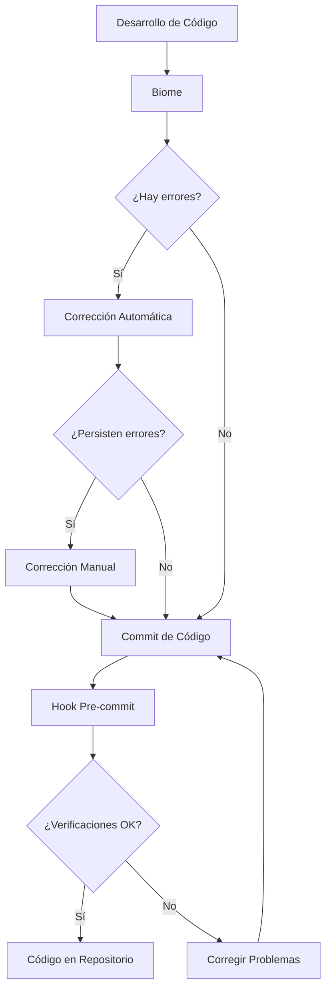

# Mejoras en la Calidad de Código

## Uso de Biome para Mantener la Calidad

El proyecto utiliza **Biome** como herramienta unificada de linting, formateo y comprobaciones de tipo. Toda la configuración necesaria se encuentra en el archivo `biome.json`.

Los scripts principales disponibles son:

```json
"scripts": {
  "lint": "biome lint --max-diagnostics=none .",
  "lint:fix": "biome lint --write .",
  "format": "biome format --write .",
  "check": "biome check --max-diagnostics=none ."
}
```

### Scripts de Corrección Automática

Se ha creado un script especial (`scripts/fix-variable-names.mjs`) para detectar y corregir automáticamente los errores de nombres de variables, especialmente aquellos relacionados con guiones bajos. Este script identifica patrones problemáticos como:

- Referencias a `state` dentro de `produce` cuando el parámetro es `_state`
- Referencias a `emoji` en `onEmojiSelect` cuando el parámetro es `_emoji`
- Referencias a `prev` en `setFormData` cuando el parámetro es `_prev`
- Referencias a `value` en formatters cuando el parámetro es `_value`
- Referencias generales a variables sin guión bajo cuando el parámetro tiene guión bajo

### Hook de Pre-commit

En la actualidad no existe un hook de pre‑commit activo. En versiones anteriores del proyecto se utilizaban scripts personalizados basados en ESLint, pero ahora Biome centraliza todas las verificaciones necesarias.

## Beneficios

- **Prevención de errores**: Las herramientas automatizadas detectan y previenen errores comunes antes de que lleguen al repositorio.
- **Consistencia**: Biome unifica linting y formateo para mantener un estilo de código coherente en todo el proyecto.
- **Flujo de trabajo mejorado**: Los scripts y hooks automatizan tareas tediosas, permitiendo a los desarrolladores centrarse en el código.
- **Detección temprana**: Los problemas se identifican en la fase de desarrollo, no en producción.

## Diagrama de Flujo de Trabajo


