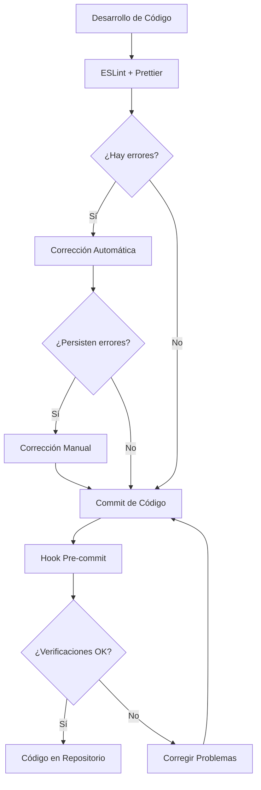

# Mejoras en la Calidad de Código

## Configuración de ESLint y Herramientas de Calidad

### Configuración de ESLint

Se ha implementado una configuración personalizada de ESLint para mejorar la calidad del código y prevenir errores comunes. La configuración se encuentra en el archivo `eslint.config.mjs` y se han añadido reglas específicas para detectar y prevenir el uso incorrecto de variables con guiones bajos.

```javascript
// Configuración de ESLint para detectar problemas de guiones bajos en variables
{
  name: "underscore-problem-detection",
  rules: {
    "no-underscore-var-mismatch": "error", // Regla personalizada
  }
}
```

### Scripts de Corrección Automática

Se ha creado un script especial (`scripts/fix-variable-names.mjs`) para detectar y corregir automáticamente los errores de nombres de variables, especialmente aquellos relacionados con guiones bajos. Este script identifica patrones problemáticos como:

- Referencias a `state` dentro de `produce` cuando el parámetro es `_state`
- Referencias a `emoji` en `onEmojiSelect` cuando el parámetro es `_emoji`
- Referencias a `prev` en `setFormData` cuando el parámetro es `_prev`
- Referencias a `value` en formatters cuando el parámetro es `_value`
- Referencias generales a variables sin guión bajo cuando el parámetro tiene guión bajo

### Hook de Pre-commit

Se ha implementado un hook de pre-commit que ejecuta automáticamente verificaciones de calidad de código antes de cada commit. El hook realiza las siguientes verificaciones:

1. **Verificación de ESLint**: Comprueba que los archivos TypeScript/TSX modificados cumplan con las reglas de ESLint.
2. **Verificación de nombres de variables**: Detecta patrones de nombres de variables problemáticos.
3. **Verificación de console.log**: Advierte sobre la presencia de declaraciones `console.log` en el código.

```bash
# Fragmento del hook pre-commit
echo "${YELLOW}🔍 Verificando patrones de nombres de variables...${NC}"
pnpm lint:vars

if [ $? -ne 0 ]; then
  echo "${RED}❌ Se encontraron variables con nombres problemáticos.${NC}"
  echo "${YELLOW}💡 Corrígelos manualmente o ejecuta 'pnpm lint:vars:fix' para intentar una corrección automática.${NC}"
  exit 1
fi
```

### Scripts en package.json

Se han añadido varios scripts en `package.json` para facilitar la ejecución de las herramientas de calidad de código:

- `lint:vars`: Verifica la presencia de patrones de nombres de variables problemáticos.
- `lint:vars:fix`: Corrige automáticamente los patrones de nombres de variables.
- `lint:fix`: Ejecuta el script de corrección de errores de lint.
- `lint:staged`: Ejecuta ESLint solo en los archivos modificados que están preparados para commit.

```json
"scripts": {
  "lint": "eslint --config eslint.config.mjs .",
  "lint:strict": "eslint --config eslint.config.mjs --max-warnings=0 .",
  "lint:fix": "node scripts/lint-fix.mjs",
  "lint:format": "prettier --write .",
  "lint:full": "pnpm lint:fix && pnpm lint:format",
  "lint:report": "node scripts/lint-report.js",
  "lint:staged": "eslint --config eslint.config.mjs --fix $(git diff --staged --name-only --diff-filter=ACMR | grep -E \"\\.(js|jsx|ts|tsx)$\")",
  "lint:vars": "node scripts/fix-variable-names.mjs --check",
  "lint:vars:fix": "node scripts/fix-variable-names.mjs --fix"
}
```

## Beneficios

- **Prevención de errores**: Las herramientas automatizadas detectan y previenen errores comunes antes de que lleguen al repositorio.
- **Consistencia**: La configuración de ESLint y Prettier asegura un estilo de código coherente en todo el proyecto.
- **Flujo de trabajo mejorado**: Los scripts y hooks automatizan tareas tediosas, permitiendo a los desarrolladores centrarse en el código.
- **Detección temprana**: Los problemas se identifican en la fase de desarrollo, no en producción.

## Diagrama de Flujo de Trabajo


