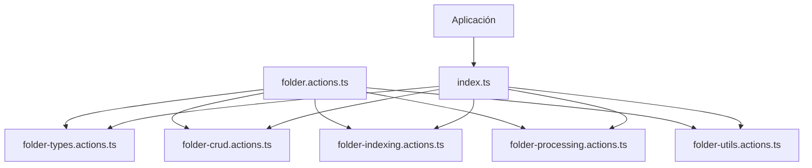
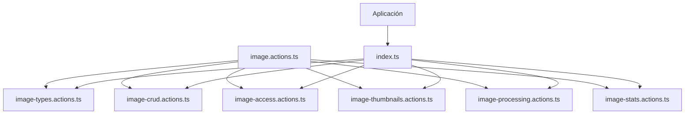
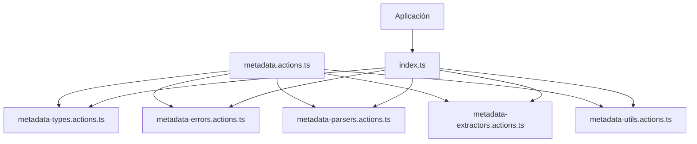

# Refactorización de Acciones en la Aplicación

## Introducción

Este documento describe la refactorización llevada a cabo para mejorar la organización del código en la carpeta `src/app/actions`. El objetivo principal fue descomponer archivos grandes en componentes más pequeños, siguiendo el principio de responsabilidad única.

## Estructura de Carpetas

La estructura resultante después de la refactorización es la siguiente:

```
src/app/actions/
├── folders/
│   ├── folder-crud.actions.ts     # Operaciones CRUD para carpetas
│   ├── folder-indexing.actions.ts # Funciones de indexación
│   ├── folder-processing.actions.ts # Procesamiento de directorios
│   ├── folder-types.actions.ts    # Tipos e interfaces
│   ├── folder-utils.actions.ts    # Funciones de utilidad
│   └── index.ts                  # Exporta todas las funciones
├── images/
│   ├── image-access.actions.ts   # Acceso a imágenes
│   ├── image-crud.actions.ts     # Operaciones CRUD para imágenes
│   ├── image-processing.actions.ts # Procesamiento de imágenes
│   ├── image-stats.actions.ts    # Estadísticas de imágenes
│   ├── image-thumbnails.actions.ts # Funciones de miniaturas
│   ├── image-types.actions.ts    # Tipos e interfaces
│   └── index.ts                  # Exporta todas las funciones
├── metadata/
│   ├── metadata-errors.actions.ts # Clases y códigos de error
│   ├── metadata-extractors.actions.ts # Extractores de metadatos
│   ├── metadata-parsers.actions.ts # Parsers para diferentes formatos
│   ├── metadata-types.actions.ts # Tipos e interfaces
│   ├── metadata-utils.actions.ts # Funciones de utilidad
│   └── index.ts                 # Exporta todas las funciones
└── thumbnails/
    └── thumbnails.actions.ts     # Funciones generales de miniaturas
```

## Convención de Nombramiento

Se ha establecido una convención de nombramiento para todos los archivos de acciones, usando el sufijo `.actions.ts` para indicar claramente que contienen funciones de acción del servidor.

## Relaciones entre Archivos

### Carpetas

La carpeta `folders` contiene acciones relacionadas con la gestión de carpetas. Cada archivo tiene una responsabilidad específica:

- **folder-types.actions.ts**: Define interfaces y tipos.
- **folder-crud.actions.ts**: Implementa operaciones básicas (crear, leer, actualizar, eliminar).
- **folder-indexing.actions.ts**: Maneja la indexación y reindexación de carpetas.
- **folder-processing.actions.ts**: Contiene lógica para procesar directorios y archivos.
- **folder-utils.actions.ts**: Provee funciones de utilidad.

### Imágenes

La carpeta `images` contiene acciones para el manejo de imágenes:

- **image-types.actions.ts**: Define interfaces y tipos.
- **image-crud.actions.ts**: Implementa operaciones CRUD.
- **image-access.actions.ts**: Provee funciones para acceder a imágenes.
- **image-thumbnails.actions.ts**: Maneja la generación y gestión de miniaturas.
- **image-processing.actions.ts**: Contiene funciones para procesar imágenes.
- **image-stats.actions.ts**: Gestiona estadísticas de imágenes.

### Metadata

La carpeta `metadata` contiene acciones para la extracción y procesamiento de metadatos:

- **metadata-types.actions.ts**: Define interfaces y tipos (RetryConfig, ExifTag, etc.)
- **metadata-errors.actions.ts**: Contiene clases de error y códigos específicos
- **metadata-parsers.actions.ts**: Funciones de análisis de metadatos específicas por formato (EXIF, etc.)
- **metadata-extractors.actions.ts**: Funciones principales para extraer metadatos y gestionar caché
- **metadata-utils.actions.ts**: Funciones utilitarias como retry, conversión de formatos, etc.

### Miniaturas

La carpeta `thumbnails` contiene acciones generales para miniaturas que no están directamente relacionadas con entidades de imágenes específicas.

## Importación y Uso

Todos los módulos exportan sus funciones a través de un archivo `index.ts`, lo que permite importar desde la carpeta principal:

```typescript
// Antes
import { getFolders } from '@/app/actions/folders/folder.actions';

// Después
import { getFolders } from '@/app/actions/folders';
```

## Diagramas

### Estructura de Folders



### Estructura de Images



### Estructura de Metadata



## Beneficios

Esta refactorización proporciona varios beneficios:

1. **Mejor organización**: Cada archivo tiene una responsabilidad clara.
2. **Mayor mantenibilidad**: Es más fácil entender y modificar archivos más pequeños.
3. **Mejor escalabilidad**: Facilita la adición de nuevas funcionalidades.
4. **Mejor rendimiento de desarrollo**: Mejora la navegación y reduce los conflictos en control de versiones.

## Conclusión

La refactorización ha mejorado significativamente la estructura del código, haciendo que sea más fácil de mantener y entender. Se recomienda seguir este patrón para futuras ampliaciones de la aplicación.