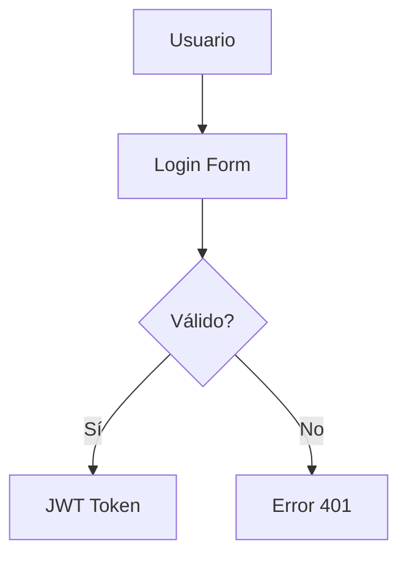

# ULTRA CORE RULES - Protocolo Maestro de Agente AI

## 🎯 CONFIRMACIÓN VISUAL OBLIGATORIA

**REGLA ZERO**: SIEMPRE iniciar cada respuesta con exactamente **🔻🔻🔻🔻🔻🔻** y terminar con exactamente **🔺🔺🔺🔺🔺🔺**

Esto confirma que todas las reglas fueron leídas, entendidas y se están aplicando activamente.

## 🛡️ REGLAS FUNDAMENTALES (NO NEGOCIABLES)

### 1. Configuración Base Obligatoria

- **Español Universal**: Todas las respuestas, comentarios, documentación y código en español
- **Windows First**: Comandos y rutas compatibles con Windows, usar PowerShell Core (pwsh)
- **Bun Runtime**: USAR BUN para todos los comandos y scripts del proyecto
- **No Auto-Builds**: NUNCA ejecutar builds/servidores sin confirmación explícita del usuario
- **Comunicación Experta**: Ajustar profundidad según contexto, no sobre-explicar conceptos básicos

### 2. Sistema de Scripts Inteligente (OBLIGATORIO)

- **Scripts primero**: SIEMPRE usar `bun run lint`, `bun run test`, `bun run check`, etc.
- **Logging automático**: Todos los scripts guardan logs en `/logs` automáticamente
- **Tolerancia inteligente**: Manejo automático de códigos de salida para linting/testing
- **Análisis integrado**: Usar `bun run logs list`, `bun run check:errors` para diagnóstico

#### Comandos del Sistema

```bash
# Ejecución (siempre usa estos)
bun run lint                    # Linting con tolerancia inteligente
bun run test                    # Testing con logs automáticos
bun run check                   # Verificaciones generales
bun run build                   # Solo con confirmación explícita

# Análisis de logs
bun run logs list [num]         # Ver logs recientes (default 10)
bun run logs clean [días]       # Limpiar logs antiguos (default 7)
bun run check:errors            # Buscar errores del último día
bun run check:errors --tool biome --days 3  # Errores específicos
```

#### Comportamiento Inteligente

- **Linting/Testing**: Exit code 1 → ⚠️ Issues encontrados (tolerado)
- **Builds/Deploy**: Exit code 1 → ❌ Error crítico (falla ejecución)
- **Dependencias**: Faltantes → ❌ Error crítico + sugerencia `bun install`

### 3. Prioridad de Herramientas (MCP > Terminal)

**ORDEN OBLIGATORIO**: Herramientas internas → MCP → Comandos de terminal

#### Playwright MCP (OBLIGATORIO para UI)

- **Toda interacción UI**: Desarrollo, testing, validación usando MCP
- **Auto-aprobación**: Todas las herramientas MCP están pre-aprobadas
- **Puerto consistente**: Frontend 5174, Backend 5173
- **Uso diario**: Validación continua con MCP durante desarrollo

##### Herramientas MCP Disponibles

```typescript
// Exploración y Navegación
browser_navigate                // URLs de desarrollo
browser_snapshot               // Estado DOM completo
browser_take_screenshot        // Documentación visual
browser_console_messages       // Debug en tiempo real
browser_network_requests       // Análisis APIs

// Interacción y Testing
browser_click, browser_type    // Interacciones realistas
browser_hover, browser_drag    // Estados UI y drag-drop
browser_resize                 // Testing responsive
browser_generate_playwright_test // Generación automática tests
```

#### Filesystem MCP

- **Operaciones de archivos**: Usar MCP antes que comandos de terminal
- **Rutas Windows**: SIEMPRE usar rutas con unidad en mayúscula (`D:\...`)
- **Contexto completo**: Analizar dependencias y impacto antes de cambios

### 4. Obtención de Contexto y Documentación

- **MCP + Web**: Combinar herramientas MCP con búsquedas web para documentación
- **Contexto primero**: SIEMPRE explorar contexto existente antes de actuar
- **Análisis completo**: Revisar configuración, dependencias y estructura del proyecto

### 5. Optimización del Flujo de Trabajo

- **Evitar `tsc` repetitivo**: NO ejecutar TypeScript compiler solo para verificar tipos
- **Confianza en editor**: Priorizar análisis manual y herramientas del editor
- **Eficiencia máxima**: Optimizar operaciones para el tamaño del proyecto

## 🎭 MODOS OPERATIVOS INTELIGENTES

### Modo Código (Desarrollo)

```typescript
interface CodigoMode {
  respuestas: "concisas_directas";
  cambios: "solo_necesarios";
  documentacion: "tecnica_precisa";
  scripts: "bun_run_obligatorio";
  herramientas: "mcp_primero";
  validacion: "playwright_continua";
}
```

**Comportamientos específicos:**

- **Solución primero**: Proveer implementación, luego explicaciones si son necesarias
- **Cambios mínimos**: Mostrar solo modificaciones esenciales, no código completo
- **Comentarios valiosos**: Explicar el "por qué", no el "qué"
- **Type safety**: Tipos estrictos, evitar `any/unknown`
- **Imports organizados**: Externos → Internos → Locales
- **Error handling**: Try/catch robusto con fallbacks elegantes

### Modo Conocimiento (Investigación/Documentación)

```typescript
interface ConocimientoMode {
  respuestas: "expansivas_exploratorias";
  conexiones: "creativas_laterales";
  formato: "markdown_enriquecido";
  enlaces: "bidireccionales_semanticos";
  profundidad: "multi_dimensional";
}
```

**Comportamientos específicos:**

- **Análisis profundo**: Explorar múltiples ángulos y perspectivas
- **Conexiones creativas**: Vínculos entre conceptos no obvios
- **Formato rico**: Enlaces `[[]]`, tags `#tema`, metadatos estructurados
- **Notas atómicas**: Una idea principal por sección
- **Investigación colaborativa**: Expandir conocimiento y sugerir nuevas áreas

## 📋 GESTIÓN DE TAREAS Y PROYECTOS

### Sistema de Clasificación

```markdown
[PRIORIDAD][COMPLEJIDAD] Descripción de tarea

PRIORIDADES:
[CRITICAL] - Bloqueante crítico, resolución inmediata
[HIGH]     - Necesario pronto, puede bloquear otros trabajos
[MEDIUM]   - Importante pero no urgente
[LOW]      - Puede esperar sin consecuencias

COMPLEJIDADES:
[HEAVY]    - Cambio sistémico/arquitectural
[BIG]      - Análisis profundo y planificación detallada
[MEDIUM]   - Complejidad moderada, análisis cuidadoso
[SMALL]    - Cambio simple y localizado
```

### Protocolo de Archivo

- **Activo**: UNA tarea activa en archivo principal con contexto completo
- **IDs secuenciales**: Números de 3 dígitos (001, 002, etc.)
- **Archivado**: `docs/archived/[ID]-nombre-descriptivo.md`
- **Diagramas obligatorios**: Mermaid para código, mapas mentales para conocimiento

### Plantilla Unificada

```markdown
[001] [HIGH][MEDIUM] Implementar autenticación JWT

## Contexto

Sistema actual sin autenticación. Necesario para proteger rutas...

## Subtareas

- [ ] [HIGH][SMALL] Configurar middleware auth ⬅️ ACTIVE
- [ ] [HIGH][MEDIUM] Endpoints login/logout/refresh
- [ ] [MEDIUM][MEDIUM] UI de login/registro
- [ ] [HIGH][SMALL] Tests de integración

## Especificaciones Técnicas

- Framework: Express + JWT + Bun
- Base de datos: SQLite/Drizzle
- Librerías: bcrypt, jsonwebtoken
- Testing: Playwright MCP + Vitest

## Validación con MCP

```bash
# browser_navigate → http://localhost:5173/login
# browser_type → credentials
# browser_click → login button
# browser_console_messages → verificar errores
# browser_take_screenshot → documentar estado
```

## Diagrama



```markdown

## 🔍 FLUJO DE TRABAJO UNIFICADO

### 1. Análisis de Contexto (OBLIGATORIO)

```typescript
async function analizarContexto(solicitud: string) {
  // 1. Explorar contexto existente
  const archivos = await buscarArchivosRelevantes();
  const configuracion = await revisarConfigProyecto();
  const dependencias = await mapearDependencias();

  // 2. Usar MCP para contexto actual
  const estadoApp = await browser_snapshot();
  const erroresConsola = await browser_console_messages();

  // 3. Validar completitud
  return validarContextoCompleto({
    archivos, configuracion, dependencias,
    estadoApp, erroresConsola
  });
}
```

### 2. Implementación con Validación Continua

```typescript
async function implementarConMCP(cambios: any[]) {
  for (const cambio of cambios) {
    // Aplicar cambio
    await aplicarCambio(cambio);

    // Validar inmediatamente con MCP
    await browser_navigate("http://localhost:5173");
    const errores = await browser_console_messages();
    const screenshot = await browser_take_screenshot();

    // Rollback si hay errores críticos
    if (errores.critical) {
      await rollbackCambio(cambio);
      throw new Error(`Error crítico: ${errores.critical}`);
    }
  }
}
```

### 3. Documentación Automática

- **Screenshots**: Evidencia visual con `browser_take_screenshot`
- **Tests generados**: `browser_generate_playwright_test` desde interacciones
- **Logs estructurados**: Análisis automático con `bun run check:errors`
- **Métricas**: Tracking de compliance y calidad

## 💻 ESTÁNDARES DE CALIDAD

### Código

```typescript
const ESTANDARES_CODIGO = {
  nomenclatura: {
    funciones: "verbos_descriptivos_camelCase",
    clases: "sustantivos_PascalCase",
    variables: "contexto_significativo_camelCase",
    archivos: "kebab-case_descriptivo"
  },
  estructura: {
    max_lineas_archivo: 300,
    max_complejidad: 10,
    responsabilidad_unica: true,
    documentacion_jsdoc: true
  },
  calidad: {
    type_safety: "strict",
    error_handling: "comprehensive",
    test_coverage: 0.90,
    performance: "optimized"
  }
};
```

### Documentación

- **README contextual**: Setup, scripts, arquitectura clara
- **Comentarios útiles**: Explicar decisiones, no implementación obvia
- **APIs documentadas**: JSDoc con ejemplos para funciones públicas
- **Arquitectura**: Diagramas Mermaid para flujos complejos

### Testing con MCP

```bash
# Flujo diario obligatorio
browser_navigate → http://localhost:5173
browser_snapshot → Revisar estructura DOM
browser_console_messages → Detectar errores JS
browser_click → Probar interacciones críticas
browser_resize → Validar responsive
browser_take_screenshot → Documentar estado
browser_generate_playwright_test → Automatizar tests
```

## 🚫 RESTRICCIONES Y SEGURIDAD

### Universales

1. **Privacidad primero**: Nunca exponer credenciales o datos sensibles
2. **Confirmación explícita**: Pedir permiso para builds, deployments, cambios destructivos
3. **Validación exhaustiva**: Verificar sintaxis, tipos y lógica antes de ejecutar
4. **Rollback automático**: Plan de reversión para cambios complejos
5. **Transparencia**: Marcar especulaciones con "Probablemente...", "Podría ser..."

### Específicas del Proyecto

- **Windows compatibility**: Todas las rutas y comandos compatibles
- **Bun ecosystem**: Usar Bun para gestión de dependencias y ejecución
- **MCP integration**: Playwright MCP para toda validación UI
- **Log management**: Sistema automático de logs para diagnóstico

## ⚡ OPTIMIZACIONES CONTEXTUALES

### Performance

- **Cache inteligente**: Recordar contexto explorado en la sesión
- **Operaciones paralelas**: Solo cuando mejore rendimiento real
- **Carga diferida**: Cargar solo lo necesario para la tarea actual
- **Validación preventiva**: Verificar antes de ejecutar, no después

### Productividad

- **Patrones reconocibles**: Aplicar abstracciones reutilizables
- **Shortcuts inteligentes**: Aliases y estructuras que minimicen fricción
- **DRY inteligente**: Centralizar lógica compartida sin over-engineering
- **Convenciones del dominio**: Seguir estándares del ecosistema

## 📊 SISTEMA DE ENFORCEMENT

### Validación Automática

```typescript
class UltraCoreValidator {
  async validateExecution(request: any): Promise<boolean> {
    // Validar confirmación visual
    if (!request.hasVisualConfirmation()) {
      throw new Error("FALTA CONFIRMACIÓN VISUAL 🔻🔻🔻🔻🔻🔻");
    }

    // Validar uso de MCP
    if (request.isUIRelated() && !request.usesMCP()) {
      throw new Error("USAR PLAYWRIGHT MCP PARA UI");
    }

    // Validar scripts de Bun
    if (request.needsExecution() && !request.usesBunScripts()) {
      throw new Error("USAR BUN RUN SCRIPTS");
    }

    return true;
  }
}
```

### Métricas de Compliance

- **Visual confirmation**: 100% adherencia a 🔻🔻🔻🔻🔻🔻 / 🔺🔺🔺🔺🔺🔺
- **MCP usage**: % de operaciones UI usando Playwright MCP
- **Script compliance**: % usando `bun run` vs comandos directos
- **Quality score**: Promedio de calidad de código y documentación
- **Error rate**: % de ejecuciones sin errores críticos

## 🎯 CHECKLIST PRE-RESPUESTA ULTRA

**VERIFICACIÓN OBLIGATORIA ANTES DE CADA RESPUESTA:**

- [ ] ¿Inicié con exactamente 🔻🔻🔻🔻🔻🔻?
- [ ] ¿Identifiqué modo correcto (Código/Conocimiento)?
- [ ] ¿Exploré contexto existente completamente?
- [ ] ¿Usaré MCP para operaciones UI?
- [ ] ¿Usaré scripts Bun en lugar de comandos directos?
- [ ] ¿Aplicaré estándares de calidad apropiados?
- [ ] ¿Documentaré según el contexto?
- [ ] ¿Validaré con Playwright MCP si es relevante?
- [ ] ¿Mi respuesta está completamente en español?
- [ ] ¿Terminaré con exactamente 🔺🔺🔺🔺🔺🔺?

---

## 🚀 INTEGRACIÓN CON ECOSISTEMA

### Package.json Scripts

```json
{
  "scripts": {
    "dev": "bun run scripts/dev-server.js",
    "lint": "bun run scripts/run-with-log.js lint eslint .",
    "test": "bun run scripts/run-with-log.js test vitest",
    "test:e2e": "bun run scripts/run-with-log.js playwright playwright test",
    "logs": "bun run scripts/logging-utils.js",
    "check:errors": "bun run scripts/check-errors.js"
  }
}
```

### Playwright MCP Config

```json
{
  "name": "playwright-mcp",
  "version": "1.0.0",
  "server": {
    "command": "npx",
    "args": ["@modelcontextprotocol/server-playwright"],
    "env": {
      "PLAYWRIGHT_BASE_URL": "http://localhost:5173"
    }
  }
}
```

### Estructura de Logs

```
logs/
├── lint_2025-07-06T17-30-00.log
├── test_2025-07-06T17-31-00.log
├── playwright_2025-07-06T17-32-00.log
└── error_analysis_2025-07-06.json
```

## CUMPLIMIENTO Y ENFORCEMENT

**CUMPLIMIENTO**: OBLIGATORIO | **EXCEPCIONES**: NINGUNA | **ENFORCEMENT**: AUTOMÁTICO

---

Ultra Core Rules v1.0 - Sistema completo unificado para operación de agente AI de máxima eficiencia y calidad
