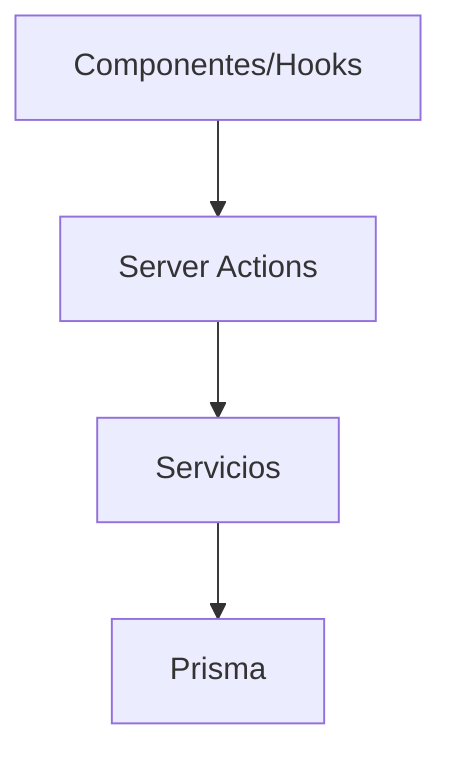

# Guía de Server Actions

Las Server Actions actúan como puente entre los componentes de React y la capa de servicios. Todas residen en `src/app/actions` y siguen el patrón `use server` de Next.js.

A continuación se listan las acciones disponibles en cada carpeta.

## activity
- `cleanupOldActivities`
- `createActivity`
- `deleteActivity`
- `getActivitiesByImage`
- `getActivitiesByType`
- `getActivityById`
- `getFilteredActivities`
- `getRecentActivities`
- `logActivity`

## albums
- `addImageToAlbum`
- `addImagesToAlbum`
- `createAlbum`
- `deleteAlbum`
- `getAlbum`
- `getAlbumImages`
- `getAlbums`
- `removeImageFromAlbum`
- `removeImagesFromAlbum`
- `updateAlbum`

## characters
- `addCharacterImage`
- `createCharacter`
- `deleteCharacter`
- `getCharacterById`
- `getCharacterImages`
- `getCharacterStats`
- `getCharacters`
- `removeCharacterImage`
- `updateCharacter`

## collections
- `addCollectionToImage`
- `addImageToCollection`
- `createCollection`
- `deleteCollection`
- `getCollection`
- `getCollectionImages`
- `getCollections`
- `removeCollectionFromImage`
- `removeImageFromCollection`
- `updateCollection`

## concepts
- `addConceptImage`
- `createConcept`
- `deleteConcept`
- `getConcept`
- `getConceptImages`
- `getConceptWithRelations`
- `getConcepts`
- `linkEntityToConcept`
- `removeConceptImage`
- `unlinkEntityFromConcept`
- `updateConcept`

## folders
- `createFolder`
- `deleteFolder`
- `updateFolder`
- `updateFolderAutoReindex`
- `getFoldersStats`
- `getFolderTree`
- `revalidateFolderRoutes`
- `searchFolders`
- `getFolderById`
- `getFolders`
- `getFoldersWithFilter`
- `indexFolder`
- `indexFolderThrottled`
- `indexMultipleFolders`
- `reindexAllFoldersInSystem as reindexAllFolders`
- `reindexAutoFolders`
- `reindexFolder`
- `reindexFolderThrottled`
- `repairFolder`
- `validateFolderPath`
- `analyzeFolderHealth`
- `checkFolderConsistency`
- `getDuplicateFiles`
- `getOrphanedImages`
- `getRecentFolderImages`
- `getFolderImages`
- `getFolderIndexingStats`
- `getFolderStats`
- `getFolderStatsById`
- `getFolderStorageStats`
- `revalidateFolderStats`

## groups
- `createGroup`
- `deleteGroup`
- `getGroup`
- `getGroups`
- `toggleGroupFavorite`
- `updateGroup`

## images
- `createImageAction`
- `deleteImageAction`
- `generateThumbnail`
- `getImageUrl`
- `getLatestFolderImagesAction`
- `getOriginalImage`
- `getRandomImagesForEntityAction`
- `getThumbnail`
- `processImageAction`
- `setImageFavoriteAction`
- `updateImageAction`

## metadata
- `clearMetadataCache`
- `createMetadataError`
- `extractMetadata`
- `getAIGenerationInfo`
- `getImageFormat`
- `getImageMetadata`
- `getImageMetadataById`
- `isSupportedImageFormat`
- `parseExifData`
- `parseMetadataString`
- `parseSharpMetadata`
- `withRetry`

## notes
- `addImageToNote`
- `createNote`
- `deleteNote`
- `getNote`
- `getNoteImages`
- `getNotes`
- `removeImageFromNote`
- `updateNote`

## places
- `addImageToPlace`
- `createPlace`
- `deletePlace`
- `getPlace`
- `getPlaceImages`
- `getPlaces`
- `removeImageFromPlace`
- `updatePlace`

## profiles
- `activateProfile`
- `createProfile`
- `deleteProfile`
- `getActiveProfile`
- `getProfile`
- `getProfiles`
- `updateProfile`

## prompts
- `addImageToPrompt`
- `createPrompt`
- `deletePrompt`
- `getPrompt`
- `getPromptImages`
- `getPromptWithRelations`
- `getPrompts`
- `linkEntityToPrompt`
- `unlinkEntityFromPrompt`
- `updatePrompt`

## properties
- `createProperty`
- `deleteProperty`
- `getProperties`
- `getProperty`
- `togglePropertyFavorite`
- `updateProperty`

## queue
- `cancelJob`
- `createJob`
- `deleteJob`
- `getJob`
- `getJobs`
- `getQueueStats`
- `getQueueStatus`
- `pauseQueue`
- `processJob`
- `resumeQueue`
- `retryJob`
- `startQueue`
- `stopQueue`
- `updateJob`

## system
- `createDefaultSettingsData`
- `createSystemError`
- `getProfileSettings`
- `getSystemSettings`
- `getSystemStats`
- `getSystemVersion`
- `initServer`
- `repairSystem`
- `resetDatabase`
- `resetProfileSettings`
- `resetSystemSettings`
- `updateProfileSettings`
- `updateSystemSettings`

## tags
- `addImageToTag`
- `assignTagToImages`
- `createTagAction`
- `deleteTagAction`
- `getSuggestedTags`
- `getTagByIdAction`
- `getTagsAction`
- `removeTagFromImages`
- `searchTagsAction`
- `updateImageTags`
- `updateTagAction`

## tasks
- `cancelTask`
- `createTask`
- `deleteTask`
- `getPendingTasks`
- `getTaskById`
- `getTaskCounts`
- `getTaskStats`
- `getTasks`
- `pauseTask`
- `processNextTask`
- `processTaskById`
- `resumeTask`
- `startTask`
- `updateTask`

## videos
- `createVideo`
- `deleteVideo`
- `findVideos`
- `getVideo`
- `getVideoStats`
- `moveVideoToFolder`
- `setVideoVisibility`
- `toggleVideoFavorite`
- `updateVideo`

## wildcards
- `addImageToWildcard`
- `createWildcard`
- `deleteWildcard`
- `getRootWildcards`
- `getWildcard`
- `getWildcardImages`
- `getWildcards`
- `removeImageFromWildcard`
- `updateWildcard`

## debug
- `getSystemStats`
- `getAppStats`

## favorites
- `addToFavorites`
- `removeFromFavorites`
- `getFavorites`
- `isFavorited`
- `toggleFavorite`
- `getFavoriteStats`
- `createFavorite`

## files
- `getFileInfo`
- `deleteFile`
- `getFileAsDataUrl`
- `getDirectoryInfo`
- `createDirectory`
- `renameFile`
- `copyFile`
- `moveFile`

## search
- `searchImages`

## stats
- `getSystemStats`
- `getStats`
- `invalidateStats`
- `getImageStats`
- `incrementImageView`
- `incrementImageDownload`

## thumbnails
- `getThumbnail`
- `optimizeThumbnails`
- `reprocessThumbnails`
- `cleanThumbnails`
- `getLastProcessedThumbnails`
- `getThumbnailStats`
- `verifySignedToken`

## uploaded-images
- `uploadImages`
- `getUploadedImages`
- `deleteUploadedImage`
- `getUploadedImageStats`

## visual-config
- `getCharacterVisualConfig`
- `getPlaceVisualConfig`
- `getWorldItemVisualConfig`

## world-items
- `getWorldItems`
- `getWorldItemById`
- `createWorldItem`
- `updateWorldItem`
- `deleteWorldItem`
- `getWorldItemImages`
- `addImageToWorldItem`
- `removeImageFromWorldItem`
