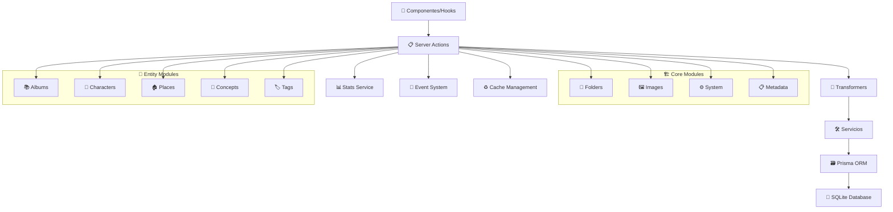

# 📋 Guía Completa de Server Actions

Las Server Actions actúan como puente entre los componentes de React y la capa de servicios. Todas residen en `src/app/actions` y siguen el patrón `use server` de Next.js para ejecución en el servidor.

## 🌊 Arquitectura General

## 📚 Módulos Documentados Completamente

### 🔴 **Core del Sistema** ✅

#### 📁 [Folders Actions](../src/app/actions/folders/README.md)

**Núcleo del sistema** - Gestión de carpetas, indexación y sincronización con filesystem.

#### 🖼️ [Images Actions](../src/app/actions/images/README.md)

**Procesamiento de imágenes** - Gestión completa de contenido multimedia.

#### ⚙️ [System Actions](../src/app/actions/system/README.md)

**Configuración y mantenimiento** - Gestión global del sistema.

#### 📚 [Albums Actions](../src/app/actions/albums/README.md)

**Gestión de álbumes** - Organización de imágenes en colecciones.

#### 📋 [Metadata Actions](../src/app/actions/metadata/README.md)

**Extracción de metadatos** - Procesamiento de datos EXIF, IA y técnicos.

### 🟡 **Entidades Principales** ✅

#### 🏷️ [Tags Actions](../src/app/actions/tags/README.md)

**Sistema de etiquetado** - Etiquetado inteligente con IA y búsqueda avanzada.

#### 👤 [Characters Actions](../src/app/actions/characters/README.md)

**Gestión de personajes** - Perfiles de personas en imágenes con analytics.

#### 🏠 [Places Actions](../src/app/actions/places/README.md)

**Ubicaciones geográficas** - Gestión de lugares con GPS y mapas.

## 📋 Listado Completo por Módulo

A continuación se listan las acciones disponibles en cada carpeta:

### activity

- `cleanupOldActivities` - Limpia actividades antiguas del sistema
- `createActivity` - Registra nueva actividad en el log
- `deleteActivity` - Elimina actividad específica
- `getActivitiesByImage` - Obtiene actividades de una imagen
- `getActivitiesByType` - Filtra actividades por tipo
- `getActivityById` - Obtiene actividad específica por ID
- `getFilteredActivities` - Aplica filtros complejos a actividades
- `getRecentActivities` - Obtiene actividades recientes
- `logActivity` - Registra actividad con contexto completo

### albums ✅ **[Documentado](../src/app/actions/albums/README.md)**

- `addImageToAlbum` - Asocia imagen a álbum
- `addImagesToAlbum` - Asocia múltiples imágenes en batch
- `createAlbum` - Crea nuevo álbum
- `deleteAlbum` - Elimina álbum del sistema
- `getAlbum` - Obtiene álbum específico
- `getAlbumImages` - Obtiene imágenes de un álbum
- `getAlbums` - Lista todos los álbumes con estadísticas
- `removeImageFromAlbum` - Desasocia imagen de álbum
- `removeImagesFromAlbum` - Desasocia múltiples imágenes
- `updateAlbum` - Actualiza metadatos de álbum

### characters

- `addCharacterImage` - Asocia imagen a personaje
- `createCharacter` - Crea nuevo personaje
- `deleteCharacter` - Elimina personaje
- `getCharacterById` - Obtiene personaje específico
- `getCharacterImages` - Obtiene imágenes de personaje
- `getCharacterStats` - Estadísticas de personaje
- `getCharacters` - Lista todos los personajes
- `removeCharacterImage` - Desasocia imagen de personaje
- `updateCharacter` - Actualiza datos de personaje

### collections

- `addCollectionToImage` - Asocia colección a imagen
- `addImageToCollection` - Asocia imagen a colección
- `createCollection` - Crea nueva colección
- `deleteCollection` - Elimina colección
- `getCollection` - Obtiene colección específica
- `getCollectionImages` - Obtiene imágenes de colección
- `getCollections` - Lista todas las colecciones
- `removeCollectionFromImage` - Desasocia colección de imagen
- `removeImageFromCollection` - Desasocia imagen de colección
- `updateCollection` - Actualiza metadatos de colección

### concepts

- `addConceptImage` - Asocia imagen a concepto
- `createConcept` - Crea nuevo concepto
- `deleteConcept` - Elimina concepto
- `getConcept` - Obtiene concepto específico
- `getConceptImages` - Obtiene imágenes de concepto
- `getConceptWithRelations` - Obtiene concepto con relaciones
- `getConcepts` - Lista todos los conceptos
- `linkEntityToConcept` - Vincula entidad a concepto
- `removeConceptImage` - Desasocia imagen de concepto
- `unlinkEntityFromConcept` - Desvincula entidad de concepto
- `updateConcept` - Actualiza datos de concepto

### debug

- `getSystemStats` - Estadísticas para debugging
- `getAppStats` - Estadísticas de la aplicación

### favorites

- `addToFavorites` - Agrega item a favoritos
- `removeFromFavorites` - Remueve item de favoritos
- `getFavorites` - Obtiene lista de favoritos
- `isFavorited` - Verifica si item es favorito
- `toggleFavorite` - Cambia estado de favorito
- `getFavoriteStats` - Estadísticas de favoritos
- `createFavorite` - Crea nuevo favorito

### files

- `getFileInfo` - Obtiene información de archivo
- `deleteFile` - Elimina archivo del sistema
- `getFileAsDataUrl` - Convierte archivo a Data URL
- `getDirectoryInfo` - Información de directorio
- `createDirectory` - Crea nuevo directorio
- `renameFile` - Renombra archivo
- `copyFile` - Copia archivo
- `moveFile` - Mueve archivo

### folders ✅ **[Documentado](../src/app/actions/folders/README.md)**

- `createFolder` - Crea nueva carpeta en sistema
- `deleteFolder` - Elimina carpeta y contenido
- `updateFolder` - Actualiza metadatos de carpeta
- `updateFolderAutoReindex` - Configura reindexado automático
- `getFoldersStats` - Estadísticas globales de carpetas
- `getFolderTree` - Estructura jerárquica de carpetas
- `revalidateFolderRoutes` - Revalida cache de rutas
- `searchFolders` - Búsqueda textual en carpetas
- `getFolderById` - Obtiene carpeta específica
- `getFolders` - Lista todas las carpetas
- `getFoldersWithFilter` - Aplica filtros a carpetas
- `indexFolder` - Indexa contenido de carpeta
- `indexFolderThrottled` - Indexación con throttling
- `indexMultipleFolders` - Indexa múltiples carpetas
- `reindexAllFoldersInSystem` - Reindexación global
- `reindexAutoFolders` - Reindexación automática
- `reindexFolder` - Reindexación forzada
- `reindexFolderThrottled` - Reindexación con throttling
- `repairFolder` - Repara inconsistencias
- `validateFolderPath` - Valida ruta de carpeta
- `analyzeFolderHealth` - Análisis de salud
- `checkFolderConsistency` - Verifica consistencia
- `getDuplicateFiles` - Encuentra archivos duplicados
- `getOrphanedImages` - Encuentra imágenes huérfanas
- `getRecentFolderImages` - Imágenes recientes
- `getFolderImages` - Todas las imágenes de carpeta
- `getFolderIndexingStats` - Stats de indexación
- `getFolderStats` - Estadísticas de carpeta
- `getFolderStatsById` - Stats por ID de carpeta
- `getFolderStorageStats` - Stats de almacenamiento
- `revalidateFolderStats` - Revalida cache de stats

### groups

- `createGroup` - Crea nuevo grupo
- `deleteGroup` - Elimina grupo
- `getGroup` - Obtiene grupo específico
- `getGroups` - Lista todos los grupos
- `toggleGroupFavorite` - Cambia estado favorito de grupo
- `updateGroup` - Actualiza metadatos de grupo

### images ✅ **[Documentado](../src/app/actions/images/README.md)**

- `createImageAction` - Crea registro de imagen
- `deleteImageAction` - Elimina imagen del sistema
- `generateThumbnail` - Genera thumbnail específico
- `getImageUrl` - URL segura para imagen
- `getLatestFolderImagesAction` - Imágenes recientes de carpeta
- `getOriginalImage` - Acceso a imagen original
- `getRandomImagesForEntityAction` - Imágenes aleatorias
- `getThumbnail` - URL de thumbnail
- `processImageAction` - Procesa y extrae metadatos
- `setImageFavoriteAction` - Marca como favorita
- `updateImageAction` - Actualiza metadatos

### metadata

- `clearMetadataCache` - Limpia cache de metadatos
- `createMetadataError` - Registra error de metadatos
- `extractMetadata` - Extrae metadatos de archivo
- `getAIGenerationInfo` - Info de generación por IA
- `getImageFormat` - Obtiene formato de imagen
- `getImageMetadata` - Metadatos completos de imagen
- `getImageMetadataById` - Metadatos por ID
- `isSupportedImageFormat` - Verifica formato soportado
- `parseExifData` - Parsea datos EXIF
- `parseMetadataString` - Parsea string de metadatos
- `parseSharpMetadata` - Parsea metadatos de Sharp
- `withRetry` - Ejecuta con reintentos

### notes

- `addImageToNote` - Asocia imagen a nota
- `createNote` - Crea nueva nota
- `deleteNote` - Elimina nota
- `getNote` - Obtiene nota específica
- `getNoteImages` - Obtiene imágenes de nota
- `getNotes` - Lista todas las notas
- `removeImageFromNote` - Desasocia imagen de nota
- `updateNote` - Actualiza contenido de nota

### places

- `addImageToPlace` - Asocia imagen a lugar
- `createPlace` - Crea nuevo lugar
- `deletePlace` - Elimina lugar
- `getPlace` - Obtiene lugar específico
- `getPlaceImages` - Obtiene imágenes de lugar
- `getPlaces` - Lista todos los lugares
- `removeImageFromPlace` - Desasocia imagen de lugar
- `updatePlace` - Actualiza datos de lugar

### profiles

- `activateProfile` - Activa perfil específico
- `createProfile` - Crea nuevo perfil
- `deleteProfile` - Elimina perfil
- `getActiveProfile` - Obtiene perfil activo
- `getProfile` - Obtiene perfil específico
- `getProfiles` - Lista todos los perfiles
- `updateProfile` - Actualiza datos de perfil

### prompts

- `addImageToPrompt` - Asocia imagen a prompt
- `createPrompt` - Crea nuevo prompt
- `deletePrompt` - Elimina prompt
- `getPrompt` - Obtiene prompt específico
- `getPromptImages` - Obtiene imágenes de prompt
- `getPromptWithRelations` - Prompt con relaciones
- `getPrompts` - Lista todos los prompts
- `linkEntityToPrompt` - Vincula entidad a prompt
- `unlinkEntityFromPrompt` - Desvincula entidad
- `updatePrompt` - Actualiza contenido de prompt

### properties

- `createProperty` - Crea nueva propiedad
- `deleteProperty` - Elimina propiedad
- `getProperties` - Lista todas las propiedades
- `getProperty` - Obtiene propiedad específica
- `togglePropertyFavorite` - Cambia estado favorito
- `updateProperty` - Actualiza datos de propiedad

### queue

- `cancelJob` - Cancela trabajo en cola
- `createJob` - Crea nuevo trabajo
- `deleteJob` - Elimina trabajo
- `getJob` - Obtiene trabajo específico
- `getJobs` - Lista trabajos en cola
- `getQueueStats` - Estadísticas de cola
- `getQueueStatus` - Estado actual de cola
- `pauseQueue` - Pausa procesamiento
- `processJob` - Procesa trabajo específico
- `resumeQueue` - Reanuda procesamiento
- `retryJob` - Reintenta trabajo fallido
- `startQueue` - Inicia procesamiento
- `stopQueue` - Detiene procesamiento
- `updateJob` - Actualiza trabajo

### search

- `searchImages` - Búsqueda de imágenes

### stats

- `getSystemStats` - Estadísticas del sistema
- `getStats` - Estadísticas generales
- `invalidateStats` - Invalida cache de stats
- `getImageStats` - Estadísticas de imagen
- `incrementImageView` - Incrementa vistas
- `incrementImageDownload` - Incrementa descargas

### system ✅ **[Documentado](../src/app/actions/system/README.md)**

- `createDefaultSettingsData` - Datos de configuración por defecto
- `createSystemError` - Registra error del sistema
- `getProfileSettings` - Configuraciones de perfil
- `getSystemSettings` - Configuraciones del sistema
- `getSystemStats` - Estadísticas del sistema
- `getSystemVersion` - Información de versión
- `initServer` - Inicialización del servidor
- `repairSystem` - Reparación del sistema
- `resetDatabase` - Reset completo de BD
- `resetProfileSettings` - Reset de configuraciones de perfil
- `resetSystemSettings` - Reset de configuraciones del sistema
- `updateProfileSettings` - Actualiza config de perfil
- `updateSystemSettings` - Actualiza config del sistema

### tags

- `addImageToTag` - Asocia imagen a etiqueta
- `assignTagToImages` - Asigna etiqueta a múltiples imágenes
- `createTagAction` - Crea nueva etiqueta
- `deleteTagAction` - Elimina etiqueta
- `getSuggestedTags` - Sugerencias de etiquetas
- `getTagByIdAction` - Obtiene etiqueta por ID
- `getTagsAction` - Lista todas las etiquetas
- `removeTagFromImages` - Remueve etiqueta de imágenes
- `searchTagsAction` - Búsqueda de etiquetas
- `updateImageTags` - Actualiza etiquetas de imagen
- `updateTagAction` - Actualiza datos de etiqueta

### tasks

- `cancelTask` - Cancela tarea específica
- `createTask` - Crea nueva tarea
- `deleteTask` - Elimina tarea
- `getPendingTasks` - Obtiene tareas pendientes
- `getTaskById` - Obtiene tarea por ID
- `getTaskCounts` - Conteos de tareas por estado
- `getTaskStats` - Estadísticas de tareas
- `getTasks` - Lista todas las tareas
- `pauseTask` - Pausa tarea específica
- `processNextTask` - Procesa siguiente tarea
- `processTaskById` - Procesa tarea específica
- `resumeTask` - Reanuda tarea pausada
- `startTask` - Inicia tarea
- `updateTask` - Actualiza datos de tarea

### thumbnails

- `getThumbnail` - Obtiene thumbnail existente
- `optimizeThumbnails` - Optimiza thumbnails existentes
- `reprocessThumbnails` - Reprocesa thumbnails
- `cleanThumbnails` - Limpia thumbnails huérfanos
- `getLastProcessedThumbnails` - Últimos thumbnails procesados
- `getThumbnailStats` - Estadísticas de thumbnails
- `verifySignedToken` - Verifica token de acceso

### presets

- `getVisualPreset`
- `updateVisualPreset`
- `getPresetsByType`

### uploaded-images

- `uploadImages` - Sube múltiples imágenes
- `getUploadedImages` - Lista imágenes subidas
- `deleteUploadedImage` - Elimina imagen subida
- `getUploadedImageStats` - Stats de imágenes subidas

### videos

- `createVideo` - Crea registro de video
- `deleteVideo` - Elimina video
- `findVideos` - Búsqueda de videos
- `getVideo` - Obtiene video específico
- `getVideoStats` - Estadísticas de video
- `moveVideoToFolder` - Mueve video a carpeta
- `setVideoVisibility` - Configura visibilidad
- `toggleVideoFavorite` - Cambia estado favorito
- `updateVideo` - Actualiza metadatos
- `getVideoVisualConfig` - Config visual de video
- `updateVideoVisualConfig` - Actualiza config visual

### visual-config

- `getCharacterVisualConfig` - Config visual de personaje
- `getPlaceVisualConfig` - Config visual de lugar
- `getWorldItemVisualConfig` - Config visual de objeto

### wildcards

- `addImageToWildcard` - Asocia imagen a wildcard
- `createWildcard` - Crea nuevo wildcard
- `deleteWildcard` - Elimina wildcard
- `getRootWildcards` - Obtiene wildcards raíz
- `getWildcard` - Obtiene wildcard específico
- `getWildcardImages` - Obtiene imágenes de wildcard
- `getWildcards` - Lista todos los wildcards
- `removeImageFromWildcard` - Desasocia imagen
- `updateWildcard` - Actualiza datos de wildcard

### world-items

- `getWorldItems` - Lista objetos del mundo
- `getWorldItemById` - Obtiene objeto específico
- `createWorldItem` - Crea nuevo objeto
- `updateWorldItem` - Actualiza objeto
- `deleteWorldItem` - Elimina objeto
- `getWorldItemImages` - Imágenes de objeto
- `addImageToWorldItem` - Asocia imagen a objeto
- `removeImageFromWorldItem` - Desasocia imagen

## 🚀 Próximos Pasos

### 🎯 Módulos Pendientes de Documentar

1. **metadata** - Extracción y gestión de metadatos
2. **tags** - Sistema de etiquetado
3. **characters** - Gestión de personajes
4. **places** - Gestión de lugares
5. **concepts** - Sistema de conceptos

### 📝 Mejoras Planificadas

- **Ejemplos interactivos** en cada módulo
- **Diagramas de flujo** detallados por operación
- **Casos de uso** específicos del dominio
- **Guías de troubleshooting** por módulo
- **Performance benchmarks** y optimizaciones

## activity

- `cleanupOldActivities`
- `createActivity`
- `deleteActivity`
- `getActivitiesByImage`
- `getActivitiesByType`
- `getActivityById`
- `getFilteredActivities`
- `getRecentActivities`
- `logActivity`

## albums

- `addImageToAlbum`
- `addImagesToAlbum`
- `createAlbum`
- `deleteAlbum`
- `getAlbum`
- `getAlbumImages`
- `getAlbums`
- `removeImageFromAlbum`
- `removeImagesFromAlbum`
- `updateAlbum`

## characters

- `addCharacterImage`
- `createCharacter`
- `deleteCharacter`
- `getCharacterById`
- `getCharacterImages`
- `getCharacterStats`
- `getCharacters`
- `removeCharacterImage`
- `updateCharacter`

## collections

- `addCollectionToImage`
- `addImageToCollection`
- `createCollection`
- `deleteCollection`
- `getCollection`
- `getCollectionImages`
- `getCollections`
- `removeCollectionFromImage`
- `removeImageFromCollection`
- `updateCollection`

## concepts

- `addConceptImage`
- `createConcept`
- `deleteConcept`
- `getConcept`
- `getConceptImages`
- `getConceptWithRelations`
- `getConcepts`
- `linkEntityToConcept`
- `removeConceptImage`
- `unlinkEntityFromConcept`
- `updateConcept`

## folders

- `createFolder`
- `deleteFolder`
- `updateFolder`
- `updateFolderAutoReindex`
- `getFoldersStats`
- `getFolderTree`
- `revalidateFolderRoutes`
- `searchFolders`
- `getFolderById`
- `getFolders`
- `getFoldersWithFilter`
- `indexFolder`
- `indexFolderThrottled`
- `indexMultipleFolders`
- `reindexAllFoldersInSystem as reindexAllFolders`
- `reindexAutoFolders`
- `reindexFolder`
- `reindexFolderThrottled`
- `repairFolder`
- `validateFolderPath`
- `analyzeFolderHealth`
- `checkFolderConsistency`
- `getDuplicateFiles`
- `getOrphanedImages`
- `getRecentFolderImages`
- `getFolderImages`
- `getFolderIndexingStats`
- `getFolderStats`
- `getFolderStatsById`
- `getFolderStorageStats`
- `revalidateFolderStats`

## groups

- `createGroup`
- `deleteGroup`
- `getGroup`
- `getGroups`
- `toggleGroupFavorite`
- `updateGroup`

## images

- `createImageAction`
- `deleteImageAction`
- `generateThumbnail`
- `getImageUrl`
- `getLatestFolderImagesAction`
- `getOriginalImage`
- `getRandomImagesForEntityAction`
- `getThumbnail`
- `processImageAction`
- `setImageFavoriteAction`
- `updateImageAction`

## metadata

- `clearMetadataCache`
- `createMetadataError`
- `extractMetadata`
- `getAIGenerationInfo`
- `getImageFormat`
- `getImageMetadata`
- `getImageMetadataById`
- `isSupportedImageFormat`
- `parseExifData`
- `parseMetadataString`
- `parseSharpMetadata`
- `withRetry`

## notes

- `addImageToNote`
- `createNote`
- `deleteNote`
- `getNote`
- `getNoteImages`
- `getNotes`
- `removeImageFromNote`
- `updateNote`

## places

- `addImageToPlace`
- `createPlace`
- `deletePlace`
- `getPlace`
- `getPlaceImages`
- `getPlaces`
- `removeImageFromPlace`
- `updatePlace`

## profiles

- `activateProfile`
- `createProfile`
- `deleteProfile`
- `getActiveProfile`
- `getProfile`
- `getProfiles`
- `updateProfile`

## prompts

- `addImageToPrompt`
- `createPrompt`
- `deletePrompt`
- `getPrompt`
- `getPromptImages`
- `getPromptWithRelations`
- `getPrompts`
- `linkEntityToPrompt`
- `unlinkEntityFromPrompt`
- `updatePrompt`

## properties

- `createProperty`
- `deleteProperty`
- `getProperties`
- `getProperty`
- `togglePropertyFavorite`
- `updateProperty`

## queue

- `cancelJob`
- `createJob`
- `deleteJob`
- `getJob`
- `getJobs`
- `getQueueStats`
- `getQueueStatus`
- `pauseQueue`
- `processJob`
- `resumeQueue`
- `retryJob`
- `startQueue`
- `stopQueue`
- `updateJob`

## system

- `createDefaultSettingsData`
- `createSystemError`
- `getProfileSettings`
- `getSystemSettings`
- `getSystemStats`
- `getSystemVersion`
- `initServer`
- `repairSystem`
- `resetDatabase`
- `resetProfileSettings`
- `resetSystemSettings`
- `updateProfileSettings`
- `updateSystemSettings`

## tags

- `addImageToTag`
- `assignTagToImages`
- `createTagAction`
- `deleteTagAction`
- `getSuggestedTags`
- `getTagByIdAction`
- `getTagsAction`
- `removeTagFromImages`
- `searchTagsAction`
- `updateImageTags`
- `updateTagAction`

## tasks

- `cancelTask`
- `createTask`
- `deleteTask`
- `getPendingTasks`
- `getTaskById`
- `getTaskCounts`
- `getTaskStats`
- `getTasks`
- `pauseTask`
- `processNextTask`
- `processTaskById`
- `resumeTask`
- `startTask`
- `updateTask`

## videos

- `createVideo`
- `deleteVideo`
- `findVideos`
- `getVideo`
- `getVideoStats`
- `moveVideoToFolder`
- `setVideoVisibility`
- `toggleVideoFavorite`
- `updateVideo`
- `getVideoVisualConfig`
- `updateVideoVisualConfig`

## wildcards

- `addImageToWildcard`
- `createWildcard`
- `deleteWildcard`
- `getRootWildcards`
- `getWildcard`
- `getWildcardImages`
- `getWildcards`
- `removeImageFromWildcard`
- `updateWildcard`

## debug

- `getSystemStats`
- `getAppStats`

## favorites

- `addToFavorites`
- `removeFromFavorites`
- `getFavorites`
- `isFavorited`
- `toggleFavorite`
- `getFavoriteStats`
- `createFavorite`

## files

- `getFileInfo`
- `deleteFile`
- `getFileAsDataUrl`
- `getDirectoryInfo`
- `createDirectory`
- `renameFile`
- `copyFile`
- `moveFile`

## search

- `searchImages`

## stats

- `getSystemStats`
- `getStats`
- `invalidateStats`
- `getImageStats`
- `incrementImageView`
- `incrementImageDownload`

## thumbnails

- `getThumbnail`
- `optimizeThumbnails`
- `reprocessThumbnails`
- `cleanThumbnails`
- `getLastProcessedThumbnails`
- `getThumbnailStats`
- `verifySignedToken`

## presets

- `getVisualPreset`
- `updateVisualPreset`
- `getPresetsByType`

## uploaded-images

- `uploadImages`
- `getUploadedImages`
- `deleteUploadedImage`
- `getUploadedImageStats`

## visual-config

- `getCharacterVisualConfig`
- `getPlaceVisualConfig`
- `getWorldItemVisualConfig`

## world-items

- `getWorldItems`
- `getWorldItemById`
- `createWorldItem`
- `updateWorldItem`
- `deleteWorldItem`
- `getWorldItemImages`
- `addImageToWorldItem`
- `removeImageFromWorldItem`
