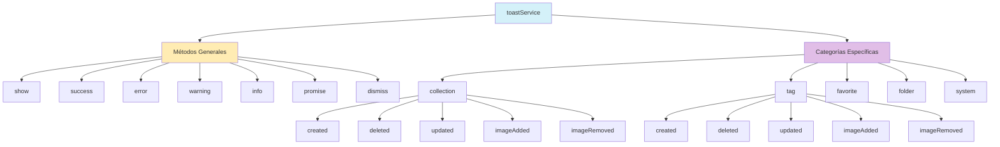

# Servicio de Notificaciones Toast

## Descripción

El servicio de notificaciones toast proporciona una interfaz unificada para mostrar mensajes de feedback al usuario sobre las operaciones realizadas en la aplicación. Está basado en la biblioteca `sonner` y ofrece diferentes tipos y categorías de notificaciones.

## Importación Correcta

Para usar correctamente el servicio de notificaciones, se debe importar `toastService` (y no `toast`) del módulo:

```typescript
// ❌ Incorrecto
import { toast } from '@/services/toast.service';

// ✅ Correcto
import toastService from '@/services/toast.service';
```

## Tipos de Notificaciones

El servicio ofrece cinco tipos básicos de notificaciones:

1. **Default**: Notificación estándar sin énfasis especial
2. **Success**: Para operaciones exitosas (verde)
3. **Error**: Para errores y fallos (rojo)
4. **Warning**: Para advertencias (amarillo)
5. **Info**: Para información general (azul)

## Estructura del Servicio



## Métodos Generales

```typescript
// Mostrar notificación estándar
toastService.show(title: string, options?: ToastOptions);

// Mostrar notificación de éxito (verde)
toastService.success(title: string, options?: ToastOptions);

// Mostrar notificación de error (rojo)
toastService.error(title: string, options?: ToastOptions);

// Mostrar notificación de advertencia (amarillo)
toastService.warning(title: string, options?: ToastOptions);

// Mostrar notificación de información (azul)
toastService.info(title: string, options?: ToastOptions);

// Mostrar notificación de promesa (con estados de carga/éxito/error)
toastService.promise(promise: Promise<any>, options: PromiseOptions);

// Cerrar una notificación específica o todas
toastService.dismiss(toastId?: string);
```

## Categorías Específicas

El servicio ofrece métodos predefinidos para diferentes entidades del sistema:

### Collections

```typescript
// Mostrar notificación de colección creada
toastService.collection.created(name?: string);

// Mostrar notificación de colección eliminada
toastService.collection.deleted(name?: string);

// Mostrar notificación de colección actualizada
toastService.collection.updated(name?: string);

// Mostrar notificación de imagen añadida a colección
toastService.collection.imageAdded(name?: string);

// Mostrar notificación de imagen eliminada de colección
toastService.collection.imageRemoved(name?: string);
```

### Tags

```typescript
// Mostrar notificación de etiqueta creada
toastService.tag.created(name?: string);

// Mostrar notificación de etiqueta eliminada
toastService.tag.deleted(name?: string);

// Mostrar notificación de etiqueta actualizada
toastService.tag.updated(name?: string);

// Mostrar notificación de etiqueta añadida a imagen
toastService.tag.imageAdded(name?: string);

// Mostrar notificación de etiqueta eliminada de imagen
toastService.tag.imageRemoved(name?: string);
```

### Favorites

```typescript
// Mostrar notificación de imagen añadida a favoritos
toastService.favorite.added();

// Mostrar notificación de imagen eliminada de favoritos
toastService.favorite.removed();

// Mostrar notificación de favoritos actualizados
toastService.favorite.updated();
```

### Folders

```typescript
// Mostrar notificación de carpeta actualizada
toastService.folder.updated(name?: string);

// Mostrar notificación de escaneo de carpeta
toastService.folder.scanning(name?: string);

// Mostrar notificación de error en carpeta
toastService.folder.error(message: string);
```

### System

```typescript
// Mostrar notificación de error del sistema
toastService.system.error(message: string);

// Mostrar notificación de advertencia del sistema
toastService.system.warning(message: string);

// Mostrar notificación de información del sistema
toastService.system.info(message: string);

// Mostrar notificación de éxito del sistema
toastService.system.success(message: string);
```

## Ejemplos de Uso

### Notificación Básica

```typescript
// Notificación simple
toastService.show('Mensaje de notificación');

// Notificación con descripción
toastService.success('Operación completada', {
  description: 'La operación se ha completado correctamente'
});

// Notificación con acción
toastService.info('Imagen recibida', {
  description: 'Una nueva imagen ha sido recibida',
  action: {
    label: 'Ver',
    onClick: () => navigate('/images/latest')
  }
});
```

### Notificación de Promesa

```typescript
// Mostrar estados de carga, éxito o error durante una operación asíncrona
toastService.promise(
  fetchData(),
  {
    loading: 'Cargando datos...',
    success: 'Datos cargados correctamente',
    error: 'Error al cargar los datos'
  }
);
```

### Categorías Específicas

```typescript
// Al crear una etiqueta
toastService.tag.created('Naturaleza'); // "🏷️ Etiqueta creada"

// Al actualizar una colección
toastService.collection.updated('Vacaciones 2023'); // "📝 Colección actualizada"

// Al añadir a favoritos
toastService.favorite.added(); // "⭐ Imagen agregada a favoritos"

// Error del sistema
toastService.system.error('No se pudo conectar con el servidor'); // "❌ Error del sistema"
```

## Corrección de Importaciones

Si encuentras errores como:

```
Attempted import error: 'toast' is not exported from '@/services/toast.service' (imported as 'toast').
```

Debes cambiar la importación a:

```typescript
// Cambiar esto:
import { toast } from '@/services/toast.service';

// Por esto:
import toastService from '@/services/toast.service';
```

Y actualizar todas las referencias de `toast` a `toastService` en tu código.