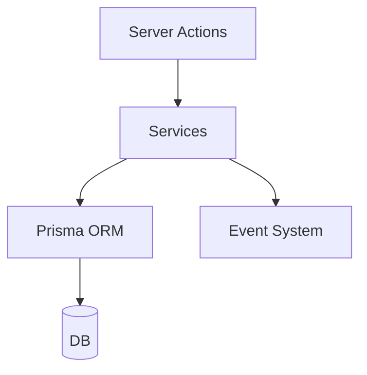

# Servicios y Lógica de Negocio

Los servicios son el núcleo de la aplicación. Encapsulan la lógica de negocio y las operaciones de base de datos.

## Arquitectura general



* Cada carpeta bajo `src/services` corresponde a una entidad o módulo del dominio.
* Los servicios exponen funciones que son consumidas por las Server Actions y, ocasionalmente, por componentes del servidor.
* Deben permanecer libres de dependencias del cliente; se ejecutan exclusivamente en el servidor.

## Estructura de un servicio típico

```text
src/services/<modulo>/
├── <modulo>.service.ts   # Implementación principal
├── index.ts              # Punto de entrada y exportaciones
└── README.md             # Documentación del módulo
```

Las funciones suelen seguir el patrón `get<Entity>`, `create<Entity>`, `update<Entity>` y `delete<Entity>`. Cualquier lógica compleja debe dividirse en utilidades internas para mantener la legibilidad.

## Ejemplo rápido

```typescript
import { folderService } from '@/services';

// Obtener carpetas con filtros
const folders = await folderService.getFolders({ search: '2025' });

// Crear una nueva carpeta
const created = await folderService.createFolder('/media/photos', {
  autoIndex: true,
});
```

## Buenas prácticas

- Mantén las funciones pequeñas y enfocadas.
- Documenta cada función exportada con comentarios JSDoc.
- Evita exponer detalles de implementación; los servicios deben ser una capa estable.
- Usa el sistema de eventos para notificar cambios relevantes al resto de la aplicación.

Para detalles específicos de cada módulo consulta el `README.md` dentro de su carpeta.
