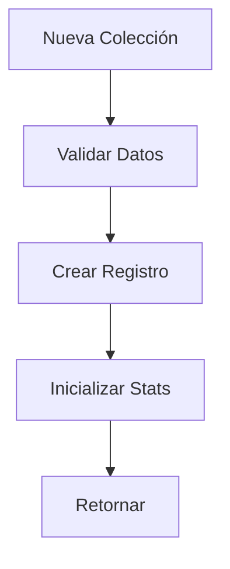
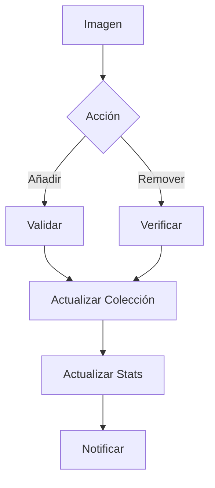
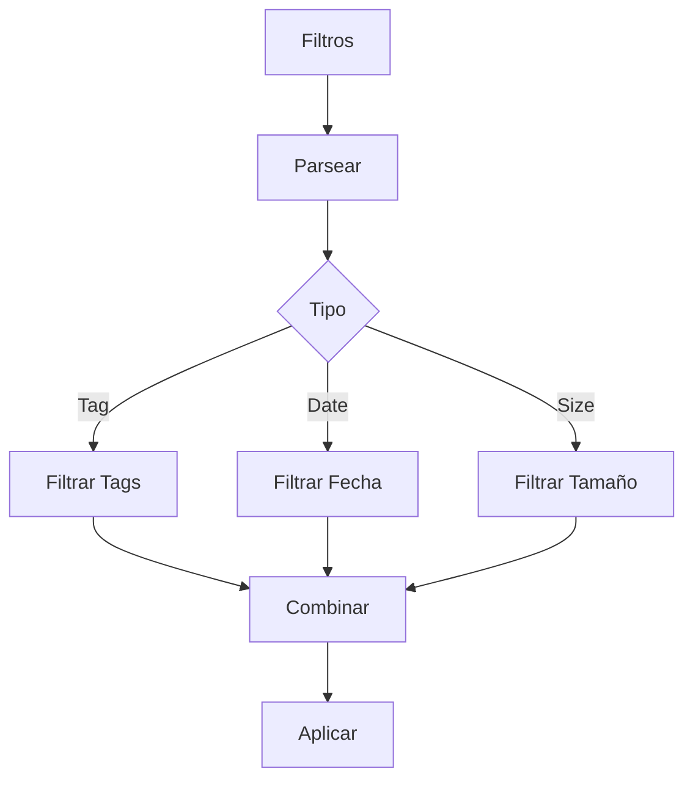
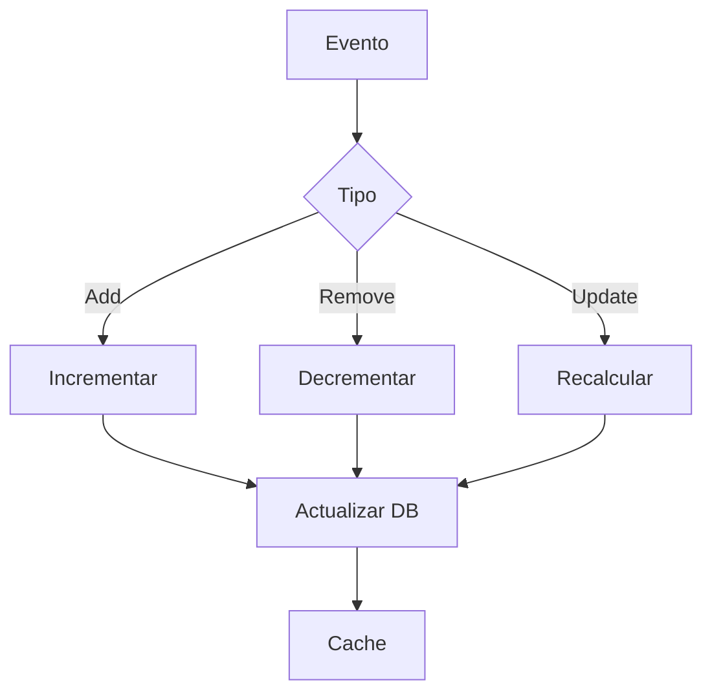

# 📚 Servicio de Colecciones

## 📝 Descripción

El servicio de colecciones gestiona la organización y agrupación de imágenes en colecciones personalizadas, permitiendo una mejor organización y acceso a los archivos.

## 🔧 Características Principales

### Estructura de Colección

```typescript
interface CollectionCreate {
	name: string;
	emoji?: string;
	color?: string;
	description?: string;
	shortcut?: string;
	sortBy?: string;
	filters?: any[];
}

interface CollectionUpdate extends Partial<Omit<CollectionCreate, "name">> {
	id: string;
	name?: string;
}

interface CollectionWithStats extends Collection {
	count: number;
	size: string;
}
```

## 📚 Métodos Principales

### `getCollections`

- Recupera todas las colecciones
- Incluye estadísticas
- Manejo de errores integrado
- Respuesta tipada

### `getCollection`

- Recupera colección por ID
- Incluye estadísticas detalladas
- Manejo de 404
- Validación de existencia

### `createCollection`

- Crea nueva colección
- Validación de datos
- Generación de ID único
- Inicialización de estadísticas

### `updateCollection`

- Actualiza colección existente
- Actualización parcial permitida
- Validación de cambios
- Preserva datos existentes

### `deleteCollection`

- Elimina colección
- Limpieza de relaciones
- Validación de existencia
- Manejo seguro

### `addImageToCollection`

- Añade imagen a colección
- Validación de existencia
- Actualización de estadísticas
- Manejo de duplicados

### `removeImageFromCollection`

- Elimina imagen de colección
- Actualización de estadísticas
- Validación de existencia
- Manejo de errores

## 🔄 Flujo de Trabajo

### Gestión de Colecciones

1. Creación/Selección de colección
2. Configuración de metadatos
3. Adición/Eliminación de imágenes
4. Actualización de estadísticas

### Estadísticas

- Conteo de imágenes
- Tamaño total
- Última actualización
- Estado de sincronización

## 🔐 Seguridad

### Validaciones

- Nombres únicos
- Datos requeridos
- Permisos de acceso
- Integridad referencial

## 📈 Optimizaciones

### Consultas

- Carga bajo demanda
- Caché de estadísticas
- Actualización eficiente
- Batch operations

### Rendimiento

- Operaciones asíncronas
- Manejo de memoria
- Respuestas optimizadas
- Control de concurrencia

## 🔗 Dependencias

- Prisma: ORM
- Fetch API: Comunicación
- FileSystem: Estadísticas
- Cache: Optimización

## 🚧 Áreas de Mejora

- Implementar filtros avanzados
- Mejorar sistema de ordenamiento
- Añadir búsqueda en colecciones
- Optimizar estadísticas grandes

## 📝 Notas Técnicas

- API RESTful
- Manejo de errores consistente
- Logging detallado
- Tipado estricto

## 🔄 Integración

### API Endpoints

- `/api/collections`: CRUD básico
- `/api/collections/:id`: Operaciones específicas
- `/api/collections/:id/images`: Gestión de imágenes

### Eventos

- Creación de colección
- Modificación de colección
- Eliminación de colección
- Cambios en imágenes

## 🔄 Diagramas de Flujo

### Gestión de Colecciones



### Gestión de Imágenes



### Sistema de Filtros



### Actualización de Stats


