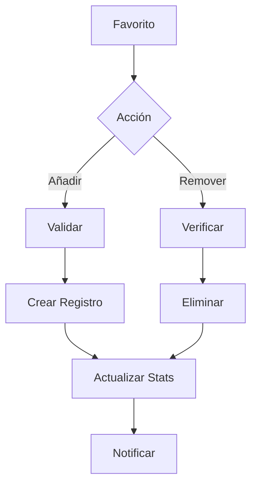
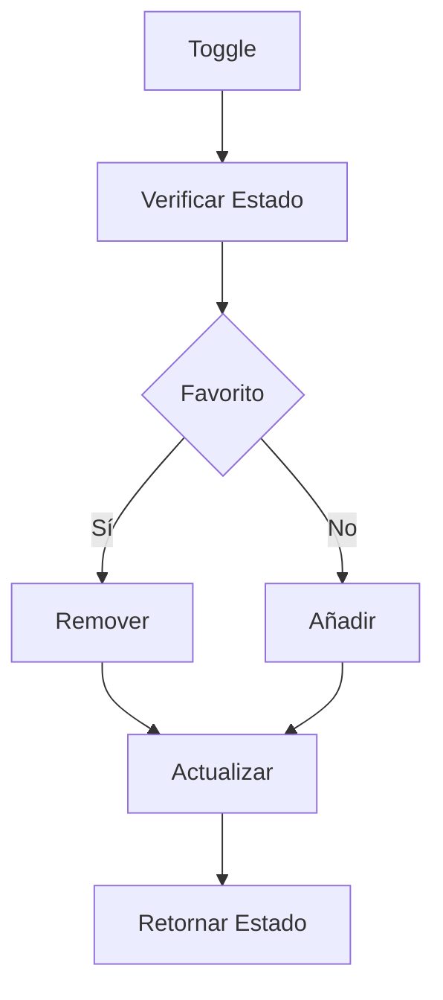
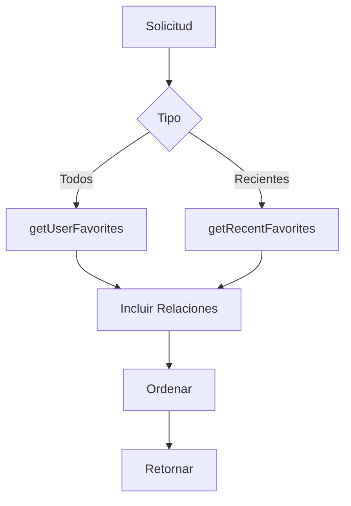
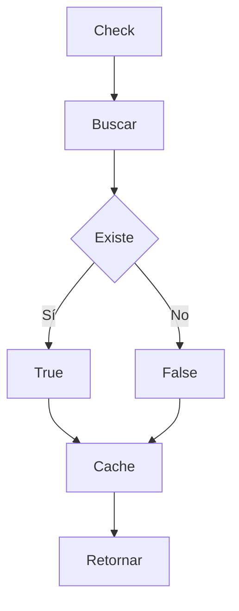

# ⭐ Servicio de Favoritos

## 📝 Descripción

El servicio de favoritos gestiona la funcionalidad de marcar y gestionar imágenes favoritas por usuario, permitiendo una organización personal y acceso rápido a las imágenes más relevantes.

## 🔧 Características Principales

### Estructura de Favorito

```typescript
interface Favorite {
	id: string;
	userId: string;
	imageId: string;
	createdAt: Date;
	image?: {
		thumbnails: Thumbnail[];
		tags: Tag[];
	};
}
```

## 📚 Métodos Principales

### `addToFavorites`

- Añade imagen a favoritos
- Incluye metadatos completos
- Relaciones automáticas
- Timestamp de creación

### `removeFromFavorites`

- Elimina imagen de favoritos
- Validación de existencia
- Limpieza de relaciones
- Manejo seguro

### `getUserFavorites`

- Obtiene favoritos del usuario
- Incluye thumbnails y tags
- Ordenado por fecha
- Carga optimizada

### `isFavorited`

- Verifica estado de favorito
- Búsqueda optimizada
- Respuesta booleana
- Validación de existencia

### `toggleFavorite`

- Alterna estado de favorito
- Operación atómica
- Retorna nuevo estado
- Manejo de errores

### `getRecentFavorites`

- Obtiene favoritos recientes
- Límite configurable
- Ordenado por fecha
- Incluye relaciones

## 🔄 Flujo de Trabajo

### Gestión de Favoritos

1. Verificación de estado
2. Modificación de favorito
3. Actualización de relaciones
4. Retorno de estado

### Consultas

- Favoritos por usuario
- Estado de imagen
- Favoritos recientes
- Metadatos completos

## 🔐 Seguridad

### Validaciones

- Usuario válido
- Imagen existente
- Permisos de acceso
- Integridad referencial

## 📈 Optimizaciones

### Consultas

- Índices optimizados
- Carga selectiva
- Relaciones eficientes
- Caché de estado

### Rendimiento

- Operaciones asíncronas
- Transacciones atómicas
- Consultas optimizadas
- Control de memoria

## 🔗 Dependencias

- Prisma: ORM
- Database: SQLite
- FileSystem: Thumbnails
- Cache: Estados

## 🚧 Áreas de Mejora

- Implementar paginación
- Añadir ordenamiento personalizado
- Mejorar caché de estados
- Optimizar consultas grandes

## 📝 Notas Técnicas

- Modelo relacional
- Índices compuestos
- Transacciones seguras
- Logging detallado

## 🔄 Integración

### Base de Datos

```prisma
model Favorite {
  id        String   @id @default(cuid())
  userId    String
  imageId   String
  createdAt DateTime @default(now())
  image     Image    @relation(fields: [imageId], references: [id])

  @@unique([userId, imageId])
  @@index([userId])
  @@index([createdAt])
}
```

### API Endpoints

- `/api/favorites`: Gestión básica
- `/api/favorites/toggle`: Alternar estado
- `/api/favorites/recent`: Favoritos recientes
- `/api/favorites/check`: Verificar estado

### Eventos

- Añadido a favoritos
- Eliminado de favoritos
- Cambio de estado
- Actualización de metadatos

## 🔄 Diagramas de Flujo

### Gestión de Favoritos



### Toggle Favorito



### Consulta de Favoritos



### Verificación de Estado


