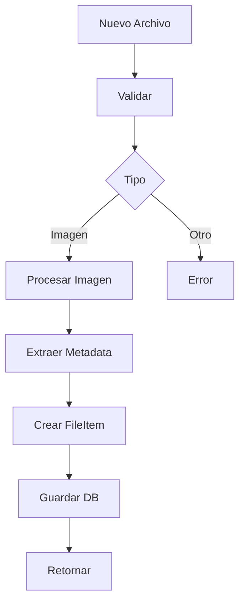
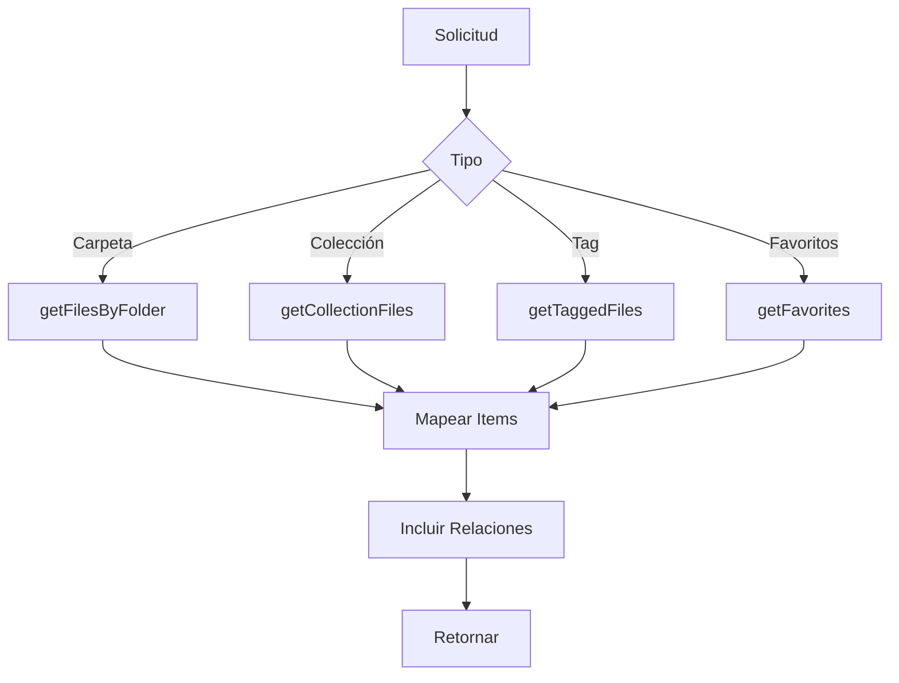
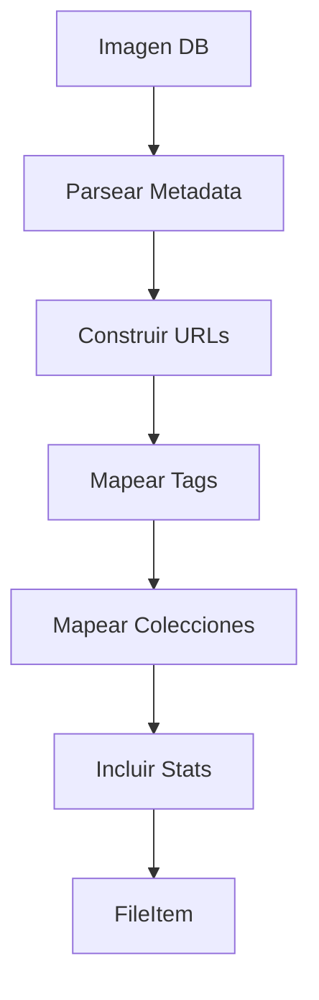
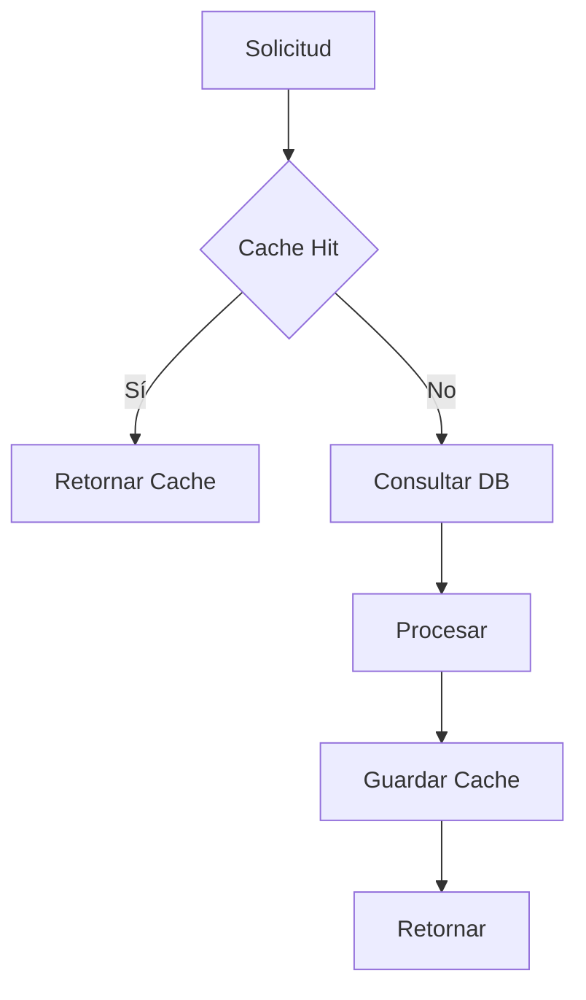

# 📁 Servicio de Archivos

## 📝 Descripción

El servicio de archivos es responsable de la gestión y recuperación de archivos en la aplicación, proporcionando una capa de abstracción sobre la base de datos y el sistema de archivos.

## 🔧 Características Principales

### Estructura de Archivo

```typescript
interface FileItem {
	id: string;
	name: string;
	path: string;
	type: "image";
	size: number;
	width: number;
	height: number;
	mimeType: string;
	thumbnail?: string;
	src: string;
	tags: Array<{
		id: string;
		name: string;
		color: string;
	}>;
	collections: Array<{
		id: string;
		name: string;
		emoji: string;
		color: string;
	}>;
	isFavorite: boolean;
	createdAt: Date;
	updatedAt: Date;
	stats?: {
		views: number;
		downloads: number;
		lastViewed: Date;
	};
}
```

## 📚 Métodos Principales

### `getFiles`

- Recupera archivos por ruta
- Incluye metadatos completos
- Ordenado por fecha de creación
- Soporte para filtrado por ruta

### `getFilesByFolder`

- Recupera archivos por ID de carpeta
- Incluye relaciones (tags, colecciones)
- Incluye estadísticas
- Ordenamiento por fecha

### `getCollectionFiles`

- Recupera archivos por colección
- Filtrado por ID de colección
- Incluye metadatos completos
- Ordenamiento personalizable

### `getTaggedFiles`

- Recupera archivos por etiqueta
- Filtrado por nombre de etiqueta
- Incluye relaciones completas
- Soporte para estadísticas

### `getFavorites`

- Recupera archivos favoritos
- Filtrado automático
- Incluye todas las relaciones
- Optimizado para rendimiento

## 🔄 Transformación de Datos

### Mapeo de Imágenes

```typescript
function mapImageToFileItem(image) {
	// Transforma datos de la BD a FileItem
	// Manejo seguro de metadatos JSON
	// Construcción de URLs
	// Mapeo de relaciones
}
```

## 🔗 Relaciones

### Tags

- ID, nombre y color
- Relación muchos a muchos
- Actualización automática

### Colecciones

- ID, nombre, emoji y color
- Relación muchos a muchos
- Metadata extendida

### Estadísticas

- Vistas y descargas
- Última visualización
- Actualización automática

## 📈 Optimizaciones

### Consultas

- Selección específica de campos
- Inclusión condicional de relaciones
- Ordenamiento optimizado
- Índices en campos clave

### Caché

- URLs de thumbnails
- Metadatos parseados
- Relaciones comunes

## 🔐 Seguridad

### Validaciones

- Parsing seguro de metadatos
- Manejo de errores robusto
- Sanitización de rutas
- Verificación de permisos

## 🔗 Dependencias

- Prisma: ORM para base de datos
- Sharp: Procesamiento de imágenes
- FileSystem: Acceso a archivos

## 🚧 Áreas de Mejora

- Implementar paginación
- Mejorar sistema de caché
- Añadir búsqueda avanzada
- Optimizar queries grandes

## 📝 Notas Técnicas

- Uso de tipos estrictos
- Manejo de errores centralizado
- Transformación de datos consistente
- Integración con otros servicios

## 🔄 Diagramas de Flujo

### Gestión de Archivos



### Consulta de Archivos



### Mapeo de Datos



### Sistema de Caché


