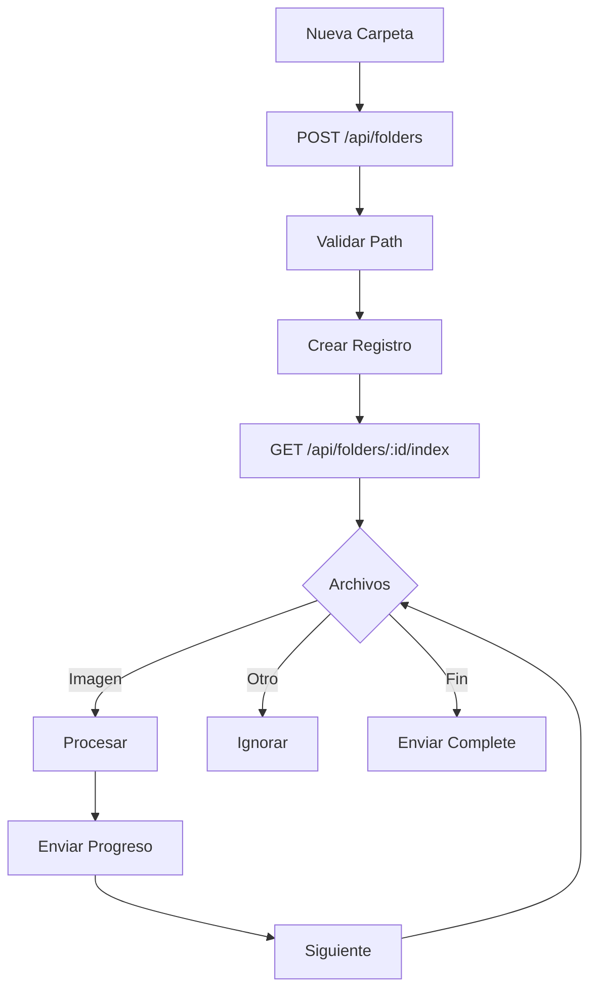
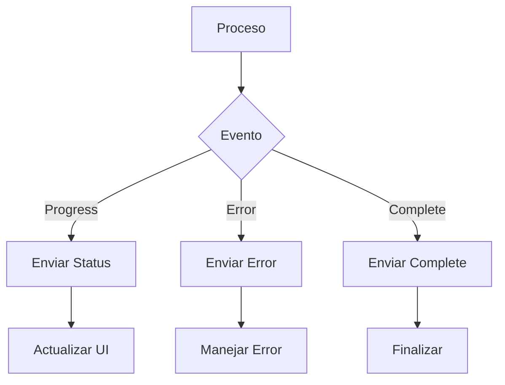
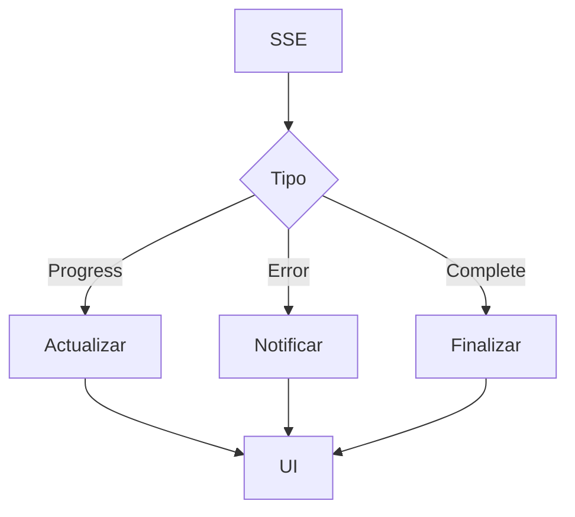
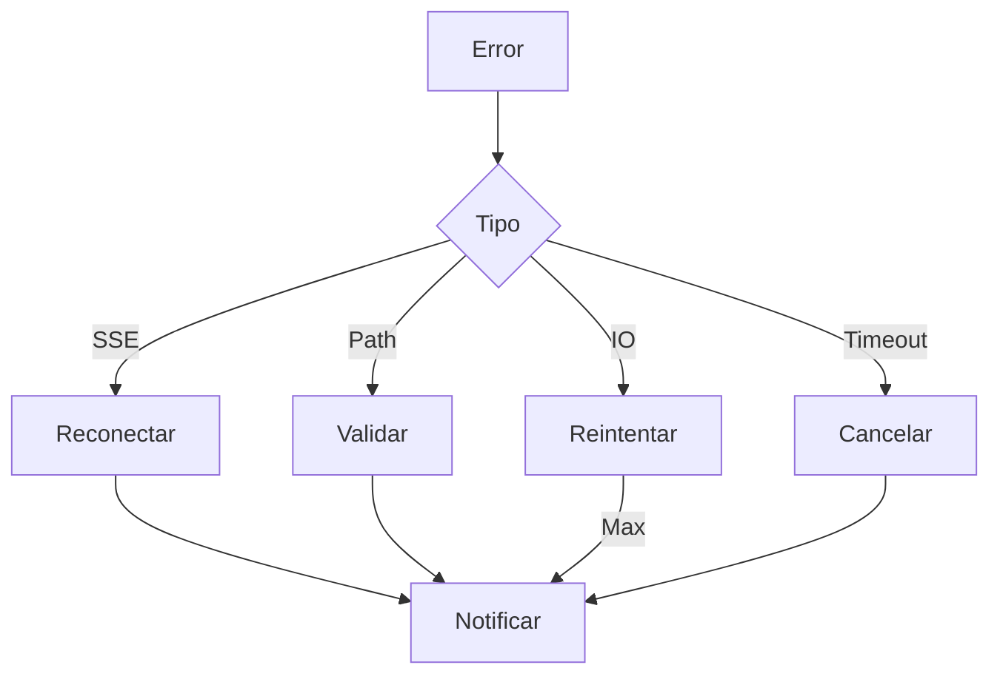

# 📁 Servicio de Carpetas

## 📝 Descripción

El servicio de carpetas gestiona la indexación, monitoreo y mantenimiento de carpetas en el sistema, proporcionando una interfaz para el manejo de directorios y su contenido. Utiliza Server-Sent Events (SSE) para proporcionar actualizaciones en tiempo real del progreso de indexación.

## 🔧 Características Principales

### Estructura de Carpeta

```typescript
interface FolderResponse {
	id: string;
	name: string;
	path: string;
	isWatched: boolean;
	totalFiles: number;
	totalSize: number;
	lastIndexed: string | null;
	createdAt: string;
	updatedAt: string;
	_count?: {
		images: number;
	};
}
```

### Sistema de Eventos y Callbacks

```typescript
interface ProcessStatus {
	status?: string;
	current?: number;
	total?: number;
	progress?: number;
	currentFile?: string;
}

interface IndexCallbacks {
	onProgress?: (status: ProcessStatus) => void;
	onError?: (error: Error) => void;
	onComplete?: () => void;
}
```

## 📚 Métodos Principales

### `getFolders`

- Recupera todas las carpetas indexadas
- Incluye estadísticas básicas
- Manejo de errores integrado
- Respuesta tipada

### `addFolder`

- Agrega nueva carpeta al sistema
- Proceso en dos fases:
  1. Creación de carpeta (POST /api/folders)
  2. Indexación con SSE (GET /api/folders/:id/index)
- Sistema de callbacks para estados
- Manejo de errores robusto
- Eventos de progreso detallados
- Timeout configurable (5 minutos por defecto)

### `indexFolder`

- Indexa contenido de carpeta
- SSE para monitoreo en tiempo real
- Callbacks para estados del proceso
- Logging detallado
- Progreso por archivo
- Manejo de reconexión automática
- Timeout configurable

### `reindexFolder`

- Re-indexa carpeta existente
- Mantiene mismos callbacks
- Actualiza estadísticas
- Preserva configuración
- SSE para progreso
- Hereda funcionalidad de indexFolder

### `deleteFolder`

- Elimina carpeta del sistema
- Limpieza de recursos asociados
- Validación de existencia
- Manejo seguro de errores

## 🔄 Flujo de Trabajo

### Indexación

1. Creación de carpeta (POST)
2. Inicio de indexación con SSE (GET)
3. Monitoreo de progreso en tiempo real
4. Actualización de estadísticas
5. Finalización y callbacks

### Eventos SSE

#### Tipos de Eventos

- `progress`: Actualización de progreso
- `error`: Notificación de errores
- `complete`: Finalización del proceso

#### Estructura de Eventos

```typescript
// Evento de Progreso
{
	type: 'progress',
	data: {
		status: string,
		current: number,
		total: number,
		progress: number,
		currentFile?: string
	}
}

// Evento de Error
{
	type: 'error',
	data: {
		type: string,
		message: string
	}
}

// Evento de Completado
{
	type: 'complete',
	data: {
		folder: FolderResponse,
		stats: {
			processed: number,
			total: number,
			totalSize: number
		}
	}
}
```

## 🔐 Seguridad y Manejo de Errores

### Validaciones

- Verificación de rutas
- Permisos de acceso
- Existencia de carpeta
- Integridad de datos
- Manejo de conexiones SSE
- Timeouts configurables

### Tipos de Errores

- `PATH_REQUIRED`: Ruta no proporcionada
- `PATH_NOT_FOUND`: Carpeta no existe
- `FOLDER_EXISTS`: Carpeta ya indexada
- `FOLDER_NOT_FOUND`: Carpeta no encontrada en BD
- `UNKNOWN_ERROR`: Errores no categorizados
- `TIMEOUT`: Excedido tiempo de espera

## 📈 Optimizaciones

### Proceso de Indexación

- Indexación asíncrona con SSE
- Procesamiento por lotes
- Caché de resultados
- Reintento automático
- Progreso en tiempo real
- Timeout configurable (5 minutos)

### Monitoreo

- Eventos SSE en tiempo real
- Actualización progresiva
- Gestión de memoria
- Control de concurrencia
- Estado detallado por archivo
- Reconexión automática

## 🔗 Dependencias

- EventSourcePolyfill
- Fetch API
- Sistema de archivos
- API de carpetas
- TransformStream para SSE

## 🚧 Áreas de Mejora

- Optimizar manejo de errores
- Mejorar reconexión SSE
- Añadir filtros avanzados
- Implementar búsqueda
- Caché de thumbnails
- Configuración de timeouts por usuario

## 📝 Notas Técnicas

- Uso de EventSource con polyfill
- Manejo asíncrono
- Logging detallado
- Tipado estricto
- SSE para tiempo real
- Headers CORS configurados

## 🔄 Integración

### API Endpoints

- `/api/folders`: CRUD básico (POST, GET, DELETE)
- `/api/folders/:id/index`: Indexación SSE (GET)
- `/api/folders/:id`: Operaciones específicas

### Headers SSE

```typescript
{
	'Content-Type': 'text/event-stream',
	'Cache-Control': 'no-cache',
	'Connection': 'keep-alive',
	'Access-Control-Allow-Origin': '*'
}
```

## 🔄 Diagramas de Flujo

### Indexación de Carpeta con SSE



### Sistema de Eventos SSE



### Monitoreo de Carpeta



### Gestión de Errores


