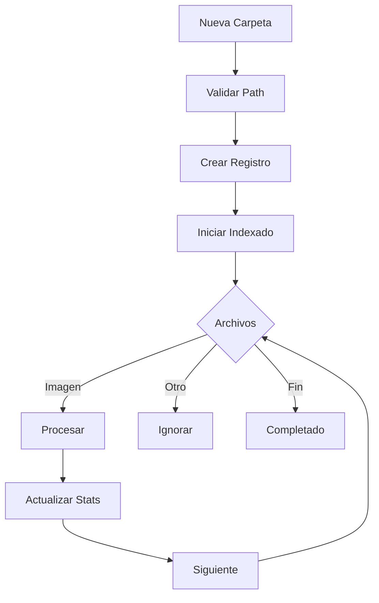
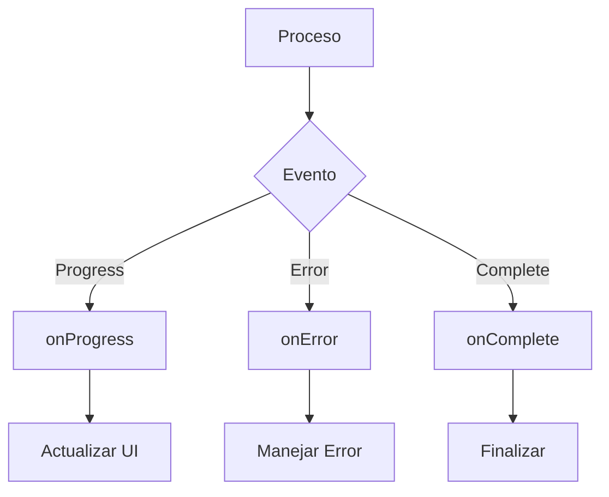
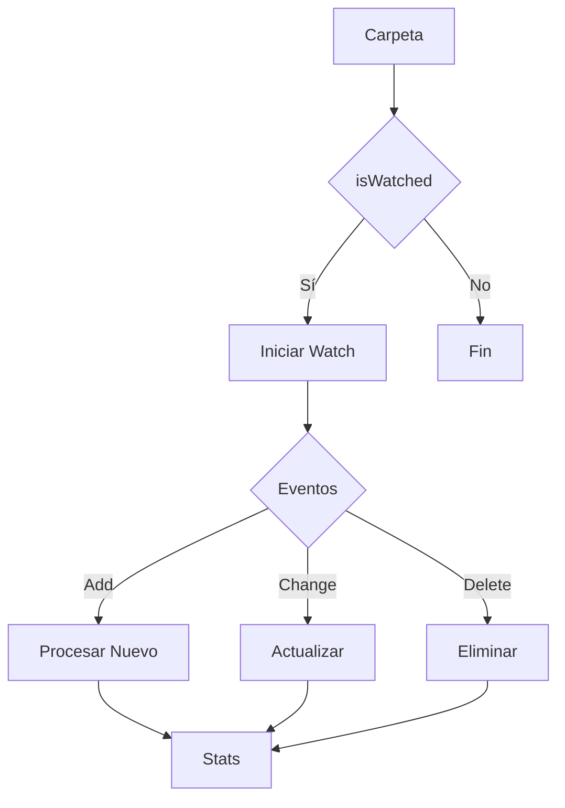
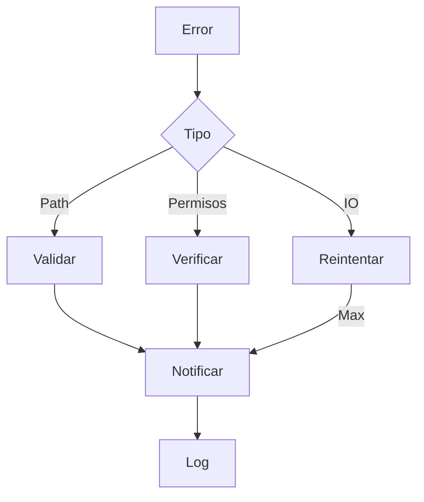

# 📁 Servicio de Carpetas

## 📝 Descripción

El servicio de carpetas gestiona la indexación, monitoreo y mantenimiento de carpetas en el sistema, proporcionando una interfaz para el manejo de directorios y su contenido.

## 🔧 Características Principales

### Estructura de Carpeta

```typescript
interface FolderResponse {
	id: string;
	name: string;
	path: string;
	isWatched: boolean;
	totalFiles: number;
	totalSize: number;
	lastIndexed: string | null;
	createdAt: string;
	updatedAt: string;
	_count?: {
		images: number;
	};
}
```

### Sistema de Callbacks

```typescript
interface ProcessStatus {
	status?: string;
	current?: number;
	total?: number;
	progress?: number;
}

interface IndexCallbacks {
	onProgress?: (status: ProcessStatus) => void;
	onError?: (error: Error) => void;
	onComplete?: () => void;
}
```

## 📚 Métodos Principales

### `getFolders`

- Recupera todas las carpetas indexadas
- Incluye estadísticas básicas
- Manejo de errores integrado
- Respuesta tipada

### `addFolder`

- Agrega nueva carpeta al sistema
- Inicia indexación automática
- Sistema de callbacks para progreso
- Manejo de errores robusto

### `indexFolder`

- Indexa contenido de carpeta
- Monitoreo de progreso en tiempo real
- Callbacks para estados del proceso
- Logging detallado

### `reindexFolder`

- Re-indexa carpeta existente
- Mantiene mismos callbacks
- Actualiza estadísticas
- Preserva configuración

### `deleteFolder`

- Elimina carpeta del sistema
- Limpieza de recursos asociados
- Validación de existencia
- Manejo seguro de errores

## 🔄 Flujo de Trabajo

### Indexación

1. Creación/Selección de carpeta
2. Inicio de indexación
3. Monitoreo de progreso
4. Finalización y callbacks

### Monitoreo

- Estado del proceso
- Progreso actual
- Total de archivos
- Porcentaje completado

## 🔐 Seguridad

### Validaciones

- Verificación de rutas
- Permisos de acceso
- Existencia de carpeta
- Integridad de datos

## 📈 Optimizaciones

### Proceso de Indexación

- Indexación asíncrona
- Procesamiento por lotes
- Caché de resultados
- Reintento automático

### Monitoreo

- Eventos en tiempo real
- Actualización progresiva
- Gestión de memoria
- Control de concurrencia

## 🔗 Dependencias

- EventSourcePolyfill
- Fetch API
- Sistema de archivos
- API de carpetas

## 🚧 Áreas de Mejora

- Mejorar manejo de errores
- Optimizar indexación grande
- Añadir filtros avanzados
- Implementar búsqueda

## 📝 Notas Técnicas

- Uso de EventSource
- Manejo asíncrono
- Logging detallado
- Tipado estricto

## 🔄 Integración

### API Endpoints

- `/api/folders`: CRUD básico
- `/api/folders/:id/index`: Indexación
- `/api/folders/:id`: Operaciones específicas

### Eventos

- Progreso de indexación
- Errores del proceso
- Completado de operaciones
- Estado del sistema

## 🔄 Diagramas de Flujo

### Indexación de Carpeta



### Sistema de Callbacks



### Monitoreo de Carpeta



### Gestión de Errores


