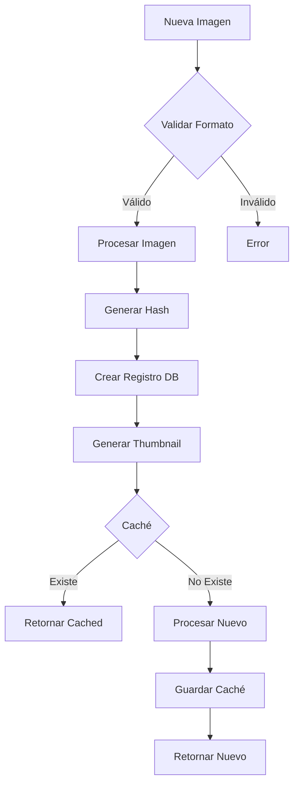
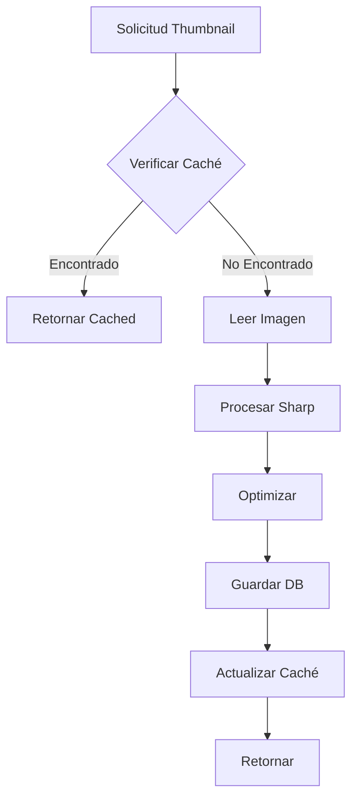
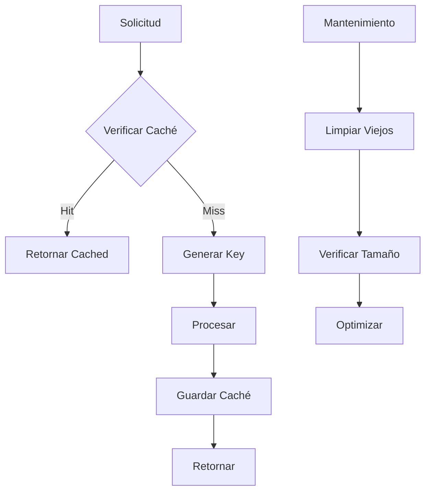

# 🖼️ Servicio de Imágenes

## 📝 Descripción

El servicio de imágenes es un componente core que maneja todas las operaciones relacionadas con el procesamiento, almacenamiento y recuperación de imágenes en la aplicación.

## 🔧 Características Principales

### Procesamiento de Imágenes

- Soporte para múltiples formatos: `.jpg`, `.jpeg`, `.png`, `.gif`, `.webp`
- Procesamiento optimizado con Sharp
- Sistema de caché para mejorar rendimiento
- Generación automática de thumbnails

### Calidades de Thumbnail

```typescript
compressed: { quality: 60, width: 200, height: 200 }
low: { quality: 70, width: 300, height: 300 }
mid: { quality: 80, width: 400, height: 400 }
high: { quality: 90, width: 500, height: 500 }
```

## 🏗️ Estructura

### Tipos Principales

```typescript
type ThumbnailQuality = "compressed" | "low" | "mid" | "high";

type CreateImageInput = {
	title: string;
	name: string;
	description?: string;
	filePath: string;
	fileSize: number;
	mimeType: string;
	width: number;
	height: number;
	userId: string;
	metadata?: Record<string, any>;
	hash?: string;
	isPublic?: boolean;
};

type ImageProcessingOptions = {
	quality?: number;
	width?: number;
	height?: number;
	format?: "webp" | "jpeg" | "png";
	fit?: "cover" | "contain" | "inside" | "outside";
};
```

## 📚 Métodos Principales

### `createImage`

- Crea una nueva imagen en la base de datos
- Genera automáticamente un thumbnail de calidad media
- Inicializa estadísticas de la imagen

### `generateThumbnail`

- Genera thumbnails en diferentes calidades
- Utiliza Sharp para el procesamiento
- Almacena en caché para acceso rápido
- Mantiene aspect ratio original

### `getThumbnail`

- Recupera thumbnails del caché o los genera si no existen
- Calidad por defecto: 'mid'
- Retorna imagen en formato base64

## 🔄 Flujo de Trabajo

1. Creación de imagen
2. Generación automática de thumbnail
3. Almacenamiento en caché
4. Acceso optimizado posterior

## 🔐 Seguridad

- Validación de formatos de archivo
- Procesamiento seguro de imágenes
- Caché con claves únicas por imagen y opciones

## 📈 Optimizaciones

- Sistema de caché implementado
- Procesamiento bajo demanda
- Reutilización de thumbnails existentes
- Compresión optimizada por formato

## 🔗 Dependencias

- Sharp: Procesamiento de imágenes
- Prisma: Persistencia de datos
- Cache: Sistema de caché interno

## 🚧 Áreas de Mejora

- Implementar limpieza periódica de caché
- Añadir soporte para más formatos
- Optimizar procesamiento en lote
- Mejorar manejo de errores

## 📝 Notas Técnicas

- Utiliza el patrón Singleton
- Mantiene directorio de caché
- Procesa imágenes de forma asíncrona
- Integrado con el servicio de estadísticas

## 🔄 Diagramas de Flujo

### Procesamiento de Imagen



### Generación de Thumbnail



### Sistema de Caché


