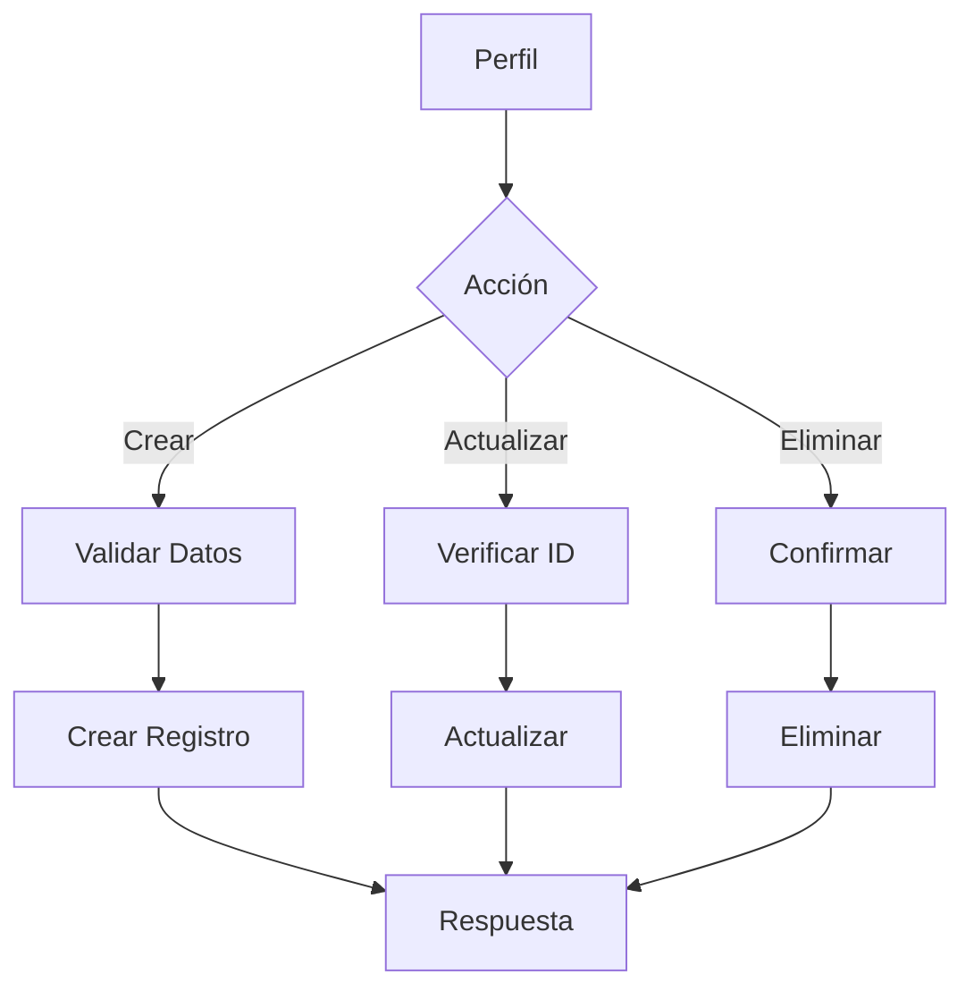
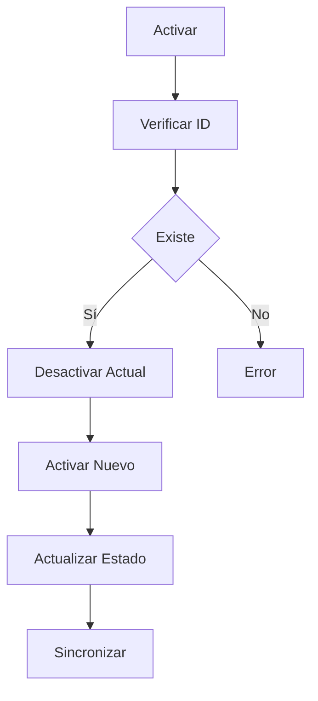
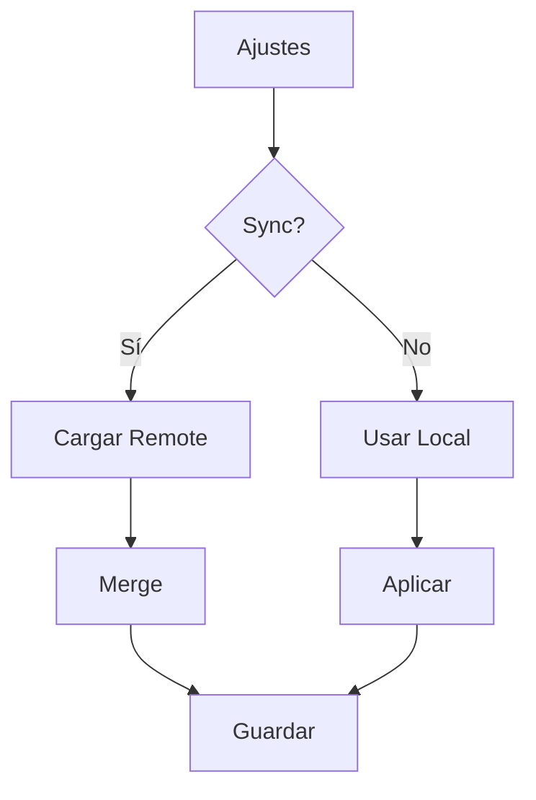
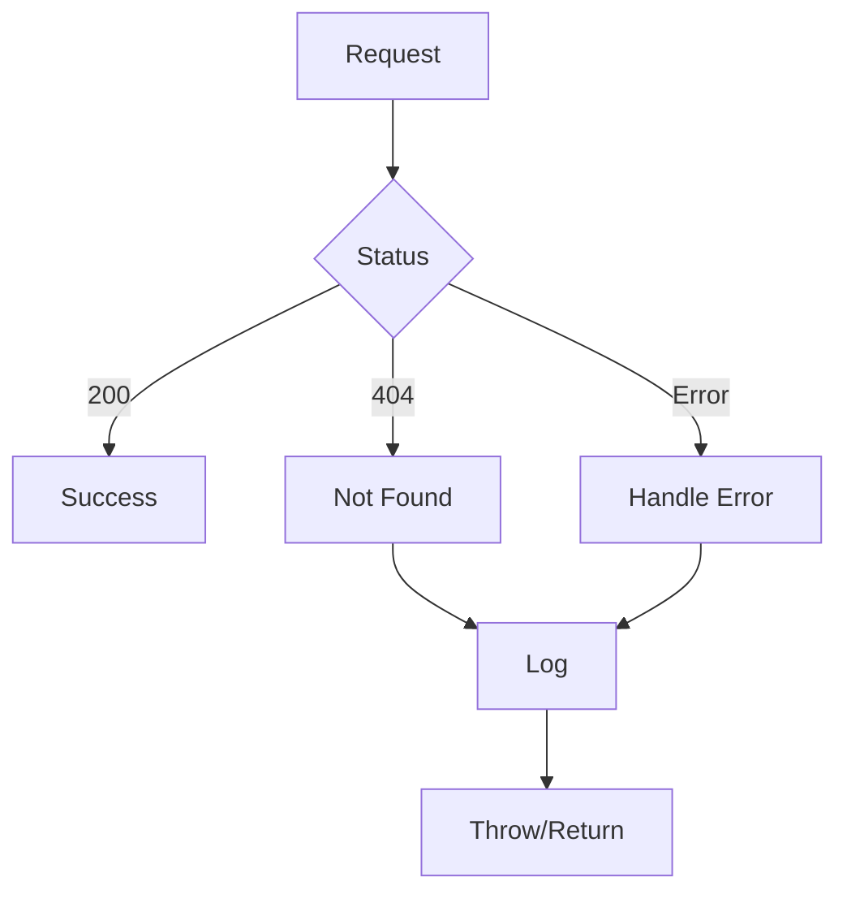

# 👤 Servicio de Perfiles

## 📝 Descripción

El servicio de perfiles gestiona la configuración y preferencias de usuario, permitiendo personalizar la experiencia de la aplicación y mantener múltiples perfiles de usuario.

## 🔧 Características Principales

### Estructura de Perfil

```typescript
interface ProfileCreate {
	name: string;
	emoji?: string;
	color?: string;
	theme?: string;
	language?: string;
	syncSettings?: boolean;
	notifications?: boolean;
	settings?: Record<string, any>;
}

interface ProfileUpdate extends Partial<ProfileCreate> {
	id: string;
	isActive?: boolean;
}

interface ProfileWithStats extends Profile {
	// Extensible para estadísticas adicionales
}
```

## 📚 Métodos Principales

### `getProfiles`

- Recupera todos los perfiles
- Incluye estadísticas
- Manejo de errores
- Respuesta tipada

### `getProfile`

- Recupera perfil por ID
- Manejo de 404
- Validación de existencia
- Retorno nullable

### `createProfile`

- Crea nuevo perfil
- Validación de datos
- Manejo de errores
- Respuesta tipada

### `updateProfile`

- Actualiza perfil existente
- Actualización parcial
- Validación de cambios
- Preserva datos

### `deleteProfile`

- Elimina perfil
- Validación de existencia
- Limpieza de recursos
- Manejo seguro

### `setActiveProfile`

- Activa perfil específico
- Actualización de estado
- Operación atómica
- Manejo de errores

## 🔄 Flujo de Trabajo

### Gestión de Perfiles

1. Creación/Selección de perfil
2. Configuración de preferencias
3. Activación/Desactivación
4. Sincronización de ajustes

### Preferencias

- Tema de interfaz
- Idioma
- Notificaciones
- Sincronización

## 🔐 Seguridad

### Validaciones

- Datos requeridos
- Formato de datos
- Permisos de acceso
- Integridad referencial

## 📈 Optimizaciones

### API

- Endpoints RESTful
- Manejo de errores
- Respuestas tipadas
- Validación robusta

### Rendimiento

- Operaciones asíncronas
- Caché de perfiles
- Control de estado
- Actualizaciones eficientes

## 🔗 Dependencias

- Fetch API: Comunicación
- JSON: Serialización
- Error Handling: Gestión de errores
- TypeScript: Tipado estático

## 🚧 Áreas de Mejora

- Implementar más estadísticas
- Mejorar sincronización
- Añadir más preferencias
- Optimizar validaciones

## 📝 Notas Técnicas

- API RESTful
- Manejo de errores consistente
- Logging detallado
- Tipado estricto

## 🔄 Diagramas de Flujo

### Gestión de Perfiles



### Activación de Perfil



### Sincronización de Ajustes



### Manejo de Errores


