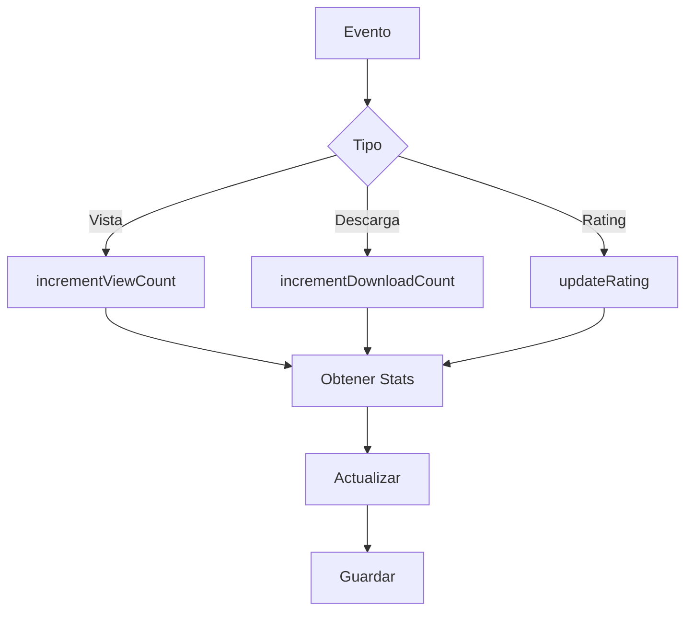
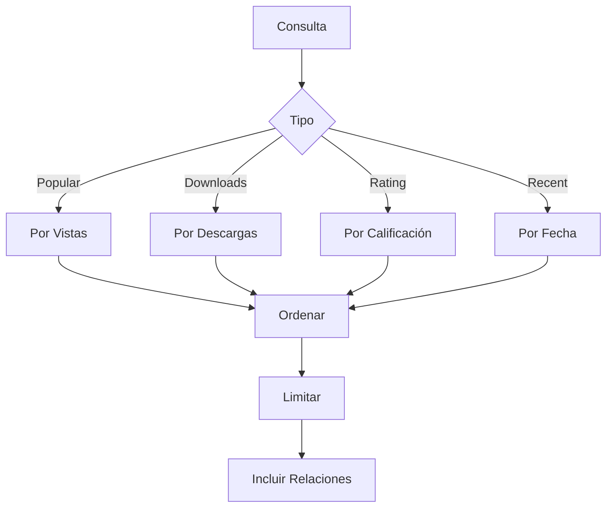
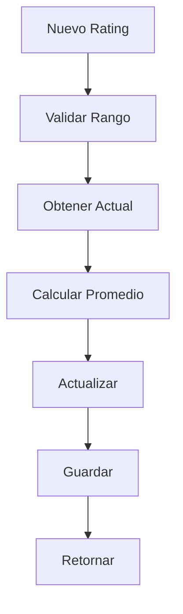
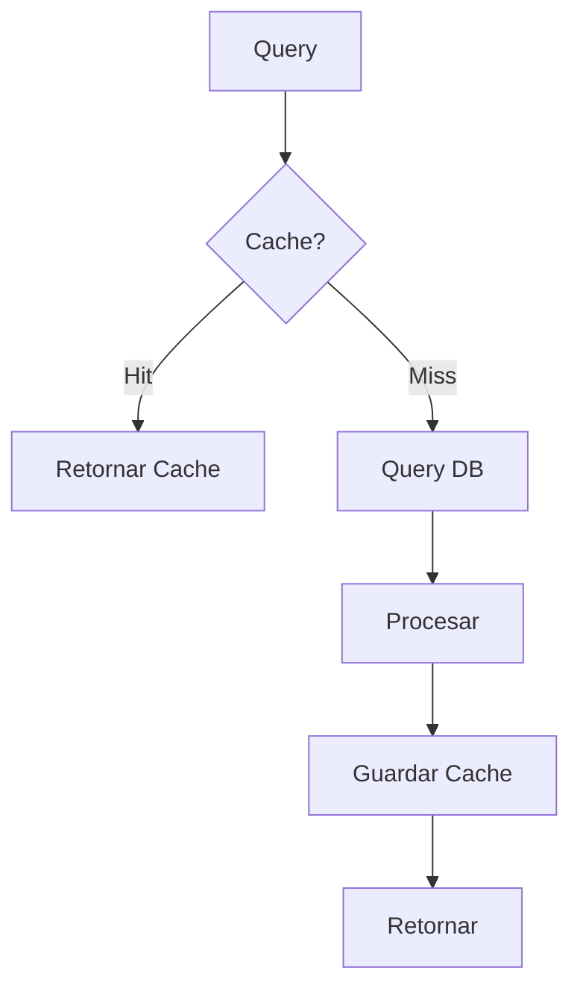

# 📊 Servicio de Estadísticas

## 📝 Descripción

El servicio de estadísticas gestiona el seguimiento y análisis de la interacción de usuarios con las imágenes, incluyendo vistas, descargas, calificaciones y tendencias.

## 🔧 Características Principales

### Estructura de Estadísticas

```typescript
interface ImageStats {
	id: string;
	imageId: string;
	viewCount: number;
	downloadCount: number;
	averageRating: number | null;
	lastViewed: Date | null;
	lastDownloaded: Date | null;
	createdAt: Date;
	updatedAt: Date;
}
```

## 📚 Métodos Principales

### `getOrCreateImageStats`

- Inicializa o recupera estadísticas
- Creación bajo demanda
- Manejo de estados iniciales
- Retorno tipado

### `incrementViewCount`

- Incrementa contador de vistas
- Actualiza última visualización
- Operación atómica
- Timestamp automático

### `incrementDownloadCount`

- Incrementa contador de descargas
- Actualiza última descarga
- Operación atómica
- Timestamp automático

### `updateRating`

- Actualiza calificación promedio
- Cálculo ponderado
- Validación de rango
- Actualización atómica

### Métodos de Consulta

- `getPopularImages`: Más vistas
- `getMostDownloadedImages`: Más descargadas
- `getHighestRatedImages`: Mejor calificadas
- `getRecentlyViewedImages`: Vistas recientemente

## 🔄 Flujo de Trabajo

### Tracking de Actividad

1. Detección de evento
2. Incremento de contador
3. Actualización de timestamps
4. Cálculo de estadísticas

### Consultas Analíticas

- Tendencias de uso
- Patrones de visualización
- Métricas de popularidad
- Rankings dinámicos

## 🔐 Seguridad

### Validaciones

- Existencia de imagen
- Rango de calificaciones
- Integridad de datos
- Control de concurrencia

## 📈 Optimizaciones

### Consultas

- Índices optimizados
- Caché de rankings
- Actualizaciones atómicas
- Batch processing

### Rendimiento

- Operaciones asíncronas
- Transacciones eficientes
- Control de memoria
- Escalabilidad horizontal

## 🔗 Dependencias

- Prisma: ORM
- Database: SQLite
- Cache: Rankings
- Events: Tracking

## 🚧 Áreas de Mejora

- Implementar análisis avanzado
- Añadir más métricas
- Mejorar sistema de caché
- Optimizar consultas pesadas

## 📝 Notas Técnicas

- Modelo relacional
- Índices compuestos
- Transacciones seguras
- Logging detallado

## 🔄 Diagramas de Flujo

### Tracking de Eventos



### Sistema de Rankings



### Actualización de Rating



### Gestión de Cache


