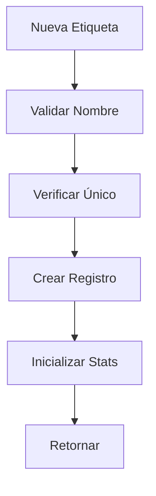
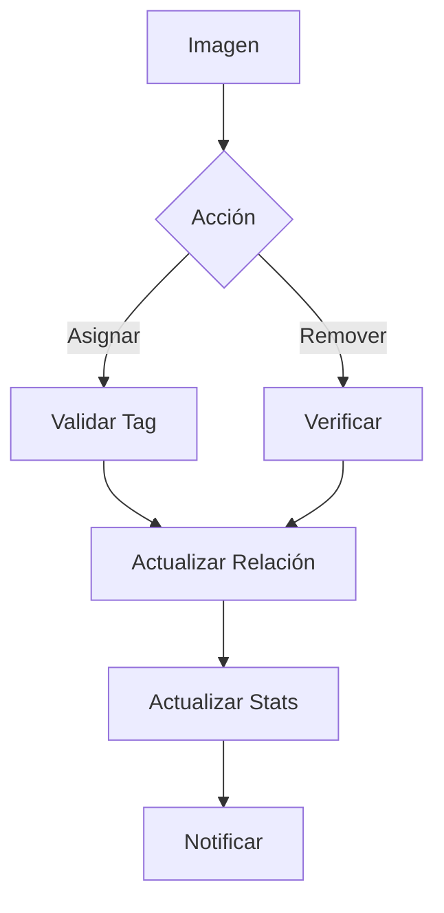
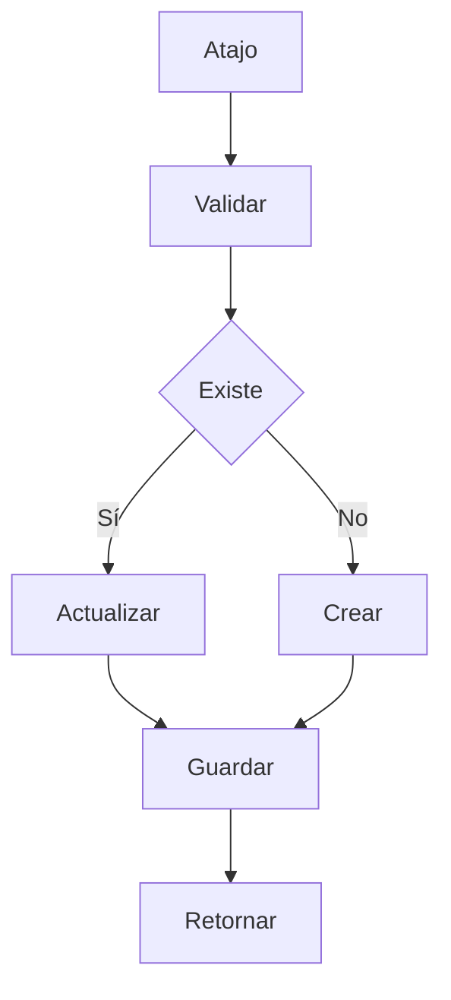
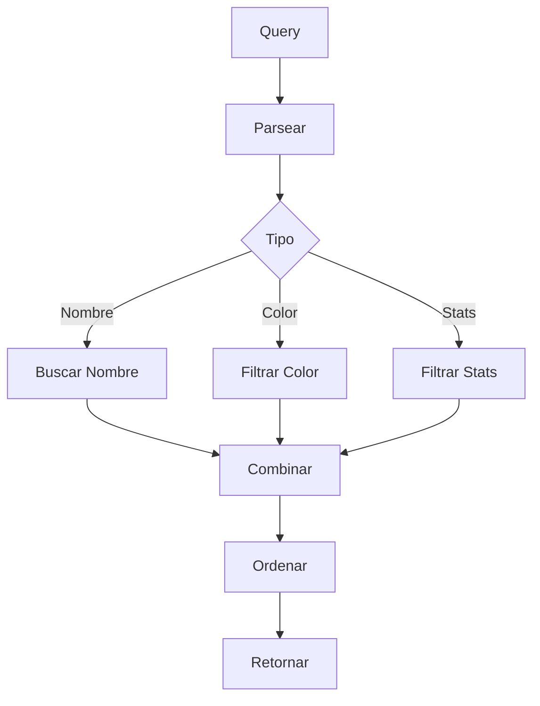

# 🏷️ Servicio de Etiquetas

## 📝 Descripción

El servicio de etiquetas proporciona funcionalidad para la categorización y organización de imágenes mediante etiquetas personalizables, permitiendo una clasificación flexible y búsqueda eficiente.

## 🔧 Características Principales

### Estructura de Etiqueta

```typescript
interface TagCreate {
	name: string;
	color?: string;
	description?: string;
	shortcut?: string;
}

interface TagUpdate extends Partial<Omit<TagCreate, "name">> {
	id: string;
	name?: string;
}

interface TagWithStats extends Tag {
	count: number;
	size: string;
}
```

## 📚 Métodos Principales

### `getTags`

- Recupera todas las etiquetas
- Incluye estadísticas
- Manejo de errores integrado
- Respuesta tipada

### `getTag`

- Recupera etiqueta por ID
- Incluye estadísticas detalladas
- Manejo de 404
- Validación de existencia

### `createTag`

- Crea nueva etiqueta
- Validación de datos
- Generación de ID único
- Inicialización de estadísticas

### `updateTag`

- Actualiza etiqueta existente
- Actualización parcial permitida
- Validación de cambios
- Preserva datos existentes

### `deleteTag`

- Elimina etiqueta
- Limpieza de relaciones
- Validación de existencia
- Manejo seguro

### `addImageToTag`

- Añade imagen a etiqueta
- Validación de existencia
- Actualización de estadísticas
- Manejo de duplicados

### `removeImageFromTag`

- Elimina imagen de etiqueta
- Actualización de estadísticas
- Validación de existencia
- Manejo de errores

## 🔄 Flujo de Trabajo

### Gestión de Etiquetas

1. Creación/Selección de etiqueta
2. Configuración de metadatos
3. Asignación/Eliminación de imágenes
4. Actualización de estadísticas

### Estadísticas

- Conteo de imágenes
- Tamaño total
- Última actualización
- Estado de sincronización

## 🔐 Seguridad

### Validaciones

- Nombres únicos
- Datos requeridos
- Permisos de acceso
- Integridad referencial

## 📈 Optimizaciones

### Consultas

- Carga bajo demanda
- Caché de estadísticas
- Actualización eficiente
- Batch operations

### Rendimiento

- Operaciones asíncronas
- Manejo de memoria
- Respuestas optimizadas
- Control de concurrencia

## 🔗 Dependencias

- Prisma: ORM
- Fetch API: Comunicación
- FileSystem: Estadísticas
- Cache: Optimización

## 🚧 Áreas de Mejora

- Implementar búsqueda por etiquetas
- Mejorar sistema de atajos
- Añadir etiquetas automáticas
- Optimizar rendimiento

## 📝 Notas Técnicas

- API RESTful
- Manejo de errores consistente
- Logging detallado
- Tipado estricto

## 🔄 Integración

### API Endpoints

- `/api/tags`: CRUD básico
- `/api/tags/:id`: Operaciones específicas
- `/api/tags/:id/images`: Gestión de imágenes

### Eventos

- Creación de etiqueta
- Modificación de etiqueta
- Eliminación de etiqueta
- Cambios en imágenes

### Utilidades

```typescript
function formatBytes(bytes: number): string {
	// Función de utilidad para formatear tamaños
	// Convierte bytes a unidades legibles
	// Soporta B, KB, MB, GB, TB
	// Precisión de 2 decimales
}
```

## 🔄 Diagramas de Flujo

### Gestión de Etiquetas



### Asignación de Imágenes



### Sistema de Atajos



### Búsqueda y Filtrado


