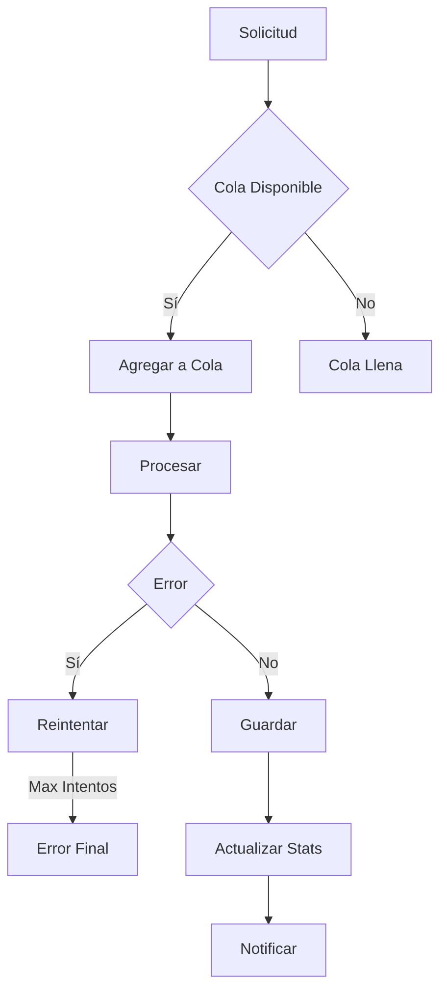
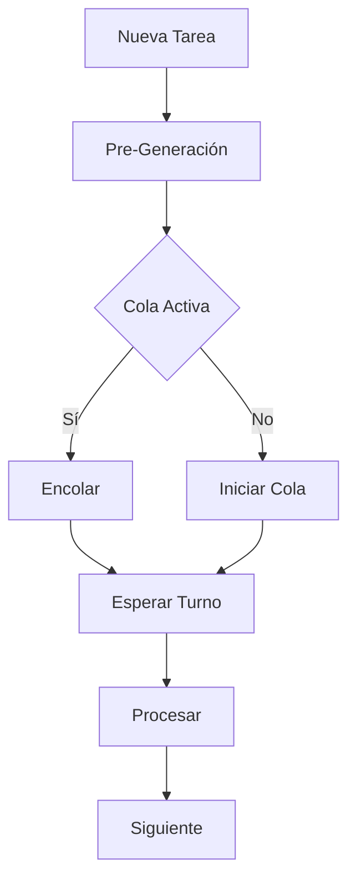
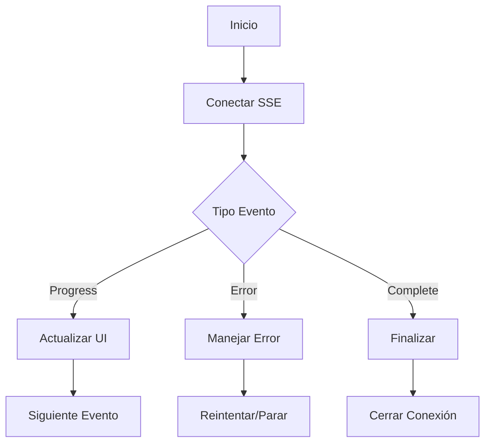
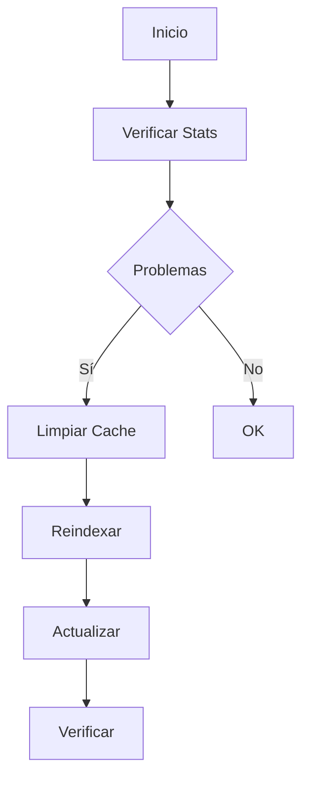

# 🖼️ Servicio de Thumbnails

## 📝 Descripción

El servicio de thumbnails es un componente especializado que maneja la generación, gestión y optimización de miniaturas para las imágenes en la aplicación.

## 🔧 Características Principales

### Gestión de Calidad

```typescript
compressed: { quality: 60, width: 200, height: 200 }
low: { quality: 70, width: 300, height: 300 }
mid: { quality: 80, width: 400, height: 400 }
high: { quality: 90, width: 500, height: 500 }
```

### Sistema de Cola

- Cola de pre-generación para procesamiento asíncrono
- Procesamiento en segundo plano
- Control de concurrencia
- Reintentos automáticos

### Monitoreo y Estadísticas

```typescript
interface ThumbnailStats {
	total: number;
	totalSize: number;
	pending: number;
	withThumbnail: number;
	recentlyProcessed: {
		id: string;
		path: string;
		processedAt: Date;
	}[];
	errors: ThumbnailError[];
}
```

## 🏗️ Estructura

### Configuración

```typescript
interface ThumbnailConfig {
	quality: ThumbnailQuality;
	width: number;
	height: number;
	format: "webp";
}

type ThumbnailQuality = "compressed" | "low" | "mid" | "high";
```

### Gestión de Errores

```typescript
interface ThumbnailError {
	imageId: string;
	imagePath: string;
	error: string;
	timestamp: Date;
}
```

## 📚 Métodos Principales

### `getThumbnail`

- Recupera thumbnails con sistema de caché
- Reintentos automáticos (3 intentos)
- Timeout de 5 minutos
- Conversión a base64

### `generateThumbnail`

- Genera thumbnails en diferentes calidades
- Optimización automática
- Manejo de errores robusto
- Actualización de estadísticas

### `reprocessAll`

- Reprocesa todos los thumbnails
- Sistema de eventos SSE para progreso
- Manejo de errores por evento
- Callbacks de progreso

### `optimizeThumbnails`

- Optimiza thumbnails existentes
- Reduce tamaño manteniendo calidad
- Monitoreo de progreso
- Gestión de errores

### `cleanThumbnails`

- Limpieza de thumbnails huérfanos
- Validación de integridad
- Reporte de limpieza
- Manejo seguro de eliminación

## 🔄 Sistema de Eventos

### Tipos de Eventos

- `progress`: Actualización de progreso
- `error`: Notificación de errores
- `complete`: Finalización de proceso
- `message`: Eventos generales

### Callbacks

```typescript
type ThumbnailEventCallback = (event: { type: string; data: any }) => void;
```

## 🔐 Seguridad y Optimización

### Timeouts y Reintentos

- Timeout por defecto: 5 minutos
- Máximo de reintentos: 3
- Delay entre reintentos: 1 segundo

### Caché

- Sistema de caché en memoria
- Claves únicas por imagen y calidad
- Invalidación automática

## 📈 Monitoreo

### Métricas Disponibles

- Total de thumbnails
- Tamaño total
- Pendientes de procesamiento
- Errores de generación
- Últimos procesados

### Mantenimiento

- Limpieza periódica
- Optimización bajo demanda
- Regeneración masiva
- Validación de integridad

## 🔗 Diagramas de Flujo

### Generación de Thumbnail



### Sistema de Cola



### Monitoreo y Eventos



### Mantenimiento



## 🔗 Dependencias

- Sharp: Procesamiento de imágenes
- EventSource: Sistema de eventos
- Cache: Sistema de caché
- Prisma: Persistencia

## 🚧 Áreas de Mejora

- Implementar procesamiento en lote más eficiente
- Mejorar sistema de prioridades
- Añadir compresión adaptativa
- Optimizar uso de memoria

## 📝 Notas Técnicas

- Patrón Singleton
- Procesamiento asíncrono
- Sistema de eventos SSE
- Gestión de memoria optimizada
